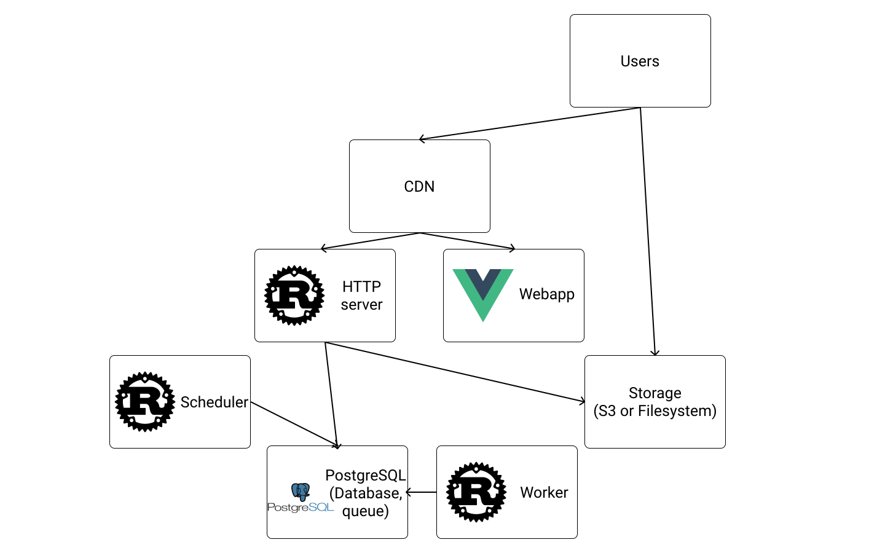

# Chapter One

*"Any sufficiently advanced cyberattack is indistinguishable from magic"*, center


<center>Centered text</center>

<p align="center">Centered text 2</p>

$$\text{This is some centered text}$$


{line-numbers: false}
```

```

This is an example chapter of a Leanpub book.  To start writing your book, simply replace the contents of this text box with your first chapter.

Chapter 2 has a quick introduction to Markdown. Click on "Chapter 2" on the left to see them.


he had no dsds swdewp[df[w[few[f]]]] this is a mistkakd

Where use `std::env` imports the module env from the standard library and `env::args()` calls the method args from this module and returns an [iterator](https://doc.rust-lang.org/book/ch13-02-iterators.html) which can be "collected" into a `Vec<String>`, a `Vector` of `String` objects.


This has an endnote[^^endnote1].


[ch_01/sha1_cracker/src/main.rs](https://github.com/skerkour/black-hat-rust/tree/main/ch_01)

```rust
use std::env;

fn main {
    let args: Vec<String> = env::args().collect();
}
```




A> This is a short saside


B> This is a short blurb.

D> This is a discussion blurb.

E> This is an error blurb.

I> This is an information blurb.

Q> This is a question blurb.

T> This is a tip blurb.

W> This is a warning blurb.

X> This is an exercise blurb.

> this is a quote?

<!-- {type: code, format: rust, line-numbers: false}
 -->

after


[^^endnote1]: This is the endnote content.

