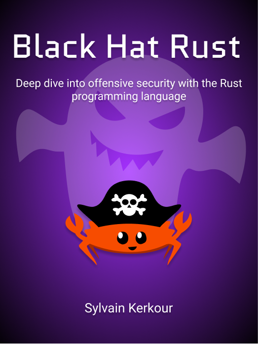

  
  <h1 align="center">Black Hat Rust - Bonuses</h1>
  <h3 align="center">Deep dive into offensive security with the Rust programming language</h3>
  <h3 align="center">
    <a href="https://academy.kerkour.com/black-hat-rust">Buy the book now!</a>
  </h3>

Thank you for purchasing Black Hat Rust!

## Malware analyses

I curated a list of the best malware analyses that can be find online in order to help you find inspiration from the current state of the art, whether it be cybercrime or cyberwar.

[Link to the reports list](./reports.md)

## Rust cheatsheet

Unlike other cheatsheet I did not make it to be exhaustive but userful instead, by covering the most important points I spotted in the real world.

[Link to the Rust cheatsheet](./rust_cheatsheet.md)
