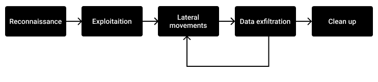
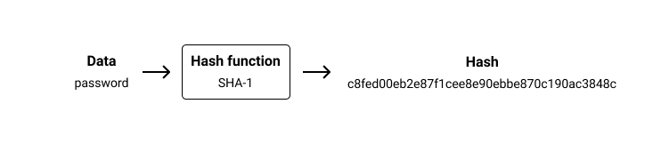
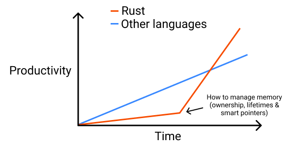

# Introduction
<!--
rust has strong suplkrt from many companies: https://news.ycombinator.com/item?id=27746130


First a disclimer.

We wont use lifetimes!.

Yes you read it right, we won't use any lifetimes in this book. Lifetimes were designed for absolute performance and or constrained environments. Their drawback is that they are unconvenient to use, and make programs harder to reasons and maintain.

If you are not developing a firmware for a vulnerable printer or something like that, I don't see reasons to contaminate your programs with lifetimes.


evolution of the hacking landscape (cryptocurrencies, ransoms)


https://www.hackthebox.eu/


learning curve: mettre sur le graph les concepts importants: generices & traits, error handling, lifetimes...


dire que evidement, un tel cracker n'est pas utilise en situation reelle, on preferere hashcat


RAII: this is an extremely powerful concept which almost eliminate all the
resources bugs


who is using Rust today


Consequences of a hack

 -->

*"Any sufficiently advanced cyberattack is indistinguishable from magic"*, unknown


Whether it be in movies or in mainstream media, hackers are often romanticized: they are depicted as black magic wizards, nasty criminals, or, in the worst cases, as thieves with a hood and a crowbar.

In reality, the spectrum of the profile of the attackers is extremely large, from the bored teenager exploring the internet to sovereign State's armies as well as the unhappy former employee. As we will see, cyberattacks are not that hard. Knowledge is simply unevenly distributed and jealously kept secret by the existing actors. The principal ingredients are a good dose of curiosity and the courage to follow your instinct.

As digital is taking an always more important place in our lives, the impact and scale of cyberattacks will increase in the same way: we are helplessly witnessing during the current COVID-19 pandemic attacks against our [hospitals](https://krebsonsecurity.com/2020/10/fbi-dhs-hhs-warn-of-imminent-credible-ransomware-threat-against-u-s-hospitals) which have [real-life and dramatic consequences](https://www.wired.co.uk/article/ransomware-hospital-death-germany).

It's time to fight back and to prepare ourselves for the wars and battles of today (not tomorrow) and to understand that, in order to defend, there is no other way than to put ourselves in the shoes of attackers and think how they think. What are their motivations? How can they break seemingly so easily into any system? What do they do to their victims? From theory to practice, we will explore the arcanes of offensive security and build our own offensive tools with the Rust programming language.

Why Rust?

The world of security (and, more generally, software) is plagued by too many programming languages with too many footguns. You have to choose between **fast and unsafe** (C, C++...) or **slow but mostly safe** (Python, Java...).

Can someone be an expert in all these languages? I don't think so. And the countless bugs and vulnerabilities in offensive tools prove I'm right.

What if, instead, we could have a unique language.

A language that, once mastered, would fill all the needs of the field:

- Shellcodes
- Cross-platform Remote Access Tools (RATs)
- Reusable and embeddable exploits
- Scanners
- Phishing toolkits
- Embedded programming
- Web servers
- ...

What if we had a single language that is low-level enough while providing high-level abstractions, is exceptionally fast, and easy to cross-compile. All of that while being memory safe, highly reusable, and extremely reliable.

No more weird toolchains, strange binary packagers, vulnerable network code, injectable phishing forms...

You got it, **Rust is the language to rule them all**.

Due to momentum, Rust isn't widely adopted by the security industry yet, but once the tech leads and independent hackers understand this reality, I believe that the change will happen really fast.

 Of course, there are some pitfalls and a few things to know, but everything is covered in the following chapters.


## Types of attacks

All attacks are not necessarily illegal or unsolicited. Let's start with a quick summary of the most common kinds of attacks found in the wild.


### Attacks without a clear goal

Teenagers have an obscene amount of free time. Thus, some of them may start learning computer security after school and hack random targets on the internet. Even if they may not have clear goals in mind other than inflating their ego and appeasing their curiosity, these kinds of attacks can still have substantial monetary costs for the victims.


### Political attacks

Sometimes, attacks have the only goal of spreading a political message. Most of the time, they materialize as [website defacements](https://en.wikipedia.org/wiki/Website_defacement) where websites' content is replaced with the political message, or [denial-of-service attacks](https://en.wikipedia.org/wiki/Denial-of-service_attack) where a piece of infrastructure or a service is made unavailable.


### Pentest

Pentest, which stands for Penetration Testing, may be the most common term used to designate security audits. One downside of pentests is that sometimes they are just a means to check boxes for compliance purposes, are performed using simple automated scanners, and may leave big holes open.


### Red team

Red teaming is seen as an evolution of traditional pentests: attackers are given more permissions and a broader scope like [phishing](https://en.wikipedia.org/wiki/Phishing) employees, using implants or even physical penetration. The idea is: in order to protect against attacks, auditors have to think and operate like real attackers.


### Bug bounty

Bug bounty programs are the uberization of security audits. Basically, companies say: "Try to hack me. If you find something and report it to me, I will pay you".

As we will see in the last chapter, bug bounty programs have their limits and are sometimes used by companies as virtue signaling instead of real security measures.


### Cybercrime

Cybercrime is definitely the most growing type of attack since the 2010s. From selling personal data on underground forums to botnets and ransomwares or credit card hacking, criminal networks have found many creative ways of acting.
An important peak occurred in 2017, when the NSA tools and exploits were leaked by the mysterious group "Shadow Brokers", which were then used in other malware such as WanaCry and Petya.

Despite the strengthening of online services to reduce the impact of data-stealing (today, it is far more difficult to take advantage of a stolen card number compared to a few years ago), criminals always find new creative ways to monetize their wrongdoings, especially with cryptocurrencies.


### Industrial spying

Industrial espionage has always been a tempting means for companies to break down competitors' secrets and achieve competitive advantage. As our economy is more and more dematerialized (digitalized), this kind of attack will only increase in terms of frequency.


### Cyberwar

This last kind of attack is certainly the less mediatized but without doubt the most spectacular. To learn more about this exciting topic, I can't recommend enough the excellent book ["Countdown to Zero Day: Stuxnet and the Launch of the World's First Digital Weapon" by Kim Zetter](https://www.goodreads.com/book/show/18465875-countdown-to-zero-day) which tells the story of, to my knowledge, the first act of advanced cyberwar: the Stuxnet worm.


## Phases of an attack




### Reconnaissance

The first phase consists of gathering as much information as possible about the target. Whether it be the names of the employees, the numbers of internet-facing machines and the services running on them, the list of the public Git repositories...

Reconnaissance is either passive (using publicly available data sources, such as social networks or search engines), or active (scanning the target's networks directly, for example).


### Exploitation

Exploitation is the initial breach. It can be performed by using exploits ([zero-day](https://en.wikipedia.org/wiki/Zero-day_(computing)) or not), abusing humans ([social engineering](https://en.wikipedia.org/wiki/Social_engineering_(security))) or both (sending office documents with malware inside).


### Lateral Movements

Also known as pivoting, lateral movement designates the process of maintaining access and gaining access to more resources and systems. Implants, Remote Access Tools (RATs), and various other tools are used during this phase. The biggest challenge is to stay hidden as long as possible.


### Data exfiltration

Data exfiltration is not present in every cyberattack, but in most which are not carried out by criminals: industrial spying, banking trojans, State spying...

It should be made with care as large chunks of data passing through the network may not go unnoticed.


### Clean up

Once the attack is successfully completed, advised attackers need to cover their tracks in order to reduce the risk of being identified: logs, temporary files, infrastructure, phishing websites...


## Profiles of attackers

The profile of attackers is also extremely varied. From lone wolves to teams of hackers, developers and analysts, there is definitely not a common profile that fits them all. However, in this section, I will try to portray which profiles should be part of a team conducting offensive operations.


### The hacker

The term hacker is controversial: mainstream media use it to describe criminals while tech people use it to describe passionate or hobbyists tinkering with tech. In our context, we will use it to describe the person with advanced offensive skills and whose role is to perform reconnaissance and exploitation of the targets.


### The exploit writer

The exploit writers are often developers with a deep understanding of security. Their role is to craft the weapons used by their teams to break into their targets' networks and machines.

Exploit development is also known as "**weaponization**".

Entire companies are operating in the grey waters of exploits trading, such as Vupen or Zerodium. They often don't find the exploits themselves but buy them from third-party hackers and find buyers (such as government agencies or malware developers).


### The developer

The role of the developer is to build custom tools (credential dumpers, proxies...) and implants used during the attack. Indeed, using publicly available, pre-made tools vastly increase the risk of being detected.

These are the skills we will learn and practice in the next chapters.


### The system administrator

Once the initial compromise is performed, the role of the system administrator is to operate and secure the infrastructure used by attackers. Their knowledge can also be used during the exploitation and lateral movements phases.


### The analyst

In all kinds of attacks, domain knowledge is required to interpret the findings and prioritize targets. This is the role of the analyst, either to provide deep knowledge about what specifically to target or to make sense of the exfiltrated data.


## Attribution

Attribution is the process of identifying and laying blame on the operators behind a cyber attack.

As we will see, it's an extremely complex topic: sophisticated attackers go through multiple networks and countries before hitting their target.

Attacks attribution is usually based on the following technical and operational elements:

Dates and time of the attackers' activities, which may reveal their time zone - even though it can easily be manipulated by moving the team to another country.

Artifacts present in the employed malware, like a string of characters in a specific alphabet or language - although, one can insert another language in order to blame someone else.

By counterattacking or hacking attackers' tools and infrastructure, or even by sending them false data which may lead them to make mistakes and consequently reveal their identities.

Finally, by browsing forums: it's not unusual that hackers praise their achievements on dedicated forums in order to both inflate their reputation and ego.

In the context of cyberwar, it is important to remember that public naming of attackers might sometimes be related to a political agenda rather than concrete facts.


## The Rust programming language


Now we have a better idea of what cyberattacks are and who is behind them, let see how they can be carried out.
Usually, offensive tools are developed in the C, C++, Python, or Java programming languages, and now a bit of Go.
But all these languages have flaws that make them far from optimal for the task: it's extremely hard to write safe and sound programs in C or C++, Python can be slow, and due to its weak typing, it's hard to write large programs and Java depends on a heavyweight runtime which may not fit all requirements when developing offensive tools.

If you are hanging out online on forums like [HackerNews](https://news.ycombinator.com) or [Reddit](https://www.reddit.com/r/programming), you can't have missed this "new" programming language called Rust. It pops almost every time we are discussing something barely related to programming. The so-called Rust Evangelism Strikeforce is promising access to paradise to the brave programmers who will join their ranks.

Rust is turning a new page in the history of programming languages by providing unparalleled guarantees and features, whether it be for defensive or offensive security. I will venture to say that Rust is the long-awaited one-size-fits-all programming language. Here is why.


## History of Rust

[According to Wikipedia](https://en.wikipedia.org/wiki/Rust_(programming_language)), *"Rust was originally designed by Graydon Hoare at Mozilla Research, with contributions from Dave Herman, Brendan Eich, and others. The designers refined the language while writing the Servo layout or browser engine, and the Rust compiler".*

Since then, the language has been following an organic growth and is today, according to [Stack Overflow's surveys](https://insights.stackoverflow.com/survey/2020#technology-most-loved-dreaded-and-wanted-languages), the most loved language by software developers for 5 years in a row.


Lately, big organizations such as Amazon or Microsoft have publicly announced their [love for the language](https://aws.amazon.com/blogs/opensource/why-aws-loves-rust-and-how-wed-like-to-help) and are creating internal talent pools.


With that being said, Rust is still a niche language today and is not widely used outside of these big companies.


## Rust is awesome

### The compiler

First hated by beginners then loved, the Rust compiler is renowned for its strictness. You should not take its rejections personally. Instead, see it like an always available code reviewer, just not that friendly.


### Fast

One of the most loved characteristics of Rust is its speed. Developers spend their day behind a screen and hate slow programs interrupting their workflows. It is thus completely natural that programmers tend to reject slow programming language contaminating the whole computing stack and creating painful user experiences.

Micro-benchmarks are of no interest to us because they are more often than not fallacious. However, there are a lot of reports demonstrating that Rust is blazing fast when used in real-world applications.

My favorite one is [Discord describing how replacing a service in Go by one in Rust](https://blog.discord.com/why-discord-is-switching-from-go-to-rust-a190bbca2b1f) not only eliminated latency spikes due to Go's garbage collector but also reduced average response time from milliseconds to microseconds.

Another one is [TechEmpower's Web Framework benchmarks](https://www.techempower.com/benchmarks/#section=data-r20), certainly the most exhaustive web framework benchmarks available on the internet where Rust shines since 2018. Some may argue that this one is a micro-benchmark, as the code is over-optimized for some specific, pre-determined use cases, yet, the result correlates with what I can observe in the real world.


### Multi-paradigm

Being greatly inspired by the [ML family](https://en.wikipedia.org/wiki/ML_(programming_language)) of programming languages, Rust can be described as easy to learn as [imperative programming languages](https://en.wikipedia.org/wiki/Imperative_programming), and as expressive as [functional programming languages](https://en.wikipedia.org/wiki/Functional_programming), whose abstractions allow them to transpose the human thoughts to code better.

Rust is rather "low-level" but offers high-level abstractions to programmers and thus is a joy to use.

The most loved feature by programmers coming from other programming languages seems to be [enums](https://doc.rust-lang.org/book/ch06-01-defining-an-enum.html), also known as *Algebraic Data Types*. They offer unparalleled expressiveness and correctness: when we "check" an enum, with the `match` keyword, the compiler makes sure that we don't forget a case, unlike switch statements in other programming languages.


**[ch_01/snippets/enums/src/lib.rs](https://github.com/skerkour/black-hat-rust/blob/main/ch_01/snippets/enums/src/lib.rs)**
```rust
pub enum Status {
    Queued,
    Running,
    Failed,
}

pub fn print_status(status: Status) {
    match status {
        Status::Queued => println!("queued"),
        Status::Running => println!("running"),
    }
}
```
```
$ cargo build
Compiling enums v0.1.0
error[E0004]: non-exhaustive patterns: `Failed` not covered
 --> src/lib.rs:8:11
  |
1 | / pub enum Status {
2 | |     Queued,
3 | |     Running,
4 | |     Failed,
  | |     ------ not covered
5 | | }
  | |_- `Status` defined here
...
8 |       match status {
  |             ^^^^^^ pattern `Failed` not covered
  |
  = help: ensure that all possible cases are being handled, possibly by adding wildcards or more match arms
  = note: the matched value is of type `Status`

error: aborting due to previous error

For more information about this error, try `rustc --explain E0004`.
error: could not compile `enums`

To learn more, run the command again with --verbose.
```


### Modular

Rust's creators clearly listened to developers when designing the ecosystem of tools accompanying it. It especially shows regarding dependencies management. Rust's package management (known as "crates") is as easy as with dynamic languages, such as Node.js' NPM, a real breath of fresh air when you had to fight with C or C++ toolchains, static and dynamic libraries.


### Explicit

Rust's is certainly one of the most explicit languages. On the one hand, it allows programs to be easier to reason about and code reviews to be more effective as fewer things are hidden.

On the other hand, it is often pointed out by people on forums, telling that they never saw such an ugly language because of its verbosity.


### The community

This section couldn't be complete if I didn't talk about the community. From kind help on forums to [free educational material](https://lborb.github.io/book/official.html), Rust's community is known to be among the most (if not the most) welcoming, helpful, and friendly online communities.

I would speculate that this is due to the fact that today, not so many companies are using Rust. Thus, the community is mostly composed of passionate programmers for whom sharing about the language is more a passion than a chore.

You can learn more about the companies using Rust in production in my blog post: [42 Companies using Rust in production (in 2021)](https://kerkour.com/blog/rust-in-production-2021/).

Where do Rustaceans hang out online?


* [The Rust's users forum](https://users.rust-lang.org/)
* [The Rust's Subreddit](https://reddit.com/r/rust/)
* [On Matrix: #rust:matrix.org](https://matrix.to/#/%23rust:matrix.org)
* [On Discord](https://discord.gg/rust-lang)


I personally use Reddit to share my projects or ideas with the community, and the forum to seek help about code.


## Setup

Before starting to code, we need to set up our development environment. We will need (without surprise) Rust, a code editor, and Docker.


### Install Rust(up)

`rustup` is the official way to manage Rust toolchains on your computer. It will be needed to update Rust and install other components like the automatic code formatter: [rustfmt](https://github.com/rust-lang/rustfmt).

It can be found online at [https://rustup.rs](https://rustup.rs)


### Installing a code editor

The easiest to use and most recommended free code editor available today is Visual Studio Code by Microsoft.

You can install it by visiting [https://code.visualstudio.com](https://code.visualstudio.com)

You will need to install the [rust-analyzer](https://github.com/rust-analyzer/rust-analyzer) extension in order to have code completion and type hints which are absolutely needed when developing in Rust. You can find it here: [https://marketplace.visualstudio.com/items?itemName=matklad.rust-analyzer](https://marketplace.visualstudio.com/items?itemName=matklad.rust-analyzer).


### Install Docker or Podman

Docker and Podman are two tools used to ease the management of Linux containers. They allow us to work on clean environments and make our build and deployment processes more reproducible.

I recommend using Docker on macOS and Windows and Podman on Linux.

The instructions to install Docker can be found on the official website: [https://docs.docker.com/get-docker](https://docs.docker.com/get-docker)

The same is true for Podman: [https://podman.io/getting-started/installation](https://podman.io/getting-started/installation)

In the next chapter, we will use commands of the form:

```bash
$ docker run -ti debian:latest
```

If you've been the podman's way, you will just have to replace the `docker` command by `podman`.

```bash
$ podman run -ti debian:latest
```

or better: create a [shell alias](https://en.wikipedia.org/wiki/Alias_(command)).

```bash
# in .bashrc or .zshrc
alias docker=podman
```


## Our first Rust program: A SHA-1 hash cracker

The moment has come to get our hands dirty: let's write our first Rust program. As for all the code examples in this book, you can find the complete code in the accompanying Git repository: [https://github.com/skerkour/black-hat-rust](https://github.com/skerkour/black-hat-rust)


```bash
$ cargo new sha1_cracker
```

Will create a new project in the folder `sha1_cracker`.

Note that by default, `cargo` will create a binary (application) project. You can create a library project with the `--lib` flag: `cargo new my_lib --lib`.





[SHA-1](https://en.wikipedia.org/wiki/SHA-1) is a [hash function](https://en.wikipedia.org/wiki/Hash_function) used by a lot of old websites to store the passwords of the users. In theory, a hashed password can't be recovered from its hash. Thus by storing the hash in their database, a website can assert that a given user has the knowledge of its password without storing the password in cleartext, by comparing the hashes. So if the website's database is breached, there is no way to recover the passwords and access the users' data.

Reality is quite different. Let's imagine a scenario where we just breached such a website, and we now want to recover the credentials of the users in order to gain access to their accounts. This is where a "hash cracker" is useful. A hash cracker is a program that will try many different hashes in order to find the original password.

This is why when creating a website, you should use a hash function specifically designed for this use case, such as [`argon2id`](https://en.wikipedia.org/wiki/Argon2), which require way more resource to bruteforce than SHA-1, for example.


This simple program will help us learn Rust's fundamentals:

* How to use [Command Line Interface (CLI)](https://en.wikipedia.org/wiki/Command-line_interface) arguments
* How to read files
* How to use an external library
* Basic error handling
* Resources management


Like in almost all programming languages, the entrypoint of a Rust program is its main function.

**[ch_01/sha1_cracker/src/main.rs](https://github.com/skerkour/black-hat-rust/blob/main/ch_01/sha1_cracker/src/main.rs)**
```rust
fn main() {
    // ...
}
```

Reading command line arguments is as easy as:

**[ch_01/sha1_cracker/src/main.rs](https://github.com/skerkour/black-hat-rust/blob/main/ch_01/sha1_cracker/src/main.rs)**
```rust
use std::env;

fn main() {
    let args: Vec<String> = env::args().collect();
}
```

Where `std::env` imports the module `env` from the standard library and `env::args()` calls the `args` function from this module and returns an [iterator](https://doc.rust-lang.org/book/ch13-02-iterators.html) which can be "collected" into a `Vec<String>`, a `Vector` of `String` objects. A `Vector` is an array type that can be resized.

It is then easy to check for the number of arguments and display an error message if it does not match what is expected.

**[ch_01/sha1_cracker/src/main.rs](https://github.com/skerkour/black-hat-rust/blob/main/ch_01/sha1_cracker/src/main.rs)**
```rust
use std::env;

fn main() {
    let args: Vec<String> = env::args().collect();

    if args.len() != 3 {
        println!("Usage:");
        println!("sha1_cracker: <wordlist.txt> <sha1_hash>");
        return;
    }
}
```

As you may have noticed, the syntax of `println!` with an exclamation mark is strange. Indeed, `println!` is not a classic function but a macro. As it's a complex topic, I redirect you to the dedicated chapter of the Book: [https://doc.rust-lang.org/book/ch19-06-macros.html](https://doc.rust-lang.org/book/ch19-06-macros.html).

`println!` is a macro and not a function because Rust doesn't support (yet?) [variadic generics](https://github.com/rust-lang/rust/issues/17190#issuecomment-71330815). It has the advantage of being compile-time evaluated and checked and thus prevent vulnerabilities such as [format string vulnerabilities](https://owasp.org/www-community/attacks/Format_string_attack).


### Error handling

How should our program behave when encountering an error? And how to inform the user of it?
This is what we call error handling.

Among the dozen programming languages that I have experience with, Rust is without any doubts my favorite one regarding error handling due to its explicitness, safety, and conciseness.

For our simple program, we will [`Box` errors](https://doc.rust-lang.org/rust-by-example/error/multiple_error_types/boxing_errors.html): we will allow our program to return any type that implements the [`std::error::Error`](https://doc.rust-lang.org/std/error/trait.Error.html) trait. What is a trait? More on that later.


**[ch_01/sha1_cracker/src/main.rs](https://github.com/skerkour/black-hat-rust/blob/main/ch_01/sha1_cracker/src/main.rs)**
```rust
use std::{
    env,
    error::Error,
};

const SHA1_HEX_STRING_LENGTH: usize = 40;

fn main() -> Result<(), Box<dyn Error>> {
    let args: Vec<String> = env::args().collect();

    if args.len() != 3 {
        println!("Usage:");
        println!("sha1_cracker: <wordlist.txt> <sha1_hash>");
        return Ok(());
    }

    let hash_to_crack = args[2].trim();
    if hash_to_crack.len() != SHA1_HEX_STRING_LENGTH {
        return Err("sha1 hash is not valid".into());
    }

    Ok(())
}
```


### Reading files

As it takes too much time to test all possible combinations of letters, numbers, and special characters, we need to reduce the number of SHA-1 hashes generated. For that, we use a special kind of dictionary, known as a wordlist, which contains the most common password found in breached websites.

Reading a file in Rust can be achieved with the standard library like that:

**[ch_01/sha1_cracker/src/main.rs](https://github.com/skerkour/black-hat-rust/blob/main/ch_01/sha1_cracker/src/main.rs)**
```rust
use std::{
    env,
    error::Error,
    fs::File,
    io::{BufRead, BufReader},
};

const SHA1_HEX_STRING_LENGTH: usize = 40;

fn main() -> Result<(), Box<dyn Error>> {
    let args: Vec<String> = env::args().collect();

    if args.len() != 3 {
        println!("Usage:");
        println!("sha1_cracker: <wordlist.txt> <sha1_hash>");
        return Ok(());
    }

    let hash_to_crack = args[2].trim();
    if hash_to_crack.len() != SHA1_HEX_STRING_LENGTH {
        return Err("sha1 hash is not valid".into());
    }

    let wordlist_file = File::open(&args[1])?;
    let reader = BufReader::new(&wordlist_file);

    for line in reader.lines() {
        let line = line?.trim().to_string();
        println!("{}", line);
    }

    Ok(())
}
```


### Crates

Now that the basic structure of our program is in place, we need to actually compute the SHA-1 hashes. Fortunately for us, some talented developers have already developed this complex piece of code and shared it online, ready to use in the form of an external library. In Rust, we call those libraries, or packages, crates. They can be browsed online at [https://crates.io](https://crates.io).

They are managed with [`cargo`](https://doc.rust-lang.org/book/ch01-03-hello-cargo.html): Rust's package manager. Before using a crate in our program, we need to declare its version in Cargo's manifest file: `Cargo.toml`.

**[ch_01/sha1_cracker/Cargo.toml](https://github.com/skerkour/black-hat-rust/blob/main/ch_01/sha1_cracker/Cargo.toml)**
```toml
[package]
name = "sha1_cracker"
version = "0.1.0"
authors = ["Sylvain Kerkour"]
edition = "2021"

# See more keys and their definitions at https://doc.rust-lang.org/cargo/reference/manifest.html

[dependencies]
sha-1 = "0.9"
hex = "0.4"
```

We can then import it in our SHA-1 cracker:

**[ch_01/sha1_cracker/src/main.rs](https://github.com/skerkour/black-hat-rust/blob/main/ch_01/sha1_cracker/src/main.rs)**
```rust
use sha1::Digest;
use std::{
    env,
    error::Error,
    fs::File,
    io::{BufRead, BufReader},
};

const SHA1_HEX_STRING_LENGTH: usize = 40;

fn main() -> Result<(), Box<dyn Error>> {
    let args: Vec<String> = env::args().collect();

    if args.len() != 3 {
        println!("Usage:");
        println!("sha1_cracker: <wordlist.txt> <sha1_hash>");
        return Ok(());
    }

    let hash_to_crack = args[2].trim();
    if hash_to_crack.len() != SHA1_HEX_STRING_LENGTH {
        return Err("sha1 hash is not valid".into());
    }

    let wordlist_file = File::open(&args[1])?;
    let reader = BufReader::new(&wordlist_file);

    for line in reader.lines() {
        let line = line?;
        let common_password = line.trim();
        if hash_to_crack == &hex::encode(sha1::Sha1::digest(common_password.as_bytes())) {
            println!("Password found: {}", &common_password);
            return Ok(());
        }
    }
    println!("password not found in wordlist :(");

    Ok(())
}
```

Hourray! Our first program is now complete. We can test it by running:

```bash
$ cargo run -- wordlist.txt 7c6a61c68ef8b9b6b061b28c348bc1ed7921cb53
```


Please note that in a real-world scenario, we may want to use optimized hash crackers such as [hashcat](https://hashcat.net) or [John the Ripper](https://www.openwall.com/john/), which, among other things, may use the GPU to significantly speed up the cracking.

Another point would be to first load the wordlist in memory before performing the computations.


### RAII

A detail may have caught the attention of the most meticulous of you: we opened the wordlist file, but we never closed it!

This pattern (or feature) is called [RAII](https://en.wikipedia.org/wiki/Resource_acquisition_is_initialization): Resource Acquisition Is Initialization. In Rust, variables not only represent parts of the memory of the computer, they may also own resources. Whenever an object goes out of scope, its destructor is called, and the owned resources are freed.

Thus, you don't need to call a `close` method on files or sockets. When the variable is dropped (goes out of scope), the file or socket will be automagically closed.

In our case, the `wordlist_file` variable owns the file and has the `main` function as scope. Whenever the main function exits, either due to an error or an early return, the owned file is closed.

Magic, isn't it? Thanks to this, it's very rare to leak resources in Rust.


### Ok(())

You might also have noticed that the last line of our `main` function does not contain the `return` keyword. This is because Rust is an expression-oriented language. Expressions evaluate to a value.  Their opposites, statements, are instructions that do something and end with a semicolon (`;`).

So if our program reaches the last line of the `main` function, the `main` function will evaluate to `Ok(())`, which means: "success: everything went according to the plan".

An equivalent would have been:
```rust
    return Ok(());
```

but not:
```rust
    Ok(());
```

Because here `Ok(());` is a statement due to the semicolon, and the main function no longer evaluates to its expected return type: `Result`.


## Mental models for approaching Rust

Using Rust may require you to re-think all the mental models you learned while using other programming languages.


### Embrace the compiler

The compiler will make you hard times when starting Rust. You will hate it. You will swear. You will wish to disable it and send it to hell. Don't.

The compiler should be seen as an always available and friendly code-reviewer. So it's not something preventing your code from compiling. Instead, it's a friend that tells you that your code is defective and even offers suggestions on how to fix it.

I have witnessed a great improvement over the years of the messages displayed by the compiler, and I have no doubts that if today the compiler produces an obscure message for an edge case, it will be improved in the future.


### Just In Time learning

Rust is a vast language that you won't be able to master in a few weeks. And that's totally fine. You don't have to know everything to get started.

I've spent a lot of time reading about all the computer science behind Rust before even writing my first program. **This was the wrong approach**. There is too much to read about all the features of Rust, and you certainly won't use them all (and you shouldn't! For example, please **never ever** use [non_ascii_idents](https://rust-lang.github.io/rfcs/2457-non-ascii-idents.html) it will only bring chaos and pain!). All this stuff is really interesting and produced by very smart people, but it prevents you from getting things done.

Instead, embrace the unknown and make your first programs. Fail. Learn. Repeat.


### Keep it simple

**Don't try to be too clever!** If you are fighting with the limits of the language (which is already huge), it may mean that you are doing something wrong. Stop what you are doing, take a break, and think about how you can do things differently. It happens to me almost every day.

Also, keep in mind that the more you are playing with the limits of the type system, the more your code will create hard-to-understand errors by the compiler. So, make you and your co-workers a favor: **KISS (Keep It Simple, Stupid)**.

**Favor getting things done rather than the perfect design that will never ship**. It's far better to re-work an imperfect solution than to never ship a perfect system.


### You pay the costs upfront

Programming in Rust may sometimes appear to be slower than in Python, Java, or Go. This is because, in order to compile, the Rust compiler requires a level of correctness far superior to other languages. Thus, in the whole lifetime of a project, Rust will save you a **lot** of time. All the energy you spend crafting a correct program in Rust, is 1x-10x the time (and money and mental health!) you save when you **won't** have to spend hours and hours debugging weird bugs.

The first programs I shipped in production were in TypeScript (Node.js) and Go. Due to the lax compilers and type systems of these languages, you have to add complex instrumentation to your code and external services to detect errors at runtime. In Rust, I've never had to use this. Simple logging (as we will see in chapter 4) is all I ever needed to track bugs in my programs. Aside from that, as far as I remember, I've never experienced a crash in a production system in Rust. This is because Rust forces you to "pay the costs upfront": you have to handle every error and be very intentional about what you are doing.

Here is another testimony from ["jhgg"](https://news.ycombinator.com/item?id=26228798), Senior Staff Engineer at Discord:
*"We are going hard on Rust in 2021 after some very successful projects in 2019 and 2020. our engineers have ramped up on the language - and we have good support internally (both in terms of tools, but also knowledge) to see its success. Once you've passed the learning curve - imo, Rust is far easier and more productive to write than go - especially if you know how to leverage the type system to build idiomatic code and apis that are very hard to use incorrectly. Every piece of rust code we have shipped to production so far has gone perfectly thanks to the really powerful compile time checks and guarantees of the language. I can't say the same for our experiences with go. Our reasons go well beyond "oh the gc in go has given us problems" but more like "go as a language has willingly ignored and has rejected advances in programming languages". You can pry those algebraic data types, enums, borrow checker, and compile time memory management/safety, etc... from my cold dead hands. [...]"*


<!-- ### Ownership and memory -->


### Functional

Rust is (in my opinion) the perfect mix between an imperative and a functional language to get things done. It means that if you are coming from a purely imperative programming language, you will have to unlearn some things and embrace the functional paradigm.

Favor iterators (chapter 3) over `for` loops. Favor immutable data over mutable references, and don't worry, the compiler will do a great job optimizing your code.


## A few things I've learned along the way

If I had to summarize my experience with Rust in one sentence, it would be:
**The productivity of a high-level language with the speed of a low-level language.**

Here are a few tips learned the hard way that I'm sharing to make your Rust journey as pleasant as possible.




Learning Rust can sometimes be extremely frustrating: there are a lot of new concepts to learn, and the compiler is mercy-less. But this is for your own good.

It took me nearly 1 year of full-time programming in Rust to become proficient and no longer have to read the documentation every 5 lines of code. It's a looong journey but absolutely worth it.


### Try to avoid lifetimes annotations

Lifetimes are certainly one of the scariest things for new people coming to Rust. Kind of like `async`, they are kind of viral and [color functions and structures ](https://journal.stuffwithstuff.com/2015/02/01/what-color-is-your-function) which not only make your code harder to read but also harder to use.

```rust
// Haha is a struct to wrap a monad generator to provide a facade for any kind of generic iterator. Because.
struct Haha<'y, 'o, L, O>
  where for<'oO> L: FnOnce(&'oO O) -> &'o O,
  O: Trait<L, 'o, L>,
  O::Item : Clone + Debug + 'static {
    x: L,
}
```

Yeaah suure, please don't mind that somebody, someday, will have to read and understand your code.

<!-- It's exacerbated by Rust's ownership model, which makes annotated references a poison complexifying your code a lot. -->


But lifetimes annotations are avoidable and, in my opinion **should be avoided**. So here is my strategy to avoid turning Rust code into some kind of monstrosity that nobody will ever want to touch and slowly die of disregard.


#### Why are lifetime annotations needed in the first place?

Lifetime annotations are needed to tell the compiler that we are manipulating some kind of long-lived reference and let him assert that we are not going to screw ourselves.


#### Lifetime Elision

The simplest and most basic trick is to omit the lifetime annotation.

```rust
fn do_something(x: &u64) {
  println!("{}", x);
}
```


It's most of the time easy to elide input lifetimes, but beware that to omit output lifetime annotations, you have to follow [these 3 rules](https://web.mit.edu/rust-lang_v1.25/arch/amd64_ubuntu1404/share/doc/rust/html/book/first-edition/lifetimes.html#lifetime-elision):

* *Each elided lifetime in a function's arguments becomes a distinct lifetime parameter.*
* *If there is exactly one input lifetime, elided or not, that lifetime is assigned to all elided lifetimes in the return values of that function.*
* *If there are multiple input lifetimes, but one of them is &self or &mut self, the lifetime of self is assigned to all elided output lifetimes.*

Otherwise, it is an error to elide an output lifetime.

```rust
fn do_something(x: &u64)-> &u64 {
    println!("{}", x);
    x
}

// is equivalent to
fn do_something_else<'a>(x: &'a u64)-> &'a u64 {
    println!("{}", x);
    x
}
```

#### Smart pointers


Now, not everything is as simple as an `HelloWorld` and you may need some kind of long-lived reference that you can use at multiple places of your codebase (a Database connection, for example, or an HTTP client with an internal connection pool).

The solution for long-lived, shared (or not), mutable (or not) references is to use [smart pointers](https://doc.rust-lang.org/book/ch15-00-smart-pointers.html).


The only downside is that smart pointers, in Rust, are a little bit verbose (but still way less ugly than lifetime annotations).


##### Rc


```rust
use std::rc::Rc;

fn main() {
    let pointer = Rc::new(1);

    {
        let second_pointer = pointer.clone(); // or Rc::clone(&pointer)
        println!("{}", *second_pointer);
    }

    println!("{}", *pointer);
}
```

To obtain a mutable, shared pointer, you can use use the [interior mutability pattern](https://doc.rust-lang.org/book/ch15-05-interior-mutability.html#refcellt-and-the-interior-mutability-pattern):

```rust
use std::cell::{RefCell, RefMut};
use std::rc::Rc;

fn main() {
    let shared_string = Rc::new(RefCell::new("Hello".to_string()));

    {
        let mut hello_world: RefMut<String> = shared_string.borrow_mut();
        hello_world.push_str(" World");
    }

    println!("{}", shared_string.take());
}
```


##### Arc

Unfortunately, `Rc<RefCell<T>>` cannot be used across threads or in an `async` context. This is where [`Arc`](https://doc.rust-lang.org/std/sync/struct.Arc.html) comes into play, which implements [`Send`](https://doc.rust-lang.org/std/marker/trait.Send.html) and [`Sync`](https://doc.rust-lang.org/std/marker/trait.Sync.html) and thus is safe to share across threads.

```rust
use std::sync::{Arc, Mutex};
use std::{thread, time};

fn main() {
    let pointer = Arc::new(5);

    let second_pointer = pointer.clone(); // or Arc::clone(&pointer)
    thread::spawn(move || {
        println!("{}", *second_pointer); // 5
    });

    thread::sleep(time::Duration::from_secs(1));

    println!("{}", *pointer); // 5
}
```


For mutable shared variables, you can use `Arc<Mutex<T>>`:
```rust
use std::sync::{Arc, Mutex};
use std::{thread, time};

fn main() {
    let pointer = Arc::new(Mutex::new(5));

    let second_pointer = pointer.clone(); // or Arc::clone(&pointer)
    thread::spawn(move || {
        let mut mutable_pointer = second_pointer.lock().unwrap();
        *mutable_pointer = 1;
    });

    thread::sleep(time::Duration::from_secs(1));

    let one = pointer.lock().unwrap();
    println!("{}", one); // 1
}
```


Smart pointers are particularly useful when embedded into structures:
```rust
struct MyService {
  db: Arc<DB>,
  mailer: Arc<dyn drivers::Mailer>,
  storage: Arc<dyn drivers::Storage>,
  other_service: Arc<other::Service>,
}
```

#### When to use lifetimes annotations

In my opinion, lifetimes annotations should never surface in any public API. It's okay to use them if you need absolute performance <u>AND</u> minimal resources usage <u>AND</u> are doing embedded development, but you should keep them hidden in your code, and they should never surface in the public API.


### It can be easy to write hard-to-read and debug code

Due to its explicitness and its bunch of features, Rust code can quickly become hard to understand. Generics, trait bounds, lifetimes... It's easy not to pay attention and write very hard-to-read code. My advice is to always think twice before writing complex code or a macro (for me, they are the worst offenders) that can easily be replaced by a function.


### Fast-paced development of the language

It's the point that scares me the most regarding Rust's future. [Every 6 weeks](https://github.com/rust-lang/rust/blob/master/RELEASES.md) a new version is released with its batch of new features.

Not only this pace causes me anxiety, but it is also the opposite of one of the pillars of my life: minimalism, where it is common knowledge that unbounded growth (of the language in this case) is the root cause of the demise of everything. When something is added, something must be subtracted elsewhere. But who is in charge of removing Rust's features? Is it even possible?

As a result, I'm afraid that the complexity of the language will grow faster than its rate of adoption and that it will be an endless, exhausting race to stay updated on the new features as developers.


### Slow compile times

Compile times are closer to what we can find in the C++ world than in the world of dynamic languages like TypeScript (if TypeScript can be considered as a dynamic language). As a result, the "edit, compile, debug, repeat" workflow can become frustrating and break developers [flow](https://en.wikipedia.org/wiki/Flow_(psychology)).

There are many tricks to improve the compilation speed of your projects.

The first one is to split a large project into smaller crates and benefit from Rust's [incremental compilation](https://blog.rust-lang.org/2016/09/08/incremental.html).

Another one is to use `cargo check` instead of `cargo build` most of the time.
```bash
$ cargo check
```

As an example, on a project, with a single letter change:
```bash
$ cargo check
    Finished dev [unoptimized + debuginfo] target(s) in 0.12s
```

```
$ cargo build
   Compiling agent v0.1.0 (black-hat-rust/ch_11/agent)
    Finished dev [unoptimized + debuginfo] target(s) in 2.24s
```

Compounded over a day (or week or month) of development, the gains are huge.

Finally, simply reduce the use of generics. Generics add a lot of work to the compiler and thus significantly increase compile times.


<!-- You can find on my blog my Rust workflow to deal with long compile times -->

### Projects maintenance

It's an open secret that most of the time and costs spent on any serious software project are from maintenance. Rust is moving fast, and its ecosystem too, it's necessary to automate projects' maintenance.

The good news is that, in my experience, due to its strong typing, Rust project maintenance is easier than in other languages: errors such as API changes will be caught at compile time.

For that, the community has built a few tools which will save you a lot of time to let you keep your projects up to date.


#### Rustup

Update your local toolchain with `rustup`:

```bash
$ rustup self update
$ rustup update
```


#### Rust fmt

`rustfmt` is a code formatter that allows codebases to have a consistent coding style and avoid nitpicking during code reviews.

It can be configured using a `.rustfmt.toml` file: [https://rust-lang.github.io/rustfmt](https://rust-lang.github.io/rustfmt).

You can use it by calling:
```bash
$ cargo fmt
```

In your projects.


#### Clippy

`clippy` is a [linter](https://en.wikipedia.org/wiki/Lint_(software)) for Rust. It will detect code patterns that may lead to errors or are identified by the community as bad style.

It helps your codebase to be consistent and reduce time spent during code reviews discussing tiny details.

It can be installed with:
```bash
$ rustup component add clippy
```

And used with:
```bash
$ cargo clippy
```


#### Cargo update

```bash
$ cargo update
```

Is a command that will automatically update your dependencies according to the [semver](https://semver.org/) declaration in your `Cargo.toml`.

#### Cargo outdated

[`cargo-outdated`](https://github.com/kbknapp/cargo-outdated) is a program that helps you to identify your outdated dependencies that can't be automatically updated with `cargo update`

It can be installed as follows:
```bash
$ cargo install -f cargo-outdated
```

The usage is as simple as running
```bash
$ cargo outdated
```
In your projects.


#### Cargo audit

Sometimes, you may not be able to always keep your dependencies to the last version and need to use an old version (due to dependency by another of your dependency...) of a crate. As a professional, you still want to be sure that none of your outdated dependencies contains any known vulnerability.

[`cargo-audit`](https://github.com/RustSec/rustsec/tree/main/cargo-audit) is the tool for the job. It can be installed with:
```bash
$ cargo install -f cargo-audit
```

Like other helpers, it's very simple to use:
```
$ cargo audit
    Fetching advisory database from `https://github.com/RustSec/advisory-db.git`
      Loaded 317 security advisories (from /usr/local/cargo/advisory-db)
    Updating crates.io index
    Scanning Cargo.lock for vulnerabilities (144 crate dependencies)
```


### How to track your findings

You will want to track the progress of your audits and the things you find along the way, whether it be to share with a team or to come back later.

There are powerful tools such as [Maltego](https://www.maltego.com) (more about it in chapter 5), but it can become costly if you want all the features.

On my side, I prefer to use simple files on disk, with markdown to write notes and reports and Git for the backup. It has the advantage of being extremely simple to use, multi-platform, easily exported, and free. Also, it easy to generate PDFs, `.docx` or other document formats from the markdown files using [pandoc](https://pandoc.org).

I've also heard good things about [Obsidian.md](https://obsidian.md/) and [Notion.so](https://www.notion.so/) but personally don't use: I prefer to own my data 🤷‍♂️


## Summary

* The Rust language is huge. Don't learn everything ahead of time. Code. Fail. Learn. Repeat.
* Expressions evaluate to a value.  Their opposites, statements, are instructions that do something and end with a semicolon (`;`).
* Try not to use lifetime annotations and macros.
* Embrace the compiler. It should be seen as an always present and friendly code-reviewer.
* [RAII](https://en.wikipedia.org/wiki/Resource_acquisition_is_initialization): Resource Acquisition Is Initialization.
* The hacker, The exploit writer, The developer, The system administrator, The analyst
* Reconnaissance, Exploitation, Lateral Movements, Data exfiltration, Clean up
