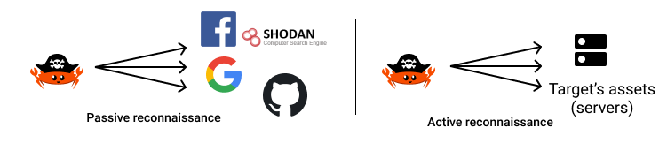
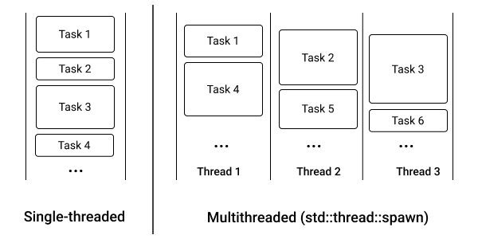

# Multi-threaded attack surface discovery


<!--

- The most important first step to reduce your organization's attack surface is knowing what that attack surface actually looks like. You can't reduce exposure to something that you don't see or are unaware that it even exists.

  That's why attack surface mapping is the first step in almost any penetration testing engagement. Doing reconnaissance on organizations to identify vulnerable targets is also exactly what a threat actor does when planning an attack.

- The difference largely lies in time. Attackers can maintain a low profile if they spread out their activities over longer time frames, but penetration testers can usually only operate within a limited time frame, according to Andreas Georgiou, security consultant at Trustwave SpiderLabs and co-creator of AttackSurfaceMapper, a new open source cybersecurity platform for automating the attack surface mapping process.


- The term “attack surface” is sometimes defined as the collection of ways an organization can be breached. But that is really just the sum of your organization’s attack vectors.A better definition is: Your attack surface is all of your attacker-exposed IT assets, whether secure or vulnerable, known and unknown, wherever they are: on-premises, in the cloud, in third-party or partner environments, or in the networks of your subsidiaries. That’s a better definition of “attack surface” because organizations benefit from having an understanding and visibility into their entire IT ecosystem that includes all of their network interconnectivity.

- passive vs active

 -->

*"To know your Enemy, you must become your Enemy"*, Sun Tzu


As we have seen, the first step of every attack is reconnaissance. The goal of this phase is to gather as much information as possible about our target in order to find entry points for the coming assault.

In this chapter, we will see the basics of reconnaissance, how to implement our own scanner in Rust and how to speed it up by leveraging multithreading.


There are two ways to perform reconnaissance: Passive and Active.




## Passive reconnaissance

Passive reconnaissance is the process of gathering information about a target without interacting with it directly, for example, searching for the target on different social networks and search engines.

Using publicly available sources is called OSINT, for **O**pen **S**ource **INT**elligence.

What kind of data is harvested using passive reconnaissance? Usually, pieces of information about employees of a company such as names, email addresses, phone numbers, but also source code repositories, leaked tokens. Thanks to search engines like [Shodan](https://www.shodan.io), we can also look for open-to-the-world services and machines.

As passive reconnaissance is the topic of chapter 5, we will focus our attention on active reconnaissance in this chapter.


## Active reconnaissance

Active reconnaissance is the process of gathering information about a target directly by interacting with it.

Active reconnaissance is noisier and can be detected by firewalls and honeypots, so you have to be careful to stay undetected, for example, by spreading the scan over a large span of time.

A honeypot is an external endpoint that shall never be used by "regular" people of a given company, so the only people hitting this endpoint are attackers. It can be a mail server, an HTTP server, or even a document with remote content embedded.

Once a honeypot is scanned or hit, it will report back to the security team which put it in place.

A canary is like a honeypot but in an internal network. Its purpose is to detect attackers once they have breached the external perimeter.

<!--
reconnaissance process:
* source identification
* data harvesting
* data processing and integration
* Data analysis
* Result delivery

-->

The reconnaissance of a target can itself be split into two steps:

* Assets discovery
* Vulnerabilities identification (which is the topic of chapter 6)


## Assets discovery

Traditionally, assets were defined only by technical elements: IP addresses, servers, domain names, networks...

Today the scope is broader and encompasses social network accounts, public source code repositories, Internet of Things objects... Nowadays, everything is on or connected to the internet. From an offensive point of view, it's really interesting.

The goal of listing and mapping all the assets of a target is to find entry points and vulnerabilities for our coming attack.


### Subdomain enumeration

The method yielding the best results for minimal efforts regarding public assets discovery is subdomains enumeration.

Indeed, nowadays, with the takeoff of cloud services, more and more companies no longer require a VPN to access their private services. They are publicly available through HTTPS.


The most accessible source of subdomains is [certificate transparency logs](https://certificate.transparency.dev/howctworks/). When a Certificate Authority (CA) issues a web certificate (for usage with HTTPS traffic, for example), the certificates are saved in public, transparent logs.

The legitimate use of these logs is to detect rogue certificates authorities who may deliver certificates to the wrong entities (imagine a certificate for `*.google.com` being delivered to a malicious hacking team, it would mean that they will be able to Man In The Middle all the Google domains without being detected).

On the other hand, this transparency allows us to automate a good chunk of our job.

For example, to search for all the certificates issued for `kerkour.com` and its subdomains, go to [https://crt.sh](https://crt.sh) and search for `%.kerkour.com` (`%` being the wildcard character): [https://crt.sh/?q=%25.kerkour.com](https://crt.sh/?q=%25.kerkour.com).

A limitation of this technique is its inability to find non-HTTP(S) services (such as email or VPN servers), and wildcard subdomains (`*.kerkour.com`, for example) which may obfuscate the actually used subdomains.


As an anecdote, the fastest security audit I ever performed was a company that left its GitLab instance publicly accessible, with registration open to the world. I found the GitLab instance with basic subdomain enumeration. When I created an account, I got access to all the (private) code repositories of the company, and a lot of them contained secrets and cloud tokens committed in code which could have led to the full takeover of the company's infrastructure.


#### What can be found

Here is a non-exhaustive list of what can be found by crawling subdomains:

- Code repositories
- Forgotten subdomain subject to [takeover](https://developer.mozilla.org/en-US/docs/Web/Security/Subdomain_takeovers)
- Admin panels
- Shared files
- Storage buckets
- Email / Chat servers

<!--
        - subdomain takeover

            - implications of a subdomain takeover

                - Brand Reputation loss, User Distrust and Negative PR

                - An attacker might choose to hijack users’ sessions on vulnerable application (simply because cookies

                - CORS can be abused by attackers to harvest sensitive information from authenticated users

                - If any one of the whitelisted hosts within a CSP gets taken over, the attacker can freely execute malicious client-side code via the application.

                - OAuth whitelisting of a vulnerable subdomain might be a cause of trouble, because an attacker can redirect users to the vulnerable subdomain during the OAuth workflow, thus leaking their OAuth token.

                - actively intercepted just by claiming a simple webhook of the third-party service

                - Clickjacking: By framing content from a whitelisted subdomain that has been taken over, an attacker can serve malicious content to the visitors of the site using IE, Edge, and Safari, due to browser behavior (well described in Cure53’s Browser Security Whitepaper).

        - vulnerable assets


- Email servers

- Intrusion detection system

- Cloud Resources: Storage Buckets, Serverless Functions, etc.

- servers

- social media accounts

- ips

- Hardware: Routers, Switches, Workstations, phones…

- API keys

- lieu physique des locaux

- Public Code Repositories

- IoT and connected objects

- Domain names and SSL certificates

- HTTP codes

- screenshots of HTTP pages

- firewalls

-->

<!-- ## Vulnerabilities identification

Once all the assets of the target are mapped, we can start hunting for vulnerabilities. -->


## Our first scanner in Rust

Software used to map attack surfaces is called scanners. Port scanner, vulnerability scanner, subdomains scanner, SQL injection scanner... They automate the long and fastidious task that reconnaissance can be and prevent human errors (like forgetting a subdomain or a server).

But, you have to keep in mind that scanners are not a panacea: they can be very noisy and thus may reveal your intentions, be blocked by anti-spam systems, or report incomplete data.


We will start with a simple scanner whose purpose is to find subdomains of a target and then will scan the most common ports for each subdomain. Then, as we go along, we will add more and more features to find more interesting stuff, the automated way.

As our programs are getting more and more complex, we first need to deepen our understanding of error handling in Rust.


## Error handling

<!--
but first, as our programm will only grow in size, we need to learn proper error handling.
in first chapter we avoided proper error handling by using ...


- Expliquer From et Into


As this is also a heavily documented and not the topic of this book, here is certainly one of the most up-to-date resources about it: [https://nick.groenen.me/posts/rust-error-handling](https://nick.groenen.me/posts/rust-error-handling)

 -->

Whether it be for libraries or for applications, errors in Rust are strongly-typed and most of the time represented as [enums](https://doc.rust-lang.org/book/ch06-01-defining-an-enum.html) with one variant for each kind of error our library or program might encounter.

For libraries, the current good practice is to use the [thiserror](https://crates.io/crates/thiserror) crate.

For programs, the [anyhow](https://crates.io/crates/anyhow) crate is the recommended one. It will prettify errors returned by the `main` function.

We will use both in our scanner to see how they fit together.

Let's define all the error cases of our program. Here, it's easy as the only fatal error is bad usage of the command-line arguments.

**[ch_02/tricoder/src/error.rs](https://github.com/skerkour/black-hat-rust/blob/main/ch_02/tricoder/src/error.rs)**
```rust
use thiserror::Error;

#[derive(Error, Debug, Clone)]
pub enum Error {
    #[error("Usage: tricoder <kerkour.com>")]
    CliUsage,
}
```

**[ch_02/tricoder/src/main.rs](https://github.com/skerkour/black-hat-rust/blob/main/ch_02/tricoder/src/main.rs)**
```rust
fn main() -> Result<(), anyhow::Error> {
    // ...
}
```


## Enumerating subdomains

We are going to use the API provided by [crt.sh](https://crt.sh), which can be queried by calling the following endpoint: `https://crt.sh/?q=%25.[domain.com]&output=json"`.

**[ch_02/tricoder/src/subdomains.rs](https://github.com/skerkour/black-hat-rust/blob/main/ch_02/tricoder/src/subdomains.rs)**
```rust
pub fn enumerate(http_client: &Client, target: &str) -> Result<Vec<Subdomain>, Error> {
    let entries: Vec<CrtShEntry> = http_client
        .get(&format!("https://crt.sh/?q=%25.{}&output=json", target))
        .send()?
        .json()?;

    // clean and dedup results
    let mut subdomains: HashSet<String> = entries
        .into_iter()
        .map(|entry| {
            entry
                .name_value
                .split("\n")
                .map(|subdomain| subdomain.trim().to_string())
                .collect::<Vec<String>>()
        })
        .flatten()
        .filter(|subdomain: &String| subdomain != target)
        .filter(|subdomain: &String| !subdomain.contains("*"))
        .collect();
    subdomains.insert(target.to_string());

    let subdomains: Vec<Subdomain> = subdomains
        .into_iter()
        .map(|domain| Subdomain {
            domain,
            open_ports: Vec::new(),
        })
        .filter(resolves)
        .collect();

    Ok(subdomains)
}
```

Notice the `?`. They means: "If the called function returns an error, abort the current function and return the error".

<!--
There are a lot of ways to enumerate subdomains for a given domain name.

In this chapter, we will focus on, according to my experience, the simplest and most effective way to enumerate subdomains with interesting assets: scraping [certificates transparency logs](https://certificate.transparency.dev/howctworks/). -->


## Scanning ports

Subdomains and IP addresses enumeration is only one part of assets discovery. The next one is port scanning: once you have discovered which servers are publicly available, you need to find out what services are publicly available on those servers.

Scanning ports is the topic of entire books. Depending on what you want: be more stealthy, be faster, have more reliable results, and so on.

There are a lot of different techniques, so in order not to skyrocket the complexity of our program, we will use the simplest technique: trying to open a TCP socket. This technique is known as *TCP connect* because it consists of trying to establish a connection to a TCP port.

A socket is kind of an internet pipe. For example, when you want to connect to a website, your browser opens a socket to the website's server, and then all the data passes through this socket. When a socket is open, it means that the server is ready to accept connections. On the other hand, if the server refuses to accept the connections, it means that no service is listening on the given port.

In this situation, it's important to use a timeout. Otherwise, our scanner can be stuck (almost) indefinitely when scanning ports blocked by firewalls.

**[ch_02/tricoder/src/ports.rs](https://github.com/skerkour/black-hat-rust/blob/main/ch_02/tricoder/src/ports.rs)**
```rust
use crate::{
    common_ports::MOST_COMMON_PORTS_100,
    model::{Port, Subdomain},
};
use std::net::{SocketAddr, ToSocketAddrs};
use std::{net::TcpStream, time::Duration};
use rayon::prelude::*;


pub fn scan_ports(mut subdomain: Subdomain) -> Subdomain {
    let socket_addresses: Vec<SocketAddr> = format!("{}:1024", subdomain.domain)
        .to_socket_addrs()
        .expect("port scanner: Creating socket address")
        .collect();

    if socket_addresses.len() == 0 {
        return subdomain;
    }

    subdomain.open_ports = MOST_COMMON_PORTS_100
        .into_iter()
        .map(|port| scan_port(socket_addresses[0], *port))
        .filter(|port| port.is_open) // filter closed ports
        .collect();
    subdomain
}


fn scan_port(mut socket_address: SocketAddr, port: u16) -> Port {
    let timeout = Duration::from_secs(3);
    socket_address.set_port(port);

    let is_open = if let Ok(_) = TcpStream::connect_timeout(&socket_address, timeout) {
        true
    } else {
        false
    };

    Port {
        port: port,
        is_open,
    }
}
```

But we have a problem. Firing all our requests in a sequential way is extremely slow: if all ports are closed, we are going to wait `Number_of_scanned_ports * timeout` seconds.


## Multithreading

Fortunately for us, there exists an API to speed-up programs: threads.

Threads are primitives provided by the Operating System (OS) that enable programmers to use the hardware cores and threads of the CPU. In Rust, a thread can be started using the `std::thread::spawn` function.



Each CPU thread can be seen as an independent worker: the workload can be split among the workers.

This is especially important as today, due to the law of physics, processors have a hard time scaling up in terms of operations per second (GHz). Instead, vendors increase the number of cores and threads. Developers have to adapt and design their programs to split the workload between the available threads instead of trying to do all the operations on a single thread, as they may sooner or later reach the limit of the processor.

With threads, we can split a big task into smaller sub-tasks that can be executed in parallel.

In our situation, we will dispatch a task per port to scan. Thus, if we have 100 ports to scan, we will create 100 tasks.

Instead of running all those tasks in sequence like we previously did, we are going to run them on multiple threads.

If we have 10 threads, with a 3 seconds timeout, it may take up to 30 seconds (`10 * 3`) to scan all the ports for a single host. If we increase this number to 100 threads, then we will be able to scan 100 ports in only 3 seconds.


## Fearless concurrency in Rust

Unfortunately, using threads is not a free and easy win.

Concurrency issues are the fear of a lot of developers. Due to their unpredictable behavior, they are extremely hard to spot and debug. They can go undetected for a long time, and then, one day, simply because your system is handling more requests per second or because you upgraded your CPU, your application starts to behave strangely. The cause is almost always that a concurrency bug is hidden in your codebase.

One of the most fabulous things about Rust is that thanks to its ownership system, the compiler guarantees our programs to be data race free.

For example, when we try to modify a vector at (roughly) the same time in two different threads:

**[ch_02/snippets/thread_error/src/main.rs](https://github.com/skerkour/black-hat-rust/blob/main/ch_02/snippets/thread_error/src/main.rs)**
```rust
use std::thread;

fn main() {
    let mut my_vec: Vec<i64> = Vec::new();

    thread::spawn(|| {
        add_to_vec(&mut my_vec);
    });

    my_vec.push(34)
}

fn add_to_vec(vec: &mut Vec<i64>) {
    vec.push(42);
}
```

The compiler throws the following error:

```default
error[E0373]: closure may outlive the current function, but it borrows `my_vec`, which is owned by the current function
 --> src/main.rs:7:19
  |
7 |     thread::spawn(|| {
  |                   ^^ may outlive borrowed value `my_vec`
8 |         add_to_vec(&mut my_vec);
  |                         ------ `my_vec` is borrowed here
  |
note: function requires argument type to outlive `'static`
 --> src/main.rs:7:5
  |
7 | /     thread::spawn(|| {
8 | |         add_to_vec(&mut my_vec);
9 | |     });
  | |______^
help: to force the closure to take ownership of `my_vec` (and any other referenced variables), use the `move` keyword
  |
7 |     thread::spawn(move || {
  |                   ^^^^^^^

error[E0499]: cannot borrow `my_vec` as mutable more than once at a time
  --> src/main.rs:11:5
   |
7  |       thread::spawn(|| {
   |       -             -- first mutable borrow occurs here
   |  _____|
   | |
8  | |         add_to_vec(&mut my_vec);
   | |                         ------ first borrow occurs due to use of `my_vec` in closure
9  | |     });
   | |______- argument requires that `my_vec` is borrowed for `'static`
10 |
11 |       my_vec.push(34)
   |       ^^^^^^ second mutable borrow occurs here

error: aborting due to 2 previous errors

Some errors have detailed explanations: E0373, E0499.
For more information about an error, try `rustc --explain E0373`.
error: could not compile `thread_error`

To learn more, run the command again with --verbose.
```

The error is explicit and even suggests a fix. Let's try it:
```rust
use std::thread;

fn main() {
    let mut my_vec: Vec<i64> = Vec::new();

    thread::spawn(move || { // <- notice the move keyword here
        add_to_vec(&mut my_vec);
    });

    my_vec.push(34)
}

fn add_to_vec(vec: &mut Vec<i64>) {
    vec.push(42);
}
```

But it also produces an error:

```default
error[E0382]: borrow of moved value: `my_vec`
  --> src/main.rs:11:5
   |
4  |     let mut my_vec: Vec<i64> = Vec::new();
   |         ---------- move occurs because `my_vec` has type `Vec<i64>`, which does not implement the `Copy` trait
5  |
6  |     thread::spawn(move || { // <- notice the move keyword here
   |                   ------- value moved into closure here
7  |     // thread::spawn(|| {
8  |         add_to_vec(&mut my_vec);
   |                         ------ variable moved due to use in closure
...
11 |     my_vec.push(34)
   |     ^^^^^^ value borrowed here after move

error: aborting due to previous error

For more information about this error, try `rustc --explain E0382`.
error: could not compile `thread_error`

To learn more, run the command again with --verbose.
```

However hard we try it, the compiler won't let us compile code with data races.

<!--


- pieges a eviter

    - deadlocks

    - race conditions
 -->

## The three causes of data races

* Two or more pointers access the same data at the same time.
* At least one of the pointers is being used to write to the data.
* There's no mechanism being used to synchronize access to the data

## The three rules of ownership

* Each value in Rust has a variable that's called its owner.
* There can only be one owner at a time.
* When the owner goes out of scope, the value will be dropped.

## The two rules of references

* At any given time, you can have either one mutable reference or any number of immutable references.
* References must always be valid.


These rules are **extremely** important and are the foundations of Rust's memory safety.

If you need more details about ownership, take some time to read the [dedicated chapter online](https://doc.rust-lang.org/book/ch04-00-understanding-ownership.html).


## Other concurrency problems


Data races are not the only concurrency bugs, there also are [**deadlocks**](https://en.wikipedia.org/wiki/Deadlock) and [**race conditions**](https://en.wikipedia.org/wiki/Race_condition).


## Adding multithreading to our scanner

Now we have seen what multithreading is in theory. Let's see how to do it in idiomatic Rust.

Usually, multithreading is dreaded by developers because of the high probability of introducing the bugs we have just seen.

But in Rust this is another story. Other than for launching long-running background jobs or workers, it's **rare to directly use the thread API from the standard library**.

Instead, we use [rayon](https://github.com/rayon-rs/rayon), *a data-parallelism library for Rust*.

Why a data-parallelism library? Because thread synchronization is hard. It's better to design our programs in a functional way that doesn't require threads to be synchronized.

**[ch_02/tricoder/src/main.rs](https://github.com/skerkour/black-hat-rust/blob/main/ch_02/tricoder/src/main.rs)**
```rust
// ...
use rayon::prelude::*;


fn main() -> Result<()> {
    // ..
    // we use a custom threadpool to improve speed
    let pool = rayon::ThreadPoolBuilder::new()
        .num_threads(256)
        .build()
        .unwrap();

    // pool.install is required to use our custom threadpool, instead of rayon's default one
    pool.install(|| {
        let scan_result: Vec<Subdomain> = subdomains::enumerate(&http_client, target)
            .unwrap()
            .into_par_iter()
            .map(ports::scan_ports)
            .collect();

        for subdomain in scan_result {
            println!("{}:", &subdomain.domain);
            for port in &subdomain.open_ports {
                println!("    {}", port.port);
            }

            println!("");
        }
    });
    // ...
}
```

Aaaand... That's all. Really. We replaced `into_iter()` by `into_par_iter()` (which means "into parallel iterator". What is an iterator? More on that in chapter 3), and now our scanner will scan all the different subdomains on dedicated threads.


In the same way, parallelizing port scanning for a single host, is as simple as:
**[ch_02/tricoder/src/ports.rs](https://github.com/skerkour/black-hat-rust/blob/main/ch_02/tricoder/src/ports.rs)**
```rust
pub fn scan_ports(mut subdomain: Subdomain) -> Subdomain {
    let socket_addresses: Vec<SocketAddr> = format!("{}:1024", subdomain.domain)
        .to_socket_addrs()
        .expect("port scanner: Creating socket address")
        .collect();

    if socket_addresses.len() == 0 {
        return subdomain;
    }

    subdomain.open_ports = MOST_COMMON_PORTS_100
        .into_par_iter()
        .map(|port| scan_port(socket_addresses[0], *port))
        .filter(|port| port.is_open) // filter closed ports
        .collect();
    subdomain
}
```

### Behind the scenes

This two-lines change hides a lot of things. That's the power of Rust's type system.


#### Prelude

```rust
use rayon::prelude::*;
```

The use of `crate::prelude::*` is a common pattern in Rust when crates have a lot of important traits or structs and want to ease their import.

In the case of `rayon`, as of version `1.5.0`, `use rayon::prelude::*;` is the equivalent of:
```rust
use rayon::iter::FromParallelIterator;
use rayon::iter::IndexedParallelIterator;
use rayon::iter::IntoParallelIterator;
use rayon::iter::IntoParallelRefIterator;
use rayon::iter::IntoParallelRefMutIterator;
use rayon::iter::ParallelDrainFull;
use rayon::iter::ParallelDrainRange;
use rayon::iter::ParallelExtend;
use rayon::iter::ParallelIterator;
use rayon::slice::ParallelSlice;
use rayon::slice::ParallelSliceMut;
use rayon::str::ParallelString;
```


#### Threadpool

In the background, the `rayon` crate started a thread pool and dispatched our tasks `scan_ports` and `scan_port` to it.

The nice thing with `rayon` is that the thread pool is hidden from us, and the library encourages us to design algorithms where data is not shared between tasks (and thus threads). Also, the parallel iterator has the same methods available as traditional iterators.


## Alternatives

Another commonly used crate for multithreading is [`threadpool`](https://docs.rs/threadpool) but it is a little bit lower level as we have to build the thread pool and dispatch the tasks ourselves. Here is an example:

**[ch_02/snippets/threadpool/src/main.rs](https://github.com/skerkour/black-hat-rust/blob/main/ch_02/snippets/threadpool/src/main.rs)**
```rust
use std::sync::mpsc::channel;
use threadpool::ThreadPool;

fn main() {
    let n_workers = 4;
    let n_jobs = 8;
    let pool = ThreadPool::new(n_workers);

    let (tx, rx) = channel();
    for _ in 0..n_jobs {
        let tx = tx.clone();
        pool.execute(move || {
            tx.send(1).expect("sending data back from the threadpool");
        });
    }

    println!("result: {}", rx.iter().take(n_jobs).fold(0, |a, b| a + b));
}
```

If you don't have a very specific requirement, I don't recommend you to use this crate. Instead, favor `rayon`'s functional programming way.


Indeed, by using `threadpool` instead of `rayon` **you are responsible** for the synchronization and communication between your threads which is the source of a lot of bugs.

It can be achieved by using a `channel` like in the example above where we "share memory by communicating".

Or with a [`std::sync::Mutex`](https://doc.rust-lang.org/std/sync/struct.Mutex.html) which allow us to "communicate by sharing memory". A Mutex combined with an [`std::sync::Arc`](https://doc.rust-lang.org/std/sync/struct.Arc.html) smart pointer allow us to share memory (variables) between threads.


<!--
## How to attack

TODO
race condition
lock contention


## How to defend


### Pour aller plus loin dans le scanning

- advanced port scanning methods

- recursive

- async await

 -->

## Going further

### More port scanning techniques

[Nmap's website](https://nmap.org/book/man-port-scanning-techniques.html) provides a detailed list of advanced port scanning techniques.


### Other sources of subdomains

<!-- https://github.com/superhedgy/AttackSurfaceMapper -->

**Wordlists**: There are wordlists containing the most common subdomains, such as [this one](https://github.com/OWASP/Amass/blob/master/resources/namelist.txt). Then we simply have to perform DNS queries for these domains and see if they resolve.

**Bruteforcing**: Bruteforcing follows the same principle but, instead of querying domains from a list, domains are randomly generated. In my experience, this method has the worst Return On Investment (results/time) and should be avoided.


**Amass**: Finally, there is the [Amass](https://github.com/OWASP/Amass) project, maintained by the [Open Web Application Security Project (OWASP)](https://owasp.org), which provides most of the techniques to enumerates subdomains.

The sources can be found in the [datasrcs](https://github.com/OWASP/Amass/tree/master/datasrcs) and [resources](https://github.com/OWASP/Amass/tree/master/resources) folders.


### Scanning Apple's infrastructure

[Here is an awesome writeup](https://samcurry.net/hacking-apple/) about a team of ethical hackers hunting vulnerabilities in Apple's infrastructure. Their methodology for reconnaissance is particularly interesting.


## Summary

* Always use a timeout when creating network connections
* Subdomain enumeration is the easiest way to find assets
* Since a few years, processors don't scale up in terms of GHz but in terms of cores
* Use `rayon` when you need to parallelize a program
* Embrace functional programming
