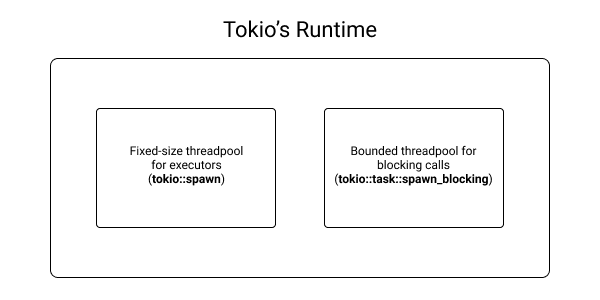

# Going full speed with async

<!--

combinators, prendre exemple de phaser, et montrer un morceau de code si ca avait ete plus imperatif
et inversement, montrer example avec boucle for / flatten pour les targets


according to alice rhyl it means...


Il n'y a pas la function `scan_port` dans le chapitre: https://github.com/skerkour/black-hat-rust/blob/210a61d12ea6e607368884b40ecd088c05a6e33d/ch_03/tricoder/src/ports.rs#L46


```
# Going full speed with async


## async-await

### What is a runtime

- It's called cooperative scheduling.
  Cooperaitve vs preemtive scheduling

- spawning

- blocking (the executor)

- channels

- sleep

- executor / scheduler

- https://tokio.rs/blog/2019-10-scheduler

### future

- snippet de future qui ne resolver pas (sans await)

### stream

### i/o

### concurrency vs parallelism

### task

### retention

- exemple de la cuisine: que se passe-t-il si les plusieurs cooks se battent pour l’acces aux ustensiles

## introduire d'autres types de scan

## cli (clap)
```
 -->


I didn't tell you the whole story: multithreading is not the only way to increase a program's speed, especially in our case, where most of the time is spent doing I/O operations (TCP connections).

Please welcome `async-await`.

Threads have problems: they were designed to parallelize compute-intensive tasks. However, our current use-case is I/O (Input / Output) intensive: our scanner launches a lot of network requests and doesn't actually compute much.

In our situation, it means that threads have two significant problems:

* They use a *lot* (compared to others solutions) of memory
* Launches and context switches have a cost that can be felt when a lot (in the ten of thousands) threads are running.


In practice, it means that our scanner will spend a lot of time waiting for network requests to complete and use way more resources than necessary.


<!--


also known as green threading or m:n threading

 -->


 <!--

 When you are nesting async blocks, you are probably doing something wrong

  -->


## Why

From a programmer's perspective, `async`/`await` provides the same things as threads (concurrency, better hardware utilization, improved speed), but with dramatically better performance and lower resource usage for I/O bound workloads.

What is an *I/O bound workload*? Those are tasks that spend most of their time waiting for network or disk operations to complete instead of being limited by the computing power of the processor.

Threads were designed a long time ago, when most of the computing was not network (web) related stuff, and thus are not suitable for too many concurrent I/O tasks.

| operation | async | thread |
| ----- | ------ | ----- |
| Creation | 0.3 microseconds | 17 microseconds |
| Context switch | 0.2 microseconds | 1.7 microseconds |

As we can see with these measurements [made by Jim Blandy](https://github.com/jimblandy/context-switch), context switching is roughly 8.5 times faster with async than with Linux threads and use approximately 20 times less memory.


## Cooperative vs Preemptive scheduling

In the programming language world, there are mainly 2 ways to deal with I/O tasks: **preemptive scheduling** and **cooperative scheduling**.

**Preemptive scheduling** is when the scheduling of the tasks is out of the control of the developer, entirely managed by a **runtime**. Whether the programmer is launching a sync or an async task, there is no difference in the code.

For example, the [Go](https://golang.org) programming relies on preemptive scheduling.

It has the advantage of being easier to learn: for the developers, there is no difference between sync and async code. Also, it is almost impossible to misuse: the runtime takes care of everything.


The disadvantages are:

* Speed, which is limited by the cleverness of the runtime.
* Hard to debug bugs: If the runtime has a bug, it may be extremely hard to find it out, as the runtime is treated as dark magic by developers.


On the other hand, with **cooperative scheduling**, the developer is responsible for telling the runtime when a task is expected to spend some time waiting for I/O. Waiting, you said? Yes, you get it. It's the exact purpose of the `await` keyword. It's an indication for the runtime (and compiler) that the task will take some time waiting for an I/O operation to complete, and thus the computing resources can be used for another task in the meantime.

It has the advantage of being **extremely fast**. Basically, the developer and the runtime are working together, in harmony, to make the most of the computing power at disposition.

The principal disadvantage of cooperative scheduling is that it's easier to misuse: if a `await` is forgotten (fortunately, the Rust compiler issues warnings), or if the event loop is blocked (what is an event loop? continue reading to learn about it) for more than a few micro-seconds, it can have a disastrous impact on the performance of the system.

The corollary is that an `async` program should deal with extreme care with compute-intensive operations.


## Future

[Rust's documentation](https://doc.rust-lang.org/std/future/trait.Future.html) describes a Future as *an asynchronous computation*.

Put another way, a Future is an object that programmers use to wrap an asynchronous operation. An asynchronous operation is not necessarily an I/O operation. As we will see below, we can also wrap a compute-intensive operation in a Future in order to be able to use it in an `async` program.

In Rust, only Futures can be `.await`ed. Thus, each time you see the `.await` keyword, it means that you are dealing with a Future.

Examples of Futures: an HTTP request (network operation), reading a file (disk operation), a database query...


How to obtain a Future?

Either by implementing the [`Future`](https://doc.rust-lang.org/std/future/trait.Future.html) trait, or by writing an `async` block / function:
```rust
async fn do_something() -> i64 {
    // ...
}

// do_something actually returns a Future<Output = i64>

let f = async { 1u64 };
// f is a Future<Output=u64>
```


## Streams

Streams are a paradigm shift for all imperative programmers.

As we will see later, Streams are iterators for the `async` world.

**You should use them when you want to apply asynchronous operations on a sequence of items of the same type.**

It can be a network socket, a file, a long-lived HTTP request.

Anything that is too large and thus should be split in smaller chunks, or that may arrive later, but we don't know when, or that is simply a collection (a `Vec` or an `HashMap` for example) to which we need to apply `async` operations to.

Even if not directly related to Rust, I recommend the site [reactivex.io](http://reactivex.io) to learn more about the elegance and limitations of Streams.


## What is a runtime

Rust does not provide the execution context required to execute Futures and Streams. This execution context is called a **runtime**. You can't run an `async` Rust program without a runtime.

The 3 most popular runtimes are:

| Runtime | All-time downloads (January 2022) | Description |
| ------ | ------ | ------ |
| [tokio](https://crates.io/crates/tokio) | 42,874,882 | An event-driven, non-blocking I/O platform for writing asynchronous I/O backed applications. |
| [async-std](https://crates.io/crates/async-std) | 5,875,271 | Async version of the Rust standard library |
| [smol](https://crates.io/crates/smol) | 1,187,600 |  A small and fast async runtime |


However, there is a problem: today, runtimes are not interoperable and require acknowledging their specificities in code: you can't easily swap a runtime for another by changing only 1-2 lines of code.

Work is done to permit interoperability in the future, but today, the ecosystem is fragmented. You have to pick one and stick to it.


## Introducing tokio

Tokio is the Rust async runtime with the biggest support from the community and has many sponsors (such as Discord, Fly.io, and Embark), which allow it to have [paid contributors](https://github.com/sponsors/tokio-rs#sponsors)!

If you are **not** doing embedded development, this is the runtime you should use. There is no hesitation to have.


### The event loop(s)

At the core of all `async` runtimes (whether it be in Rust, Node.js, or other languages) are the **event loops**, also called **processors**.

 - https://tokio.rs/blog/2019-10-scheduler#the-next-generation-tokio-scheduler](./assets/ch03_event_loop.png)

In reality, for better performance, there are often multiple processors per program, one per CPU core.

Each event-loop has its own queue of tasks`await`ing for completion. Tokio's is known to be a work-stealing runtime. Each processor can steal the task in the queue of another processor if its own is empty (i.e. it has nothing to do and is "sitting" idle).


To learn more about the different kinds of event loops, you can read this excellent article by Carl Lerche: [https://tokio.rs/blog/2019-10-scheduler](https://tokio.rs/blog/2019-10-scheduler).


### Spawning

When you want to dispatch a task to the runtime to be executed by a processor, you `spawn` it. It can be achieved with tokio's [`tokio::spawn`](https://docs.rs/tokio/1.8.1/tokio/fn.spawn.html) function.


For example:
**[ch_03/tricoder/src/ports.rs](https://github.com/skerkour/black-hat-rust/blob/main/ch_03/tricoder/src/ports.rs)**
```rust
tokio::spawn(async move {
    for port in MOST_COMMON_PORTS_100 {
        let _ = input_tx.send(*port).await;
    }
});
```

This snippet of code spawns 1 task that will be pushed into the queue of one of the processors. As each processor have its own OS thread, by spawning a task, we use all the resources of our machine without having to manage threads ourselves. Without spawning, all the operations are executed on the same processor and thus the same thread.


### Sleep

You can sleep using [`tokio::time::sleep`](https://docs.rs/tokio/1.8.1/tokio/time/fn.sleep.html):

**[ch_03/snippets/concurrent_stream/src/main.rs](https://github.com/skerkour/black-hat-rust/blob/main/ch_03/snippets/concurrent_stream/src/main.rs)**
```rust
tokio::time::sleep(Duration::from_millis(sleep_ms)).await;
```


The advantage of sleeping in the `async` world is that it uses almost 0 resources! No thread is blocked.


### Timeout

You may want to add timeouts to your futures. For example, not to block your system when requesting a slow HTTP server,

It can be easily achieved with [`tokio::time::timeout`](https://docs.rs/tokio/latest/tokio/time/fn.timeout.html) as follows:

**[ch_03/tricoder/src/ports.rs](https://github.com/skerkour/black-hat-rust/blob/main/ch_03/tricoder/src/ports.rs)**
```rust
tokio::time::timeout(Duration::from_secs(3), TcpStream::connect(socket_address)).await
```

The great thing about Rust's Futures composability is that this timeout function can be used with **any** Future! Whether it be an HTTP request, reading a file, or establishing a TCP connection.


## Avoid blocking the event loops

**THIS IS THE MOST IMPORTANT THING TO REMEMBER.**

The most important rule to remember in the world of `async-await` is **not to block the event loop**.

What does it mean? Not calling functions that may run for more than 10 to 100 microseconds directly. Instead, `spawn_blocking` them.

This is known as the [colored functions problem](https://journal.stuffwithstuff.com/2015/02/01/what-color-is-your-function/). You can't call blocking functions inside `async` functions like you would normally do, and vice versa. It would break (not literally) the system.

<!-- But first, we need to learn the difference between concurrency and parallelism. -->

### CPU intensive operations

So, how to execute compute-intensive operations, such as encryption, image encoding, or file hashing?

`tokio` provides the [`tokio::task::spawn_blocking`](https://docs.rs/tokio/1.8.1/tokio/task/fn.spawn_blocking.html) function for blocking operations that eventually finish on their own. By that, I mean a blocking operation which is not an infinite background job. For this kind of task, a Rust [Thread](https://doc.rust-lang.org/stable/std/thread/index.html) is more appropriate.

Here is a an example from an application where `spawn_blocking` is used:
```rust
let is_code_valid = spawn_blocking(move || crypto::verify_password(&code, &code_hash)).await?;
```

Indeed, the function `crypto::verify_password` is expected to take a few milliseconds to complete, it would block the event loop.

Instead, by calling `spawn_blocking`, the operation is dispatched to tokio's blocking tasks thread pool.




Under the hood, tokio maintains two thread pools.

One fixed-size thread pool for its executors (event-loops, processors) which execute async tasks. Async tasks can be dispatched to this thread pool using [`tokio::spawn`](https://docs.rs/tokio/1.8.1/tokio/fn.spawn.html).

And one dynamically sized but bounded (in size) thread pool for blocking tasks. By default, the latter will grow up to 512 threads. Blocking tasks can be dispatched to this thread pool using [`tokio::task::spawn_blocking`](https://docs.rs/tokio/1.8.1/tokio/task/fn.spawn_blocking.html). You can read more about how to finely configure it [in tokio's documentation](https://docs.rs/tokio/1.8.1/tokio/runtime/struct.Builder.html#method.max_blocking_threads).


This is why `async-await` is also known as "Green threads" or "M:N threads". They look like threads for the user (the programmer), but `spawning` is cheaper, and you can spawn way more green threads than the actual number of OS threads the runtime is going to use under the hood.


## Sharing data

You may want to share data between your tasks. As each task can be executed in a different thread (processor), sharing data between `async` tasks are subject to the same rules as sharing data between threads.

### Channels

First, the channels. As we saw in the previous chapter, channels allow us to "share memory by communicating" instead of "communicate by sharing memory" (Mutexes).

Tokio provides many types of channels depending on the task to accomplish:

#### The `oneshot` channel

*The [oneshot](https://docs.rs/tokio/latest/tokio/sync/oneshot/index.html) channel supports sending a single value from a single producer to a single consumer. This channel is usually used to send the result of a computation to a waiter.*


**[docs.rs/tokio/latest/tokio/sync](https://docs.rs/tokio/latest/tokio/sync/index.html#oneshot-channel)**
```rust
use tokio::sync::oneshot;

async fn some_computation() -> String {
    "represents the result of the computation".to_string()
}

#[tokio::main]
async fn main() {
    let (tx, rx) = oneshot::channel();

    tokio::spawn(async move {
        let res = some_computation().await;
        tx.send(res).unwrap();
    });

    // Do other work while the computation is happening in the background

    // Wait for the computation result
    let res = rx.await.unwrap();
}
```

#### The `mpsc` channel

For **M**ultiple **P**roducers, **S**ingle **C**onsumer.

*The [mpsc](https://docs.rs/tokio/latest/tokio/sync/mpsc/index.html) channel supports sending many values from many producers to a single consumer. This channel is often used to send work to a task or to receive the result of many computations.*

It can be used to dispatch jobs to a pool of workers.


**[docs.rs/tokio/latest/tokio/sync](https://docs.rs/tokio/latest/tokio/sync/index.html#mpsc-channel)**
```rust
use tokio::sync::mpsc;

async fn some_computation(input: u32) -> String {
    format!("the result of computation {}", input)
}

#[tokio::main]
async fn main() {
    let (tx, mut rx) = mpsc::channel(100);

    tokio::spawn(async move {
        for i in 0..10 {
            let res = some_computation(i).await;
            tx.send(res).await.unwrap();
        }
    });

    while let Some(res) = rx.recv().await {
        println!("got = {}", res);
    }
}
```


#### `broadcast`

**The [broadcast](https://docs.rs/tokio/latest/tokio/sync/broadcast/index.html) channel supports sending many values from many producers to many consumers. Each consumer will receive each value.**

It can be used as a Pub/Sub mechanism where consumers subscribe to messages or events.


**[docs.rs/tokio/latest/tokio/sync](https://docs.rs/tokio/latest/tokio/sync/index.html#broadcast-channel)**
```rust
use tokio::sync::broadcast;

#[tokio::main]
async fn main() {
    let (tx, mut rx1) = broadcast::channel(16);
    let mut rx2 = tx.subscribe();

    tokio::spawn(async move {
        assert_eq!(rx1.recv().await.unwrap(), 10);
        assert_eq!(rx1.recv().await.unwrap(), 20);
    });

    tokio::spawn(async move {
        assert_eq!(rx2.recv().await.unwrap(), 10);
        assert_eq!(rx2.recv().await.unwrap(), 20);
    });

    tx.send(10).unwrap();
    tx.send(20).unwrap();
}
```


#### `watch`

**The [watch](https://docs.rs/tokio/latest/tokio/sync/index.html#watch-channel) channel supports sending many values from a single producer to many consumers. However, only the most recent value is stored in the channel. Consumers are notified when a new value is sent, but there is no guarantee that consumers will see all values.**

**The watch channel is similar to a broadcast channel with capacity 1.**


### `Arc<Mutex<T>>`

Finally, the last important thing to know is how to use mutexes in `async` Rust.

A mutex allows programmers to safely share a variable between threads (and thus `async` tasks). But, due to Rust's ownership model, a Mutex needs to be wrapped with a [`std::sync::Arc`](https://doc.rust-lang.org/std/sync/struct.Arc.html) smart pointer.

Why do we need a mutex in the first place? Because if 2 threads try to access and/or modify the same variable (memory case) at the same time, it leads to a **data race**. A class of bugs that is very hard to find and fix.

**[docs.rs/tokio/latest/tokio/sync](https://docs.rs/tokio/latest/tokio/sync/struct.Mutex.html#examples)**
```rust
use tokio::sync::Mutex;
use std::sync::Arc;

#[tokio::main]
async fn main() {
    let data1 = Arc::new(Mutex::new(0));
    let data2 = Arc::clone(&data1);

    tokio::spawn(async move {
        let mut lock = data2.lock().await;
        *lock += 1;
    });

    let mut lock = data1.lock().await;
    *lock += 1;
}
```

A great thing to note is that RAII (remember in chapter 01) comes in handy with mutexes: We don't have to manually `unlock` them like in other programming languages. They will automatically unlock when going out of scope (when they are dropped).

#### Retention

The problem with mutexes is lock retention: when a task locks that other tasks have to wait for the same mutex for too much time.

In the worst case, it can lead to deadlock: All tasks are blocked because a single task doesn't release the mutex lock.


## Combinators

<!-- TODO: defintion combinator -->

Combinators are a very interesting topic. Almost all the definitions you'll find on the internet will make your head explode 🤯 because they raise more questions than they answer.

Thus, here is my empiric definition: Combinators are methods that ease the manipulation of some type `T`. They favor a functional (method chaining) style of code.

```rust
let sum: u64 = vec![1, 2, 3].into_iter().map(|x| x * x).sum();
```


This section will be pure how-to and real-world patterns about how combinators make your code easier to read or refactor.


### Iterators

Let start with iterators because this is certainly the situation where combinators are the most used.

#### Obtaining an iterator

An `Iterator` is an object that enables developers to traverse collections.

Iterators can be obtained from most of the collections of the standard library.

First, [`into_iter`](https://doc.rust-lang.org/std/iter/trait.IntoIterator.html) which provides an owned iterator: the collection is moved, and you can no longer use the original variable.

**[ch_03/snippets/combinators/src/main.rs](https://github.com/skerkour/black-hat-rust/blob/main/ch_03/snippets/combinators/src/main.rs)**
```rust
fn vector() {
    let v = vec![
        1, 2, 3,
    ];

    for x in v.into_iter() {
        println!("{}", x);
    }

    // you can't longer use v
}
```


Then, `iter` which provides a borrowed iterator. Here `key` and `value` variables are references (`&String` in this case).
```rust
fn hashmap() {
    let mut h = HashMap::new();
    h.insert(String::from("Hello"), String::from("World"));

    for (key, value) in h.iter() {
        println!("{}: {}", key, value);
    }
}
```


Since version 1.53 (released on June 17, 2021), iterators can also be obtained from arrays:

**[ch_03/snippets/combinators/src/main.rs](https://github.com/skerkour/black-hat-rust/blob/main/ch_03/snippets/combinators/src/main.rs)**
```rust
fn array() {
    let a =[
        1, 2, 3,
    ];

    for x in a.iter() {
        println!("{}", x);
    }
}
```

#### Consuming iterators


Iterators are lazy: they won't do anything if they are not consumed.

As we have just seen, Iterators can be consumed with `for x in` loops. But this is not where they are the most used. Idiomatic Rust favor functional programming. It's a better fit for its ownership model.


[for_each](https://doc.rust-lang.org/std/iter/trait.Iterator.html#method.for_each) is the functional equivalent of `for .. in ..` loops:

**[ch_03/snippets/combinators/src/main.rs](https://github.com/skerkour/black-hat-rust/blob/main/ch_03/snippets/combinators/src/main.rs)**
```rust
fn for_each() {
    let v = vec!["Hello", "World", "!"].into_iter();

    v.for_each(|word| {
        println!("{}", word);
    });
}
```


[collect](https://doc.rust-lang.org/std/iter/trait.Iterator.html#method.collect) can be used to transform an iterator into a collection:

**[ch_03/snippets/combinators/src/main.rs](https://github.com/skerkour/black-hat-rust/blob/main/ch_03/snippets/combinators/src/main.rs)**
```rust
fn collect() {
    let x = vec![1, 2, 3, 4, 5, 6, 7, 8, 9, 10].into_iter();

    let _: Vec<u64> = x.collect();
}
```


Conversely, you can obtain an `HashMap` (or a `BTreeMap`, or other collections, see [https://doc.rust-lang.org/std/iter/trait.FromIterator.html#implementors](https://doc.rust-lang.org/std/iter/trait.FromIterator.html#implementors), using `from_iter`:

**[ch_03/snippets/combinators/src/main.rs](https://github.com/skerkour/black-hat-rust/blob/main/ch_03/snippets/combinators/src/main.rs)**
```rust
fn from_iter() {
    let x = vec![(1, 2), (3, 4), (5, 6)].into_iter();

    let _: HashMap<u64, u64> = HashMap::from_iter(x);
}
```


[reduce](https://doc.rust-lang.org/std/iter/trait.Iterator.html#method.reduce) accumulates over an iterator by applying a closure:

**[ch_03/snippets/combinators/src/main.rs](https://github.com/skerkour/black-hat-rust/blob/main/ch_03/snippets/combinators/src/main.rs)**
```rust
fn reduce() {
    let values = vec![1, 2, 3, 4, 5].into_iter();

    let _sum = values.reduce(|acc, x| acc + x);
}
```

Here `_sum` = 1 + 2 + 3 + 4 + 5 = 15


[fold](https://doc.rust-lang.org/std/iter/trait.Iterator.html#method.fold) is like `reduce` but can return an accumulator of different type than the items of the iterator:

**[ch_03/snippets/combinators/src/main.rs](https://github.com/skerkour/black-hat-rust/blob/main/ch_03/snippets/combinators/src/main.rs)**
```rust
fn fold() {
    let values = vec!["Hello", "World", "!"].into_iter();

    let _sentence = values.fold(String::new(), |acc, x| acc + x);
}
```

Here `_sentence` is a `String`, while the items of the iterator are of type `&str`.


#### Combinators

First, one of the most famous, and available in almost all languages: [filter](https://doc.rust-lang.org/std/iter/trait.Iterator.html#method.filter):

**[ch_03/snippets/combinators/src/main.rs](https://github.com/skerkour/black-hat-rust/blob/main/ch_03/snippets/combinators/src/main.rs)**
```rust
fn filter() {
    let v = vec![-1, 2, -3, 4, 5].into_iter();

    let _positive_numbers: Vec<i32> = v.filter(|x: &i32| x.is_positive()).collect();
}
```


[inspect](https://doc.rust-lang.org/std/iter/trait.Iterator.html#method.inspect) can be used to... inspect the values flowing through an iterator:

**[ch_03/snippets/combinators/src/main.rs](https://github.com/skerkour/black-hat-rust/blob/main/ch_03/snippets/combinators/src/main.rs)**
```rust
fn inspect() {
    let v = vec![-1, 2, -3, 4, 5].into_iter();

    let _positive_numbers: Vec<i32> = v
        .inspect(|x| println!("Before filter: {}", x))
        .filter(|x: &i32| x.is_positive())
        .inspect(|x| println!("After filter: {}", x))
        .collect();
}
```


[map](https://doc.rust-lang.org/std/iter/trait.Iterator.html#method.map) is used to convert an the items of an iterator from one type to another:

**[ch_03/snippets/combinators/src/main.rs](https://github.com/skerkour/black-hat-rust/blob/main/ch_03/snippets/combinators/src/main.rs)**
```rust
fn map() {
    let v = vec!["Hello", "World", "!"].into_iter();

    let w: Vec<String> = v.map(String::from).collect();
}
```

Here from `&str` to `String`.


[filter_map](https://doc.rust-lang.org/std/iter/trait.Iterator.html#method.filter_map) is kind of like chaining `map` and `filter`. It has the advantage of dealing with `Option` instead of `bool`:

**[ch_03/snippets/combinators/src/main.rs](https://github.com/skerkour/black-hat-rust/blob/main/ch_03/snippets/combinators/src/main.rs)**
```rust
fn filter_map() {
    let v = vec!["Hello", "World", "!"].into_iter();

    let w: Vec<String> = v
        .filter_map(|x| {
            if x.len() > 2 {
                Some(String::from(x))
            } else {
                None
            }
        })
        .collect();

    assert_eq!(w, vec!["Hello".to_string(), "World".to_string()]);
}
```

[chain](https://doc.rust-lang.org/std/iter/trait.Iterator.html#method.chain) merges two iterators:

**[ch_03/snippets/combinators/src/main.rs](https://github.com/skerkour/black-hat-rust/blob/main/ch_03/snippets/combinators/src/main.rs)**
```rust
fn chain() {
    let x = vec![1, 2, 3, 4, 5].into_iter();
    let y = vec![6, 7, 8, 9, 10].into_iter();

    let z: Vec<u64> = x.chain(y).collect();
    assert_eq!(z.len(), 10);
}
```

[flatten](https://doc.rust-lang.org/std/iter/trait.Iterator.html#method.flatten) can be used to flatten collections of collections:

**[ch_03/snippets/combinators/src/main.rs](https://github.com/skerkour/black-hat-rust/blob/main/ch_03/snippets/combinators/src/main.rs)**
```rust
fn flatten() {
    let x = vec![vec![1, 2, 3, 4, 5], vec![6, 7, 8, 9, 10]].into_iter();

    let z: Vec<u64> = x.flatten().collect();
    assert_eq!(z.len(), 10);
}
```

Now `z = vec![1, 2, 3, 4, 5, 6, 7, 8, 9, 10]`;

<!-- [flat_map](https://doc.rust-lang.org/std/iter/trait.Iterator.html#method.flat_map)
```rust
// .flat_map()
``` -->


##### Composing combinators

This is where combinators shine: they make your code more elegant and (most of the time) easier to read because closer to how Humans think than how computers work.


**[ch_03/snippets/combinators/src/main.rs](https://github.com/skerkour/black-hat-rust/blob/main/ch_03/snippets/combinators/src/main.rs)**
```rust
#[test]
fn combinators() {
    let a = vec![
        "1",
        "2",
        "-1",
        "4",
        "-4",
        "100",
        "invalid",
        "Not a number",
        "",
    ];

    let _only_positive_numbers: Vec<i64> = a
        .into_iter()
        .filter_map(|x| x.parse::<i64>().ok())
        .filter(|x| x > &0)
        .collect();
}
```

For example, the code snippet above replaces a big loop with complex logic, and instead, in a few lines, we do the following:

* Try to parse an array of collection of strings into numbers
* filter out invalid results
* filter numbers less than 0
* collect everything in a new vector

It has the advantage of working with immutable data and thus reduces the probability of bugs.


### `Option`


Use a default value: [unwrap_or](https://doc.rust-lang.org/std/option/enum.Option.html#method.unwrap_or)
```rust
fn option_unwrap_or() {
    let _port = std::env::var("PORT").ok().unwrap_or(String::from("8080"));
}
```

Use a default `Option` value: [or](https://doc.rust-lang.org/std/option/enum.Option.html#method.or)
```rust
// config.port is an Option<String>
let _port = config.port.or(std::env::var("PORT").ok());
// _port is an Option<String>
```

Call a function if `Option` is `Some`: [and_then](https://doc.rust-lang.org/std/option/enum.Option.html#method.and_then)
```rust
fn port_to_address() -> Option<String> {
    // ...
}

let _address = std::env::var("PORT").ok().and_then(port_to_address);
```

Call a function if `Option` is `None`: [or_else](https://doc.rust-lang.org/std/option/enum.Option.html#method.or_else)
```rust
fn get_default_port() -> Option<String> {
    // ...
}

let _port = std::env::var("PORT").ok().or_else(get_default_port);
```


<!-- Get a (mutable, or not) reference: [as_ref](https://doc.rust-lang.org/std/option/enum.Option.html#method.as_ref) and [as_mut](https://doc.rust-lang.org/std/option/enum.Option.html#method.as_mut)
```rust

// .as_ref() & .as-mut()
``` -->

And the two extremely useful function for the `Option` type:
[is_some](https://doc.rust-lang.org/std/option/enum.Option.html#method.is_some) and [is_none](https://doc.rust-lang.org/std/option/enum.Option.html#method.is_none)

`is_some` returns `true` is an `Option` is `Some` (contains a value):
```rust
let a: Option<u32> = Some(1);

if a.is_some() {
    println!("will be printed");
}

let b: Option<u32> = None;

if b.is_some() {
    println!("will NOT be printed");
}
```


`is_none` returns `true` is an `Option` is `None` (does **not** contain a value):
```rust
let a: Option<u32> = Some(1);

if a.is_none() {
    println!("will NOT be printed");
}


let b: Option<u32> = None;

if b.is_none() {
    println!("will be printed");
}
```


You can find the other (and in my experience, less commonly used) combinators for the `Option` type online: [https://doc.rust-lang.org/std/option/enum.Option.html](https://doc.rust-lang.org/std/option/enum.Option.html).


### `Result`


Convert a `Result` to an `Option` with [`ok`](https://doc.rust-lang.org/std/result/enum.Result.html#method.ok):

**[ch_03/snippets/combinators/src/main.rs](https://github.com/skerkour/black-hat-rust/blob/main/ch_03/snippets/combinators/src/main.rs)**
```rust
fn result_ok() {
    let _port: Option<String> = std::env::var("PORT").ok();
}
```


Use a default `Result` if `Result` is `Err` with [`or`](https://doc.rust-lang.org/std/result/enum.Result.html#method.or):

**[ch_03/snippets/combinators/src/main.rs](https://github.com/skerkour/black-hat-rust/blob/main/ch_03/snippets/combinators/src/main.rs)**
```rust
fn result_or() {
    let _port: Result<String, std::env::VarError> =
        std::env::var("PORT").or(Ok(String::from("8080")));
}
```


[`map_err`](https://doc.rust-lang.org/std/result/enum.Result.html#method.map_err) converts a `Result<T, E>` to a `Result<T, F>` by calling a function:

```rust
fn convert_error(err: ErrorType1) -> ErrorType2 {
    // ...
}


let _port: Result<String, ErrorType2> = std::env::var("PORT").map_err(convert_error);
```


Call a function if `Results` is `Ok`: [and_then](https://doc.rust-lang.org/std/result/enum.Result.html#method.and_then).

```rust
fn port_to_address() -> Option<String> {
    // ...
}

let _address = std::env::var("PORT").and_then(port_to_address);
```

Call a function and default value: [map_or](https://doc.rust-lang.org/std/result/enum.Result.html#method.map_or)
```rust
let http_port = std::env::var("PORT")
    .map_or(Ok(String::from("8080")), |env_val| env_val.parse::<u16>())?;
```


Chain a function if `Result` is `Ok`: [map](https://doc.rust-lang.org/std/result/enum.Result.html#method.map)

```rust
let master_key = std::env::var("MASTER_KEY")
    .map_err(|_| env_not_found("MASTER_KEY"))
    .map(base64::decode)??;
```


<!-- Get a (mutable, or not) reference: [as_ref](https://doc.rust-lang.org/std/result/enum.Result.html#method.as_ref) and [as_mut](https://doc.rust-lang.org/std/result/enum.Result.html#method.as_mut)
```rust

// .as_ref() & .as_mut()
``` -->


And the last two extremely useful functions for the `Result` type:
[is_ok](https://doc.rust-lang.org/std/result/enum.Result.html#method.is_ok) and [is_err](https://doc.rust-lang.org/std/result/enum.Result.html#method.is_err)


`is_ok` returns `true` is an `Result` is `Ok`:

```rust
if std::env::var("DOES_EXIST").is_ok() {
    println!("will be printed");
}

if std::env::var("DOES_NOT_EXIST").is_ok() {
    println!("will NOT be printed");
}
```

`is_err` returns `true` is an `Result` is `Err`:

```rust
if std::env::var("DOES_NOT_EXIST").is_err() {
    println!("will be printed");
}

if std::env::var("DOES_EXIST").is_err() {
    println!("will NOT be printed");
}
```


You can find the other (and in my experience, less commonly used) combinators for the `Result` type online: [https://doc.rust-lang.org/std/result/enum.Result.html](https://doc.rust-lang.org/std/result/enum.Result.html).


### When to use `.unwrap()` and `.expect()`

`unwrap` and `expect` can be used on both `Option` and `Result`. They have the potential to crash your program, so use them with parsimony.

I see 2 situations where it's legitimate to use them:

* Either when doing exploration, and quick script-like programs, to not bother with handling all the edge cases.
* When you are sure they will never crash, **but**, they should be accompanied by a comment explaining why it's safe to use them and why they won't crash the program.


### Async combinators

You may be wondering: what it has to do with `async`?

Well, the [Future](https://docs.rs/futures/latest/futures/future/trait.Future.html) and the [Stream](https://docs.rs/futures/latest/futures/stream/trait.Stream.html) traits have two friends, the [FutureExt](https://docs.rs/futures/latest/futures/future/trait.FutureExt.html) and the [StreamExt](https://docs.rs/futures/latest/futures/stream/trait.StreamExt.html) traits. Those traits add combinators to the `Future` and `Stream` types, respectively.


#### `FutureExt`

[then](https://docs.rs/futures/latest/futures/future/trait.FutureExt.html#method.then) calls a function returning a Future after the initial Future finished:

```rust
async fn compute_a() -> i64 {
    40
}

async fn compute_b(a: i64) -> i64 {
    a + 2
}

let b = compute_a().then(compute_b).await;
// b = 42
```

[map](https://docs.rs/futures/latest/futures/future/trait.FutureExt.html#method.map) converts a Future's output to a different type by calling a **non-async** function:

```rust
async fn get_port() -> String {
    // ...
}

fn parse_port() -> Result<u16, Error> {
    // ...
}

let port: Result<u16, Error> = get_port().map(parse_port).await;
```

[flatten](https://docs.rs/futures/latest/futures/future/trait.FutureExt.html#method.flatten) merges a Future of Future (`Future<Output=Future<Output=String>>` for example) into a simple Future (`Future<Output=String>`).

```rust
let nested_future = async { async { 42 } };

let f = nested_future.flatten();
let forty_two = f.await;
```

[into_stream](https://docs.rs/futures/latest/futures/future/trait.FutureExt.html#method.into_stream) converts a future into a single element stream.

```rust
let f = async { 42 };
let stream = f.into_stream();
```

<!-- [boxed](https://docs.rs/futures/latest/futures/future/trait.FutureExt.html#method.boxed) -->


You can find the other (and in my experience, less commonly used) combinators for the `FutureExt` type online: [https://docs.rs/futures/latest/futures/future/trait.FutureExt.html](https://docs.rs/futures/latest/futures/future/trait.FutureExt.html).


#### `StreamExt`

As we saw, Streams are like async iterators, and this is why you will find the same combinators, such as [filter](https://docs.rs/futures/latest/futures/stream/trait.StreamExt.html#method.filter), [fold](https://docs.rs/futures/latest/futures/stream/trait.StreamExt.html#method.fold), [for_each](https://docs.rs/futures/latest/futures/stream/trait.StreamExt.html#method.for_each), [map](https://docs.rs/futures/latest/futures/stream/trait.StreamExt.html#method.map) and so on.

Like Iterators, Streams **should be consumed** to have any effect.


Additionally, there are some specific combinators that can be used to process elements concurrently:
[for_each_concurrent](https://docs.rs/futures/latest/futures/stream/trait.StreamExt.html#method.for_each_concurrent) and [buffer_unordered](https://docs.rs/futures/latest/futures/stream/trait.StreamExt.html#method.buffer_unordered).

As you will notice, the difference between the two is that `buffer_unordered` produces a Stream that needs to be consumed while `for_each_concurrent` actually consumes the Stream.

Here is a quick example:

**[ch_03/snippets/concurrent_stream/src/main.rs](https://github.com/skerkour/black-hat-rust/blob/main/ch_03/snippets/concurrent_stream/src/main.rs)**
```rust
use futures::{stream, StreamExt};
use rand::{thread_rng, Rng};
use std::time::Duration;

#[tokio::main(flavor = "multi_thread")]
async fn main() {
    stream::iter(0..200u64)
        .for_each_concurrent(20, |number| async move {
            let mut rng = thread_rng();
            let sleep_ms: u64 = rng.gen_range(0..20);
            tokio::time::sleep(Duration::from_millis(sleep_ms)).await;
            println!("{}", number);
        })
        .await;
}
```

```bash
$ cargo run --release
14
17
18
13
9
2
5
8
16
19
3
4
10
29
0
7
20
15
...
```

The lack of order of the printed numbers shows us that jobs are executed concurrently.

In `async` Rust, Streams and their concurrent combinators replace worker pools in other languages. Worker pools are commonly used to process jobs concurrently, such as HTTP requests, file hashing, and so on. But in Rust, they are an anti-pattern because their APIs often favor imperative programming, mutable variables (to accumulate the result of computation) and thus may introduce subtle bugs.

Indeed, the most common challenge of a worker pool is to collect back the result of the computation applied to the jobs.

There are 3 ways to use Streams to replace worker pools and collect the result in an idiomatic and functional way. Remember to **always put an upper limit on the number of concurrent tasks. Otherwise, you may quickly exhaust the resources of your system and thus affect performance**.


##### Using `buffer_unordered` and `collect`

Remember `collect`? It can also be used on Streams to convert them to a collection.

**[ch_03/tricoder/src/main.rs](https://github.com/skerkour/black-hat-rust/blob/main/ch_03/tricoder/src/main.rs)**
```rust
// Concurrent stream method 1: Using buffer_unordered + collect
let subdomains: Vec<Subdomain> = stream::iter(subdomains.into_iter())
    .map(|subdomain| ports::scan_ports(ports_concurrency, subdomain))
    .buffer_unordered(subdomains_concurrency)
    .collect()
    .await;
```

This is the more functional and idiomatic way to implement a worker pool in Rust. Here, our `subdomains` is the list of jobs to process. It's then transformed into Futures holding port scanning tasks. Those Futures are concurrently executed thanks to `buffer_unordered`. And the Stream is finally converted back to a `Vec` with `.collect().await`.


##### Using an `Arc<Mutex<T>>`

**[ch_03/tricoder/src/main.rs](https://github.com/skerkour/black-hat-rust/blob/main/ch_03/tricoder/src/main.rs)**
```rust
// Concurrent stream method 2: Using an Arc<Mutex<T>>
let res: Arc<Mutex<Vec<Subdomain>>> = Arc::new(Mutex::new(Vec::new()));

stream::iter(subdomains.into_iter())
    .for_each_concurrent(subdomains_concurrency, |subdomain| {
        let res = res.clone();
        async move {
            let subdomain = ports::scan_ports(ports_concurrency, subdomain).await;
            res.lock().await.push(subdomain)
        }
    })
    .await;
```


##### Using channels

**[ch_03/tricoder/src/ports.rs](https://github.com/skerkour/black-hat-rust/blob/main/ch_03/tricoder/src/ports.rs)**
```rust
// Concurrent stream method 3: using channels
let (input_tx, input_rx) = mpsc::channel(concurrency);
let (output_tx, output_rx) = mpsc::channel(concurrency);

tokio::spawn(async move {
    for port in MOST_COMMON_PORTS_100 {
        let _ = input_tx.send(*port).await;
    }
});

let input_rx_stream = tokio_stream::wrappers::ReceiverStream::new(input_rx);
input_rx_stream
    .for_each_concurrent(concurrency, |port| {
        let subdomain = subdomain.clone();
        let output_tx = output_tx.clone();
        async move {
            let port = scan_port(&subdomain.domain, port).await;
            if port.is_open {
                let _ = output_tx.send(port).await;
            }
        }
    })
    .await;

// close channel
drop(output_tx);

let output_rx_stream = tokio_stream::wrappers::ReceiverStream::new(output_rx);
let open_ports: Vec<Port> = output_rx_stream.collect().await;
```

Here we voluntarily complexified the example as the two channels (one for queuing jobs in the Stream, one for collecting results) are not necessarily required.

One interesting thing to notice, is the use of a generator:
```rust
tokio::spawn(async move {
    for port in MOST_COMMON_PORTS_100 {
        let _ = input_tx.send(*port).await;
    }
});
```

Why? Because as you don't want unbounded concurrency, you don't want unbounded channels, it may put down your system under pressure. But if the channel is bounded and the downstream system processes jobs slower than the generator, it may block the latter and cause strange issues. This is why we spawn the generator in its own tokio task, so it can live its life in complete independence.


## Porting our scanner to async

At the end of this chapter, our scanner is going to be very efficient. No more tons of threads, it will use all the available cores on our machine, no more, and the `async` runtime is going to efficiently dispatch tasks (network requests) to those processors.


### `main`

The first thing is to decorate our `main` function with [`tokio::main`](https://docs.rs/tokio/latest/tokio/attr.main.html).

**[ch_03/tricoder/src/main.rs](https://github.com/skerkour/black-hat-rust/blob/main/ch_03/tricoder/src/main.rs)**
```rust
#[tokio::main]
async fn main() -> Result<(), anyhow::Error> {
    let http_timeout = Duration::from_secs(10);
    let http_client = Client::builder().timeout(http_timeout).build()?;

    let ports_concurrency = 200;
    let subdomains_concurrency = 100;
    let scan_start = Instant::now();

    let subdomains = subdomains::enumerate(&http_client, target).await?;

    // ...
}
```

What is this dark magic?

`#[tokio::main]` is a macro that creates a multi-threaded runtime and wrap the body of our main function. It's the equivalent of:
```rust
fn main() -> Result<(), anyhow::Error> {
    let runtime = tokio::runtime::Builder::new_multi_thread()
        .enable_all()
        .build()
        .unwrap();

    runtime.block_on(async move {
        // ...
    })
}
```

### Subdomains


**[ch_03/tricoder/src/subdomains.rs](https://github.com/skerkour/black-hat-rust/blob/main/ch_03/tricoder/src/subdomains.rs)**
```rust
type DnsResolver = AsyncResolver<GenericConnection, GenericConnectionProvider<TokioRuntime>>;

pub async fn enumerate(http_client: &Client, target: &str) -> Result<Vec<Subdomain>, Error> {
    let entries: Vec<CrtShEntry> = http_client
        .get(&format!("https://crt.sh/?q=%25.{}&output=json", target))
        .send()
        .await?
        .json()
        .await?;

    let mut dns_resolver_opts = ResolverOpts::default();
    dns_resolver_opts.timeout = Duration::from_secs(4);

    let dns_resolver = AsyncResolver::tokio(
        ResolverConfig::default(),
        dns_resolver_opts,
    )
    .expect("subdomain resolver: building DNS client");
```

```rust
    // clean and dedup results
    let mut subdomains: HashSet<String> = entries
        .into_iter()
        .map(|entry| {
            entry
                .name_value
                .split("\n")
                .map(|subdomain| subdomain.trim().to_string())
                .collect::<Vec<String>>()
        })
        .flatten()
        .filter(|subdomain: &String| subdomain != target)
        .filter(|subdomain: &String| !subdomain.contains("*"))
        .collect();
    subdomains.insert(target.to_string());
```

Note that here `flatten` is not the `flatten` method of a Future, it's the `flatten` method of an Iterator.

Then, we can check if the domains resolve by turning the subdomains into a Stream. Thanks to the combinators, the code remains easy to read.

```rust
    let subdomains: Vec<Subdomain> = stream::iter(subdomains.into_iter())
        .map(|domain| Subdomain {
            domain,
            open_ports: Vec::new(),
        })
        .filter_map(|subdomain| {
            let dns_resolver = dns_resolver.clone();
            async move {
                if resolves(&dns_resolver, &subdomain).await {
                    Some(subdomain)
                } else {
                    None
                }
            }
        })
        .collect()
        .await;

    Ok(subdomains)
}

pub async fn resolves(dns_resolver: &DnsResolver, domain: &Subdomain) -> bool {
    dns_resolver.lookup_ip(domain.domain.as_str()).await.is_ok()
}
```


By turning the subdomains into a Stream, we can then use the `map` combinator and `buffer_unordered` to scan the subdomains concurrently and `collect` the result into a `Vector`.

Very elegant and handy, in my opinion.

```rust
    // Concurrent stream method 1: Using buffer_unordered + collect
    let scan_result: Vec<Subdomain> = stream::iter(subdomains.into_iter())
        .map(|subdomain| ports::scan_ports(ports_concurrency, subdomain))
        .buffer_unordered(subdomains_concurrency)
        .collect()
        .await;
```

### Ports

As we previously saw, we use a stream as a worker pool to scan all the ports of a given host concurrently:
**[ch_03/tricoder/src/ports.rs](https://github.com/skerkour/black-hat-rust/blob/main/ch_03/tricoder/src/ports.rs)**
```rust
pub async fn scan_ports(concurrency: usize, subdomain: Subdomain) -> Subdomain {
    let mut ret = subdomain.clone();
    let socket_addresses: Vec<SocketAddr> = format!("{}:1024", subdomain.domain)
        .to_socket_addrs()
        .expect("port scanner: Creating socket address")
        .collect();

    if socket_addresses.len() == 0 {
        return subdomain;
    }

    let socket_address = socket_addresses[0];

    // Concurrent stream method 3: using channels
    let (input_tx, input_rx) = mpsc::channel(concurrency);
    let (output_tx, output_rx) = mpsc::channel(concurrency);

    tokio::spawn(async move {
        for port in MOST_COMMON_PORTS_100 {
            let _ = input_tx.send(*port).await;
        }
    });

    let input_rx_stream = tokio_stream::wrappers::ReceiverStream::new(input_rx);
    input_rx_stream
        .for_each_concurrent(concurrency, |port| {
            let output_tx = output_tx.clone();
            async move {
                let port = scan_port(socket_address, port).await;
                if port.is_open {
                    let _ = output_tx.send(port).await;
                }
            }
        })
        .await;
    // close channel
    drop(output_tx);

    let output_rx_stream = tokio_stream::wrappers::ReceiverStream::new(output_rx);
    ret.open_ports = output_rx_stream.collect().await;

    ret
}
```

Finally, remember that when scanning a single port, we need a timeout.

Because [`tokio::time::timeout`](https://docs.rs/tokio/latest/tokio/time/fn.timeout.html) returns a `Future<Output=Result>` we need to check that both the Result of `TcpStream::connect` and `tokio::time::timeout` are Ok to be sure that the port is open.

```rust
async fn scan_port(mut socket_address: SocketAddr, port: u16) -> Port {
    let timeout = Duration::from_secs(3);
    socket_address.set_port(port);

    let is_open = matches!(
        tokio::time::timeout(timeout, TcpStream::connect(&socket_address)).await,
        Ok(Ok(_)),
    );

    Port {
        port: port,
        is_open,
    }
}
```

Notice the `matches!` macro, which is a shortcut for:

```rust
    let is_open =
        match tokio::time::timeout(timeout, TcpStream::connect(&socket_addresses[0])).await {
            Ok(Ok(_)) => true,
            _ => false,
        };
```


## How to defend

**Do not block the event loop**. I can't repeat it enough as I see it too often. As we saw previously, you need to spawn blocking tasks in the dedicated thread pool (either fixed in size or unbounded, depending on if your application is more compute or I/O intensive).

Don't forget the numbers: in an `async` function or block, do not call a non-`async` function or perform a computation that may run for **more than 10 to 100 microseconds**.

<!-- In order to find potential mistakes in your code, you have to do the same things as when looking to attack: review it, review it and review it. -->


## Summary

* Multithreading should be preferred when the program is CPU bound, `async-await` when the program is I/O bound
* **Don't block the event loop**
* Streams are async iterators
* Streams replace worker pools
* Always limit the number of concurrent tasks or the size of channels not to exhaust resources
* If you are nesting async blocks, you are probably doing something wrong.
