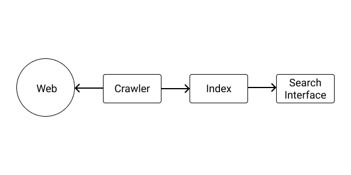
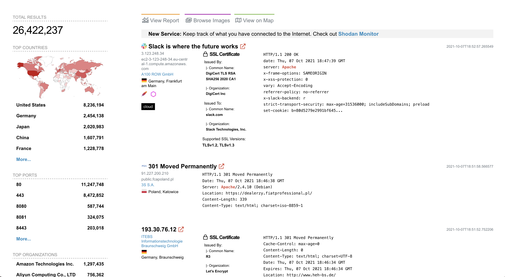
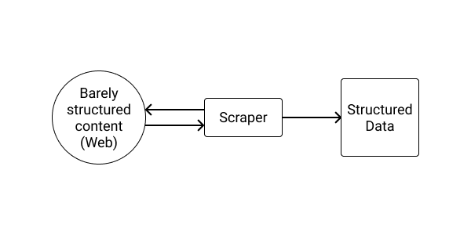
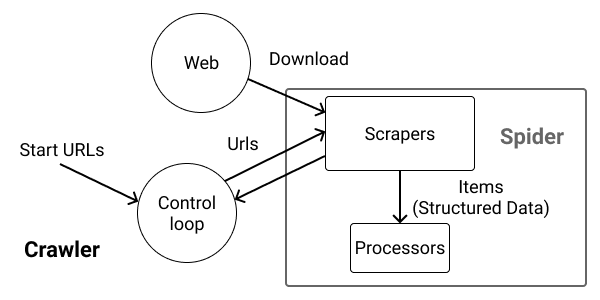
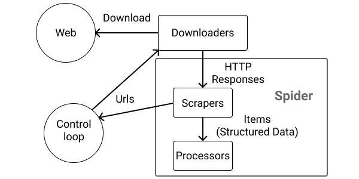

# Crawling the web for OSINT

<!--
https://codeburst.io/web-scraping-in-rust-881b534a60f7
https://github.com/causal-agent/scraper
https://www.gkbrk.com/wiki/rust_web_scraping/
https://joydeep31415.medium.com/rust-and-webscraping-ebecc9ae536c
https://rust-lang-nursery.github.io/rust-cookbook/web.html
https://www.fullstacklabs.co/blog/a-rusting-rubyist-v
https://docs.scrapy.org/en/latest/topics/architecture.html
https://github.com/skerkour/archive/blob/main/crawler-go/crawler.go
https://github.com/skerkour/private_archive/blob/main/github-crawler/spiders.go


https://github.com/mattsse/voyager
https://github.com/pop-os/url-crawler/
https://github.com/let4be/crusty


https://crates.io/crates/headless_chrome
https://crates.io/crates/thirtyfour
https://crates.io/crates/fantoccini
-->

## OSINT

OSINT stands for Open Source Intelligence. Just to be clear, the *Open Source* part has nothing to do with the *Open Source* you are used to know.

OSINT can be defined as the methods and tools that use publicly available information to support intelligence analysis (investigation, reconnaissance).

As OSINT consists of extracting meaningful information from a lot of data, it can, and should, be automated.


## Tools

The most well-known tool for OSINT is [Maltego](https://www.maltego.com/). It provides a desktop application with a lot of features to visualize, script, and automate your investigations.

Unfortunately, it may not be the best fit for everyone as the **pro** plan is pricy if you are not using it often. Also, from what I know, the SDKs are available only for a [few programming languages](https://docs.maltego.com/support/solutions/articles/15000015757-transform-libraries), which make it hard to interface with **the** programming language you love: Rust.

This is why I prefer plain markdown notes with homemade scripts in the programming language I prefer. The results of the scripts are then pasted into the markdown report or exported as CSV or JSON files.

Everything is backed up in a Git repository.

Then, with a tool like [Pandoc](https://pandoc.org/) you can export the markdown report to almost any format you want: PDF, HTML, Docx, Epub, PPTX, Latex...

If you like the graphical representation, you can also use something like [markmap](https://markmap.js.org) to turn your markdown document into a mindmap, which is not exactly a graph, but a tree.


Four other useful projects are:

- [Sherlock](https://github.com/sherlock-project/sherlock): *Hunt down social media accounts by username across social networks*
- [theHarvester](https://github.com/laramies/theHarvester): *E-mails, subdomains and names Harvester*
- [phoneinfoga](https://github.com/sundowndev/phoneinfoga): *Information gathering & OSINT framework for phone numbers. It allows you to first gather standard information such as country, area, carrier and line type on any international phone number.*
- [gitrob](https://github.com/michenriksen/gitrob): *Reconnaissance tool for GitHub organizations*


## Search engines

The purpose of a search engine is to turn an ocean of data into searchable and actionable **information**.

A search engine is composed of the following pieces:

- **Crawlers**, which navigate the ocean of data and turn it into structured data
- An **index**, used to store the structured data extracted by the crawlers
- And, the **search interface** used to query the index




Why it's important?

Because in essence, **OSINT is about building a specialized search engine about our targets: you crawl data from other databases and only index the meaningful information about your target to be searched later**. Whether it be in a markdown report, in maltego, or in a traditional database like PostgreSQL.

As we will see, search engines are not limited to the web (such as Google or Bing). There also are search engines for servers and IoT (Internet of Things).


Unfortunately for us, most public search engines are polite: they respect `robots.txt` files and thus may omit interesting data. More importantly, they don't crawl pages behind a login screen.

This is why we also need to know how to build our own crawlers.


### Google

Google being the dominant search engine, it's no surprise that you will find most of what you are looking for on it.

#### Google operators

The Google search allows its users to refine their queries. For example:

`site:kerkour.com` to limit the search to a specific site.

`intitle:"Index of"` to search for pages with a title containing "Index of".

`intext:kerkour` to search for pages containing "kerkour" in their bodies.

`inurl:hacking` to search for pages with the word "hacking" in their URLs.


You can find more [Google operators here](https://moz.com/learn/seo/search-operators).

#### Google dorks

Google dorks are specially crafted Google queries relying on operators to find vulnerable sites.

Here are a few examples of google dorks to find juicy targets:

`intitle:"index of" ".env"` to find leaked `.env` files.

`intitle:"Index of" "DCIM/camera"` to find private images.

`intitle:"Index of" "firebase.json"` to find firebase tokens.

`inurl:"/app/kibana" intitle:"Kibana"` to find open-to-the-world kibana dashboards.

`intitle:"index of" "authorized_keys"` to find leaked SSH keys and configuration.

`inurl:/wp-content/uploads/ ext:txt "username" | "user name" | "uname" | "user" | "userid" | "user id" AND "password" | "pass word" | "pwd" | "pw"` to find leaked wordpress credentials.


Google has an incredible amount of private data in its index, available to whoever will bother to ask for it.


You can find more Google dorks on [Exploit DB](https://www.exploit-db.com/google-hacking-database).

Your imagination is the limit!

#### Git dorks

In the same vein, by using [GitHub](https://github.com)'s search and specially crafted queries, you may be able to find juicy findings.

`user:skerkour access_key` to restrict your query to a specific user.

`filename:.env` to find a file with a specific name.

`org:microsoft s3_key` to limit your query to a specific organization.

`filename:wp-config.php` to find WordPress credentials.


You can find more Git(Hub) dorks on... Github: [https://github.com/obheda12/GitDorker/blob/master/Dorks/alldorksv3](https://github.com/obheda12/GitDorker/blob/master/Dorks/alldorksv3).

<!-- https://obheda12.medium.com/gitdorker-a-new-tool-for-manual-github-dorking-and-easy-bug-bounty-wins-92a0a0a6b8d5 -->


## IoT & network Search engines

There also are specialized search engines that don't crawl the web but crawl the internet.

On these search engines, you enter an IP address, a domain name, or the name of a service (`apache` or `elastisearch` for example), and they return all the servers running this specific service or all the data they have on a particular IP address.

* [Shodan](https://www.shodan.io/)
* [Censys](https://search.censys.io/)




## Social media

Social networks depend on the region of your target.

You can find a pretty exhaustive list of social networks here: [https://github.com/sherlock-project/sherlock/blob/master/sites.md](https://github.com/sherlock-project/sherlock/blob/master/sites.md), but here are the most famous ones:

* [Facebook](https://www.facebook.com/)
* [Twitter](https://twitter.com/)
* [VK](https://vk.com/)
* [Instagram](https://www.instagram.com/)
* [Reddit](https://www.reddit.com/)


## Maps

Physical intrusion is out of the topic of this book, but using maps such as [Google Maps](https://www.google.com/maps) can be useful: by locating the restaurants around your target, you may be able to find some employees of your target eating there and be able either to hear what are they talking about when eating, or maybe taking a picture of their badges and identities.


## Videos

With the rise of the video format, more and more details are leaked every day, the two principal platforms being [YouTube](https://www.youtube.com/) and [Twitch](https://www.twitch.tv/).

What to look at in the videos of your targets? Three things:

- **Who** is in the videos
- **Where** the videos are recorded, and what looks like the building
- The background **details**, it already happened that some credentials (or an organization chart, or any other sensitive document) were leaked because a sheet with them written was in the background of a video.


## Government records

Finally, almost all countries have public records about businesses, patents, trademarks, and other things of interest that may help you to connect the dots.


## Crawling the web

First, a term disambiguation: what is the difference between a scraper and a crawler?

Scraping is the process of turning unstructured web data into structured data.




Crawling is the process of running through a lot of interlinked data (web pages, for example).

In practice, it's most of the time useless to scrape without crawling through multiple pages or to crawl without scraping content, so we can say that each crawler is a scraper, and almost every scraper is a crawler.

Some people prefer to call a scraper a crawler for a specific website and a crawler something that crawls the entire web. Anyway, I think that it's nitpicking, so we won't spend more time debating.

For the rest of this book, we are going to use the term **crawler**.

So, why crawl websites to scrape data?

It's all about **automation**. Yes, you can manually browse the 1000s pages of a website and manually copy/paste the data in a spreadsheet.

Or, you could build a specialized program, the crawler, that will do it for you in a blink.


### Designing a crawler




A crawler is composed of the following parts:

**Start URLs**: you need a list of seed URLs to start the crawl. For example, the root page of your target's website.


**Spiders**: this is the specialized part of a crawler, tuned for a specific site or task. For example, we could implement a spider to get all the users of a GitHub organization or all the vulnerabilities of a specific product. A spider is itself composed of 2 parts:

- The scraper that fetches the URLs, parses the data, turns it into structured data, and a list of URLs extracted from the document to continue the crawl.
- The processor that precesses the structured data: saving it to a database, for example.


The biggest advantage of splitting the responsibilities of a spider into 2 distinct stages is that they can be run with different concurrency levels depending on your expected workload. For example, you could have a pool with 3 concurrent scrapers not to flood the website you are crawling and trigger bot detection systems, but 100 concurrent processors.

<!-- The control loop -->

<!--

the goal is to have to create the minimum of code for a specific website
or put in another way:
to reuse the maximum of code across crawls

 -->


**A Control loop**: this is the generic part of a crawler. Its job is to dispatch data between the scrapers and the processors and queue URLs.


## Why Rust for crawling

Now you may be wondering, why Rust for crawling? After all, Python and Go already have a solid ecosystem around this problem (respectively [Scrapy](https://scrapy.org/) and [Colly](http://go-colly.org/)).


### Async

The first, and maybe most important reason for using Rust, is its async I/O model: you are guaranteed to have the best performance possible when making network requests.

### Memory-related performance

Making a lot of network requests and parsing data often require creating a lot of short-lived memory objects, which would put a lot of pressure on garbage collectors. As Rust doesn't have a garbage collector, it doesn't have this problem, and the memory usage will be far more deterministic.


### Safety when parsing

Scraping requires parsing. Parsing is one of the most common ways to introduce vulnerabilities ([Parsing JSON is a Minefield](https://seriot.ch/projects/parsing_json.html), [XML parsing vulnerabilities](https://gist.github.com/mgeeky/4f726d3b374f0a34267d4f19c9004870)) or bugs. Rust, on the other hand, with its memory safety and strict error handling, provides better tools to handle the complex task of parsing untrusted data and complex formats.


## Associated types

Now we are all up about what a crawler is and why Rust, let's learn the last few Rust features that we need to build a crawler.

The last important point to know about generics in Rust is: **Associated types**.

You already dealt with associated types when using iterators and Futures.

Remember `Future<Output=String>`, here `String` is an associated type.

We could build a generic spider such as:
```rust
pub trait Spider<I>{
    fn name(&self) -> String;
    fn start_urls(&self) -> Vec<String>;
    async fn scrape(&self, url: &str) -> Result<(Vec<I>, Vec<String>), Error>;
    async fn process(&self, item: I) -> Result<(), Error>;
}
```

But then it would be very inconvenient to use it as each function using it would need to also be generic over `I`:
```rust
fn use_spider<I, S: Spider<I>>(spider: S) {
    // ...
}
```

By using an associated type, we simplify the usage of the trait and communicate more clearly how it works:
```rust
#[async_trait]
pub trait Spider {
    type Item;

    fn name(&self) -> String;
    fn start_urls(&self) -> Vec<String>;
    async fn scrape(&self, url: &str) -> Result<(Vec<Self::Item>, Vec<String>), Error>;
    async fn process(&self, item: Self::Item) -> Result<(), Error>;
}
```

```rust
fn use_spider<S: Spider>(spider: S) {
    // ...
}
```

Like with type parameters, you can add constraints to associated types:

```rust
pub trait Spider {
    type Item: Debug + Clone;

    fn name(&self) -> String;
    fn start_urls(&self) -> Vec<String>;
    async fn scrape(&self, url: &str) -> Result<(Vec<Self::Item>, Vec<String>), Error>;
    async fn process(&self, item: Self::Item) -> Result<(), Error>;
}
```


## Atomic types

Atomic types, like mutexes, are shared-memory types: they can be safely shared between multiple threads.

They allow not to have to use a mutex, and thus and all the ritual around `lock()` which may introduce bugs such as deadlocks.

You should use an atomic if you want to share a boolean or an integer (such as a counter) across threads instead of a `Mutex<bool>` or `Mutex<i64>`.

Operations on atomic types require an ordering argument. The reason is out of the topic of this book, but you can read more about it on this excellent post: [Explaining Atomics in Rust](https://cfsamsonbooks.gitbook.io/explaining-atomics-in-rust/).

To keep things simple, use [`Ordering::SeqCst`](https://doc.rust-lang.org/std/sync/atomic/enum.Ordering.html#variant.SeqCst) which provides the strongest guarantees.


**[ch_05/snippets/atomic/src/main.rs](https://github.com/skerkour/black-hat-rust/blob/main/ch_05/snippets/atomic/src/main.rs)**
```rust
use std::sync::atomic::{AtomicUsize, Ordering};
use std::sync::Arc;
use std::thread;

fn main() {
    // creating a new atomic
    let my_atomic = AtomicUsize::new(42);

    // adding 1
    my_atomic.fetch_add(1, Ordering::SeqCst);

    // geting the value
    assert!(my_atomic.load(Ordering::SeqCst) == 43);

    // substracting 1
    my_atomic.fetch_sub(1, Ordering::SeqCst);

    // replacing the value
    my_atomic.store(10, Ordering::SeqCst);
    assert!(my_atomic.load(Ordering::SeqCst) == 10);

    // other avalable operations
    // fetch_xor, fetch_or, fetch_nand, fetch_and...

    // creating a new atomic that can be shared between threads
    let my_arc_atomic = Arc::new(AtomicUsize::new(4));

    let second_ref_atomic = my_arc_atomic.clone();
    thread::spawn(move|| {
        second_ref_atomic.store(42, Ordering::SeqCst);
    });
}
```

The available types are:

- `AtomicBool`
- `AtomicI8`
- `AtomicI16`
- `AtomicI32`
- `AtomicI64`
- `AtomicIsize`
- `AtomicPtr`
- `AtomicU8`
- `AtomicU16`
- `AtomicU32`
- `AtomicU64`
- `AtomicUsize`

You can learn more about atomic type in the [Rust doc](https://doc.rust-lang.org/std/sync/atomic/).


## Barrier

A barrier is like a `sync.WaitGroup` in Go: it allows multiples concurrent operations to synchronize.


```rust
use tokio::sync::Barrier;
use std::sync::Arc;

#[tokio::main]
async fn main() {
    // number of concurrent operations
    let barrier = Arc::new(Barrier::new(3));

    let b2 = barrier.clone()
    tokio::spawn(async move {
        // do things
        b2.wait().await;
    });

     let b3 = barrier.clone()
    tokio::spawn(async move {
        // do things
        b3.wait().await;
    });

    barrier.wait().await;

    println!("This will print only when all the three concurrent operations have terminated");
}
```


## Implementing a crawler in Rust

In the following section, we are going to build a generic crawler and three different spiders:

- a spider for an HTML-only website
- a spider for a JSON API
- and a spider for a website using JavaScript to render elements so we are going to need to use a headless browser


## The spider trait

**[ch_05/crawler/src/spiders/mod.rs](https://github.com/skerkour/black-hat-rust/blob/main/ch_05/crawler/src/spiders/mod.rs)**
```rust
#[async_trait]
pub trait Spider: Send + Sync {
    type Item;

    fn name(&self) -> String;
    fn start_urls(&self) -> Vec<String>;
    async fn scrape(&self, url: String) -> Result<(Vec<Self::Item>, Vec<String>), Error>;
    async fn process(&self, item: Self::Item) -> Result<(), Error>;
}
```


## Implementing the crawler


**[ch_05/crawler/src/crawler.rs](https://github.com/skerkour/black-hat-rust/blob/main/ch_05/crawler/src/crawler.rs)**
```rust
    pub async fn run<T: Send + 'static>(&self, spider: Arc<dyn Spider<Item = T>>) {
        let mut visited_urls = HashSet::<String>::new();
        let crawling_concurrency = self.crawling_concurrency;
        let crawling_queue_capacity = crawling_concurrency * 400;
        let processing_concurrency = self.processing_concurrency;
        let processing_queue_capacity = processing_concurrency * 10;
        let active_spiders = Arc::new(AtomicUsize::new(0));

        let (urls_to_visit_tx, urls_to_visit_rx) = mpsc::channel(crawling_queue_capacity);
        let (items_tx, items_rx) = mpsc::channel(processing_queue_capacity);
        let (new_urls_tx, mut new_urls_rx) = mpsc::channel(crawling_queue_capacity);
        let barrier = Arc::new(Barrier::new(3));
```


```rust
        for url in spider.start_urls() {
            visited_urls.insert(url.clone());
            let _ = urls_to_visit_tx.send(url).await;
        }

        self.launch_processors(
            processing_concurrency,
            spider.clone(),
            items_rx,
            barrier.clone(),
        );

        self.launch_scrapers(
            crawling_concurrency,
            spider.clone(),
            urls_to_visit_rx,
            new_urls_tx.clone(),
            items_tx,
            active_spiders.clone(),
            self.delay,
            barrier.clone(),
        );
```

And finally, the control loop, where we queue new URLs that have not already have been visited and check if we need to stop the crawler.

By dropping `urls_to_visit_tx`, we close the channels, and thus stop the scrappers, once they have all finished processing the remaining URLs in the channel.


```rust
        loop {
            if let Some((visited_url, new_urls)) = new_urls_rx.try_recv().ok() {
                visited_urls.insert(visited_url);

                for url in new_urls {
                    if !visited_urls.contains(&url) {
                        visited_urls.insert(url.clone());
                        log::debug!("queueing: {}", url);
                        let _ = urls_to_visit_tx.send(url).await;
                    }
                }
            }

            if new_urls_tx.capacity() == crawling_queue_capacity // new_urls channel is empty
            && urls_to_visit_tx.capacity() == crawling_queue_capacity // urls_to_visit channel is empty
            && active_spiders.load(Ordering::SeqCst) == 0
            {
                // no more work, we leave
                break;
            }

            sleep(Duration::from_millis(5)).await;
        }

        log::info!("crawler: control loop exited");

        // we drop the transmitter in order to close the stream
        drop(urls_to_visit_tx);

        // and then we wait for the streams to complete
        barrier.wait().await;
    }
```


Executing the processors concurrently is just a matter of spawning a new task, with a stream and `for_each_concurrent`. Once the stream is stopped, we "notify" the `barrier`.
```rust
    fn launch_processors<T: Send + 'static>(
        &self,
        concurrency: usize,
        spider: Arc<dyn Spider<Item = T>>,
        items: mpsc::Receiver<T>,
        barrier: Arc<Barrier>,
    ) {
        tokio::spawn(async move {
            tokio_stream::wrappers::ReceiverStream::new(items)
                .for_each_concurrent(concurrency, |item| async {
                    let _ = spider.process(item).await;
                })
                .await;

            barrier.wait().await;
        });
    }
```

Finally, launching scrapers, like processors, requires a new task, with a stream and `for_each_concurrent`.

The logic here is a little bit more complex:

- we first increment `active_spiders`
- then, we scrape the URL and extract the data and the next URLs to visit
- we then send these items to the processors
- we also send the newly found URLs to the control loop
- and we sleep for the configured delay, not to flood the server
- finally, we decrement `active_spiders`

By dropping `items_tx`, we are closing the `items` channel, and thus stopping the processors once the channel is empty.

```rust
    fn launch_scrapers<T: Send + 'static>(
        &self,
        concurrency: usize,
        spider: Arc<dyn Spider<Item = T>>,
        urls_to_vist: mpsc::Receiver<String>,
        new_urls: mpsc::Sender<(String, Vec<String>)>,
        items_tx: mpsc::Sender<T>,
        active_spiders: Arc<AtomicUsize>,
        delay: Duration,
        barrier: Arc<Barrier>,
    ) {
        tokio::spawn(async move {
            tokio_stream::wrappers::ReceiverStream::new(urls_to_vist)
                .for_each_concurrent(concurrency, |queued_url| {
                    let queued_url = queued_url.clone();
                    async {
                        active_spiders.fetch_add(1, Ordering::SeqCst);
                        let mut urls = Vec::new();
                        let res = spider
                            .scrape(queued_url.clone())
                            .await
                            .map_err(|err| {
                                log::error!("{}", err);
                                err
                            })
                            .ok();

                        if let Some((items, new_urls)) = res {
                            for item in items {
                                let _ = items_tx.send(item).await;
                            }
                            urls = new_urls;
                        }

                        let _ = new_urls.send((queued_url, urls)).await;
                        sleep(delay).await;
                        active_spiders.fetch_sub(1, Ordering::SeqCst);
                    }
                })
                .await;

            drop(items_tx);
            barrier.wait().await;
        });
    }
```


## Crawling a simple HTML website

The plain HTML website that we will crawl is [CVE Details](https://www.cvedetails.com/): *the ultimate security vulnerabilities datasource*.

It's a website providing an easy way to search for vulnerabilities with a [CVE ID](https://cve.mitre.org/).

We will use this page as the start URL: [https://www.cvedetails.com/vulnerability-list/vulnerabilities.html](https://www.cvedetails.com/vulnerability-list/vulnerabilities.html) which, when you look at the bottom of the page, provides the links to all the other pages listing the vulnerabilities.


### Extracting structured data

The first step is to identify what data we want. In this case, it's all the information of a CVE entry:
**[ch_05/crawler/src/spiders/cvedetails.rs](https://github.com/skerkour/black-hat-rust/blob/main/ch_05/crawler/src/spiders/cvedetails.rs)**
```rust
#[derive(Debug, Clone)]
pub struct Cve {
    name: String,
    url: String,
    cwe_id: Option<String>,
    cwe_url: Option<String>,
    vulnerability_type: String,
    publish_date: String,
    update_date: String,
    score: f32,
    access: String,
    complexity: String,
    authentication: String,
    confidentiality: String,
    integrity: String,
    availability: String,
}
```

Then, with a browser and the developers tools, we inspect the page to search the relevant HTML classes and ids that will allow us to extract that data:
**[ch_05/crawler/src/spiders/cvedetails.rs](https://github.com/skerkour/black-hat-rust/blob/main/ch_05/crawler/src/spiders/cvedetails.rs)**
```rust
async fn scrape(&self, url: String) -> Result<(Vec<Self::Item>, Vec<String>), Error> {
    log::info!("visiting: {}", url);

    let http_res = self.http_client.get(url).send().await?.text().await?;
    let mut items = Vec::new();

    let document = Document::from(http_res.as_str());

    let rows = document.select(Attr("id", "vulnslisttable").descendant(Class("srrowns")));
    for row in rows {
        let mut columns = row.select(Name("td"));
        let _ = columns.next(); // # column
        let cve_link = columns.next().unwrap().select(Name("a")).next().unwrap();
        let cve_name = cve_link.text().trim().to_string();
        let cve_url = self.normalize_url(cve_link.attr("href").unwrap());


        let _ = columns.next(); // # of exploits column

        let access = columns.next().unwrap().text().trim().to_string();
        let complexity = columns.next().unwrap().text().trim().to_string();
        let authentication = columns.next().unwrap().text().trim().to_string();
        let confidentiality = columns.next().unwrap().text().trim().to_string();
        let integrity = columns.next().unwrap().text().trim().to_string();
        let availability = columns.next().unwrap().text().trim().to_string();
```

```rust
        let cve = Cve {
            name: cve_name,
            url: cve_url,
            cwe_id: cwe.as_ref().map(|cwe| cwe.0.clone()),
            cwe_url: cwe.as_ref().map(|cwe| cwe.1.clone()),
            vulnerability_type,
            publish_date,
            update_date,
            score,
            access,
            complexity,
            authentication,
            confidentiality,
            integrity,
            availability,
        };
        items.push(cve);
    }
}
```


### Extracting links

**[ch_05/crawler/src/spiders/cvedetails.rs](https://github.com/skerkour/black-hat-rust/blob/main/ch_05/crawler/src/spiders/cvedetails.rs)**
```rust
let next_pages_links = document
    .select(Attr("id", "pagingb").descendant(Name("a")))
    .filter_map(|n| n.attr("href"))
    .map(|url| self.normalize_url(url))
    .collect::<Vec<String>>();
```


To run this spider, go to the git repository accompanying this book, in **[ch_05/crawler](https://github.com/skerkour/black-hat-rust/blob/main/ch_05/crawler/)**, and run:
```bash
$ cargo run -- run --spider cvedetails
```


## Crawling a JSON API

Crawling a JSON API is, on the other hand, pretty straightforward, as the data is already (in theory) structured. The only difficulty is to find the next pages to crawl.

Here, we are going to scrape all the users of a GitHub organization. Why it's useful? Because if you gain access to one of these accounts (by finding a leaked token or some other means), or gain access to some of the repositories of the organization.

**[ch_05/crawler/src/spiders/github.rs](https://github.com/skerkour/black-hat-rust/blob/main/ch_05/crawler/src/spiders/github.rs)**
```rust
#[derive(Debug, Clone, Serialize, Deserialize)]
pub struct GitHubItem {
    login: String,
    id: u64,
    node_id: String,
    html_url: String,
    avatar_url: String,
}
```


As our crawler won't make tons of requests, we don't need to use a token to authenticate to Github's API, but we need to set up some headers. Otherwise, the server would block our requests.

Finally, we also need a regexp, as a *quick and dirty* way to find next page to crawl:
```rust
pub struct GitHubSpider {
    http_client: Client,
    page_regex: Regex,
    expected_number_of_results: usize,
}

impl GitHubSpider {
    pub fn new() -> Self {
        let http_timeout = Duration::from_secs(6);
        let mut headers = header::HeaderMap::new();
        headers.insert(
            "Accept",
            header::HeaderValue::from_static("application/vnd.github.v3+json"),
        );

        let http_client = Client::builder()
            .timeout(http_timeout)
            .default_headers(headers)
            .user_agent(
                "Mozilla/5.0 (Windows NT 6.1; Win64; x64; rv:47.0) Gecko/20100101 Firefox/47.0",
            )
            .build()
            .expect("spiders/github: Building HTTP client");

        // will match https://...?page=XXX
        let page_regex =
            Regex::new(".*page=([0-9]*).*").expect("spiders/github: Compiling page regex");

        GitHubSpider {
            http_client,
            page_regex,
            expected_number_of_results: 100,
        }
    }
}
```

Extracting the item is just a matter of parsing the JSON, which is easy thanks to `reqwest`, which provides the `json` method.

Here, the trick is to find the next URL to visit. For that, we use the regex compiled above and capture the current page number. For example, in `...&page=2` we capture `2`.

Then we parse this String into a number, increment this number, and replace the original URL with the new number. Thus the new URL would be `...&page=3`.

If the API doesn't return the expected number of results (which is configured with the `per_page` query parameter), then it means that we are at the last page of the results, so there is no more page to crawl.

**[ch_05/crawler/src/spiders/github.rs](https://github.com/skerkour/black-hat-rust/blob/main/ch_05/crawler/src/spiders/github.rs)**
```rust
async fn scrape(&self, url: String) -> Result<(Vec<GitHubItem>, Vec<String>), Error> {
    let items: Vec<GitHubItem> = self.http_client.get(&url).send().await?.json().await?;

    let next_pages_links = if items.len() == self.expected_number_of_results {
        let captures = self.page_regex.captures(&url).unwrap();
        let old_page_number = captures.get(1).unwrap().as_str().to_string();
        let mut new_page_number = old_page_number
            .parse::<usize>()
            .map_err(|_| Error::Internal("spider/github: parsing page number".to_string()))?;
        new_page_number += 1;

        let next_url = url.replace(
            format!("&page={}", old_page_number).as_str(),
            format!("&page={}", new_page_number).as_str(),
        );
        vec![next_url]
    } else {
        Vec::new()
    };

    Ok((items, next_pages_links))
}
```

To run this spider, go to the git repository accompanying this book, in **[ch_05/crawler/](https://github.com/skerkour/black-hat-rust/blob/main/ch_05/crawler/)**, and run:
```bash
$ cargo run -- run --spider github
```


## Crawling a JavaScript web application

Nowadays, more and more websites generate elements of the pages client-side, using JavaScript. In order to get this data, we need a **headless browser**: it's a browser that can be operated remotely and programmatically.

For that, we will use [chromedriver](https://chromedriver.chromium.org/downloads).

On a Debian-style machine, it can be installed with:
```bash
$ sudo apt install chromium-browser chromium-chromedriver
```


Because the headless browser client methods require a mutable reference (`&mut self`), we need to wrap it with a mutex to be able to use it safely in our pool of scrapers.

**[ch_05/crawler/src/spiders/quotes.rs](https://github.com/skerkour/black-hat-rust/blob/main/ch_05/crawler/src/spiders/quotes.rs)**
```rust
impl QuotesSpider {
    pub async fn new() -> Result<Self, Error> {
        let mut caps = serde_json::map::Map::new();
        let chrome_opts = serde_json::json!({ "args": ["--headless", "--disable-gpu"] });
        caps.insert("goog:chromeOptions".to_string(), chrome_opts);
        let webdriver_client = ClientBuilder::rustls()
            .capabilities(caps)
            .connect("http://localhost:4444")
            .await?;

        Ok(QuotesSpider {
            webdriver_client: Mutex::new(webdriver_client),
        })
    }
}
```

Fetching a web page with our headless browser can be achieved in two steps:

- first, we go to the URL
- then, we fetch the source

**[ch_05/crawler/src/spiders/quotes.rs](https://github.com/skerkour/black-hat-rust/blob/main/ch_05/crawler/src/spiders/quotes.rs)**
```rust
async fn scrape(&self, url: String) -> Result<(Vec<Self::Item>, Vec<String>), Error> {
    let mut items = Vec::new();
    let html = {
        let mut webdriver = self.webdriver_client.lock().await;
        webdriver.goto(&url).await?;
        webdriver.source().await?
    };
```

Once we have the rendered source of the page, we can scrape it like any other HTML page:
```rust
let document = Document::from(html.as_str());

let quotes = document.select(Class("quote"));
for quote in quotes {
    let mut spans = quote.select(Name("span"));
    let quote_span = spans.next().unwrap();
    let quote_str = quote_span.text().trim().to_string();

    let author = spans
        .next()
        .unwrap()
        .select(Class("author"))
        .next()
        .unwrap()
        .text()
        .trim()
        .to_string();

    items.push(QuotesItem {
        quote: quote_str,
        author,
    });
}
```


```rust
let next_pages_link = document
    .select(
        Class("pager")
            .descendant(Class("next"))
            .descendant(Name("a")),
    )
    .filter_map(|n| n.attr("href"))
    .map(|url| self.normalize_url(url))
    .collect::<Vec<String>>();

Ok((items, next_pages_link))
```


To run this spider, you first need to launch `chromedriver` in a separate shell:
```bash
$ chromedriver --port=4444 --disable-dev-shm-usage
```

Then, in another shell, go to the git repository accompanying this book, in **[ch_05/crawler/](https://github.com/skerkour/black-hat-rust/blob/main/ch_05/crawler/)**, and run:
```bash
$ cargo run -- run --spider quotes
```


## How to defend

The BIG problem is to detect if a visitor is legitimate or is a bot. Millions are spent on this specific problem, and current systems by the biggest corporations are still far from perfect. That's why you sometimes need to fill those annoying captchas.

Let's be clear. You can't protect against a determined programmer wanting to scrape your website. You can only implement measures that make their life harder.

Here are a few techniques to trap crawlers.

### Infinite redirects, loops, and slow pages

The first method is a basic trap: you can create dummy pages that users should never arrive on, but a bad bot will. These dummy pages would infinitely lead to other dummy pages, leading to other dummy pages.

For example, `/trap/1` would lead to `/trap/2`, which would lead to `/trap/3`...


You could also intentionally slow down these dummy pages:
```javascript
function serve_page(req, res) {
    if (bot_is_detected()) {
        sleep(10 * time.Second)
        return res.send_dummy_page();
    }
}
```

A good trick to catch bad bots is to add these traps in the `disallow` section of your `robots.txt` file.


### Zip bombing

The second method is certainly the most offensive one.

It consists of abusing the internal compression algorithms to create a `.zip` or `.gzip` file that is small (a few kilobytes/megabytes), but once uncompressed weights many gigabytes, which will lead the crawler to exhaust all its memory until the crash.

Here is how to simply create such a file:
```bash
$ dd if=/dev/zero bs=1M count=10000 | gzip > 10G.gzip
$ du -sh 10G.gzip
$ 10M     10G.gzip
```

Then, when a bot is detected, serve this file instead of a legitimate HTML page:
```javascript
function serve_page(req, res) {
    if (bot_is_detected()) {
        res.set_header("Content-Encoding", "gzip")
        return res.send_file("10G.gzip");
    }
}
```

Why GZip? Because GZip is almost universally automatically handled by HTTP clients. Thus just by requesting the URL, the crawler is going to automagically crash.

<!-- why gzip?
Car c'est dans le fonctionnement de HTTP, donc n'importe quel client qui va visiter la page, va crasher -->

### Bad data

<!--
https://blog.haschek.at/2017/how-to-defend-your-website-with-zip-bombs.html
https://news.ycombinator.com/item?id=14707674
https://www.bamsoftware.com/hacks/zipbomb/
https://news.ycombinator.com/item?id=20352439
-->

Finally, the last method is to defend against the root cause of why you are being scrapped in the first place: the data.

The idea is simple: if you are confident enough in your bot detection algorithm (I think you shouldn't), you can serve rotten and poisoned data to the crawlers.

Another, more subtle approach is to serve "tainted data": data with embedded markers that will allow you to identify and confront the scrapers, an impossible date, or imaginary names, for example.


## Going further

### Advanced architecture




For more advanced crawlers, you may want to add a new part to your crawler: **Downloaders**.

Downloaders' role is to download the content available at an URL.

`URL -> Downloader -> Raw Data`.


By extracting downloaders from spiders, you can build a collection of reusable downloaders:

- `reqwest` for HTML only websites
- An headless browser for Single Page Apps
- ...


### Use a swappable store for the queues

Another improvement for our crawler would be to use a persistent, on-disk store for our queues. Redis or PostgreSQL, for example.

It would enable crawls to be paused and started at will, queues to grow past the available memory of our system, and jobs to be distributed among multiple machines.

### Error handling and retries

To keep the code "clean" we didn't implement any error handling nor retry mechanism. If, for any reason, a crawled website is temporarily unavailable, you may want to retry fetching it later.

### Respecting robots.txt

* Fetch `robots.txt` on start.
* Parse it and turn it into a set of rules.
* For each queued URL, check if it matches a rule.


## Summary

* OSINT is repetitive and thus should be automated
* Use atomic types instead of integers or boolean wrapped by a mutex
* It's very hard to defend against scappers.
