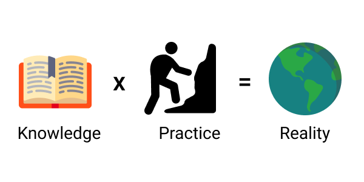
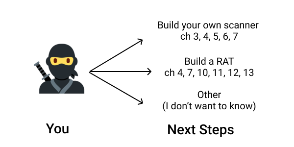

# Conclusion

By now, I hope to have convinced you that due to its safety, reliability, and polyvalence, Rust is **THE** language that will re-shape the offensive security and programming worlds.

I also hope that with all the applied knowledge you read in this book, you are now ready to get things done.

Now it's **YOUR** turn.


## What we didn't cover

There are few topics we didn't cover in this book:

* **Lifetime annotations**
* **Macros**
* **Embedded**
* **Ethics**
* **BGP hijacking**

<!--
* **Reverse engineering**
* **Network analysis and capture**
-->

### Lifetime Annotations

I don't like [lifetime annotations](https://doc.rust-lang.org/book/ch10-03-lifetime-syntax.html). When combined with generics, it becomes extremely easy to produce **extremely hard to read and reason about** code. Do you and your coworkers a favor: avoid lifetime annotations.

Instead, whenever it's possible, prefer to move data, or when it's not possible, use [smart pointers](https://doc.rust-lang.org/book/ch15-00-smart-pointers.html) such as [`Rc`](https://doc.rust-lang.org/std/rc/struct.Rc.html) and [`Arc`](https://doc.rust-lang.org/std/sync/struct.Arc.html) for long-lived references.

One of the goals of this book was to prove that we can create complex programs without using them. Actually, when you avoid lifetime, Rust is a lot easier to read and understand, even by non-initiates. It looks very similar to TypeScript, and suddenly and lot more people are able to understand your code.


### Macros

I don't like macros either. Don't get me wrong. They sometimes provide awesome usability improvements such as `println!`, `log::info!`, or `#[derive(Deserialize, Serialize)]`. But I believe that most of the time, they try to dissimulate complexity that should be first cut down or solved with better abstraction and code architecture.

Rust provides **Declarative macros** ending with a `!` such as `println!` and **Procedural macros** to generate code from attributes such as `#[tokio::main]`.

The [Rust Book](https://doc.rust-lang.org/book/ch19-06-macros.html) provides everything you need to get started writing macros, but please, think twice before writing a macro.


### Embedded

Really cool stuff can be found on the internet about how to use microcontrollers to create hacking devices, such as on [hackaday](https://hackaday.com/category/security-hacks/), [mg.lol](https://mg.lol/blog/tag/usb/) and [hack5](https://hak5.org/). I believe that Rust has a bright future in these areas, but, unfortunately, I have never done any embedded development myself, so this topic didn't have its place in this book.

If you want to learn more, [Ferrous Systems' blog](https://ferrous-systems.com/blog/) contains a lot of content about using Rust for embedded systems.


### Ethics

Ethics always has been a complex topic debated since the first philosophers and is highly dependent on the culture, so I have nothing new to bring to the table. That being said, "With great power comes great responsibility" and building a cyber-arsenal can have real consequences on the civil population. For example: [https://citizenlab.ca/2020/12/the-great-ipwn-journalists-hacked-with-suspected-nso-group-imessage-zero-click-exploit/](https://citizenlab.ca/2020/12/the-great-ipwn-journalists-hacked-with-suspected-nso-group-imessage-zero-click-exploit/) and [https://citizenlab.ca/2016/08/million-dollar-dissident-iphone-zero-day-nso-group-uae/](https://citizenlab.ca/2016/08/million-dollar-dissident-iphone-zero-day-nso-group-uae/).

<!--
https://hn.algolia.com/?dateRange=all&page=0&prefix=true&query=nso&sort=byPopularity&type=story
-->

Also, I believe that in a few years, attacks such as ransomware targeting critical infrastructure (energy, health centers...) will be treated by states as terrorism, so it's better not to have anything to do with that kind of criminals, unlike this [55-year-old Latvian woman](https://krebsonsecurity.com/2021/06/how-does-one-get-hired-by-a-top-cybercrime-gang/), self-employed web site designer and mother of two, who's alleged to have worked as a programmer for a malware-as-a-service platform, and subsequently arrested by the U.S. Department of Justice.


## The future of Rust

I have absolutely no doubt that Rust will gradually replace all the low-level code that is today written in C or C++ due to the guarantees provided by the compiler. Too many critical vulnerabilities could have been avoided. It will start with networked services, as those are the easiest to remotely exploit (what is not networked today?), especially in video games where the amount of network vulnerabilities is [mind-blowing](https://hackerone.com/valve/hacktivity?type=team).

It may take some time for the biggest codebases, such as web browsers ([but it already has started for Firefox](https://wiki.mozilla.org/Oxidation)), which is sad, because web browsers are the almost universal entry-point for anything virtual nowadays, we will continue to see a [lot of memory-related vulnerabilities](https://www.cvedetails.com/product/15031/Google-Chrome.html?vendor_id=1224) that Rust could have avoided.

I also noticed a lot of interest for Rust in Web development. I myself use it to develop a SaaS ([https://bloom.sh](https://bloom.sh)), and it's an extremely pleasant experience, especially as a solo developer, as it has never ever crashed and thus allow me to sleep better. I've also shared my experience and a few tips on my blog: [https://kerkour.com/blog/rust-for-web-development-2-years-later/](https://kerkour.com/blog/rust-for-web-development-2-years-later/).

The only limit to world domination is its (relative) complexity, and, more importantly, the long compile times.

You can stay updated by following the two official Rust blogs:
* [https://blog.rust-lang.org](https://blog.rust-lang.org)
* [https://foundation.rust-lang.org/posts](https://foundation.rust-lang.org/posts)


## Leaked repositories

You can find online source code leaked from organizations practicing offensive operations.

The 2 most notable are:

[Hacked Team](https://github.com/hackedteam) where a company specialized in selling offensive tools to governments across the world was hacked, and all its data was leaked. The write up by the hacker is also really interesting: [https://www.exploit-db.com/papers/41914](https://www.exploit-db.com/papers/41914)


And [Vault7](https://github.com/sterling0x1/CIA-Hacking-Tools) where the CIA lost control of the majority of its hacking arsenal, including malware, viruses, trojans, weaponized "zero day" exploits... The leaks were published by [Wikileaks](https://en.wikipedia.org/wiki/WikiLeaks) in 2017 .


## How bad guys get caught

After having read tons of hacking stories reported by journalists and authors, I've come to the conclusion that the 3 most common ways bad guys get caught are **snitches**, **metadata**, and **communications**.

Ego, money, judiciaries threats... There are many reasons that may drive a person to snitch and betray their teammates.

As we saw in previous chapters, computers leak metadata everywhere: IP addresses, compile-time, and paths in binaries...


Finally comes communications. Whether it be on forums or chats, communicating leave traces and thus pieces of evidence.


## Your turn

Now it's **YOUR TURN** to act! This is not the passive consumption of this book that will improve your skills and magically achieve your goals. You can't learn without practice, and it's action that shapes the world, not [overthinking](https://kerkour.com/overthinking/).




**I repeat, knowledge has no value if you don't practice!**.

I hope to have shared enough of the knowledge I acquired through practice and failure, now it's your turn to practice and fail. You can't make a perfect program the first time. Nobody can. But those are always the people practicing (and failing!) the most who become the best.


Now there are 3 ways to get started:

- Build your own scanner and sell it as a service.
- Build your own scanner and start hunting vulnerabilities in bug bounty programs.
- Build your own RAT and find a way to monetize it.



<!--

Write your own scanner or RAT in Rust. Add features. Improve it over time. Remember that you can't learn without practice and that it's action that shapes the world, not thinking.

**The next steps?**

I believe that copying is a great way to learn by doing so the first thing that I would recommend, if you don't have any specific project to complete, is to copy existing ones. To learn, you should not copy the code line by line, but instead, copy the features and implement them in Rust without looking at the source code at all.

You can find inspiration in the bonuses provided with this book, and with GitHub topics: [security](https://github.com/topics/security)  TODO: reste de la liste -->

<!--

### Next steps

All this speech about action is great, but now what?

I have good news for you, I anticipated this question! I have extracted the scanner we made in chapters 02, 03, 04, and 07 into it's own project and improved it: [https://github.com/skerkour/phaser](https://github.com/skerkour/phaser).

Phaser combines attack surface mapping and vulnerability scanning in order to provide easy-to-use fully automated security scans.

Just run:
```shell
$ phaser scan - -aggressive kerkour.com
```

To generate a detailed report of the attack surface of the target and its potential vulnerabilities.

Whether you want to contribute to your first Rust project, for example by adding a module, or to start your first bug bounty, or scan the network of your company, **phaser** is THE project to get started!

I also setup a complete [CI](https://github.com/skerkour/phaser/tree/main/.github/workflows) workflow that you can copy for your own Rust projects.


You may be wondering: *"but against who should I use it? And how can I make money and experience with it?"*
-->


### Selling a scanner as a service

Selling it as a service (as in Software as a Service, SaaS) is certainly the best way to monetize a scanner.


2 famous companies in the market are [Acunetix](https://www.acunetix.com/) and [Detectify](https://detectify.com/).

Beware that finding prospects for this kind of service is hard, and you certainly won't be able to do it all by yourself. Furthermore, you not only need to quickly adapt to new vulnerabilities to protect your customers, but also to follow all the major references such as OWASP, which is a lot of work!

Actual security doesn't sell. The sentiment of security does.


### Bug bounty

<!--


for smaller organisation, the best thing is to aimlly report to them and ne rien attendre en refour

they are most of the time understaffed and or underfounded.

it will increase your karma balance mais rien de plus


https://twitter.com/danielvf/status/1446344532380037122
 -->

Bug bounty programs are the uberization of offensive security. No interview, no degree asked. Anyone can join the party and try to make money or a reputation by finding vulnerabilities.

If you are lucky, you could find a low-hanging fruit and make your first hundreds to thousands of dollars in a few hours (hint: subdomain takeover).
<!-- If you find an easy target you should be able to make your first hundreds to thousands dollars just by running [phaser](https://github.com/skerkour/phaser). No jokes! If you are lucky, it can happen in less than 2 hours. The longest thing being to write the report. -->

If you are less lucky, you may quickly find vulnerabilities, or manually, then spend time writing the report, all that for your report being dismissed as non-receivable. Whether it be a duplicate, or, not appreciated as serious enough to deserve a monetary reward.

This is the dark side of bug bounties.


I **recommend you to only participate in bug bounty programs offering monetary rewards.** Those are often the most serious people, and your time is too precious to be exploited.

Engineers are often afraid to ask for money, but **you should not**. People are making money off your skills, you are in your own right to claim your piece of the cake!


#### Public vs Private bug bounty programs

Some bug bounties programs are private: you need to be invited to be able to participate.

My limited experience with private bug bounty programs was extremely frustrating, and I swore to never (even try to) participate again: I found an SSRF that could have been escalated into something more serious. I found that the company was running a bug bounty program, so maybe I could take time to report. But the program was private: you needed an invitation to participate. I had to contact the owners of the platform so many times. Unfortunately, it took too much time between the day I found the vulnerabilities and the day I was finally accepted to join the bug bounty program that I was working on something completely different, and I had lost all the interest and energy to report these bugs 🤷‍♂️

Another anecdote about private a bug bounty program: I found an XSS on a subdomain of a big company that could have been used to steal session cookies. As the company was not listed on any public bug bounty platform, I privately contacted them, explaining the vulnerability and asking if they offer bounties. They kindly replied that yes, they sometimes offer bounties, depending on the severity of the vulnerability. Apparently a kind of non-official bug bounty program. But not this time because they said the vulnerability already had been reported. Fine, that happens all the time, no hard feelings. But, a few months later, I re-checked, and the vulnerability was still present, and many more. Once bitten, twice shy. I didn't report these new vulnerabilities, because again, it seemed not worth the time, energy, and mental health to deal with that.

All of that to say: bug bounty programs are great, but don't lose time with companies not listed on public bug bounty platforms, there is no accountability, and you will just burn time and energy (and become crazy in front of the indifference while you kindly help them secure their systems).

Still, if you find vulnerabilities on a company's systems and want to help them, because you are on a good day, **don't contact them asking for money first**! It could be seen as extortion, and in today's ambiance with all the ransomware, it could bring you big problems.


First, send a detailed report about the vulnerabilities, how to fix them, and only then, maybe, ask if they offer rewards.

Unfortunately, not everyone understands that if we (as a society) don't reward the good guys for finding bugs, then only the bad guys have incentives to find and exploit those bugs.


Here is another story of a bug hunter who found a critical vulnerability in a blockchain-related project and then has been totally ghosted when it came the time to be paid: [https://twitter.com/danielvf/status/1446344532380037122](https://twitter.com/danielvf/status/1446344532380037122).


#### Bug bounty platforms

* [https://hackerone.com](https://hackerone.com)
* [https://www.bugcrowd.com](https://www.bugcrowd.com)


#### How to succeed in bug bounty

<!-- se focus sur des entreprises qui paient bien, et se focuser sur leur technologie
 -->

From what I observed, the simplest strategy to succeed in bug bounty is to focus on very few (2 to 3) companies and have a deep understanding of their technology stack and architecture.

For example, the bug hunter [William Bowling](https://hackerone.com/vakzz) seems to mostly focus on GitLab, GitHub, and Verizon Media. He is able to find highly rewarding bugs due to the advanced knowledge of the technologies used by those companies.

The second strategy, way less rewarding but more passive, is to simply run automated scanners (if allowed) on as many as possible targets and to harvest the low-hanging fruits such as subdomain takeovers and other configuration bugs. This strategy may not be the best if you want to make a primary income out of it. That being said, with a little bit of luck, [you could quickly make a few thousand dollars this way](https://www.google.com/search?q=subdomain+takeover+uber+hackerone).


#### Bug bounty report template

Did you find your first bug? Congratulation!

But you are not sure how to write a report?

In order to save you time, I've prepared a template to report your bugs.

You can find it in the accompanying GitHub repository: [https://github.com/skerkour/black-hat-rust/blob/main/ch_14/report.md](https://github.com/skerkour/black-hat-rust/blob/main/ch_14/report.md).


## Build your own RAT

There are basically 2 legal ways to monetize a RAT:

- Selling to infosec professionals
- Selling to governments


### Selling a RAT to infosec professionals


The two principal projects in the market are [Cobalt Strike](https://www.cobaltstrike.com/) and [Metasploit Meterpreter](https://www.offensive-security.com/metasploit-unleashed/about-meterpreter/).


### Selling to governments

As I'm writing this, [Pegasus](https://en.wikipedia.org/wiki/Pegasus_(spyware)), the malware developed by NSO Group, is under the spotlight and is the perfect illustration of offensive tools sold to governments.

The malware is extremely advanced, using multiple 0-day exploits. But, there is a lot of ethical problems coming with selling this kind of cyber weapon, especially when they are used by tyrannical governments to track and suppress opposition.


## Other interesting blogs

* [https://krebsonsecurity.com](https://krebsonsecurity.com)
* [https://googleprojectzero.blogspot.com](https://googleprojectzero.blogspot.com/)
* [https://infosecwriteups.com](https://infosecwriteups.com)
* [US-CERT](https://twitter.com/USCERT_gov)
* [CERT-FR](https://twitter.com/CERT_FR)


## Contact

I hope that you are now ready to hack the planet.

I regularly publish content that is complementary to this book in my newsletter.

Every week I share updates about my projects and everything I learn about how to (ab)use technology for fun & profit: Programming, Hacking & Entrepreneurship. You can subscribe by **Email or RSS**: [https://kerkour.com/subscribe](https://kerkour.com/subscribe).

You bought the book and are annoyed by something? Please tell me, and I will do my best to improve it!

Or, did you enjoy the read and want to say thank you?

You can contact me by email: sylvain@kerkour.com

I’m not active on social networks because they are too noisy and time-sucking, by design.
