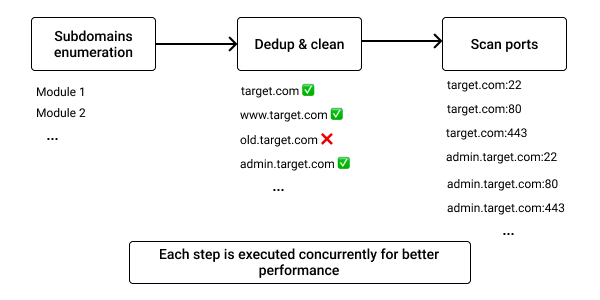
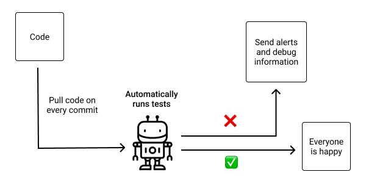

+++
title = "Black Hat Rust - Chapter 4"
date = 2021-01-01T6:00:00Z
type = "page"
url = "/black-hat-rust/4"
access = "paid_members"

+++

# Adding modules with trait objects

Imagine that you want to add a camera to your computer which is lacking one. You buy a webcam and connect it via a USB port. Now imagine that you want to add storage to the same computer. You buy an external hard drive and also connect it via a similar USB port.

This is the power of generics applied to the world of physical gadgets. A USB port is a **generic** port, and an accessory that connects to it is a **module**. You don't have device-specific ports, such as a specific port for a specific webcam vendor, another port for another vendor, another one for one vendor of USB external drives, and so on... You can connect almost any USB device to any USB port and have it working (minus software drivers compatibility...). Your PC vendors don't have to plan for any module you may want to connect to your computer. They just have to follow the generic and universal USB specification.

The same applies to code. A function can perform a specific task against a specific type, and a generic function can perform a specific task on *some* (more on that later) types.


`add` can only add two `i64` variables.

```rust
fn add(x: i64, y: i64) -> i64 {
    return x + y;
}
```


Here, `add` can add two variables of any type.

```rust
fn add<T>(x: T, y: T) -> T {
    return x + y;
}
```

**But this code is not valid**: it makes no sense to add two planes (for example). And the compiler don't even know how to add two planes! This is where **constraints** come into play.

```rust
use std::ops::Add;

fn add<T: Add<Output = T>>(x: T, y: T) -> T {
    return x + y;
}
```

Here, `add` can add any types that implement the [`Add`](https://doc.rust-lang.org/std/ops/trait.Add.html) trait. By the way, this is how we do operator overloading in Rust: by implementing traits from the [`std::ops`](https://doc.rust-lang.org/stable/std/ops/) module.


## Generics

Generic programming's goal is to improve code reusability and reduce bugs by allowing functions, structures, and traits to have their types *defined later*.

In practice, it means that an algorithm can be used with multiple different types, provided that they fulfill the **constraints**. As a result, if you find a bug in your generic algorithm, you only have to fix it once. If you had to implement the algorithm 4 times for 4 different but similar types (let say `int32`, `int64`, `float32`, `float64`), not only you spent 4x more time to implement it, but you will also spend 4x more time fixing the same bug in all the implementations (granted you didn't introduce other bugs due to fatigue).


In Rust, functions, traits (more on that below), and data types can be generic:
```rust
use std::fmt::Display;

// a generic function, whose type parameter T is constrained
fn generic_display<T: Display>(item: T) {
    println!("{}", item);
}

// a generic struct
struct Point<T> {
    x: T,
    y: T,
}

// another generic struct
struct Point2<T>(T, T)

// a generic enum
enum Option<T> {
    Some(T),
    None
}


fn main() {
    let a: &str = "42";
    let b: i64 = 42;

    generic_display(a);
    generic_display(b);

    let (x, y) = (4i64, 2i64);

    let point: Point<i64> = Point {
        x,
        y
    };

    // generic_display(point) <- not possible. Point does not implement Display
}
```

Generics are what allow Rust to be so expressive. Without them, it would not be possible to have generic collections such as [`Vec`](https://doc.rust-lang.org/std/vec/struct.Vec.html), [`HashMap`](https://doc.rust-lang.org/std/collections/hash_map/struct.HashMap.html), or [`BTreeSet`](https://doc.rust-lang.org/std/collections/struct.BTreeSet.html).


```rust
use std::collections::HashMap;

struct Contact {
    name: String,
    email: String,
}

fn main() {
    // imagine a list of imported contacts with duplicates
    let imported_contacts = vec![
        Contact {
            name: "John".to_string(),
            email: "john@smith.com".to_string(),
        },
        Contact {
            name: "steve".to_string(),
            email: "steve@jobs.com".to_string(),
        },
        Contact {
            name: "John".to_string(),
            email: "john@smith.com".to_string(),
        },
        // ...
    ];

    let unique_contacts: HashMap<String, Contact> = imported_contacts
            .into_iter()
            .map(|contact| (contact.email.clone(), contact))
            .collect();
}
```

Thanks to the power of generics, we can reuse `HashMap` from the standard library and quickly deduplicate our data!


Imagine having to implement those collections for **all the types** in your programs?


## Traits


Traits are the Rust's equivalent of interfaces in other languages (with some differences).

As defining a term by its synonym is not really useful, let see what does it mean in code:

```rust
pub trait Dog {
    fn bark(&self) -> String;
}

pub struct Labrador{}

impl Dog for Labrador {
    fn bark(&self) -> String {
        "wouf".to_string()
    }
}

pub struct Husky{}

impl Dog for Husky {
    fn bark(&self) -> String {
        "Wuuuuuu".to_string()
    }
}

fn main() {
    let labrador = Labrador{};
    println!("{}", labrador.bark());

    let husky = Husky{};
    println!("{}", husky.bark());
}

// Output:

// wouf
// Wuuuuuu
```


By defining a `Dog` interface, all types that implement this trait in our program will be considered as being a `Dog`.

This is why we say that traits (and interfaces) allow programmers to define **shared behavior**: behaviors that are shared by multiple types.


### Default Implementations

It's possible to provide default implementations for trait methods:

```rust
pub trait Hello {
    fn hello(&self) -> String {
        String::from("World")
    }
}

pub struct Sylvain {}

impl Hello for Sylvain {
    fn hello(&self) -> String {
        String::from("Sylvain")
    }
}

pub struct Anonymous {}

impl Hello for Anonymous {}

fn main() {
    let sylvain = Sylvain{};
    let anonymous = Anonymous{};

    println!("Sylvain: {}", sylvain.hello());
    println!("Anonymous: {}", anonymous.hello());
}
// Output:

// Sylvain: Sylvain
// Anonymous: World
```


### Traits composition

Traits can be composed to require more advanced constraints:

```rust
pub trait Module {
    fn name(&self) -> String;
    fn description(&self) -> String;
}

pub trait SubdomainModule {
    fn enumerate(&self, domain: &str) -> Result<Vec<String>, Error>;
}

fn enumerate_subdomains<M: Module + SubdomainModule>(module: M, target: &str) -> Vec<String> {
    // ...
}
```

<!--

In traditional [Object Oriented Programming (OOP)](https://en.wikipedia.org/wiki/Object-oriented_programming) style, shared behavior between classes is expressed through inheritance, for example, in C++:
```c++
// Shared behavior
class Module {
    public:
        string name();
        string description();
}

// Derived classes
class SubdomainModule: public Module {
    public:
        enumerate(string);
};


class HttpModule: public Module {
    public:
        scan(string);
};
```

On the other hand, Rust favors composition:
```rust
// Shared behavior
pub trait Module {
    fn name(&self) -> String;
    fn description(&self) -> String;
}

#[async_trait]
pub trait SubdomainModule: Module {
    async fn enumerate(&self, domain: &str) -> Result<Vec<String>, Error>;
}


#[async_trait]
pub trait HttpModule: Module {
    async fn scan(
        &self,
        http_client: &Client,
        endpoint: &str,
    ) -> Result<Option<HttpFinding>, Error>;
}
``` -->


<!--
> Coming soon

Now, back to our scanner. We want to add modules in order to add features and scanning capabilities. -->
<!-- TODO code example de function module -->

<!-- so we will put all those modules in a list -->

<!-- TODO code generic list-->

<!-- aaaaaannnd -->

<!-- TODO it does not work -->


<!-- It does not work!

Indeed, -->


### Async Traits

As of today, `async` functions in traits are not natively supported by Rust. Fortunately, [David Tolnay](https://github.com/dtolnay) got our back covered (one more time): we can use the [async-trait](https://github.com/dtolnay/async-trait) crate.

```rust
#[async_trait]
pub trait HttpModule: Module {
    async fn scan(
        &self,
        http_client: &Client,
        endpoint: &str,
    ) -> Result<Option<HttpFinding>, Error>;
}
```

### Generic traits

Traits can also have generic parameters:

```rust
use std::fmt::Display;

trait Printer<S: Display> {
    fn print(&self, to_print: S) {
        println!("{}", to_print);
    }
}

struct ActualPrinter{}

impl<S: Display> Printer<S> for ActualPrinter {}

fn main() {
    let s = "Hello";
    let n: i64 = 42;
    let printer = ActualPrinter{};

    printer.print(s);
    printer.print(n);
}

// output:

// Hello
// 42
```

And even better, you can implement a generic trait for a generic type:
```rust
use std::fmt::Display;

trait Printer<S: Display> {
    fn print(&self, to_print: S) {
        println!("{}", to_print);
    }
}

// implements Printer<S: Display> for any type T
impl<S: Display, T> Printer<S> for T {}

fn main() {
    let s = "Hello";
    let printer: i64 = 42;

    printer.print(s);
}

// Output:

// Hello
```


### The `derive` attribute

When you have a lot of traits to implement for your types, it can quickly become tedious and may complexify your code.

Fortunately, Rust has something for us: the `derive` [attribute](https://doc.rust-lang.org/rust-by-example/attribute.html).

By using the `derive` attribute, we are actually feeding our types to a [Derive macro](https://doc.rust-lang.org/reference/procedural-macros.html#derive-macros) which is a kind of [procedural macro](https://doc.rust-lang.org/reference/procedural-macros.html#procedural-macros).

They take code as input (in this case, our type), and create more code as output. At compile-time.


This is especially useful for data deserialization: Just by implementing the  [`Serialize`](https://docs.rs/serde/latest/serde/trait.Serialize.html) and [`Deserialize`](https://docs.rs/serde/latest/serde/trait.Deserialize.html) traits from the [`serde`](https://docs.rs/serde) crate, the (almost) universally used serialization library in the Rust world, we can then serialize and deserialize our types to a lot of data formats: [JSON](https://github.com/serde-rs/json), [YAML](https://github.com/dtolnay/serde-yaml), [TOML](https://github.com/alexcrichton/toml-rs), [BSON](https://github.com/mongodb/bson-rust) and so on...


```rust
use serde::{Serialize, Deserialize};

#[derive(Debug, Clone, Serialize, Deserialize)]
struct Point {
    x: u64,
    y: u64,
}
```

Without much effort, we just implemented the [`Debug`](https://doc.rust-lang.org/std/fmt/trait.Debug.html), [`Clone`](https://doc.rust-lang.org/std/clone/trait.Clone.html), [`Serialize`](https://docs.rs/serde/latest/serde/trait.Serialize.html) and [`Deserialize`](https://docs.rs/serde/latest/serde/trait.Deserialize.html) traits for our `struct Point`.


One thing to note is that all the subfields of your `struct` need to implement the traits:
```rust
use serde::{Serialize, Deserialize};

// Not possible:
#[derive(Debug, Clone, Serialize, Deserialize)]
struct Point<T> {
    x: T,
    y: T,
}

// instead, do this:
use serde::{Serialize, Deserialize};
use core::fmt::Debug; // Import the Debug trait

#[derive(Debug, Clone, Serialize, Deserialize)]
struct Point<T: Debug + Clone + Serialize + Deserialize> {
    x: T,
    y: T,
}
```


## Traits objects

Now you may be wondering: How to create a collection that can contain different concrete types that satisfy a given trait? For example:
```rust
trait UsbModule {
    // ...
}

struct UsbCamera {
     // ...
}

impl UsbModule for UsbCamera {
    // ..
}

impl UsbCamera {
    // ...
}

struct UsbMicrophone{
     // ...
}

impl UsbModule for UsbMicrophone {
    // ..
}

impl UsbMicrophone {
    // ...
}

let peripheral_devices: Vec<UsbModule> = vec![
    UsbCamera::new(),
    UsbMicrophone::new(),
];
```

Unfortunately, this is not as simple in Rust. As the modules may have a different size in memory, the compiler doesn't allow us to create such a collection. All the elements of the vector don't have the same shape.


**Traits objects** solve precisely this problem: when you want to use different concrete types (of varying shape) adhering to a contract (the trait), at runtime.


Instead of using the objects directly, we are going to use pointers to the objects in our collection. This time, the compiler will accept our code, as every pointer has the same size.

How to do this in practice? We will see below when adding modules to our scanner.


### Static vs Dynamic dispatch

So, what is the technical difference between a generic parameter and a trait object?

When you use a generic parameter (here for the `process` function):
**[ch_04/snippets/dispatch/src/statik.rs](https://github.com/skerkour/black-hat-rust/blob/main/ch_04/snippets/dispatch/src/statik.rs)**
```rust
trait Processor {
    fn compute(&self, x: i64, y: i64) -> i64;
}

struct Risc {}

impl Processor for Risc {
    fn compute(&self, x: i64, y: i64) -> i64 {
        x + y
    }
}

struct Cisc {}

impl Processor for Cisc {
    fn compute(&self, x: i64, y: i64) -> i64 {
        x * y
    }
}

fn process<P: Processor>(processor: &P, x: i64) {
    let result = processor.compute(x, 42);
    println!("{}", result);
}

pub fn main() {
    let processor1 = Cisc {};
    let processor2 = Risc {};

    process(&processor1, 1);
    process(&processor2, 2);
}
```


The compiler generates a **specialized version for each type you call the function with** and then replaces the call sites with calls to these specialized functions.

This is known as **monomorphization**.

For example the code above is roughly equivalent to:
```rust
fn process_Risc(processor: &Risc, x: i64) {
    let result = processor.compute(x, 42);
    println!("{}", result);
}

fn process_Cisc(processor: &Cisc, x: i64) {
    let result = processor.compute(x, 42);
    println!("{}", result);
}
```

It's the same thing as if you were implementing these functions yourself. This is known as **static dispatch**. The type selection is made statically at compile time. It provides the best runtime performance.


On the other hand, when you use a trait object:
**[ch_04/snippets/dispatch/src/dynamic.rs](https://github.com/skerkour/black-hat-rust/blob/main/ch_04/snippets/dispatch/src/dynamic.rs)**
```rust
trait Processor {
    fn compute(&self, x: i64, y: i64) -> i64;
}

struct Risc {}

impl Processor for Risc {
    fn compute(&self, x: i64, y: i64) -> i64 {
        x + y
    }
}

struct Cisc {}

impl Processor for Cisc {
    fn compute(&self, x: i64, y: i64) -> i64 {
        x * y
    }
}

fn process(processor: &dyn Processor, x: i64) {
    let result = processor.compute(x, 42);
    println!("{}", result);
}

pub fn main() {
    let processors: Vec<Box<dyn Processor>> = vec![
        Box::new(Cisc {}),
        Box::new(Risc {}),
    ];

    for processor in processors {
        process(&*processor, 1);
    }
}
```

The compiler will generate only 1 `process` function. It's at runtime that your program will detect which kind of `Processor` is the `processor` variable and thus which `compute` method to call. This is known **dynamic dispatch**. The type selection is made dynamically at runtime.

The syntax for trait objects `&dyn Processor` may appear a little bit heavy, especially when coming from less verbose languages. I personally love it! In one look, we can see that the function accepts a trait object, thanks to `dyn Processor`.

The reference `&` is required because Rust needs to know the exact size for each variable.

As the structures implementing the `Processor` trait may vary in size, the only solution is then to pass a reference. It could also have been a (smart) pointer such as `Box`, `Rc` or `Arc`.

**The point is that the `processor` variable needs to have a size known at compile time.**

Note that in this specific example, we do `&*processor` because we first need to dereference the `Box` in order to pass the reference to the `process` function. This is the equivalent of `process(&(*processor), 1)`.

When compiling dynamically dispatched functions, Rust will create under the hood what is called a [vtable](https://en.wikipedia.org/wiki/Virtual_method_table), and use this vtable at runtime to choose which function to call.

<!-- > Coming soon: VTable -->

<!-- explain VTable
https://docs.google.com/presentation/d/1q-c7UAyrUlM-eZyTo1pd8SZ0qwA_wYxmPZVOQkoDmH4/edit#slide=id.p
https://llogiq.github.io/2020/03/14/ootb.html
https://alschwalm.com/blog/static/2017/03/07/exploring-dynamic-dispatch-in-rust/
https://github.com/usagi/rust-memory-container-cs
https://medium.com/digitalfrontiers/rust-dynamic-dispatching-deep-dive-236a5896e49b
-->

### Some Closing Thoughts

Use static dispatch when you need absolute performance and trait objects when you need more flexibility or collections of objects sharing the same behavior.


## Command line argument parsing

In the first chapter, we saw how to access command-line arguments. For more complex programs, such as our scanner, a library to parse command-line arguments is required.

For example, we may want to pass more complex configuration options to our program, such as an output format (JSON, XML...), a debug flag, or simply the ability to run multiple commands.

We will use the most famous one: [clap](https://crates.io/crates/clap) as it's also my favorite one, but keep in mind that alternatives exist, such as [structopt](https://crates.io/crates/structopt).


```rust
    let cli = Command::new(clap::crate_name!())
        .version(clap::crate_version!())
        .about(clap::crate_description!())
        .subcommand(Command::new("modules").about("List all modules"))
        .subcommand(
            Command::new("scan").about("Scan a target").arg(
                Arg::new("target")
                    .help("The domain name to scan")
                    .required(true)
                    .index(1),
            ),
        )
        .arg_required_else_help(true)
        .get_matches();
```

Here we declare 2 subcommands: `modules` and `scan`.

The `scan` subcommand also has a required argument: `target`, thus calling `scan` like that:
```bash
$ tricoder scan
```

Won't work. You need to call it with an argument:
```bash
$ tricoder scan kerkour.com
```


Then, we can check which subcommand has been called and the value of the arguments:
```rust
    if let Some(_) = cli.subcommand_matches("modules") {
        cli::modules();
    } else if let Some(matches) = cli.subcommand_matches("scan") {
        // we can safely unwrap as the argument is required
        let target = matches.value_of("target").unwrap();
        cli::scan(target)?;
    }
```


## Logging

When a long-running program encounters a non-fatal error, we may not necessarily want to stop its execution. Instead, the good practice is to log the error for further investigation and debugging.

There are two extraordinary crates for logging in Rust:

* [log](https://crates.io/crates/log): for simple, textual logging.
* [slog](https://crates.io/crates/slog): for more advanced structured logging.

These crates are not strictly speaking loggers. You can add them to your programs as follows:

**[ch_04/snippets/logging/src/main.rs](https://github.com/skerkour/black-hat-rust/blob/main/ch_04/snippets/logging/src/main.rs)**
```rust
fn main() {
    log::info!("message with info level");
    log::error!("message with error level");
    log::debug!("message with debug level");
}
```

But when you run the program:
```
$ cargo run
   Compiling logging v0.1.0 (black-hat-rust/ch_04/snippets/logging)
    Finished dev [unoptimized + debuginfo] target(s) in 0.56s
     Running `target/debug/logging`
```

Nothing is printed...

For actually displaying something, you need a logger. The `log` and `slog` crates are only **facades**.

They provide a unified interface for logging across the ecosystem, but they do not actually log anything. For that, you need a logger crate.


### env_logger

You can find a list of loggers in the documentation of the `log` crate: [https://github.com/rust-lang/log#in-executables](https://github.com/rust-lang/log#in-executables).

For the rest of this book, we will use [env_logger](https://crates.io/crates/env_logger) because it provides great flexibility and precision about what we log, and more importantly, is easy to use.

To set it up, simply export the `RUST_LOG` environment variable and call the `init` function as follows:

**[ch_04/tricoder/src/main.rs](https://github.com/skerkour/black-hat-rust/blob/main/ch_04/tricoder/src/main.rs)**
```rust
env::set_var("RUST_LOG", "info,trust_dns_proto=error");
env_logger::init();
```

Here, we tell `env_logger` to log at the `info` level by default and to log at the `error` level for the `trust_dns_proto` crate.


## Adding modules to our scanner

<!-- In mainstream media or movies, hackers are described as dark magicians. In reality, the biggest hacks were not -->


The architecture of our scanner looks like that:



We naturally see two kinds of modules emerging:

* Modules to enumerate subdomains
* Modules to scan each port and look for vulnerabilities

These 2 kinds of modules, while being different, may still share common features.

So let's declare a parent `Module` trait:

```rust
pub trait Module {
    fn name(&self) -> String;
    fn description(&self) -> String;
}
```

### Subdomains modules

The role of a subdomain module is to find all the subdomains for a given domain and source.

```rust
#[async_trait]
pub trait SubdomainModule: Module {
    async fn enumerate(&self, domain: &str) -> Result<Vec<String>, Error>;
}
```


### HTTP modules

The goal of an HTTP module is: for a given endpoint (`host:port`), check if a given vulnerability can be found.

```rust
#[async_trait]
pub trait HttpModule: Module {
    async fn scan(
        &self,
        http_client: &Client,
        endpoint: &str,
    ) -> Result<Option<HttpFinding>, Error>;
}
```


#### Open to registration GitLab instances

Remember the story about the open-to-the-world GitLab instance?


**[ch_04/tricoder/src/modules/http/gitlab_open_registrations.rs](https://github.com/skerkour/black-hat-rust/blob/main/ch_04/tricoder/src/modules/http/gitlab_open_registrations.rs)**
```rust
#[async_trait]
impl HttpModule for GitlabOpenRegistrations {
    async fn scan(
        &self,
        http_client: &Client,
        endpoint: &str,
    ) -> Result<Option<HttpFinding>, Error> {
        let url = format!("{}", &endpoint);
        let res = http_client.get(&url).send().await?;

        if !res.status().is_success() {
            return Ok(None);
        }

        let body = res.text().await?;
        if body.contains("This is a self-managed instance of GitLab") && body.contains("Register") {
            return Ok(Some(HttpFinding::GitlabOpenRegistrations(url)));
        }

        Ok(None)
    }
}
```


#### Git files disclosure

Another fatal flaw is git files and directory disclosure.

This often happens to PHP applications served by [nginx](https://www.nginx.com) or the [Apache HTTP Server](https://httpd.apache.org) when they are misconfigured.

The vulnerability is to leave the git files publicly accessible. `.git/config` or `.git/HEAD` for example. It's (most of the time) possible to download all the git history [with a script](https://github.com/liamg/gitjacker).


One day, I audited the website of a company where a friend was an intern. The blog (WordPress, if I recall correctly) was vulnerable to this vulnerability, and I was able to download all the git history of the project. It was funny because I had access to all the commits my friend made during his internship.

But more seriously, the **database credentials were committed in the code**...


**[ch_04/tricoder/src/modules/http/git_head_disclosure.rs](https://github.com/skerkour/black-hat-rust/blob/main/ch_04/tricoder/src/modules/http/git_head_disclosure.rs)**
```rust
impl GitHeadDisclosure {
    pub fn new() -> Self {
        GitHeadDisclosure {}
    }

    fn is_head_file(&self, content: &str) -> bool {
        return Some(0) == content.to_lowercase().trim().find("ref:");
    }
}

#[async_trait]
impl HttpModule for GitHeadDisclosure {
    async fn scan(
        &self,
        http_client: &Client,
        endpoint: &str,
    ) -> Result<Option<HttpFinding>, Error> {
        let url = format!("{}/.git/HEAD", &endpoint);
        let res = http_client.get(&url).send().await?;

        if !res.status().is_success() {
            return Ok(None);
        }

        let body = res.text().await?;
        if self.is_head_file(&body) {
            return Ok(Some(HttpFinding::GitHeadDisclosure(url)));
        }

        Ok(None)
    }
}
```

#### .env file disclosure

`.env` file disclosure is also the kind of vulnerability that is easy to overlook but can be fatal: it may leak all the secrets of your web application, such as database or SMTP credentials, encryption keys...


**[ch_04/tricoder/src/modules/http/dotenv_disclosure.rs](https://github.com/skerkour/black-hat-rust/blob/main/ch_04/tricoder/src/modules/http/dotenv_disclosure.rs)**
```rust
#[async_trait]
impl HttpModule for DotEnvDisclosure {
    async fn scan(
        &self,
        http_client: &Client,
        endpoint: &str,
    ) -> Result<Option<HttpFinding>, Error> {
        let url = format!("{}/.env", &endpoint);
        let res = http_client.get(&url).send().await?;

        if res.status().is_success() {
            return Ok(Some(HttpFinding::DotEnvFileDisclosure(url)));
        }

        Ok(None)
    }
}
```

Please note that this module is not that reliable, and you may want to add regexp matching to be sure that the app is not returning a valid response for any URL. `[A-Z0-9]+=.*` for example.


#### .DS_Store file disclosure

`.DS_Store` file disclosure is more subtle. It's less catastrophic than a `.env` file disclosure, for example.

Once leaked, a `.DS_Store` file may reveal other sensible files forgotten in the folder, such as `database_bakcup.sql`, or the whole structure of the application.

**[ch_04/tricoder/src/modules/http/ds_store_disclosure.rs](https://github.com/skerkour/black-hat-rust/blob/main/ch_04/tricoder/src/modules/http/ds_store_disclosure.rs)**
```rust
impl DsStoreDisclosure {
    pub fn new() -> Self {
        DsStoreDisclosure {}
    }

    fn is_ds_store_file(&self, content: &[u8]) -> bool {
        if content.len() < 8 {
            return false;
        }

        let signature = [0x0, 0x0, 0x0, 0x1, 0x42, 0x75, 0x64, 0x31];

        return content[0..8] == signature;
    }
}

#[async_trait]
impl HttpModule for DsStoreDisclosure {
    async fn scan(
        &self,
        http_client: &Client,
        endpoint: &str,
    ) -> Result<Option<HttpFinding>, Error> {
        let url = format!("{}/.DS_Store", &endpoint);
        let res = http_client.get(&url).send().await?;

        if !res.status().is_success() {
            return Ok(None);
        }

        let body = res.bytes().await?;
        if self.is_ds_store_file(&body.as_ref()) {
            return Ok(Some(HttpFinding::DsStoreFileDisclosure(url)));
        }

        Ok(None)
    }
}
```


#### Unauthenticated access to databases

These past years, there wasn't one month where one company was breached or ransomed because they left a database with no authentication on the internet. The worse offenders are [mongoDB](https://www.mongodb.com) and [Elasticsearch](https://www.elastic.co). A less famous (because more niche, targeted for cloud infrastructure) but still important to know is [etcd](https://etcd.io)


For etcd, it can be detected with string matching;
**[ch_04/tricoder/src/modules/http/etcd_unauthenticated_access.rs](https://github.com/skerkour/black-hat-rust/blob/main/ch_04/tricoder/src/modules/http/etcd_unauthenticated_access.rs)**
```rust
#[async_trait]
impl HttpModule for EtcdUnauthenticatedAccess {
    async fn scan(
        &self,
        http_client: &Client,
        endpoint: &str,
    ) -> Result<Option<HttpFinding>, Error> {
        let url = format!("{}/version", &endpoint);
        let res = http_client.get(&url).send().await?;

        if !res.status().is_success() {
            return Ok(None);
        }

        let body = res.text().await?;
        if body.contains(r#""etcdserver""#)
            && body.contains(r#""etcdcluster""#)
            && body.chars().count() < 200
        {
            return Ok(Some(HttpFinding::EtcdUnauthenticatedAccess(url)));
        }

        Ok(None)
    }
}
```


#### Unauthenticated access to admin dashboards

Another configuration oversight that can be fatal is leaving dashboards open to the world.

In my experience, the main offenders are: [kibana](https://www.elastic.co/kibana), [traefik](https://doc.traefik.io/traefik/operations/dashboard/), [zabbix](https://www.zabbix.com/documentation/current/manual/web_interface/frontend_sections/monitoring/dashboard) and [Prometheus](https://prometheus.io).

String matching is most of the time enough:
**[ch_04/tricoder/src/modules/http/kibana_unauthenticated_access.rs](https://github.com/skerkour/black-hat-rust/blob/main/ch_04/tricoder/src/modules/http/kibana_unauthenticated_access.rs)**
```rust
#[async_trait]
impl HttpModule for KibanaUnauthenticatedAccess {
    async fn scan(
        &self,
        http_client: &Client,
        endpoint: &str,
    ) -> Result<Option<HttpFinding>, Error> {
        let url = format!("{}", &endpoint);
        let res = http_client.get(&url).send().await?;

        if !res.status().is_success() {
            return Ok(None);
        }

        let body = res.text().await?;
        if body.contains(r#"</head><body kbn-chrome id="kibana-body"><kbn-initial-state"#)
        || body.contains(r#"<div class="ui-app-loading"><h1><strong>Kibana</strong><small>&nbsp;is loading."#)
        || Some(0) == body.find(r#"|| body.contains("#)
        || body.contains(r#"<div class="kibanaWelcomeLogo"></div></div></div><div class="kibanaWelcomeText">Loading Kibana</div></div>"#) {
            return Ok(Some(HttpFinding::KibanaUnauthenticatedAccess(
                url,
            )));
        }

        Ok(None)
    }
}
```

#### Directory listing disclosure

Also prevalent in PHP applications served by Nginx and Apache server, this configuration error allows the whole world to view access the files on the folders of the server. It's crazy the amount of personal and enterprise data you can access with google dorks, such as:
```default
intitle:"index.of" "parent directory" "size"
```

**[ch_04/tricoder/src/modules/http/directory_listing_disclosure.rs](https://github.com/skerkour/black-hat-rust/blob/main/ch_04/tricoder/src/modules/http/directory_listing_disclosure.rs)**
```rust
// ...
impl DirectoryListingDisclosure {
    pub fn new() -> Self {
        DirectoryListingDisclosure {
            dir_listing_regex: Regex::new(r"<title>Index of .*</title>")
                .expect("compiling http/directory_listing regexp"),
        }
    }

    async fn is_directory_listing(&self, body: String) -> Result<bool, Error> {
        let dir_listing_regex = self.dir_listing_regex.clone();
        let res = tokio::task::spawn_blocking(move || dir_listing_regex.is_match(&body)).await?;

        Ok(res)
    }
}

// ...

#[async_trait]
impl HttpModule for DirectoryListingDisclosure {
    async fn scan(
        &self,
        http_client: &Client,
        endpoint: &str,
    ) -> Result<Option<HttpFinding>, Error> {
        let url = format!("{}/", &endpoint);
        let res = http_client.get(&url).send().await?;

        if !res.status().is_success() {
            return Ok(None);
        }

        let body = res.text().await?;
        if self.is_directory_listing(body).await? {
            return Ok(Some(HttpFinding::DirectoryListingDisclosure(url)));
        }

        Ok(None)
    }
}
```


## Tests

Now we have our modules, how can we be sure that we didn't make mistakes while writing the code?

Tests, of course!

The principal mistake to avoid when writing tests is to write tests starting from the implementation being tested.

**You should not do that!**

Tests should be written from the **specification**. For example, when testing the `.DS_Store` file disclosure, we may have some magic bytes wrong in our code. So we should write our test by looking at the `.DS_Store` file [specification](https://0day.work/parsing-the-ds_store-file-format/), and not our own implementation.

**[ch_04/tricoder/src/modules/http/ds_store_disclosure.rs](https://github.com/skerkour/black-hat-rust/blob/main/ch_04/tricoder/src/modules/http/ds_store_disclosure.rs)**
```rust
#[cfg(test)]
mod tests {
    #[test]
    fn is_ds_store() {
        let module = super::DsStoreDisclosure::new();
        let body = "testtesttest";
        let body2 = [
            0x00, 0x00, 0x00, 0x01, 0x42, 0x75, 0x64, 0x31, 0x00, 0x00, 0x30, 0x00, 0x00, 0x00,
            0x08, 0x0,
        ];

        assert_eq!(false, module.is_ds_store_file(body.as_bytes()));
        assert_eq!(true, module.is_ds_store_file(&body2));
    }
}
```


### Async tests


Thanks to `tokio`, writing `async` tests is just a few keystrokes away.

**[ch_04/tricoder/src/modules/http/directory_listing_disclosure.rs](https://github.com/skerkour/black-hat-rust/blob/main/ch_04/tricoder/src/modules/http/directory_listing_disclosure.rs)**
```rust
#[cfg(test)]
mod tests {
    use super::DirectoryListingDisclosure;

    #[tokio::test]
    async fn is_directory_listing() {
        let module = DirectoryListingDisclosure::new();

        let body = String::from("Content <title>Index of kerkour.com</title> test");
        let body2 = String::from(">ccece> Contrnt <tle>Index of kerkour.com</title> test");
        let body3 = String::from("");
        let body4 = String::from("test test test test test< test> test  <title>Index</title> test");

        assert_eq!(true, module.is_directory_listing(body).await.unwrap());
        assert_eq!(false, module.is_directory_listing(body2).await.unwrap());
        assert_eq!(false, module.is_directory_listing(body3).await.unwrap());
        assert_eq!(false, module.is_directory_listing(body4).await.unwrap());
    }
}
```


### Automating tests



Tests are not meant to be manually run each time you write code. It would be a bad usage of your precious time. Indeed, Rust takes (by design) a loooong time to compile. Running tests on your own machine more than a few times a day would break your focus.

Instead, tests should be run from CI (Continuous Integration). CI systems are pipelines you configure that will run your tests each time you push code. Nowadays practically all code platforms ([GitHub](https://github.com/features/actions), [GitLab](https://docs.gitlab.com/ee/ci/), [sourcehut](https://man.sr.ht/builds.sr.ht/)...) provide built-in CI. You can find examples of CI workflows for Rust projects here: [https://github.com/skerkour/phaser/tree/main/.github/workflows](https://github.com/skerkour/phaser/tree/main/.github/workflows).

```yaml
name: CI

# This workflow run tests and build for each push

on:
  push:
    branches:
      - main
      - 'feature-**'

jobs:

  test_phaser:
    runs-on: ubuntu-latest
    steps:
      - uses: actions/checkout@v2

      - name: Update local toolchain
        run: |
          rustup update
          rustup component add clippy
          rustup install nightly

      - name: Toolchain info
        run: |
          cargo --version --verbose
          rustc --version
          cargo clippy --version

      - name: Lint
        run: |
          cd phaser
          cargo fmt -- --check
          cargo clippy -- -D warnings

      - name: Test
        run: |
          cd phaser
          cargo check
          cargo test --all

      - name: Build
        run: |
          cd phaser
          cargo build --release
```


## Other scanners

There is a lot of specialized scanners you may want to take inspiration from:

* https://github.com/cyberark/KubiScan
* https://github.com/sqlmapproject/sqlmap
* [https://github.com/search?q=scanner](https://github.com/search?q=scanner)

## Summary

* Use generic parameters when you want absolute performance and trait objects when you want more flexibility.
* Before looking for advanced vulnerabilities, search for configuration errors.
* Understanding how a system is architectured eases the process of identifying configuration vulnerabilities.
* Never write tests by looking at the code being tested. Instead, look at the specification.
* Use CI to run tests instead of running them locally

