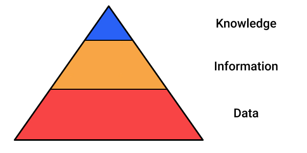
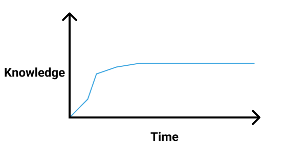

+++
title = "Continuous Learning - Introduction"
date = 2021-07-26T6:00:00Z
type = "page"
url = "/continuous-learning/introduction"
access = "paid_members"
+++

# Introduction


## The information age


Internet, computers and smartphone made the amount of information available to the average Human explode, to the point that our epoch is called the [Information age](https://en.wikipedia.org/wiki/Information_Age): an economy mainly based on information technologies.


We now have access to so much information that it's even problematic: we no longer have the time to process all this information which leads us to be overloaded and even burnout.

This is why you need a system to turn all this information into something actionable, something that can help you achieve your goals.


## Data vs. Information vs. Knowledge

Before continuing, you first need to understand what knowledge is, and what it's not.



**Data** are the raw facts that we gather from the surrounding world: `42°C in Paris at 2021-07-26T6:00:00Z`.

**Information** is data refined for consumption by Humans: `42°C in Paris on Tuesday 26 of July`

Finally, **knowledge** is what you use to make a decision, most of the time by making connections between the pieces of information: `Paris is hot in July. I should think about wearing light clothes.`

In one sentence: **Information is refined data whereas knowledge is useful information**.


## The problem with how we approach education

Most societies currently approach education as a stage in our lives, approximately between 3 and 25 years.



And then what? The world stops going forward, and you no longer need to learn anything?

Of course not, if you want to stay relevant, whether it be in your job, as an entrepreneur, or simply as a citizen, you need to continue to learn all your life.

And this is even before talking about the superior education in some countries where if you don't come from a very rich family, you have to get a massive student debt that will basically turn you into a modern slave for the best years of your life.


So yeah, while schools are fighting and cheating to improve their ranking and spending huge amounts of money and energy on bureaucratic tasks we


Just to be clear for the rest of the book: even if I attended some prestigious schools such as [42](https://cv.42.fr/skerkour), I barely graduated from high school and have not bothered to get any other piece of paper stating my supposed skills. In other words, I have no degree and still managed to be a not-so-bad programmer.

Here is how.


### Ahead of Time vs. Just in Time

The first distinction to make is Ahead of Time vs. Just in Time learning.

Engineers and scientific people love Ahead of Time learning. Basically, it's when you learn things that you don't need to know now, mostly because it's seem interesting. You learn things, and then you find useful applications for this knowledge.

On the other hand, Just in Time learning is when you spend time learning new things only when you need it, or you need to complete a project. Just in Time learning is goal-driven: You first define your goals, and then you acquire the knowledge to achieve them.


I do believe that Just in Time is better. Indeed, there is just too many things to learn, and you don't have an infinite amount of time, so it's better to start from your goals and then learn what you need to achieve your goals. Ahead of Time learning can lead to **severe procrastination**, which in turn can lead to unhappiness.

But, as we will see, you should not limit your information and knowledge acquisition to dedicated learning sessions (e.g. when reading a book or following a course). It should be something that happens all the time:
- Taking notes when reading a book
- Saving the important ideas of the articles that you read online
- Saving the important things that someone may say in a chat


<!-- ## Focus

TODO -->


## Neurplasticity

Your brain is composed of billions of neurons and trillions of synapses, connecting the neurons together and forming very complex networks that scientists are trying to unravel the mysteries and engineers are mimicking to create Artificial Intelligence software, but you may already know that.

However, do you know how to use this phenomenal organ to optimize your learning process?

Basically, when you are learning something or practicing some activity, new connections between your neurons are created. This phenomenon is called **neuroplasticity**: the ability of your brain to create, strengthen or dismantle connections between your neurons.


That's why when you learn something for the first time, you tend to forget it quickly: your neural connections are not strong enough.


## The forgetting curve

This phenomenon was studied In the late 19th century by the German psychologist [Hermann Ebbinghaus](https://en.wikipedia.org/wiki/Hermann_Ebbinghaus) carried out many experiments to better understand learning and forgetting.

His most famous finding certainly was the **forgetting curve**: a curve describing the loss of information that one has learned.


His conclusion was that to maximize retention you need to periodically refresh your knowledge.

Active recall of information not only refreshes the forgetting curve, but makes it decay more slowly afterward.

This, as you may have guessed, means that your neural network encoding the information becomes stronger and stronger.


This is where **spaced repetition** comes into play: when you want to learn something new, you need to periodically refresh your knowledge to maximize retention.


## Spaced repetition in practice

Please, tell me: **How to practice spaced repetition**?

I personally use [Quizlet](https://quizlet.com), but any flashcard application will do it.

The idea is that every week, you create a new deck with what you want to learn and read the deck at a fixed interval.

For this to be as effective and easy as possible, you have to make it a habit and do it every day. Maybe before lunch, maybe before sleeping, just do it every single day. It doesn't need to be for 1 hour, 15-20 minutes is enough.


## Thriving thanks to Diminishing Returns


Efficient knowledge assimilation (the act of turning information into something valuable and actionable) is the key to thrive in the information age.

Whether you are a software engineer, a lawyer, a manager, or an entrepreneur, your value lies in how efficiently you can learn new things to stay relevant in your field in an ever-accelerating world.

But there are two problems.

The first one is that today, there is simply too much information available and it's hard to isolate the signal from the noise.

The second problem is that knowledge (*"white collar"*) jobs are evolving faster than the capacity of most people to learn new things. For example, today, you are a software engineer developing backend applications, and you may want to move into Machine Learning with all the recent and exciting advancements, such as the Open Source / Model [Stable Diffusion](https://stability.ai/blog/stable-diffusion-public-release).

But I have good news for you.

Learning follows the law of diminishing returns: you need to spend exponentially more effort to squeeze the last bits of performance when learning a specific topic.


And this is where the hackers start to see how to use this tendency to their own advantage: most people are afraid of learning a new topic, because they think they will never be able to be as knowledgeable as the most famous experts.

By spending two weeks studying a topic really hard, you can assimilate the most important principles of this topic and become better than maybe 90% of the people on this planet (I admit that I took this number out of my hat, but from experience, I think it's pretty accurate).

Of course, you won't become a Ph.D. in the field in two weeks, but anyway, being too much an expert has many drawbacks, such as [overthinking and analysis paralysis](https://kerkour.com/overthinking).


So, do you want to change your job or start a new startup in a field where you have no expertise?


Study hard the big principles for 2 weeks. Then do 1 applied project per week for 3 weeks to learn the current practices and trends. That's all.

<!--
When I say the big principles, it's the "immutable laws" that didn't change much for a long time (long time being relative to your field) and thus, according to the [Lindy effect](https://en.wikipedia.org/wiki/Lindy_effect) are going to stay relevant for a long time in the future, such as Linux, common algorithms and design patterns in the programming world, or Human psychology in the management world. -->


In a little bit more than 1 month, you will be more effective in this field than most of your peers/competitors, even if they studied the topic in university 15 years ago... You don't need to be an expert to **start doing**.


## The system

For that, I've developed a 3-stages system: **Acquisition** (processing), **Organization** (storing), **Retrieval** (search and recalling)

```
Acquisition -> Organization -> Retrieval
```

It's what I call the **knowledge assimilation pipeline**: a system to learn complex topics from mixed media sources.

Put another way, a method to reliably **turn information into knowledge**.


Let's start with the second and third stages of the system: Building and using a knowledge base.
