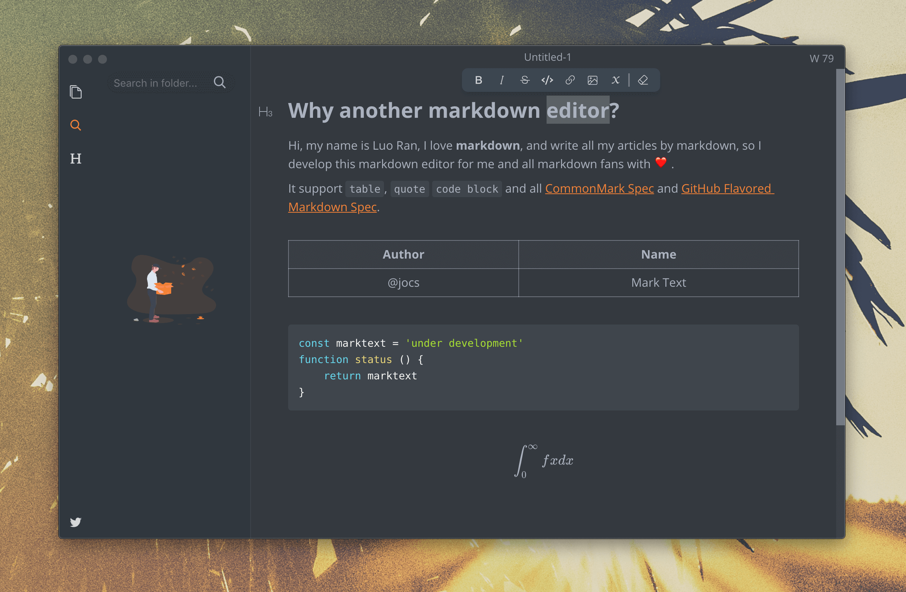

+++
title = "Technical Writer - Writing"
date = 2021-06-01T6:00:00Z
type = "page"
url = "/technical-writer/writing"
access = "paid_members"

+++

<!--

always start with the big principles, the immutable laws. The principes that exist since long time and that will continue to exist for a long time,  Then you can enter the technical details that may (or may not) become irrelevant in a few years.


mindmap and mindnode to find ideas
-->


# Writing

Now that you know the bigger picture it's time to stop procrastinating and start writing your manuscript.

For now, we don't care about formatting, we don't care about publishing. We only care about writing great content.


## Why your book


### Finding your niche

Greate ideas often come by associating 2 ideas. For example: Rust is the best language for offensive security.


If I search ["Javascript"](https://www.amazon.com/s?k=javascript&i=digital-text&crid=28H0M55XAKHNL) on the Amazon Kindle store, the query returns more than 5000 results. For sure, someone interested in learning JavaScript is not going to buy all these books.


**For who are you writing your book, and why should they be interested?**


If the answer is "everybody" or "because it's interesting" then think again.


Today you know and achieved things that you didn't 1 year ago. So there are thousands to millions of people who would like to be where you are now. These are your potential readers.


But this is not enough, you still need to clarify which specific thing you want to share to your readers.

For that, use the following template: **Teaching X to Y so they can achieve Z**

Where:
- **X** is a specific system, framework, programming language...
- **Y** is a specific community
- **Z** is the final goal

For example:
- Teaching offensive security to beginner Rust programmers so they can think like an attacker and create more secure programs.
- Teaching Vue.js to intermediate JavaScript programmers so they can create Single Page Applications.
- Teaching server programming to Go developers so they can build scalable backend applications.


This specific topic destined for a specific community is your **niche** and the community your **audience**.

### Unique Value Proposition

Now that you have a niche, you need to find why people should choose YOUR book among many others that may already exist.

### But, what is value

Defining value is hard, especially when we are talking about knowledge products, so let me show you first what value **is not**.

One day, I received an email telling me that my book was too expensive doing some comparison with another Rust book, to show that the price-per-page is too high and thus value not good.

I believe that the value of a knowledge product is the **exact opposite**.

The value of a knowledge product lies in how much time you can save by consuming it, rather than reading or watching tons of unstructured tutorials on the internet.

The maths are simple: if you are paid $20 per hour, and a product costing $100 saved you 100 hours, then you basically saved $19,900 ($20 * 100 hours - $100).

In 2 words, it means that your book should provide a **simpler and faster** path to what your readers want.

**Simpler** because when writing about technology and science, it's easy to overwhelm your readers with too many not-so-relevant details. You should always assume that your readers already have some knowledge and that they can ignore more advanced details.


**Faster** because we are all racing against time. Why wait many years for something that you can get tomorrow or in 1 month? All entrepreneurs will tell you that it's better to be fast, and maybe fail fast, than to be too late to the party and lose the interest of potential customers.

It's always better to [focus on the 20% that provides 80% of the results](https://en.wikipedia.org/wiki/Pareto_principle).

<!-- TODO: pareto link -->


## The tools

"Traditional" authors use word processors such as Google Docs or Microsoft Words to write the manuscript of their book. While these tools provide great collaborative and built-in spellcheck features, you cannot use them if you want to include code sections in your book, or if you want to customize the exported files, as we will see in the next chapter.

Instead, we are going to use **Markdown**.

To my knowledge, Markdown is the most portable format available for writers today: There are countless editors and as many tools to work with it: static site editors, PDF generators, [Knowledge bases](https://kerkour.com/continuous-learning)...

To start writing your book, you only need a markdown editor. That's all, really. Even a text editor like notepad would be enough actually, just inconvenient.

### Choosing a Markdown Editor

There are many, many markdown editors, I recommend you to try a few and pick the one you are the more comfortable with. [Don't overthink](https://kerkour.com/overthinking).

I personally prefer minimalist editors because when everything is barebone, you have no other choice than to focus on your work.

#### Cross-platforms


##### [Visual Studio Code (VS Code)](https://code.visualstudio.com)


A tip to improve productivity while writing markdown with VSCode is to toggle zen mode: **Ctrl** / **Cmd** P and search for "zen mode".

##### [iA Writer](https://ia.net/writer)


iA Writer is a minimalist and very clean markdown editor available for macOS, iOS & iPadOS, Android and Windows.


##### [MarkText](https://github.com/marktext/marktext)



MarkText is an elegant and, more importantly, Open Source Markdown editor with a [WYSIWYG (What You See Is What You Get)](https://en.wikipedia.org/wiki/WYSIWYG) interface.

It's unfortunately only available for computers.

For Linux users, MarkText is available as a [Flatpak](https://flathub.org/apps/details/com.github.marktext.marktext).


##### [Typora](https://typora.io)


Typora is another clean and minimalist markdown editor. Like MarkText, it's unfortunately only available for computers.


#### For Apple Devices

If you are hooked into the Apple universe, here are a few applications that leverage this ecosystem to provide a great experience.

##### [Bear](https://bear.app)


Bear is more a Markdown notes application than a markdown editor. It provides advanced features for notes-taking, such as tags, exporting to Word docs, and encrypted notes.

The biggest problem with bear is that you can edit local files, only iCloud files, so you lose the ability to use your writing with other programs, as we will need to do to produce the ebooks files in the next chapter.


##### [Ulysses](https://ulysses.app)


Unlike Bear, [you can edit local files with Ulysses](https://help.ulysses.app/kb/guide/en/external-folders-ZfPYZQCwid/Steps/1048491,1048494) which make it a great fit for out use case.


#### For Linux

On the other hand, if you are more an adept of the penguin, here are a few editors that you should consider.

##### [Apostrophe](https://apps.gnome.org/en/app/org.gnome.gitlab.somas.Apostrophe/)


Apostrophe is a minimalist Markdown editor based on [GTK+](https://www.gtk.org) and licensed under the GNU General Public License v3.0 (GPLv3).

It uses pandoc under the hood to process Markdown (more on pandoc in chapter 3).


##### [ghostwriter](http://wereturtle.github.io/ghostwriter)


ghostwriter is a Windows and Linux text editor for Markdown, developed in C++ with the [Qt 5](https://www.qt.io) framework.


#### My favorite Markdown editor

I've personally settled on iA Writer: I do not only love its minimalistic aesthetic, but I also love that it has the same interface on computers, tablets and phones, which allows me to have a consistent workflow. The cherry on the cake is that contrary to some other markdown editors, it works directly with files on the filesystem, so I can view and edit my markdown files in other applications. A nice bonus is the built-in spell-checker, which saves a lot of time during the editing phase, where I can focus on wording and grammar.

I then use VSCode's Git integration to commit and push my files in a private Git repository.

On iOS devices, you can use the [Working Copy](https://workingcopyapp.com) application to synchronize your work with any Git repository.

### Illustrations

As the saying goes: "A picture is worth a thousand words".

Including illustrations in your book may allow you to explain complex things, simply (more on that below).

You want a tool that exports your illustration to the `.png` or `.jpg` formats? Why not `.svg`? Because the [SVG image format](https://developer.mozilla.org/en-US/docs/Web/SVG) is a vector format, and not all tools handle it because it needs to be interpreted, while PNG and JPEG are raster formats which make them easy to display.

#### [Figma](https://www.figma.com)


Figma is a relatively new-comer in the world of graphic design. Its unique value proposition is a web-based (and thus available on all platforms), live-editable by multi-users vector editor. While its principal use-cases are application mock-ups and logos, I personally use it for my illustrations because of how easy it is to use.


#### [Diagrams.net](https://app.diagrams.net)


Its principal advantage is its huge library of pre-made elements, such as AWS services, Android and iOS icons...


#### [Excalidraw](https://excalidraw.com)


Finally, there is excalidraw which provides a free and simple diagram editor. It's unique value proposition is that the diagrams look as if they were hand-drawn.


#### A few things to remember

Because all these services are cloud services, they may automatically terminate your account, or cease operations overnight. **This is why you should always keep a local backup of the source files of your illustrations.** For Figma it means a `.svg` file, for diagrams.net a `.drawio` file.


## Transmitting knowledge

As we saw in the last chapter, the value of a book lies in the knowledge it contains and how it is shared with the reader.


### Writing the detailed plan

The first thing to do, is to write the detailed plan of your book with 3 levels of sub-headers:

```
# Chapter Title

## Section Title

### Important Point Title
```

Each **chapter** should discuss an important idea.

Each **section** should explain a method, a system or examples to approach the important idea of the chapter that you will detail in the **important points**.

You should then take a few days to review that this plan makes sense and is clear enough for your audience.

A nice tool to help you write the plan of your book is a MindMap.


A mindmap is a way to hierarchically represent linked ideas. It enables you to fit way more ideas on a screen than in a linear, text-based, fashion.

A nice one that I recommend for the Apple ecosystem is [MindNode](https://www.mindnode.com) which allows your to export your mindmap as Markdown so you just have to paste it in your Markdown editor.

An Open Source and cross-platform alternative that directly works on Markdown is [Markmap](https://github.com/markmap/markmap).


You write Markdown, and it generates a mindmap.


### Why? How? What?

Sharing knowledge effectively is not intuitive but can be achieved easily by using the following plan.


Start with **Why**. Here you need to describe the problem that you are going to solve. Your reader need to understand why this thing that looks innocuous at a first glance is actually a problem.

Then, provide the **theoretical background**, the **what**.


Then comes the **how**, the **concrete implementation** where you detail your solution, and explain why you prefer this solution over the others.


Finally, provide a **summary**. The best way to do that is by using a short list of  bullet points with the important ideas at the end of the chapter.

For example, you may want to write a book about a specific software framework. There is value in explaining the theory behind the choices made by the creators.


Always remember that a technical book is fundamentally different than a free blog post. Most of the time, people writing blog posts do it because they have something to sell whether it be an idea or a product, on the other hand, with a book, the reader has already bought the product, so you should stay focused on **providing value**.

## Avoiding the writer's block

Writing long-form content can be paralyzing, especially when you are not used to it!

Nobody can avoid this phenomenon called the **writer's block**.

I know only one method that works to avoid it: I write as if I was talking with a friend. I can write stupid or wrong things, no problems. It's text. I can edit it, format it, rework it or delete it later!

Sometimes, I even talk to myself as if I were talking with my friend in front of me, and write down what I'm saying.

It's as simple as that. You build a castle by placing one stone after the other, not by trying to build everything at the same time.

One thing that you should **NOT** do is to use substances to find inspiration. Writing while being drunk or having smoked marijuana can be easier, but it's a very bad habit that can **destroy your life**. **DON'T DO THAT**, because you will always need more and enter an infernal spiral. Do you need to be intoxicated to speak with your heart to your friends. No! So you don't need to be intoxicated to write.


### Start with the big ideas

Another trick to avoid the writer's block is to start with the big ideas, write them down even if they are not correct sentences, and then you'll be able to fill the holes more easily.

## Storytelling

Almost every writing resource will keep trumpeting about how telling a story is a good way to hook your readers and to make your book not boring.

While I particularly enjoy good stories for fictions and humanities, but I think that for technical reads, it does more harm than good.

Technical topics are already hard enough to understand and apprehend. Storytelling adds indirection and obfuscates what really matters.


This is why I think that storytelling is a good fit for the introduction of the book and the conclusion, but not to transmit deep technical knowledge.

A better way is to simply illustrate your writings with anecdotes, real or fictional.


## Editing your manuscript

Once you are pretty satisfied with what you have written, it's time to review and edit it.

The golden rule of editing is to never review your writings the same day you wrote them. You need a fresh mind to


### Ask Why? Why? Why? Why?

Why this sentence is here? Why this word and not another one? Why can't I remove this section?


### Trim the fat

When reviewing your book, you should read it with the intent of removing 20% of it.

Why? Because most of your readers certainly already know a lot of things, so respect your readers' time and go straight to the point.

Your readers want to get the job done, and your role is to help them to do it fast.

Start again from your 3-level plan, and verify that when writing your book you did not obfuscate the plan with too many words. It's often the problem of self-improvement books: they want to fill as many pages as possible and then it can become very hard to understand what are the really important ideas.


### Tools

As a non-native English writer, the only tool I use for editing is a Grammar and style checker.

The most famous one is [Grammarly](http://grammarly.com).

If you prefer to support Open Source tools, there is [LanguageTool](https://languagetool.org) which is very similar and is even cheaper but, in my experience, a little bit less effective.

Please note that I never use their invasive browser extension which may be a huge problem for your privacy. Instead, I only use the web interface.


### Getting feedback

The easiest, and in my opinion, most effective way to get feedback about your book is to publish parts of it as blog posts.

Then youshare these posts on social websites such as [Reddit](https://www.reddit.com), [HackerNews](https://news.ycombinator.com) or [Twitter](https://twitter.com).

As we will see in the Marketing chapter, it's also a great way to make people want to buy it.


## Summary

* The value of a technical book lies in how many hours you can save to your readers
* During the editing phase, trim the fat
* Use [Grammarly](https://languagetool.org) or [LanguageTool](https://languagetool.org) to fix your spelling, grammar and wording.
* Get feedback by publishing parts of your book as blog posts.


<!-- [Next Chapter: Publishing](/technical-writer/publishing) -->
