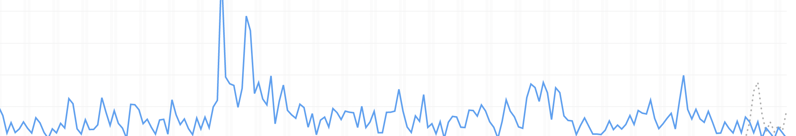

+++
title = "Technical Writer - Marketing"
date = 2021-06-01T6:00:00Z
type = "page"
url = "/technical-writer/marketing"
access = "paid_members"

+++

<!--

* pre-sale
* growing an audience
* social networks
  * reddit
  * specialized websites and newsletters
  * twitter
-->

# Marketing

Marketing your book is certainly the hardest part of the journey. On one hand, because everybody is already fighting hard for the attention of "consumers", and on the other hand because it's a marathon, not a sprint.

<!--
## Writing a landing page that sells
-->

## Where to promote your book

The holy rule of indie marketing is that it's better to reach few people with a deep interest of your topic than many people that are not interested.

### Your own blog

There are 2 ways to make "try" your book.

Either you provide a free chapter, or you can publish excerpts on your own blog.

I believe that the latter is the best solution for many reasons.

First, by publishing excerpts, you can get feedback on specific parts of your book.

Second, because it's easier to promote a link to a blog post than to a PDF.

And finally, because by publishing great content on your blog, you will increase its notoriety and thus its SEO (Search Engine Optimization).

This is why your blog should be the first place where you promote your book. All other channels should funnel people to your blog.

### Reddit

[Reddit](https://www.reddit.com) is certainly the place where you can reach the most people when you have no audience.

People organize themselves into communities around topics, so you just need to target 1 or 2 communities that could be interested in what you have to say.

I have noticed that the key to success on Reddit is to simply talk with your heart. If you try some marketing or sales trick, people will notice, and drama comes very fast on Reddit.

Be aware that most communities don't appreciate spam, thus, you will need to be a good [netizen](https://en.wikipedia.org/wiki/Netizen) and answer questions and comments.

### Twitter

On the other hand, reaching people on Twitter is hard due to their algorithm optimized for viral (dumb) content, and that you will need to pay to "promote" your tweets.

Basically, Twitter's algorithm works as follow: the more you spend time or money on it, the more you are rewarded, which makes me believe that the investment is not worth it when you are beginning. Your time is your most precious asset.

That being said, it's still possible to reach a large audience by finding the good #hashtags for your topic, which are often followed by bots that will happily retweet your posts.

### Specialized newsletters

Better than Twitter, are specialized newsletters about your topic. Often run by fans that are always looking for content to include, you can send them your content to publish, and if they find it valuable for their audience, they will happily publish it.

For example, for my book Black Hat Rust, I try to publish at least 1 post per week in the [This Week In Rust newsletter](https://this-week-in-rust.org).

### GitHub

If you book contains code samples, I **strongly** recommend you to create a GitHub repository.

As I'm writing this, the GitHub repository of my book [Black Hat Rust](https://github.com/skerkour/black-hat-rust/) has ~1700 stars which led to hundred of direct sales (tracked with coupons, so the number of indirect sales is higher) which means thousands of $$.

It's also a good idea to inform prospects why they would NOT want to buy your book. There is nothing worse than a disappointed or angry customer, so it's better not to make a sale than having someone angrily tarnishing your work on online forums.

### Be careful of drama

It is indisputable, **drama sells**.

It generates a lot of visits, which generally means increased revenues, but you don't necessarily want to do that because it can destroy your reputation in the long term.

That being said, here is what I identified that tends to generate the most drama and reactions:
Strong opinion on a controversial topic, but with few linked sources.

The idea is to destroy something that many people think it's true, but you think is wrong, and not to include too much sources? Why? Because then many people on the forums will quickly comment that you don't have any proof. But as many people may already be on your side, they will reply with sources and arguments. And it's a controversial topic, it will never ends.

This is how to generate "engagement", the graal of Silicon-Valley's style funded Startups which means that your post will be ranked higher by the algorithms, and also why I hate Twitter so much.

## When to promote

Another thing to know is that the time of the day and the day of the week have a huge impact on the effectiveness of your marketing efforts.

There are many articles on Internet about when to publish:
* [https://optinmonster.com/the-best-time-to-send-emails-heres-what-studies-show/]( https://optinmonster.com/the-best-time-to-send-emails-heres-what-studies-show/)
* [https://www.wordstream.com/blog/ws/2014/09/04/best-time-to-send-email-campaign](https://www.wordstream.com/blog/ws/2014/09/04/best-time-to-send-email-campaign)
* [https://www.mailjet.com/blog/news/best-time-to-send-email-newsletters/](https://www.mailjet.com/blog/news/best-time-to-send-email-newsletters/)
* [https://coschedule.com/blog/best-time-to-send-email](https://coschedule.com/blog/best-time-to-send-email)

I will save you tons of SEO fluff: the best moment in the day to post something is at 9 a.m. in the timezone where the majority of your audience lives.

The best days to post are Tuesday or Wednesday.

Why?

Because people mostly check the news and social networks at work and when commuting. They have better things to do than reading your stuff during the weekends and after work, like hanging out with friends or playing video games, or taking care of their family.

Also, depending on the channel that people use to follow your content, there might be some lag between the day of publication and the moment when your content is read. Some people use social media, some use RSS readers, others will discover your through weekly newsletters.

So by publishing on Tuesday or Wednesday, you increase your chances of being read by your audience.

## Momentums

Momentums are those moments when the wind is in your back, and you can fully open the sail to make a lot of sales.

It's when you get some attention from people on the internet, and you need to capitalize on it to keep it as long as possible and make as many sales as possible.

One example is [GitHub's trending page](https://github.com/trending/).

When your repository get a certain amount of stars in 1 day, it becomes promoted on the trending page, which brings tons of curious people. Furthermore, when appaearing on the trendping page of a specific language, [Rust](https://github.com/trending/rust) for example, some Twitter bots will tweet your repository, giving it an even bigger reach.

<!-- TODO -->

Another example is Twitter bots: If you find the good #hashtags, your tweets will be boosted by bots with thousands of people interested on a specific topic.

So when one of these things happen, it's time to roll up your sleeves and surf the wave 💰

<!-- TODO -->
<!--

Finally, the last example is when an influencer with a large following base talks about your work.

 TODO -->

## Tracking the origin of your sales

There are basically 2 ways to understand where your sales come from.

The first one is to set up an analytics service, such as [Plausible](https://plausible.io) or [Fathom](https://usefathom.com) and look at the Referrers. The problem is that a lot of websites strip the Referrer header making the data unreliable.

The second one is to use **coupon codes**: discount codes with the name of the source, `GITHUB`, `TWITTER` for example. The problem with this method is that people can copy an URL with a coupon code and share it on private forums or chats obfuscating where your customers really found about your book.

Because both of these methods have caveats and are not reliable alone, the best way is to look at both and try to identify patterns.

## Tips and tricks to boost your sales

Sales of a book are never linear: there are some peaks related to the (temporary) success of your marketing efforts.

Thus, you need to regularly use tricks to boost your sales.

Here are the most effective.

### Early-access bonuses

It may be hard to win people's trust when you are a nobody on internet, and you are asking for money in exchange, that, maybe, some day in the future, you will give them the book that you promised.

A way to break the ice is to offer some early-access bonuses related to the content of the book.

The trick is to offer the bonuses only to the early-access supporters, so they buy the book **now** and don't wait for the book to be completed.

It can be anything: some artwork, a call with you,

For example, for my book, I offered all early-access supporters a curated list of advanced malware analyses. The analyses were not from me, but it would still require a few hours of work and some advanced knowledge to make a list with such a high ratio of information.

### Flash sales

Flash sales create two effects in the mind of your prospects.

First, they feel having a good deal, and everyone is happy when have good value for our money.

The second, and most important effect is the sense of urgency. People always feel they can buy your book later, until they never buy it. With flash sales, you give them a good reason to do it **now**.

A way to make your flash sales more effective is to justify them.

For example, with the invasion of Ukraine, I expected cyberattacks to rise significantly, so I made a Cyberwar sale to help people prepare.

## Summary

* Have your own blog and funnel people to it to promote your book.
* Use momentums to your advantage.
* It's better to reach few people with a deep interest of your topic than many people not interested.

<!-- [Next Chapter: Conclusion](/technical-writer/conclusion) -->
