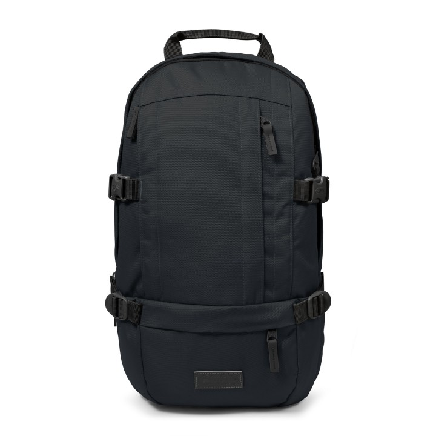
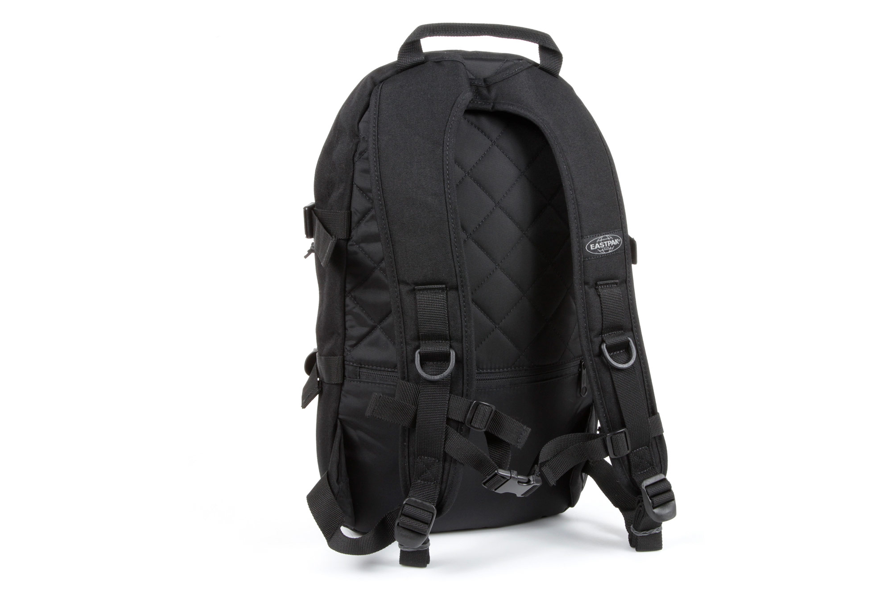
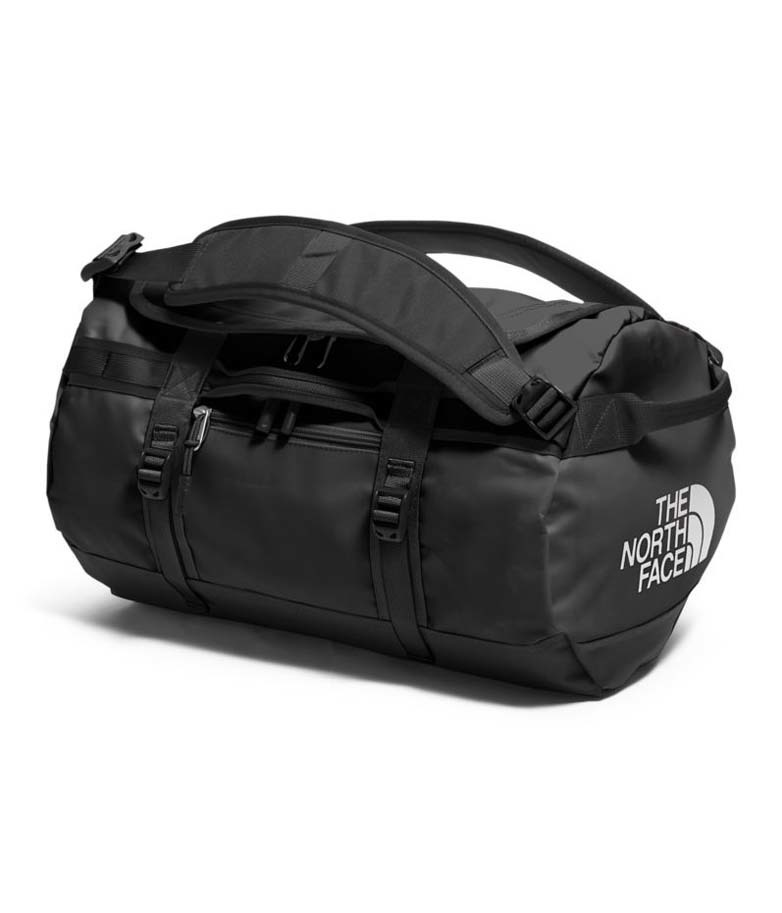

+++
date = 2018-09-11T01:42:42+02:00
title = "Living with only two carry-on bags"

[extra]
lang = "en"
+++

During the fall of 2017 I left Paris, France to start a company (Phaser, which is now [Bloom](https://bloom.sh)) from
anywhere in the world.

Here is how I achieved to live with only 2 carry-on bags and be able to pack my stuff and move to the
other corner of the world in less than 20 minutes.

1. [Benefits](#benefits)
2. [Drawbacks](#drawbacks)
3. [Frontpack](#frontpack)
4. [Backpack](#backpack)

-------

## Benefits

There is many benefits to have all my stuff fitting in only two bags. Here is a few which come to my mind:

* Don't have to pay for checked luggage.
* I don't lose time everyday to chose my outfit.
* Ability to pack and relocate to anywhere in the world in less than 20 minutes.
* All my stuff is high quality. If something is damaged, it's replaced.
* The places where I live are always in order, and easy to clean.
* Unparalleled ability to travel and see beautiful places.
* Wash cycles are easier (1 / week).
* Reduced ecological footprint.
* Reduced cognitive load to choose my daily outfit.

## Drawbacks

None so far. Really.

## Frontpack

Easpak Floid (Black - 16L)

The 'frontpack' is actually my everyday backapck. It should carry enought stuff to sleep far from home for 2 days.

* my 13' laptop with it's powerbank
* 1 socks pair
* 1 underpant
* 1 RaspberryPi 0 w for hacking
* USB cables for my stuff
* 1 ebook e-ink reader

## Backpack

The North Face Base Camp Duffel XS (Black - 33L)

The 'Backpack' is generally used when relocating to carry my clothes or when the 'frontpack' is not
adequate.

* 1 Volcom Frozen Chino for formal events (very high quality pant)
* 2 Uniqlo men dry stretch sweatpants for everyday use
* 2 Uniqlo men dry stretch sweat full-zip hoodie
* 1 short swinsuit
* 7 Uniqlo Airsim underpants
* 7 Celio socks pairs
* 4 Uniqlo airsim teeeshirts

it also contains my toilet bag:

* 1 nail clipper
* 1 tweezers
* 1 toothbrush

<!--
## Accessories/Bags

| Model | Qty. |
| ----- | ---- |
| dww | ddwd |

## Clothing

## Documents?

## Toiletries + Medicine?

immodium

## Extras ?

https://lighterpack.com/r/2j9p5q

-->
