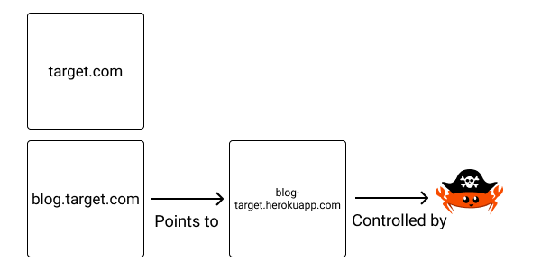

+++
title = "Black Hat Rust - Chapter 6"
date = 2021-01-01T6:00:00Z
type = "page"
url = "/black-hat-rust/6"
access = "paid_members"

+++

# Finding vulnerabilities

<!--
hacker one
https://googleprojectzero.blogspot.com/2021/01/introducing-in-wild-series.html
https://googleprojectzero.blogspot.com/2021/01/in-wild-series-chrome-exploits.html
https://googleprojectzero.blogspot.com/2021/01/in-wild-series-android-exploits.html
https://googleprojectzero.blogspot.com/2021/01/in-wild-series-android-post-exploitation.html
https://googleprojectzero.blogspot.com/p/0day.html


https://googleprojectzero.github.io/0days-in-the-wild/rca.html


https://googleprojectzero.blogspot.com/2021/04/who-contains-containers.html
https://googleprojectzero.blogspot.com/2021/03/in-wild-series-october-2020-0-day.html
https://googleprojectzero.blogspot.com/2021/01/a-look-at-imessage-in-ios-14.html


https://securitylab.github.com/research/exchange-rce-CVE-2020-0688/
https://googleprojectzero.blogspot.com/
https://googleprojectzero.blogspot.com/2020/06/ff-sandbox-escape-cve-2020-12388.html
https://googleprojectzero.blogspot.com/2020/06/a-survey-of-recent-ios-kernel-exploits.html
https://googleprojectzero.blogspot.com/2020/04/fuzzing-imageio.html
https://googleprojectzero.blogspot.com/2020/01/remote-iphone-exploitation-part-1.html
https://googleprojectzero.blogspot.com/2020/01/remote-iphone-exploitation-part-2.html
https://googleprojectzero.blogspot.com/2020/01/remote-iphone-exploitation-part-3.html
https://securitylab.github.com/research/bean-validation-RCE/
https://securitylab.github.com/research/CVE-2020-6449-exploit-chrome-uaf/
https://securitylab.github.com/research/
-->

## What is a vulnerability

The [OWASP](https://owasp.org/) project defines a vulnerability as follows: *A vulnerability is a hole or a weakness in the application, which can be a design flaw or an implementation bug, that allows an attacker to cause harm to the stakeholders of an application*

What is a vulnerability depends on your threat model (What is a threat model? We will learn more about that in chapter 11).

For example, [this bug](https://hackerone.com/reports/1203842) was rewarded $700 for a *simple* DNS leak. But in the context of privacy-preserving software, this leak is rather important and may endanger people.

In the same vein, a tool such as [`npm audit`](https://docs.npmjs.com/auditing-package-dependencies-for-security-vulnerabilities) may report a looot of vulnerabilities in your dependencies. In reality, even if your own software uses those vulnerable dependencies, it may not be vulnerable at all, as the vulnerable functions may not be called or called in a way that the vulnerability can't be triggered.


## Weakness vs Vulnerability (CWE vs CVE)


CVE *is a list of records — each containing an identification number, a description, and at least one public reference — for publicly known cybersecurity​ vulnerabilities and exposures*.

You can find the list of existing CVEs on the site [https://www.cvedetails.com](https://www.cvedetails.com) (that we have scraped in the previous chapter).


CWE (Common Weakness Enumeration) *is a community-developed list of software and hardware weakness types*.

You can find the list of CWEs online: [https://cwe.mitre.org](https://cwe.mitre.org).


**Thus, a weakness (CWE) is a pattern that may lead to a vulnerability (CVE).**

Not all vulnerabilities have a CVE ID associated. Sometimes because the person who found the vulnerability thinks it's not worth the hassle, sometimes, because they don't want the vulnerability to be publicly disclosed.


## Vulnerability vs Exploit

While a vulnerability is a hole in an application, an exploit is a chunk of code that takes advantage of that vulnerability for offensive purposes.

Writing an exploit is known as **weaponization**: the process of turning a software bug into an actionable digital weapon.

Writing exploits is a subtle art that requires deep knowledge of the technology where the vulnerability has been found.

For example, writing an exploit for an XSS vulnerability (as we will see below) requires deep knowledge of the web and JavaScript ecosystem to bypass the restrictions imposed by the vulnerability, Web Application Firewalls (WAF), and browsers, such as a limited number of characters.


## 0 Day vs CVE

Not all vulnerabilities are public. Some are discovered and secretly kept in order to be weaponized or sold to people that are going to weaponize them.

A non-public, but known by some, exploit is called a 0 Day.

More can be read on the topic in the excellent Wikipedia's article about [Market for zero-day exploits](https://en.wikipedia.org/wiki/Market_for_zero-day_exploits).

On the other hand, a CVE is a known vulnerability affecting a product, even if no public exploit is available for this vulnerability.

## Web vulnerabilities

I don't think that toy examples of vulnerabilities teach anything.

This is why instead of crafting toy examples of vulnerabilities for the sole purpose of this course, vulnerabilities that you will never ever encounter in a real-world situation, I've instead curated what I think is among the best writeups about finding and exploiting vulnerabilities affecting real products and companies.


## Injections

Injections is a family of vulnerabilities where some malicious payload can be injected into the application for various effects.

**The root cause of all injections is the mishandling of the programs' inputs**.


What are examples of a program's input?

* For a web application, it can be the input fields of a form or an uploaded file.
* For a VPN server, it is the network packets.
* For a wifi client, it is, among other things, the name of the detected Wifi networks.
* For an email application, it is the emails, its metadata, and the attachments.
* For a chat application, it's the messages, the names of the users, and the media.
* For a video player, it's the video files and the subtitle files.
* For a music player, the audio files and their metadata.
* For a terminal, it is the input of the user and the output of the command-line applications.


## HTML injection

HTML injection is a vulnerability where an attacker is able to inject arbitrary HTML code into the responses of an application rendering HTML code.


It can be used for [defacement](https://en.wikipedia.org/wiki/Website_defacement) or tricking the users into doing harmful (for them) actions, such as replacing a login form with a malicious one.

Here is an example of pseudo-code vulnerable to HTML injections:
```javascript
function comment(req, res) {
  let new_comment = req.body.comment;

  // comment is NOT sanitized when saved to database
  save_to_db(new_comment);

  let all_comments = db.find_comments();

  let html = "";

  // comments are NOT sanitized when rendered
  for comment in comments {
    html += "<div><p>" + comment + "</p></div>";
  }

  res.html(html);
}
```


## SQL injection

In the years 2010s' SQL injections were all the rage due to PHP's fame and its insecure APIs. Now they are rarer and rarer, thanks to [ORMs](https://en.wikipedia.org/wiki/Object%E2%80%93relational_mapping) and other web frameworks that provide good security by default.

<!-- Different kind of SQL injections: blind, time based... -->


Here is an example of pseudo-code vulnerable to SQL injection:

```javascript
function get_comment(req, res) {
  let comment_id = req.query.id;

  // concataining strings to build SQL queries is FATAL
  let sql_query = "SELECT * FROM comments WHERE id = " + comment_id;

  let comment = db.execute_query(sql_query);

  let html = template.render(comment);

  res.html(html);
}
```

Which can be exploited with the following request:

```default
GET https://kerkour.com/comments?id=1 UNION SELECT * FROM users
```

### Blind SQL injection

The prerequisite for a SQL injection vulnerability is that the website output the result of the SQL query to the web page. Sometimes it's not the case, but there still is a vulnerability under the hood.

This scenario is called a blind injection because we can't see the result of the injection.

You can learn how to exploit them here: [https://portswigger.net/web-security/sql-injection/blind](https://portswigger.net/web-security/sql-injection/blind)


### Case studies

* [SQL injection on admin.acronis.host development web service](https://hackerone.com/reports/923020)
* [SQL Injection at /displayPDF.php](https://hackerone.com/reports/914427)
* [SQL injection on contactws.contact-sys.com in TScenObject action ScenObjects leads to remote code execution](https://hackerone.com/reports/816254)
* [www.drivegrab.com SQL injection](https://hackerone.com/reports/273946)


### Other database languages injections

After the PHP and Ruby crazes came Node.JS.

Everything became JSON objects. Even the databases' records and this is how [mongoDB](https://www.mongodb.com) took off. Relational database-powered applications may be vulnerable to SQL injections. MongoDB-powered applications may be vulnerable to MongoDB's query language injections.

Like other kinds of database injections, the idea is to find a vulnerable input that is not sanitized and transmitted as is to the database.


## XSS

XSS (for Cross Site Scripting) injections are a kind of attack where a malicious script (JavaScript most of the time, as it's universally understood by web browsers) is injected into a website.


If the number of SQL injections in the wild has reduced over time, the number of XSS has, on the other hand, exploded in the past years, where a lot of the logic of web applications now lives client-side (especially with [Single-Page Applications (SPA)](https://en.wikipedia.org/wiki/Single-page_application)).


For example, we have the following HTTP request:
```default
POST /myform?lang=fr
Host: kerkour.com
User-Agent: curl/7.64.1
Accept: */*
Content-Type: application/json
Content-Length: 35

{"username":"xyz","password":"xyz"}
```

How many potential injection points can you spot?

Me, at least 4:

* In the Url, the `lang` query parameter
* The `User-Agent` header
* The `username` field
* The `password` field


Those are all user-provided input that may (or may not) be processed by the web application, and if not conscientiously validated, result in a XSS injection.


Here is an example of pseudo-code vulnerable to XSS injection:
```javascript
function post_comment(req, res) {
  let comment = req.body.comment;

  // You need to sanitize inputs!
  db.create_comment(comment);

  res(comment);
}
```


There are 3 kinds of XSS:

* Reflected XSS
* Stored XSS
* DOM-based XSS


### Reflected XSS

A reflected XSS is an injection that exists only during the lifetime of a request.

They are mostly found in query parameters and HTTP headers.


For example
```default
GET /search?q=<script>alert(1)</script>
Host: kerkour.com
User-Agent: <script>alert(1)</script>
Accept: */*
```

The problem with reflected XSS for attackers is that they are harder to weaponize: the payload should be provided in the request, most of the time in the URL. It may raise suspicion!


One trick to hide an XSS payload in an URL is to use an URL shortener: for example, the following URL:
```default
https://kerkour.com/search?q=<script>alert(1)</script>
```

Can be obfuscated such as:
```default
https://minifiedurl.co/q9n7l
```

Thus, victims may be way less suspicious as we are all used to clicking on minified URLs, in the description of YouTube videos, for example.


### Stored XSS

A stored XSS is an injection that exists beyond the lifetime of the request. It is stored by the server of the web application and served in future requests.

For example, a comment on a blog.

They are most of the time found in forms data and HTTP headers.

For example:
```default
POST /myform
Host: kerkour.com
User-Agent: <script>alert(1)</script>
Accept: */*
Content-Type: application/json
Content-Length: 35

{"comment":"<script>alert(1)</script>"}
```

Once stored by the server, the payload will be served to potentially many victims.


A kind of stored XSS that developers often overlook is within SVG files. Yes, SVG files **can execute `<script>` blocks**.

Here is an example of such a malicious file:
```svg
<?xml version="1.0" standalone="no"?>
<!DOCTYPE svg PUBLIC "-//W3C//DTD SVG 1.1//EN" "http://www.w3.org/Graphics/SVG/1.1/DTD/svg11.dtd">
<svg version="1.1" baseProfile="full" xmlns="http://www.w3.org/2000/svg">
  <polygon id="triangle" points="0,0 0,50 50,0" fill="#009900" stroke="#004400"/>
  <script type="text/javascript">
    alert(document.domain);
  </script>
</svg>
```

You can see it in action online: [https://kerkour.com/imgs/xss.svg](https://kerkour.com/imgs/xss.svg) where a nice JavaScript alert will welcome you. Now think at all those image forms that kindly accept this image and serve it to all the users of the web application 😈


### DOM-based XSS

A Dom-based XSS is an XSS injection where the payload is not returned by the server, but instead executed directly by the browser by modifying the [DOM](https://developer.mozilla.org/en-US/docs/Web/API/Document_Object_Model/Introduction).

Most of the time, the entrypoint of DOM-based XSS is an URL such as:
```html
<script>
document.write('...' + window.location + '...');
</script>
```

By sending a payload in `window.location` (the URL), an attacker will be able to execute JavaScript in the context of the victim, without the server even coming into play in this scenario. In the case of a Single-Page Application, the payload could attain the victim without even making a request to the server, making it impossible to investigate without client-side instrumentation.


### Why it's bad

The impact of an XSS vulnerability is script execution in the context of the victim. Today, it means that the attackers have most of the time full control: they can steal session tokens, execute arbitrary commands, usurp identities, deface websites and so on...

Note that in some circumstances, XSS injections can be turned into remote-code executions (RCE, more on that below) due to [Server Side rendering (SSR)](https://nuxtjs.org/docs/2.x/concepts/server-side-rendering) and [headless browsers](https://www.google.com/searchq=headless+browsers).


### Case studies

* [Stored XSS in Wiki pages](https://hackerone.com/reports/526325)
* [Stored XSS in backup scanning plan name](https://hackerone.com/reports/961046)
* [Reflected XSS on https://help.glassdoor.com/GD_HC_EmbeddedChatVF](https://hackerone.com/reports/1244053)


## Server Side Request Forgery (SSRF)

A Server Side Request Forgery happens when an attacker can issue HTTP requests from the server of the web application. Most of the time, the attacker is also able to read the response of the request.


Here is an example of pseudo-code vulnerable to SSRF:
```javascript
function check_url(req, res) {
  let url = req.body.url;

  // You need to check the url against an allowlist
  let response = http_client.get(url);

  // DON'T display the result of the HTTP request
  res(response);
}
```


This kind of vulnerability is particularly devastating in cloud environments where some metadata and/or credentials can be fetched: [https://gist.github.com/jhaddix/78cece26c91c6263653f31ba453e273b](https://gist.github.com/jhaddix/78cece26c91c6263653f31ba453e273b).


### Why it's bad

Most of the time, the impact of an SSRF is access to internal services that were not intended to be publicly accessible and thus may not require authentication (Internal dashboards, databases...). I think that I don't need to write a roman for you to understand how harmful it can be.


### Case studies

* [Full Read SSRF on Gitlab's Internal Grafana](https://hackerone.com/reports/878779)
* [Server Side Request Forgery (SSRF) at app.hellosign.com leads to AWS private keys disclosure](https://medium.com/techfenix/ssrf-server-side-request-forgery-worth-4913-my-highest-bounty-ever-7d733bb368cb)
* [SSRF chained to hit internal host leading to another SSRF which allows reading internal images.](https://hackerone.com/reports/826097)


## Cross-Site Request Forgery (CSRF)

A Cross-Site Request Forgery is a vulnerability that allows an attacker to force a user to execute unwanted actions.


There are two families of CSRFs:

The first one is by using forms. Imagine a scenario where an application allows administrators to update the roles of other users. Something like:
```php
$current_user = $_COOKIE["id"];
$role = $_POST["role"];
$username = $_POST["username"];

if (is_admin($current_user)) {
  set_role($role, $username);
}
```

If I host on my website `malicious.com` a form such as:
```html
<html>
  <body>
    <form action="https://kerkour.com/admin" method="POST">
      <input type="hidden" name="role" value="admin" />
      <input type="hidden" name="username" value="skerkour" />
    </form>
    <script>
      document.forms[0].submit();
    </script>
  </body>
</html>
```

Any administrator of `kerkour.com` that will visit `malicious.com` will make (without even knowing it) a request to `kerkour.com` telling this website to set me as an admin.


The second one is by using URLs. The vulnerability lies in the fact that `GET` requests may execute actions instead of read-only queries.

```default
GET https://kerkour.com/admin?set_role=admin&user=skerkour
```

Imagine I send this URL to an administrator of a vulnerable website, I'm now myself an administrator too :)


As CSRFs rely on cookies, thus, Single Page Applications are most of the time immune against those vulnerabilities.


### Why it's bad


Like XSSs, CSRF vulnerabilities allow attackers to execute commands with the rights of another user. If the victim is an administrator, they have administrator's privileges and thus may be able to compromise the entire application.


### Case studies

* [TikTok Careers Portal Account Takeover](https://security.lauritz-holtmann.de/advisories/tiktok-account-takeover/)
* [Account takeover just through csrf](https://hackerone.com/reports/1066189)


## Open redirect

An open redirect is a kind of vulnerability that allows an attacker to redirect a user of a legitimate website to another one.


Here is an example of pseudo-code vulnerable to Open redirect:
```javascript
function do_something(req, res) {
  let redirect_url = req.body.redirect;

  // You need to check redirect targets againt an allowlist
  res.redirect(redirect_url);
}
```

For example, a victim may visit `https://kerkour.com/login?redirect=malicious.com` and be redirected to `malicious.com`.

Like XSSs and CSRFs, they can be obfuscated using links shorteners.


### Why it's bad

The most evident use of this kind of vulnerability is phishing, as a victim may think to have clicked on a legitimate link but finally land on an evil one.


### Case studies

* [How I earned $550 in less than 5 minutes](https://medium.com/@ahmadbrainworks/bug-bounty-how-i-earned-550-in-less-than-5-minutes-open-redirect-chained-with-rxss-8957979070e5)


## (Sub)Domain takeover

(Sub)Domain takeovers are certainly the low-hanging fruits the easiest to find if you want to make a few hundred dollars fast in bug bounty programs.

The vulnerability comes from the fact that a DNS record points to a public cloud resource no longer under the control of the company owning the domain.




Let say you have a web application on Heroku (a cloud provider).

To point your own domain to the app, you will have to set up something like a `CNAME` DNS record pointing to `myapp.herokuapp.com`.

Time flies, and you totally forget that this DNS record exists and decide to delete your Heroku app. Now the domain name `myapp.herokuapp.com` is again available for anybody wanting to create an app with such a name.

So, if a malicious user creates a Heroku application with the name `myapp`, it will be able to serve content from **your own domain** as it is still pointing to `myapp.herokuapp.com`.

We took the example of a Heroku application, but there are a lot of scenarios where such a situation may happen:

* A floating IP from a public cloud provider such as AWS
* A blog at almost all SaaS blogging platform
* a CDN
* a S3 bucket


### Why it's bad

First, as subdomains may have access to cookies of other subdomains (such as `www`...) the control of a subdomain may allow attackers to exfiltrate those cookies.

Second, a subdomain takeover may also allow attackers to set up phishing pages with legitimate URLs.

Finally, a subdomain takeover may allow attackers to spread misleading information. For example, if people against a company take control of the `press.company.com` subdomain, they may spread false messages while the rest of the world thinks that those messages come from the PR department of the hacked company.


### Case Studies

* [Subdomain Takeover to Authentication bypass](https://hackerone.com/reports/335330)
* [Subdomain Takeover Via Insecure CloudFront Distribution cdn.grab.com](https://hackerone.com/reports/352869)
* [Subdomain takeover of v.zego.com](https://hackerone.com/reports/1180697)


## Arbitrary file read

Arbitrary file read vulnerabilities allow attackers to read the content of files that should have stayed private.


Here is an example of pseudo-code vulnerable to arbitrary file read:
```javascript
function get_asset(req, res) {
  let asset_id = req.query.id;

  let asset_content = file.read('/assets/' + asset_id);

  res(asset_content);
}
```

It can be exploited like this:
```default
https://example.com/assets?id=../etc/passwd
```

See the trick? Instead of sending a legitimate `id`, we send the path of a sensitive file.

As everything is a file on Unix-like systems, secret information such as database credentials, encryption keys, or SSH keys, might be somewhere on the filesystem. Any attackers able to read those files would quickly be able to inflict a lot of damages to a vulnerable application.


Here are some examples of files whose content may be of interest:
```default
/etc/passwd
/etc/shadow
/proc/self/environ
/etc/hosts
/etc/resolv.conf
/proc/cpuinfo
/proc/filesystems
/proc/interrupts
/proc/ioports
/proc/meminfo
/proc/modules
/proc/mounts
/proc/stat
/proc/swaps
/proc/version
~/.bash_history
~/.bashrc
~/.ssh/authorized_keys
~/.ssh/id_dsa
.env
```


### Why it's bad

Once able to read the content on any file on the filesystem, it's only a matter of time before the attacker can escalate the vulnerability to a more severe one, and take over the server.

Here is an example of escalating a file read vulnerability to remote code execution: [Read files on the application server leads to RCE](https://hackerone.com/reports/178152)


### Case Studies

* [Arbitrary file read via the UploadsRewriter when moving and issue](https://hackerone.com/reports/827052)
* [External SSRF and Local File Read via video upload due to vulnerable FFmpeg HLS processing](https://hackerone.com/reports/1062888)
* [Arbitrary local system file read on open-xchange server](https://hackerone.com/reports/303744)


## Denial of Service (DoS)

A Denial of Service (DoS) attack's goal is to make a service unavailable to its legitimate users.


The motivation of such an attack is most of the time financial: whether it be for demanding a ransom to stop the DoS, or to cut off a competitor during a period where a high number of sales are expected.


As you may have guessed, blocking Rust's event loop often leads to a DoS, where a tiny amount of requests might block the entire system.


There also is the cousin of DoS: DDoS, for Distributed Denial of Service, where the final goal is the same (make a service unavailable to its legitimate users), but the method is different. Here, attackers count on the limited resources of the victim, for example, CPU power or bandwidth, and try to exhaust these resources by distributing the load on their side to multiple machines.

DDoS are usually not carried by a single attacker, but by a botnet controlled by an attacker.


### Why it's bad

Can your customers buy tee shirts on your website if they can't access it?


### Case Studies

* [DoS on PayPal via web cache poisoning](https://portswigger.net/research/responsible-denial-of-service-with-web-cache-poisoning)
* [Denial of Service | twitter.com & mobile.twitter.com](https://hackerone.com/reports/903740)
* [DoS on the Issue page by exploiting Mermaid](https://hackerone.com/reports/470067)


## Arbitrary file write

Arbitrary file writes vulnerabilities allow attackers to overwrite the content of files that should have stayed intact.


Here is an example of pseudo-code vulnerable to arbitrary file write:
```javascript
function upload_file(req, res) {
  let file = req.body.file;
  let file_name = req.body.file_name;

  fs.write('/uploads/' + file_name, file);

  res(ok);
}
```

It can be exploited by sending a file with a name such as:
```default
../root/.ssh/authorized_keys
```

When the vulnerable code processes the upload, it will overwrite the `.ssh/authorized_keys` file of the `root` user, giving the attacker the keys to the kingdom.


## Memory vulnerabilities

These vulnerabilities are one of the reasons for Rust's popularity, thanks to which you are immune against, as long as you stay away from `unsafe`. This is what we call "memory safety".

<!-- Because they mostly -->

They mostly plague low-level programming languages such as C and C++, where you have to manually manage the memory, but as we will see, dynamic languages such as Ruby and Python that rely on a lot of packages written in C or C++ themselves can also be (indirectly) vulnerable.

<!--
https://news.ycombinator.com/item?id=27263875 (C++ Software Security Sins: Basic Issues)
-->


## Buffer overflow


Here is an example of pseudo-code vulnerable to buffer overflow:
```javascript
function copy_string(input []char) []char {
  // buffer is too small if len(input) > 32 which will lead to a buffer overflow
  let copy = [32]char;

  for (i, c) in input {
    copy[i] = c;
  }

  return copy;
}
```


How does Rust prevent this kind of vulnerability? It has buffer boundaries checks and will panic if you try to fill a buffer with more data than its size.

<!-- ### Why it's bad -->


### Case studies

* [An introduction to the hidden attack surface of interpreted languages](https://securitylab.github.com/research/now-you-c-me/)
* [CVE-2020-16010: Chrome for Android ConvertToJavaBitmap Heap Buffer Overflow](https://googleprojectzero.github.io/0days-in-the-wild/0day-RCAs/2020/CVE-2020-16010.html)

<!--

https://googleprojectzero.github.io/0days-in-the-wild/0day-RCAs/2020/CVE-2020-17087.html
https://googleprojectzero.blogspot.com/2021/03/in-wild-series-october-2020-0-day.html
https://googleprojectzero.blogspot.com/2021/01/in-wild-series-windows-exploits.html
-->


## Use after free

A use after free bug, as the name indicates, is when a program reuse memory that already has been freed.

As the memory is considered free by the memory allocator, this latter could have reused it to store other data.


Here is an example of pseudo-code vulnerable to use after free:
```javascript
function allocate_foobar() []char {
  let foobar = malloc([]char, 1000);
}

function use_foobar(foobar []char) {
  // do things
  free(foobar);
}

function also_use_foobar(foobar []char) {
  // do things
}


function main() {
  let foobar = allocate_foobar();

  use_foobar(foobar);

  // do something else
  // ...

  // !! we reuse foobar after freeing it in use_foobar
  also_use_foobar(foobar);
}
```


### Why it's bad

The memory allocator may reuse previously freed memory for another purpose. It means that an use after free vulnerability may not only lead to data corruption but also to remote code execution if an important pointer is overwritten.

From an attacker's point of view, use after free vulnerabilities are not that reliable due to the nature of memory allocators, which are not deterministic.


### Case studies

* [Exploiting a textbook use-after-free in Chrome](https://securitylab.github.com/research/CVE-2020-6449-exploit-chrome-uaf/)


## Double free

The name of this bug is pretty self-descriptive: A double free is when a heap-allocated variable (with `malloc` for example) is freed twice.

It will mess with the memory allocator's state and lead to *undefined behavior*.


Here is an example of pseudo-code vulnerable to double free:
```javascript
function allocate_foobar() []char {
  let foobar = malloc([]char, 1000);
}

function use_foobar(foobar []char) {
  // do things
  free(foobar);
}

function main() {
  let foobar = allocate_foobar();

  use_foobar(foobar);

  // !! foobar was already freed in use_foobar
  free(foobar);
}
```

### Why it's bad

Double freeing a pointer will mess with the memory allocator's state.

Like use after free vulnerabilities, double free vulnerabilities lead to *undefined behavior*. Most of the time, it means a crash or data corruption. Sometimes, it can be exploited to produce code execution, but it's in practice really hard to achieve.


<!--
## Format string problems

A format string vulnerability


Here are two examples of pseudo-code vulnerable to format string vulnerability:
```javascript
function main(argc int, argv []char) {
  // the attacker controls the format arguments
  printf(argv[1]);
}


function main(argc int, argv []char) {
  // the second variable is missing
  printf("%s %s", argv[0]);
}
```


### Why it's bad

Format string vulnerabilities may lead to information disclosure or code execution.

### Case studies
-->


## Other vulnerabilities


## Remote Code Execution (RCE)


The name Remote Code Execution is pretty self-explanatory: it's a situation where an attacker is able to remotely execute code on the machine where the vulnerable application runs. Whether it be a server, a smartphone, a computer, or a smart light bulb.


### Why it's bad

Remote code execution allows not only for full control of the machine(s), but also to do everything you can imagine: data leaks (because once you control a server, you can access the databases it is connected to), defacements...

Also, as we will see in chapter 13, any Remote Code Execution vulnerability can be used by a worm to massively infect a lot of machines in a very short amount of time.

### Case studies

* [RCE when removing metadata with ExifTool](https://hackerone.com/reports/1154542)
* [RCE via unsafe inline Kramdown options when rendering certain Wiki pages](https://hackerone.com/reports/1125425)
* [Now you C me, now you don't, part two: exploiting the in-between](https://securitylab.github.com/research/now-you-c-me-part-two/)
* [RCE on CS:GO client using unsanitized entity ID in EntityMsg message](https://hackerone.com/reports/584603)
* [Potential pre-auth RCE on Twitter VPN](https://hackerone.com/reports/591295)


## Integer overflow (and underflow)

An integer overflow vulnerability occurs when an arithmetic operation attempts to create a numeric value that is outside of the range that can be held by a number variable.

For example, a `uint8` (`u8` in Rust) variable can hold values between **0** and **255** because it is encoded on **8** bits. Depending on the language, it often leads to *undefined behavior*.


Here is an example of pseudo-code vulnerable to integer overflow:
```javascript
function withdraw(user id, amount int32) {
  let balance: int32 = find_balance(user);

  if (balance - amount > 0) {
    return ok();
  } else {
    return error();
  }
}
```

Because `balance` and `amount` are encoded on a `int32` they will overflow after `2,147,483,647` and `-2,147,483,648`. If we try to subtract `4,294,967,295` (amount) to `10,000` (balance), in C the result will be `10001`... which is positive, and may sink your bank business.


Here is another, more subtle, example:
```javascript
// n is controlled by attacker
function do_something(n uint32) {
  let buffer = malloc(sizeof(*char) * n);

  for (i = 0; i < n; i++)
    buffer[i] = do_something();
  }
}
```

If we set `n` to a too big number that overflows an `uint32` multiplied by the size of a pointer (4 bytes on a 32bit system) like `1073741824`, an integer overflow happens, and we allocate a buffer of size `0` which will be overflowed by the following `for` loop.

One interesting thing to note is that in debug mode (`cargo build` or `cargo run`), Rust will panic when encountering an integer overflow, but in release mode (`cargo build --release` or `cargo run --release`), Rust will not panic. Instead, it performs *two’s complement wrapping*: the program won't crash, but the variable will hold an invalid value.

```rust
let x: u8 = 255;

// x + 1 = 0 (and not 256)
// x + 2 = 1 (and not 257)
// x + 3 = 2 (and not 258)
```

More can be read about this behavior in the [Rust book](https://doc.rust-lang.org/book/ch03-02-data-types.html#integer-types).


### Why it's bad

This kind of vulnerability became popular with smart contracts, where large sums of money were stolen due to flawed contracts.


Integer overflow vulnerabilities can be used to control the execution flow of a program or to trigger other vulnerabilities (such as the buffer overflow of the example above).


### Case studies

* [An integer overflow found in /lib/urlapi.c](https://hackerone.com/reports/547630)
* [libssh2 integer overflows and an out-of-bounds read (CVE-2019-13115)](https://securitylab.github.com/research/libssh2-integer-overflow/)
* [Another libssh2 integer overflow (CVE-2019-17498)](https://securitylab.github.com/research/libssh2-integer-overflow-CVE-2019-17498/)


## Logic error

A logic error is any error that allows an attacker to manipulate the business logic of an application. For example, an attacker might be able to order many items in an eShope at a price of 0, or an attacker might able to fetch sensitive data that normally only admins are allowed to fetch.

Beware that thanks to the compiler, this is certainly the kind of bugs you may produce the most when developing in Rust. This is why writing tests is important!

**No compiler ever will be able to catch logic errors.**


### Case studies

* [Availing Zomato gold by using a random third-party `wallet_id`](https://hackerone.com/reports/938021)
* [OLO Total price manipulation using negative quantities](https://hackerone.com/reports/364843)


## Race condition

A race condition occurs when a program relies on many **concurrent** operations, and the program relies on the sequence or timing of these operations to produce correct output.

The corollary is that if for some reason, lack of synchronization, for example, the sequence or timing of operations is changed, an error happens.

For example, trying to read a value just after having updated it in an eventually-consistent database.


### Why it's bad

Most of the time, an exploitable race condition occurs when verification is done concurrently of an update (or create or delete) operation.


### Case studies

* [Race Condition of Transfer data Credits to Organization Leads to Add Extra free Data Credits to the Organization](https://hackerone.com/reports/974892)
* [Race Condition allows to redeem multiple times gift cards which leads to free "money"](https://hackerone.com/reports/759247)
* [Ability to bypass partner email confirmation to take over any store given an employee email](https://hackerone.com/reports/300305)


## Additional resources

There is the great [swisskyrepo/PayloadsAllTheThings](https://github.com/swisskyrepo/PayloadsAllTheThings) and [EdOverflow/bugbounty-cheatsheet](https://github.com/EdOverflow/bugbounty-cheatsheet) GitHub repositories with endless examples and payloads that help to find these vulnerabilities.

Basically, you just have to copy/paste the provided payloads into the inputs of your favorite web applications, and some vulnerabilities may pop. If no vulnerability is obvious but interesting error messages are displayed, it's still worth taking the time to investigate.


## Bug hunting

Now we have an idea of what looks like a vulnerability, let see how to find them in the real world.

There are some recurrent patterns that should raise your curiosity when hunting for vulnerabilities.


<!--

if you have consciensieusement etudie les case studies ci dessus, vous devriez voir emerger des patterns maintenant. Si ce n'est pas encore fait, do it now!


En effet, les ulnerabilites viennent d'input utilisateur, qui ont n'ont soit pas ete sanitizé, soit traité par un composant vulenrable, comme une librairie de retourche d'image.


2 main source of vulnerabilities:
- input
- configuration
 -->


### Rich text editors

Rich text editors, such as [WYSIWYG](https://github.com/topics/wysiwyg) or Markdown are often an easy target for XSS.


### File upload

From arbitrary file write to XSS (with SVG files), file upload forms are also a great place to find a lot of vulnerabilities.


### Input fields

As we saw, injections come from input fields that are not sanitized. The thing to exploit non-sanitized input fields is to understand how and where they are outputted. Sometimes, this is not obvious as they may be processed by some algorithm. To transform URLs into links, for example.

Also, sometimes, input fields are hidden from the interface:
```html
<input type="hidden" id="id" name="id" value="123">
```


### HTTP Headers

An often overlooked attack vector is the HTTP headers of a request.

Indeed, HTTP headers are sometimes used by applications and sent back in response. For example, think of an analytic service that displays the top 10 User-agent headers.


### Dangerous / deprecated algorithms

Some dangerous and deprecated algorithms such as `md5` are still used in the wild. If you are auditing an application with access to the source code, a simple `rg -i md5` suffices (using [ripgrep](https://github.com/BurntSushi/ripgrep)).


### Methods with dangerous parameters

There are two kinds of methods with dangerous parameters:

* Cryptographic functions, where bad initialization or key reuse may lead to serious errors like `AES-GCM-256` with reused nonces.
* Data manipulation functions in memory unsafe languages such as `memset` or `strcpy` in `C`.

### Auth systems

At the heart of almost every application, there are two vital systems:

**An authentication system** to verify that users are who they pretend to be.

**And an authorization system** to verify that users have the legitimate rights to execute the operations they want to execute.

Authentication and authorization system are often complex and scattered all over the place.

When auditing an application, understand what operations require elevated privileges, and try to execute them without these privileges.


### Multiplayer games

Game developers are not security engineers. They may focus their attention on gameplay, performance, and a lot of other things in their domain of expertise, but not necessarily security.

Furthermore, the networking stacks of some games are written in memory-unsafe languages, such as C or C++. This is the perfect recipe for disaster (memory-related vulnerabilities).

As a side note, this is why you might not want to play multiplayer games on your work computer.


### Complex format parsing

Parsing complex formats such as [YAML](https://yaml.org/) is hard. This is why there are a lot of bugs that are found in parsing libraries. Sometimes, these bugs are actual vulnerabilities.

Most of the time, those are memory-related vulnerabilities, either due to the complexity of the format, either because developers often try to be clever when implementing parsers to be at the first position in micro-benchmarks, and they use some tricks that introduce bugs and vulnerabilities.


### Just-In-Time compilation

Just-In-Time (JIT) compilers need to reduce the security measures of modern operating systems (by design), such as making some part of the memory **Writable And Executable**. It means that memory-related vulnerabilities are way easier to exploit.


## The tools

Now we have a good idea of **what** to look for, let see **how**!

### Web

There are only 4 tools required to start hunting web vulnerabilities:

### A web browser

Firefox or Chrome (and derivatives), as they have better developer tools than the other web browsers.

There are tons of extensions on the respective marketplaces, but you don't need them. Also, web extensions can be dangerous, as they may be able to exfiltrate all your sensitive data. So just ignore them.


### A tool to make HTTP requests

[`curl`](https://curl.se/) is good for the task as it can be embedded in small bash scripts.

My 3 favorite options are:

To inspect the headers of a site:
```bash
$ curl -I https://kerkour.com
```

To download a file for further inspection:
```bash
$ curl -O https://kerkour.com/index.html
```

And to `POST` JSON data
```bash
curl --header "Content-Type: application/json" \
  --request POST \
  --data '{"username":"<script>alert(1)</script>","password":"xxx"}' \
  http://kerkour.com/api/register
```


### A scanner

You get it! A scanner is what we built in the previous chapters.

Scanners can't replace the surgical precision of the brain of a hacker. Their purpose is to save you time by automating repetitive and fastidious tasks.


<!-- An Open-Source scanner I recommend: **Phaser** ([https://github.com/skerkour/phaser](https://github.com/skerkour/phaser)) of course!

Phaser was extracted and improved from the chapters 2, 3, and 4 of this course, and was designed to be as simple and as fast a possible. Just point it to a target, and it will autimagically generate a report with everything it can finds, saving you hours of manual audit and pipping between different tools. -->

Beware that a scanner, depending on the modules you enable, may be noisy and reveal your intentions. Due to their bruteforce-like nature, they are easy to detect by firewalls. Thus, if you prefer to stay under the radar, be careful which options you enable with your scanner.


### And an intercepting proxy

An intercepting proxy will help you inspect and modify requests on the fly, whether those requests come from your main computer or from other devices such as a phone which does not have developer tools in the browser.

It's extremely useful to bypass client-side validation logic and send your payloads directly to the backend of the applications you are inspecting. They also often offer some kind of automation, which is great. It will save you a lot of time!


I believe that there is no better offensive proxy than the [Burp Suite](https://portswigger.net/burp/communitydownload). It has a free (*"community"*) version to let it try, and if you like it, and are serious about your bug hunting quest, you can buy a license to unlock all the features.

*Burp Suite* also provides a lot of features to automate your requests and attacks.

If this is your very first step in hacking web applications, you don't necessarily need an intercepting proxy. The developer tools of your web browser may suffice. That being said, it's still great to learn how to use one, as you will be quickly limited when you will want to intercept and modify requests.


<!-- ### Memory

Finding memory related vulnerabilities is more difficult than finding web vulnerabilities, and requires more advanced tooling.


#### Debugger

gdb

#### Static analysis

radare2 -->


<!--
patterns to look for

-->

<!--

tools to automate code review

https://www.trailofbits.com/post/discovering-goroutine-leaks-with-semgrep
-->


## Automated audits


### Fuzzing

Fuzzing is a method used to find bugs and vulnerabilities in software projects by automatically feeding them random data.

Instead of testing a small set of test cases handwritten by developers, a fuzzer will try a lot of inputs and see what happens.

Fuzzing is a kind of testing that is fully automated and thus requires way less human effort than reviewing a codebase, especially as the code base is very large. Also, fuzzing can be used against closed source programs, while reverse-engineering is slow, fastidious, and expensive in human time.


#### Installing the tools

The recommended tool to start fuzzing a Rust project (or actually any library that can be embedded by Rust) is to use [`cargo-fuzz`](https://github.com/rust-fuzz/cargo-fuzz).


```bash
$ cargo install -f cargo-fuzz
$ rustup install nightly
```

*Note: cargo-fuzz relies on `libFuzzer`. `libFuzzer` needs LLVM sanitizer support, so this only works on x86-64 Linux and x86-64 macOS for now. This also needs a nightly Rust toolchain since it uses some unstable command-line flags. Finally, you'll also need a C++ compiler with C++11 support.*


#### Getting started

First, we need a piece of code to fuzz. We will use an idiomatic faulty `memcpy` like function.

**Warning**: This is absolutely not an idiomatic piece of Rust, and this style of code should be avoided at all costs.

**[ch_06/fuzzing/src/lib.rs](https://github.com/skerkour/black-hat-rust/blob/main/ch_06/fuzzing/src/lib.rs)**
```rust
pub fn vulnerable_memcopy(dest: &mut [u8], src: &[u8], n: usize) {
    let mut i = 0;

    while i < n {
        dest[i] = src[i];
        i += 1;
    }
}
```

Then, we need to initialize `cargo-fuzz`:
```bash
$ cargo fuzz init
$ cargo fuzz list
fuzz_target_1
```

It created a `fuzz` folder which itself contains a `Cargo.toml` file:

We just need to add the `arbitrary` to the list of dependencies.

**[ch_06/fuzzing/fuzz/Cargo.toml](https://github.com/skerkour/black-hat-rust/blob/main/ch_06/fuzzing/fuzz/Cargo.toml)**
```toml
[package]
name = "fuzzing-fuzz"
version = "0.0.0"
authors = ["Automatically generated"]
publish = false


[package.metadata]
cargo-fuzz = true

[dependencies]
libfuzzer-sys = "0.4"
arbitrary = { version = "1", features = ["derive"] }

[dependencies.fuzzing]
path = ".."

# Prevent this from interfering with workspaces
[workspace]
members = ["."]

[[bin]]
name = "fuzz_target_1"
path = "fuzz_targets/fuzz_target_1.rs"
test = false
doc = false
```

The [`arbitrary`](https://docs.rs/arbitrary/1.0.1/arbitrary/) allows us to derive the [`Arbitrary`](https://docs.rs/arbitrary/1.0.1/arbitrary/trait.Arbitrary.html) trait, which enable us to use any `struct` for our fuzzing, and not a simple `[u8]` buffer.


Then we can implement our first fuzzing target:

**[ch_06/fuzzing/fuzz/fuzz_targets/fuzz_target_1.rs](https://github.com/skerkour/black-hat-rust/blob/main/ch_06/fuzzing/fuzz/fuzz_targets/fuzz_target_1.rs)**
```rust
#![no_main]
use libfuzzer_sys::fuzz_target;

#[derive(Clone, Debug, arbitrary::Arbitrary)]
struct MemcopyInput {
    dest: Vec<u8>,
    src: Vec<u8>,
    n: usize,
}

fuzz_target!(|data: MemcopyInput| {
    let mut data = data.clone();
    fuzzing::vulnerable_memcopy(&mut data.dest, &data.src, data.n);
});
```

And we can finally run the fuzzing engine:
```bash
$ cargo +nightly fuzz run fuzz_target_1
```

And BOOOM!

```default
INFO: Running with entropic power schedule (0xFF, 100).
INFO: Seed: 2666516150
INFO: Loaded 1 modules   (2403 inline 8-bit counters): 2403 [0x55f3843d4101, 0x55f3843d4a64),
INFO: Loaded 1 PC tables (2403 PCs): 2403 [0x55f3843d4a68,0x55f3843de098),
INFO:        1 files found in black-hat-rust/ch_06/fuzzing/fuzz/corpus/fuzz_target_1
INFO: -max_len is not provided; libFuzzer will not generate inputs larger than 4096 bytes
INFO: seed corpus: files: 1 min: 1b max: 1b total: 1b rss: 37Mb
#2      INITED cov: 7 ft: 8 corp: 1/1b exec/s: 0 rss: 38Mb
#3      NEW    cov: 7 ft: 9 corp: 2/2b lim: 4 exec/s: 0 rss: 38Mb L: 1/1 MS: 1 ChangeBit-
thread '<unnamed>' panicked at 'index out of bounds: the len is 0 but the index is 0', black-hat-rust/ch_06/fuzzing/src/lib.rs:5:19
note: run with `RUST_BACKTRACE=1` environment variable to display a backtrace
==17780== ERROR: libFuzzer: deadly signal
    #0 0x55f3841d6f71 in __sanitizer_print_stack_trace /rustc/llvm/src/llvm-project/compiler-rt/lib/asan/asan_stack.cpp:87:3
    #1 0x55f384231330 in fuzzer::PrintStackTrace() (black-hat-rust/ch_06/fuzzing/fuzz/target/x86_64-unknown-linux-gnu/release/fuzz_target_1+0x114330)
    #2 0x55f38421635a in fuzzer::Fuzzer::CrashCallback() (black-hat-rust/ch_06/fuzzing/fuzz/target/
// ..
    #25 0x55f3841521e6 in main (black-hat-rust/ch_06/fuzzing/fuzz/target/x86_64-unknown-linux-gnu/release/fuzz_target_1+0x351e6)
    #26 0x7f8e4cc1a0b2 in __libc_start_main /build/glibc-eX1tMB/glibc-2.31/csu/../csu/libc-start.c:308:16
    #27 0x55f38415234d in _start (black-hat-rust/ch_06/fuzzing/fuzz/target/x86_64-unknown-linux-gnu/release/fuzz_target_1+0x3534d)

NOTE: libFuzzer has rudimentary signal handlers.
      Combine libFuzzer with AddressSanitizer or similar for better crash reports.
SUMMARY: libFuzzer: deadly signal
MS: 5 InsertRepeatedBytes-ChangeBit-ShuffleBytes-ChangeByte-InsertRepeatedBytes-; base unit: ebdc2288a14298f5f7adf08e069b39fc42cbd909
0xc5,0xc5,0xc5,0xc5,0xc5,0xc5,0xc5,0xc5,0xc5,0xe5,0xc5,0xc5,0x4a,0x4a,0x4a,0x4a,0x4a,0x4a,0x4a,0xc5,0x30,0xc5,0xc5,0xc5,0x1a,
\xc5\xc5\xc5\xc5\xc5\xc5\xc5\xc5\xc5\xe5\xc5\xc5JJJJJJJ\xc50\xc5\xc5\xc5\x1a
artifact_prefix='black-hat-rust/ch_06/fuzzing/fuzz/artifacts/fuzz_target_1/'; Test unit written to black-hat-rust/ch_06/fuzzing/fuzz/artifacts/fuzz_target_1/crash-2347beb104184ae3cea139c1b7a9e568ca5ae57b
Base64: xcXFxcXFxcXF5cXFSkpKSkpKSsUwxcXFGg==
```

```default
────────────────────────────────────────────────────────────────────────────────

Failing input:

        black-hat-rust/ch_06/fuzzing/fuzz/artifacts/fuzz_target_1/crash-2347beb104184ae3cea139c1b7a9e568ca5ae57b

Output of `std::fmt::Debug`:

        MemcopyInput {
            dest: [
                197,
                197,
                197,
                197,
                229,
                197,
            ],
            src: [],
            n: 14209073747218549322,
        }

Reproduce with:

        cargo fuzz run fuzz_target_1 black-hat-rust/ch_06/fuzzing/fuzz/artifacts/fuzz_target_1/crash-2347beb104184ae3cea139c1b7a9e568ca5ae57b

Minimize test case with:

        cargo fuzz tmin fuzz_target_1 black-hat-rust/ch_06/fuzzing/fuzz/artifacts/fuzz_target_1/crash-2347beb104184ae3cea139c1b7a9e568ca5ae57b

────────────────────────────────────────────────────────────────────────────────

Error: Fuzz target exited with exit status: 77
```

The output shows us the exact input that was provided when our function crashed.


#### To learn more


To learn more about fuzzing, take a look at the [Rust Fuzz Book](https://rust-fuzz.github.io/book/introduction.html) and the post [What is Fuzz Testing?](https://blog.fuzzbuzz.io/what-is-fuzz-testing/) by *Andrei Serban*.

<!-- ## Manual audits


### Code reviews

```bash
$ rg unsafe
```


### Dependencies -->


<!-- ## Chaining vulnerabilities


### Case studies

* [Android Kernel arbitrary code execution](https://securitylab.github.com/research/one_day_short_of_a_fullchain_android/). -->


## Summary

* It takes years to be good at hunting vulnerabilities, whether it be memory or web. Pick one domain, and hack, hack, hack to level up your skills. You can't be good at both in a few weeks.
* **Always validate input coming from users**. Almost all vulnerabilities come from insufficient input validation. Yes, it's tiresome, but you have to choose between that and announcing to your boss/customers that their data have been hacked.
* Always validate untrusted input.
* Always check untrusted input.


## [Next Chapter: Exploit development](/black-hat-rust/7)
