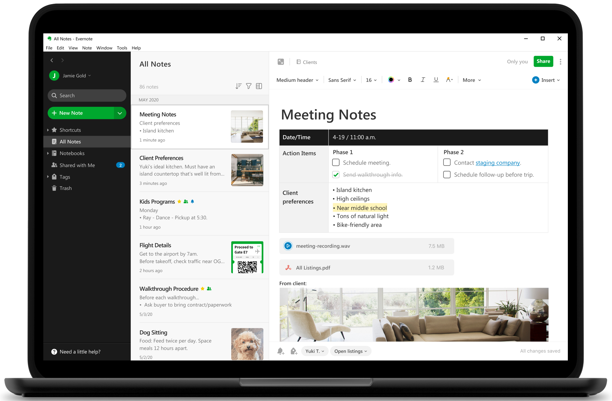
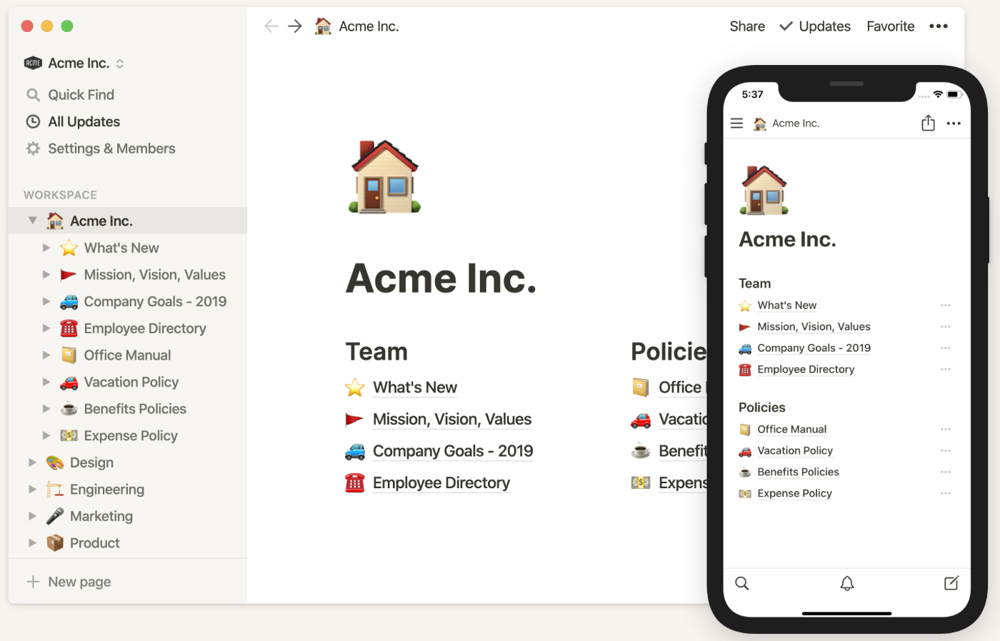
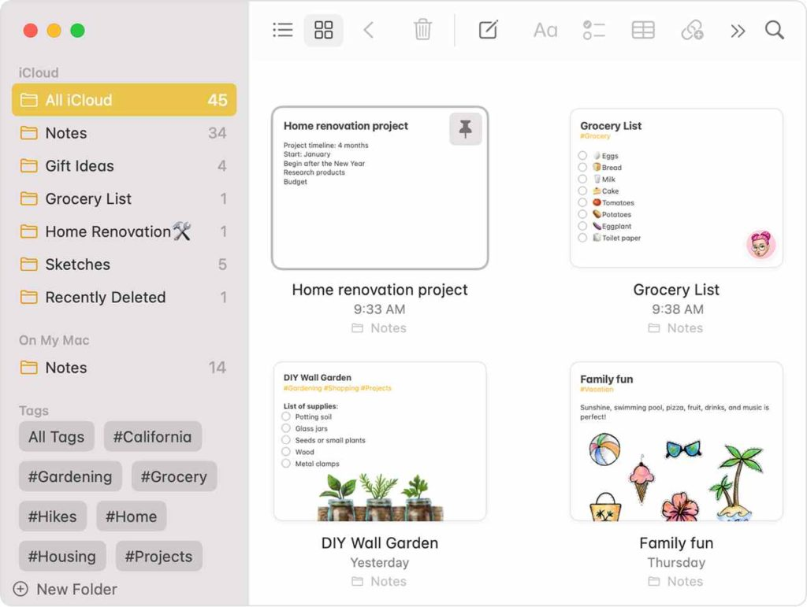
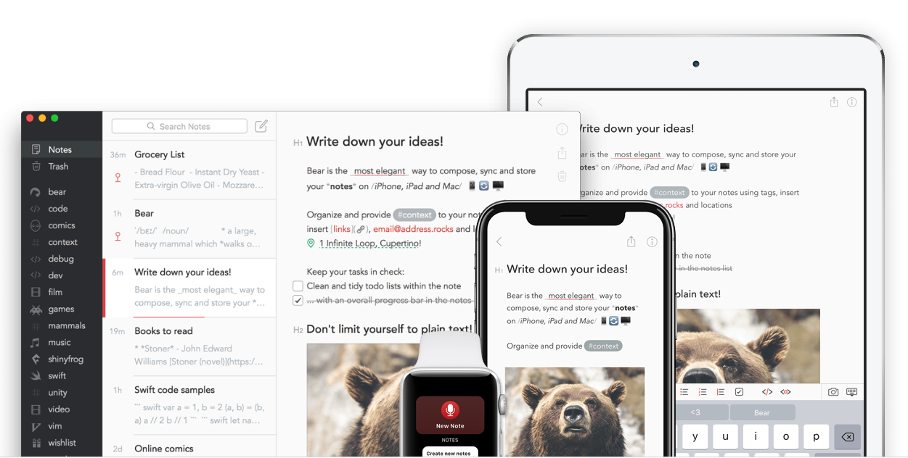

+++
title = "Continuous Learning - The Knowledge Base"
date = 2021-07-26T6:00:00Z
type = "page"
url = "/continuous-learning/knowledge-base"
access = "paid_members"
+++

# The Knowledge Base

A knowledge base should be seen as your personal Google: the place where you look for answers when you have questions about something you have already read, heard or seen.

The most important thing to understand about your knowledge base is that it is a central repository for all the things that you learned in the past.

Central means that you **SHOULD NOT** have to look to another place for a specific piece of information. In an old chat, in your bookmarks, in your email inbox or in the highlight of your kindle device for example.

Websites can go offline for a lot of reasons (company going bankrupt, technical issues, hacks...) that's why bookmarks are not a good way to preserve knowledge. Instead, you should copy the parts of interest into your knowledge base, and then add the link to the webpage at the top or the bottom of the note.

For example, I have in my knowledge base a folder called `wallet` where I put all my transport and event tickets. I don't need to search in my `Downloads` folder or my inbox when I'm about to board a train.

## Organizing your knowledge base

You can't organize ideas only in a hierarchical way, using folders and subfolders.

For example, where belongs a note about using python for data science: In the `programming/python` folder, or in the `datascience` folder?

Instead, the trick is to group related notes in the same folder (ex: `courses` to group notes about online courses) and then add **tags** to your notes.

Tags allow notes to belong to multiple categories at the same time.

For example let's take the following quote by Edsger W. Dijkstra.

```
Simplicity is a great virtue but it requires hard work to achieve it and education to appreciate it. And to make matters worse: complexity sells better.
```

You can put the note in the `quote` folder and add the following tags: `#author/dijkstra #quote #minimalism #complexity`


## Choosing the right tool

Now that you understand the requirements for a good knowledge base, let's do a quick review of the best apps available today.

Most people think that good knowledge base software requires both computer/tablet and smartphone apps, but this is wrong. As we will see in the next chapter, you don't necessarily need to be able to append notes to your knowledge base from a phone. On the other hand, searching is preferable.

As we have seen, a pre-requisite for our knowledge base software is to support tags. Another pre-requisite is that it should works even without internet connectivity: You should be able to access your entire knowledge base, and update it even if there is an internet outage, or if the service hosting it (if any) is down.

### [Evernote](https://evernote.com/)




Evernote has fallen in disgrace. Don't use it. Slow, buggy, taking data hostage... I've read many reviews of long-time users who now regret being blocked with it.


### [Notion](https://www.notion.so/)



Its biggest strenght is an ecosystem of tools that can be connected to your Notion workspace such as a blogging engine, a form collector, and many others.


While notion is all the rage these days, I believe it will follow the same fate as Evernote, but in a different way.

Notion is now sold as a knowledge management tool for **organizations**. A very competitive space, and thus, will certainly end up bloated and not a good fit for a personal knowledge management tool.

And this is before talking about the pricing strategy of this kind of [B2B](https://en.wikipedia.org/wiki/Business-to-business) startups, which is optimized for companies, not individuals.


### [Apple notes](https://apps.apple.com/us/app/notes/id1110145109)



While Apple Notes had too few features in the past to make it a good knowledge base, it became a serious contender with the recent support for Tags.


The 2 principal drawbacks of Apple Notes are:

1. The lack of Markdown support, which makes it not interoperable with other apps and software.
2. When you consolidate all your digital life under a single account, if that company goes rogue, or if your account is banned due to the mistake of an automated system, even for a reason completely unrelated to your knowledge base, you will lose everything.


### [Bear app](https://bear.app/)



Bear is a note apps for the Apple devices that support Markdown and tags. The app is beautiful and optimized for productivity.

It also has advanced features such as the ability to export to HTML, PDF, DOCX, MD, JPG, and encrypted notes.


The biggest problem with Bear is that it stores files on iCloud and not your filesystem. Thus your iCloud account remains a single point of failure.


### Markdown + Git


This is for the reasons mentioned above that I prefer to use Markdown + Git for my knowledge base. These technologies are highly interoperable, and can be used across many different providers, applications, and can even be hosted on your own server.

On a computer, you only need [VS Code](https://code.visualstudio.com/). You can have a very efficient workflow with the right keyboard shortcuts to commit and push to Git.


On iPhones and iPads, you can use the combo: [Working Copy](https://workingcopyapp.com/) to sync your Git repository and [iA Writer](https://ia.net/writer) to search and edit your knowledge base, which supports tags.


## Spaced repetition in practice

Once the information that you deemed as important is stored in your knowledge base, it's time to feed the essential parts to your brain using spaced repetition.

For that, I use a flashcard software called [Quizlet](https://quizlet.com).

You create card sets with the most important points that you want to remember (the non-important bits can be searched when needed) and study them every 3 to 6 days.

That's all, really.


### Practice

The other way to reinforce your neural networks toward a specific piece of information is by practicing.

Fail, adjust, learn, repeat.

## Summary

- Your knowledge should be centralized in your knowledge base. Not scattered across many applications.
- If you know how to use Git, use Markdown and Git for your knowledge base.
- Else, use Apple Notes or Bear if you are into the Apple ecosystem, or Notion otherwise.
- Use a flashcards or Anki cards software to practice spaced repetition.

[Next: Acquisition](/continuous-learning/acquisition)
