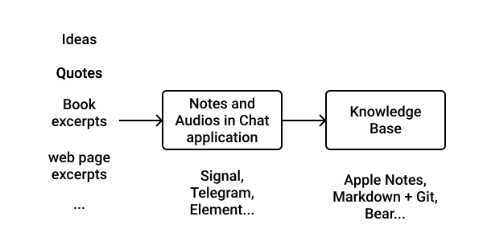

+++
title = "Continuous Learning - Knowledge Acquisition"
date = 2021-07-26T6:00:00Z
type = "page"
url = "/continuous-learning/acquisition"
access = "paid_members"
+++

<!--

[What to Learn](https://news.ycombinator.com/item?id=28904021)

-->

# Knowledge Acquisition

Now that we have a centralized repository to store, search and learn from our knowledge, it's time to fill it.

Always remember that it's a selective process, and information will be lost, but that's on purpose: in order to turn information into knowledge, you need to trim the irrelevant "fat".

## How to learn anything

My strategy to learn any thing is actually simple.

First I focus on the big and immutable ideas of the field, the "axioms", the things that didn't change for a long time (long time being relative to your field) and thus, according to the [Lindy effect](https://en.wikipedia.org/wiki/Lindy_effect) are going to stay relevant for a long time in the future.

Then, I apply what I studied with small to medium projects to learn the current practices and methodologies.

For exemple, if I would have to learn programming again today, I would start with computers artchitecture, operating systems and Linux, algorithms and design patterns. Then, I would practice by building small command line program to solve my real-world problems, such as a calculator, an app to display the schedule of my bus lines...

## Filling your knowledge base

Now you know what to learn, it's time to see how to fill you knowledge base in practice.

The simplicity and effectiveness of this system rely on a 2-step process to fill your knowledge base.

First, you save what you want to remember. I say save, because it should not be noted into your knowledge base on the spot.

That's why you don't need a knowledge base application that supports mobile. Instead, I send notes and audios to myself in a chat application. Most chat applications nowadays support a "Send to myself" conversation to save notes: [Signal](https://signal.org), [Telegram](https://telegram.org), [Element](https://element.io)...

The second step consists in re-reading or re-listening to your notes in your chat application, potentially augmenting them with additional research and transfering them in your knowledge base. Then, you can delete the messages in the chat app.

This 2-step process allows you not only to find potential mistakes but also to initiate spaced repetitions, as we saw in the introduction.

Why a chat application? Because it acts as a Last-in, First-out queue, kind of like a todo list. Once your process a message and delete it, it's done, gone. Unlike bookmarks that will accumulate over time and clutter your digital space.

Also, you don't want to have to think about how to organize your knowledge base when having a new idea, like which tags to add. Focus on your idea, write it down, and organize your knowledge base later when poping the note from your  Last-in, First-out queue.

Now, maybe you are like me, and [you don't have a phone](https://kerkour.com/i-ditched-my-phone). You can replace the chat application with a small notebook and remove the pages once you transfer the notes to your knowledge base. Another alternative is to use a dictaphone.

Either way, the goal here is to be able to take notes on the spot with the less frinction as possible, and to process it later.

<!--

En plus du dictaphone:
Ecriture papier: prise de photo

what is great about this  system is than you are not de[edent on any device]

 -->

## The Sources of Knowledge

Today, many medium exist to learn new things directly from experts:
* Podcasts
* Videos
* Blog posts
* Books
* ...

But not all sources of knowledge are equal.

I believe that text (with illustrations) was, is, and will remain the best tool at our disposal to transmit and store most knowledge.

There are many factors to explain this.

Text is easier to edit than audio and video. Thus if a mistake is found, it can be fixed quickly.

Text requires your full attention, while you can do something else when listening to a podcast.

Our brain is wired to recognize Human faces and be empathic. Thus, videos are good at transmitting and generating emotions. On the other hand, due to its raw form, text tends to activate only the rational thinking part of our brain.

Text mediums such as websites, books, and ebook readers can be optimized to provide a good focus for the reader. On the other hand, a video always has a background. Furthermore, video platforms tend to optimize for "engagement" and will use many tricks to grab your attention.

Text can be searched (e.g. `⌘ / Ctrl + f` to search this page) while it's way harder to search for a precise passage in a video or podcast.

Text parts can be saved way more easily than parts of an audio or video.

Text has the best support for tools for people with disabilities.

The structure of a text is easy to appreciate, while it's most of the time way harder to rembmer how an educationnal video or podcast was structured.

Finally, text is lightweight. When you compare the knowledge / weight ratio of text to video or audio, text is the clear winner. As an example, the entire content of this website (blog posts + courses + media) weighs a total of 35 MBytes on my disk, which means that it can be saved for very cheap and can be transfered in a few seconds.

My knowledge base (~4 years of notes, schemas, and screenshots) weighs ~101 MBytes.

On the other hands, videos containing the same information would weight hundreds of GigaBytes.

**Text is and will always be the king when it comes to sharing and acquiring information and knowledge.**

<!--
continuous learning

there is not a single one size fit all solution, it depends of you personnality

some people (like me) prefer to learn alone

pther in groups and wl prefer claases and bootcampa

-->

### Paid vs. Free

Whether it be sharing expert knowledge or curating existing knowledge, creating content takes a lot of time. And authors and creators are like you: they need to pay the rent, the food, and the extras.

Furthermore, a lot (if not most) of the free content available on the internet today is produced to build an audience and ultimately make money out of it, not to help the readers / viewers achieve their goals. This is the role of the paid content.

Most content creators tell the **why** in their free content, and the **how** in their paid content.

**This is why you should invest in paid content if you are serious about learning something.** It will save you a lot of time, and thus money and frustration.

### Books

I think I don't need to say anything about books, as it's the (approximately) universal way for Humans to share knowledge since thousands of years.

I just want to note that due to a lot of factors (e.g. customers perceiving a high number of pages as a proxy for good quality), a lot of books are, in my opinion, not curated enough: they contain too much noise to fill the pages and not enough signal.

That being said, book are not only a medium to share knowledge, but also to transmit emotions and inspire the readers.

Where to find books?

[Goodreads](https://www.goodreads.com) of course, but also on social aggreagtor websites, where people regularly ask for recommendations. On [Hacker News](https://hn.algolia.com/?dateRange=all&page=0&prefix=true&query=book&sort=byPopularity&type=story) if you like tech and entrepreneurship, or reddit for example.

Finally, there are some specialised websites such as: [Software Engineering Books](https://software-engineering-books.com).

<!-- ### Online courses -->

## Feedback

We are Humans, so we all make mistakes. Thus, it's a matter of time before you learn things that are wrong.

This is why you need **feedback** about what you learn. This is the purpose of exams and teachers in the traditional education system, but you may not necessarily be able to afford a private teacher all your life.

Thus, the best way to get feedback is to publish what you learn, for example, through blog posts.

[Next: Conclusion](/continuous-learning/conclusion)
